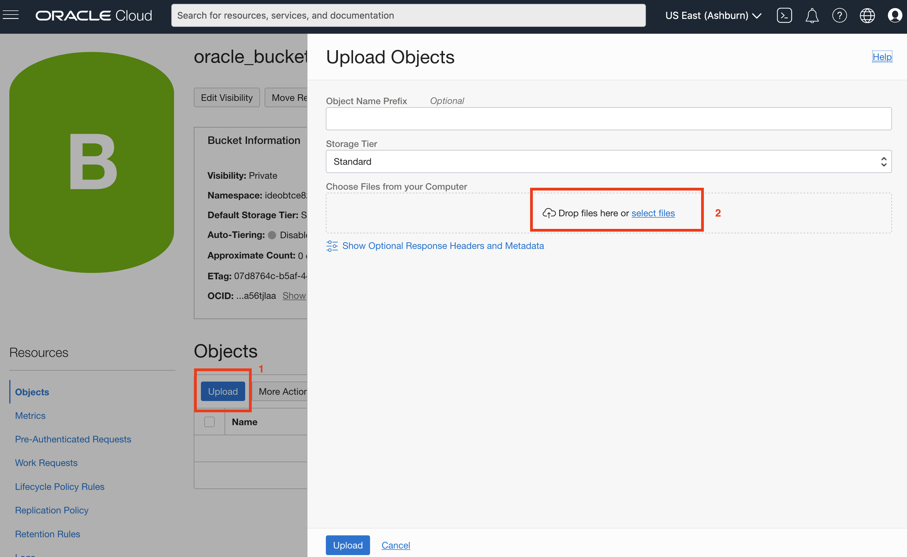

# Lab 1: Understand Data And Download Samples

## Introduction

Due to the nature of time-series anomaly detection, the data required for training any ML models needs to be formatted properly. Similarly here, our core ML algorithm behind our service has few basic requirements on the data to train an effective model.

In this session, we will discuss the data requirements and formats, and provide some sample datasets as examples. We will also show you how to upload to Oracle object storage for later to create data assets and train the model.

***Estimated Lab Time***: 25 minutes

### Objectives

In this lab, you will:
- Understand the data requirements and data formats for training and detecting with the model
- Be able to download prepared sample datasets
- Upload the downloaded dataset into OCI (Oracle Cloud Infrastructure) object storage

### Prerequisites
- A Free tier or paid tenancy account in OCI
- Familiar with OCI object storage to upload data

## **STEP 1:** Understand Data Requirements

The core algorithm of our Anomaly Detection service is a multivariate anomaly detection algorithm, which has two major data quality requirements on the training data:

* The training data should be anomaly-free (without outliers), containing observations that have normal conditions ONLY.
* The training data should cover all the normal scenarios which contain the full value ranges on all attributes.

Additionally, the algorithm also has some requirements on data type, minimum number of  attributes and observations on the training data as follows:

* The data should have a 2-D matrix shape for CSV format, which have:
    - columns containing one timestamp, and other numeric attributes/signals/sensors
    - rows representing observations of those attributes/signals/sensors at the given timestamps in the first column.
    - rows that are strictly ordered by timestamp, without duplicated timestamps.
* The training data should have at least 3 highly correlated attributes.
* At least one attribute does not have a missing value.
* The number of observations/timestamps in training data should be at least eight times of attributes or 40, whichever is greater.

The testing/detecting data is also required to only contain columns like timestamp and other numeric attributes that match with the training data; observations are strictly ordered by unique timestamps. No further requirements on testing data.

### Data format requirement

The service can accept two types of data: CSV format, and JSON format. The data should only contain one timestamp and other numeric attributes, and timestamp has to be the first column, which satisfy the [ISO 8601 format](https://en.wikipedia.org/wiki/ISO_8601).

#### CSV format
CSV-formatted data should have comma-separated lines, with first line as the header, and other lines as data. Note the first column is the timestamp column.

**Note:**
* Missing value is permitted(with empty), data is sorted by timestamp, and boolean flag values should be converted to numeric (0/1).
* Do not have a new line as the last line. The last line should still be an observation with other attributes/signals.

Here is an example of CSV-formatted data:
```csv
timestamp,sensor1,sensor2,sensor3,sensor4,sensor5
2020-07-13T14:03:46Z,,0.6459,-0.0016,-0.6792,0
2020-07-13T14:04:46Z,0.1756,-0.5364,-0.1524,-0.6792,1
2020-07-13T14:05:46Z,0.4132,-0.029,,0.679,0
```

#### JSON format
Similarly, JSON-formatted data should also contain timestamps and numeric attributes only, with the following keys:

**Note:**
* Missing value is coded as null without quote.

```json
{ "requestType": "INLINE",
  "columnLabels": ["sensor1", "sensor2", "sensor3", "sensor4", "sensor5", "sensor6", "sensor7", "sensor8", "sensor9", "sensor10"],
  "data": [
      { "timestamp" : "2012-01-01T08:01:01.000Z", "value" : [1, 2.2, 3, 1, 2.2, 3, 1, 2.2, null, 4] },
      { "timestamp" : "2012-01-02T08:01:02.000Z", "value" : [1, 2.2, 3, 1, 2.2, 3, 1, 2.2, 3, null] }
  ]
}
```

**Prerequisites**
* The training data should cover all the normal system conditions with the full value ranges for all attributes/signals.
* The training data should not have abnormal conditions, which may contains anomalies.
* The attributes in the data should be correlated well or belong to the same system or asset. Attributes from different systems are suggested to train separate models.

## **STEP 2:** Download Sample Data

Here are two prepared sample datasets to help you to easily understand how the training and testing data looks like, Download the two files to your local machine.

* [processed training csv data](../files/demo-training-data.csv)
    - 10 signals with timestamp column, with 10,000 observations
* <a href="../files/demo-testing-data.json" target="_blank" download>processed testing json data</a>
    - same 10 signals with timestamp column, 100 observations


## **STEP 3:** Upload Data to Object Storage

You need to upload those sample training data into Oracle object storage, to be prepared for model training in next steps.

**STEP 3a:** Create an Object Storage Bucket (This step is optional in case the bucket is already created)

First, From the OCI Services menu, click Object Storage.


Then, Select Compartment from the left dropdown menu. Choose the compartment matching your name or company name.


Next click Create Bucket.


Next, fill out the dialog box:
* Bucket Name: Provide a name <br/>
* Storage Tier: STANDARD

Then click Create


**STEP 3b:** Upload Downloaded file into Storage Bucket

Switch to OCI window and click the Bucket Name.

Bucket detail window should be visible. Click Upload


Click on Upload and then browse to file which you desire to upload.


More details on Object storage can be found on this page. [Object Storage Upload Page](https://oracle.github.io/learning-library/oci-library/oci-hol/object-storage/workshops/freetier/index.html?lab=object-storage) to see how to upload.


Congratulations on completing this lab!

[Proceed to the next section](#next).

## Acknowledgements
* **Authors**
    * Jason Ding - Principal Data Scientist - Oracle AI Services
    * Haad Khan - Senior Data Scientist - Oracle AI Services
* **Last Updated By/Date**
    * Haad Khan - Principal Data Scientist, May 2021
