# Getting Started

## Introduction

Today, the most successful and fastest growing companies are generally data-driven organizations. Taking advantage of data is pivotal to answering many pressing business problems; however, this can prove to be overwhelming and difficult to manage due to data’s increasing diversity, scale, and complexity. One of the most popular technologies that businesses use to overcome these challenges and harness the power of their growing data is OCI Data flow that provides serverless Apache Spark at scale.

Oracle Cloud Infrastructure (OCI) Data Flow is a fully managed Apache Spark service to perform processing tasks on extremely large data sets without infrastructure to deploy or manage. This enables rapid application delivery because developers can focus on app development, not infrastructure management.

ETL stands for extract, transform, and load, and ETL tools move data between systems. If ETL were for people instead of data, it would be akin to public and private transportation. Companies use  ETL jobs move data from a source, transform it to the form that is required, and load the resulting data and schema into a target system.

*Estimated Lab Time*: 40 minutes

### Objectives

In this tutorial, you'll build an end-to-end data pipeline that performs extract, transform, and load (ETL) operations. The pipeline will use OCI Dataflow Apache Spark and OCI Metastore running on OCI for querying and manipulating the data. You'll also use technologies like OCI Object store for data storage, and Oracle Analytics Cloud (OAC) for visualization the raw data.

In this lab, you will do the following :

1. Navigate to Data Catalog Console and creates new MetaStore Instance under a Compartment.

2. Build a sample PySpark application that will create the database and DDL to create HIVE Tables. We run some Select/Aggregation queries to see that the metadata about the data is stored in the MetaStore and all subsequent data flow Runs, can leverage the DDL created once and query the data.

3. Navigates to Data Flow Console and creates the Data Flow Application using the PySpark application created in #2 above and selects the metastore that needs to be associated with the template.

4. User navigates to Data Flow Console and runs the Application.

5. User navigates to the Object store to inspect the transformed data in the Metastore.

6. User navigates to OAC to visualize the data.

Your dataset is the [Yelp Review and Business Dataset](https://www.kaggle.com/yelp-dataset/yelp-dataset), downloaded from the Kaggle website under the terms of the Creative Commons CC0 1.0 Universal (CC0 1.0) "Public Domain Dedication" license.

The dataset is in JSON format and it is stored  in object store for downstream processing.

This lab guides you step by step, and provides the parameters you need. The python application is uploaded to the [Bucket](https://console.us-ashburn-1.oraclecloud.com/object-storage/buckets/idehhejtnbtc/workshop-scripts/objects)

  

### Prerequisites

* Python 3.6+ setup locally.

* An Oracle Cloud log in with the API Key capability enabled. Load your user under Identity/Users, and confirm you can create API Keys.


* An API key registered and deployed to your local environment. See [Register an API Key](https://docs.oracle.com/iaas/Content/API/Concepts/apisigningkey.htm) for more information

* OCI Python SDK. See [Installing OCI python SDK](https://oracle-cloud-infrastructure-python-sdk.readthedocs.io/en/latest/installation.html#downloading-and-installing-the-sdk)

* A python IDE of your choice. The workshop uses [Visual Studio Code (VSCode)](https://code.visualstudio.com/download)

* Local environment setup with all the dependencies setup as described [Here](https://docs.oracle.com/en-us/iaas/data-flow/data-flow-tutorial/develop-apps-locally/front.htm#develop-locally-concepts)

* From the Console, click the hamburger menu to display the list of available services. Select Data Flow and click `Applications`

* Basic understanding of Python and Spark.

## **STEP 1**: Inspect the Input JSON DataSet

 1. From the Console navigate to the object storage

   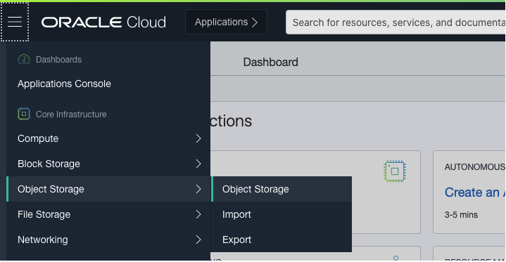

 2. For this workshop, we are reusing existing buckets `workshop-scripts` that contains all the input python files and `workshop-data` that contains all the Input JSON files  in compartment  `dataflow-demo`. The process to upload the files is as described [File Upload](https://docs.oracle.com/en-us/iaas/Content/GSG/Tasks/addingbuckets.htm#Putting_Data_into_Object_Storage).

 3. In the bucket `workshop-scripts` find the `hive-example.py` and `query_metastore` files

     

 4. In the bucket `workshop-data` find the input JSON files ```yelp_business_yelp_academic_dataset_business.json``` in the folder `yelp_business` and the file ```yelp_review_yelp_academic_dataset_review.json``` in the folder ```yelp_review```

     

## **STEP 2**: Inspect the MetaStore

1. In the Console, open the navigation menu and click ```Analytics & AI```. Click ```Data Catalog```.

    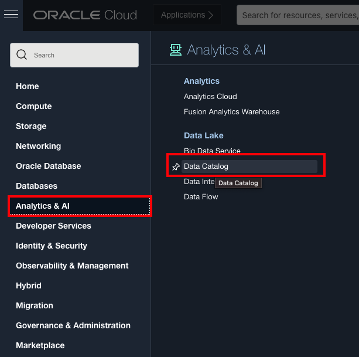

2. From the Data Catalog service page, click ```Metastores```.

    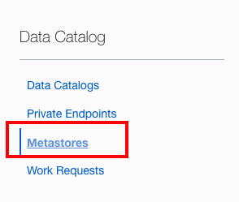

3. Change the Compartment to the ```dataflow-demo```

   

4. Should list the MetaStores in  ```dataflow-demo``` Compartment and you should find the ```DF-metastore``` Metastore that we will use for the workshop

    

5. Open the metastore ```DF-metastore```  to inspect the location of the table for the MetaStore. This will hold the data for the tables that we create later.

    

## **STEP 3**: Create a Python application in Oracle Cloud Infrastructure Data Flow

1. Create an Application, provide a `Name` and `Description`

2. In the `Resource Configuration`. Leave the default values for `Spark Version`, `Driver Shape` , `Exexutor Shape` and `Number of Executors`

3. In the Application Configuration

    3.1 Choose `Language` as `Python`

    3.2 In `Select a File` pick the Object Storage File Name bucket as `Field-Training` and file name as `hive-example.py`

    3.3 Leave the `Main class Name` and the `Archive URI` empty

    3.4 In the `Argument` field enter the path for the JSON files (seperated by space) that we saw in Step#1 above and name of Hive DB (give your UUID + "DB"). The format of path is as following ```oci://<<bucketname@namespace/folder-path>>```

    for e.g. `oci://workshop-data@idehhejtnbtc/yelp_review/yelp_review_yelp_academic_dataset_review.json oci://workshop-data@idehhejtnbtc/yelp_business/yelp_business_yelp_academic_dataset_business.json FieldTrainingDB`

    3.5 In the `Metastore in dataflow-demo` choose ```DF-metastore``` and you should see the path of the Managed table getting populated automatically.
4. Double-check your Application configuration, and confirm it is similar to the following

   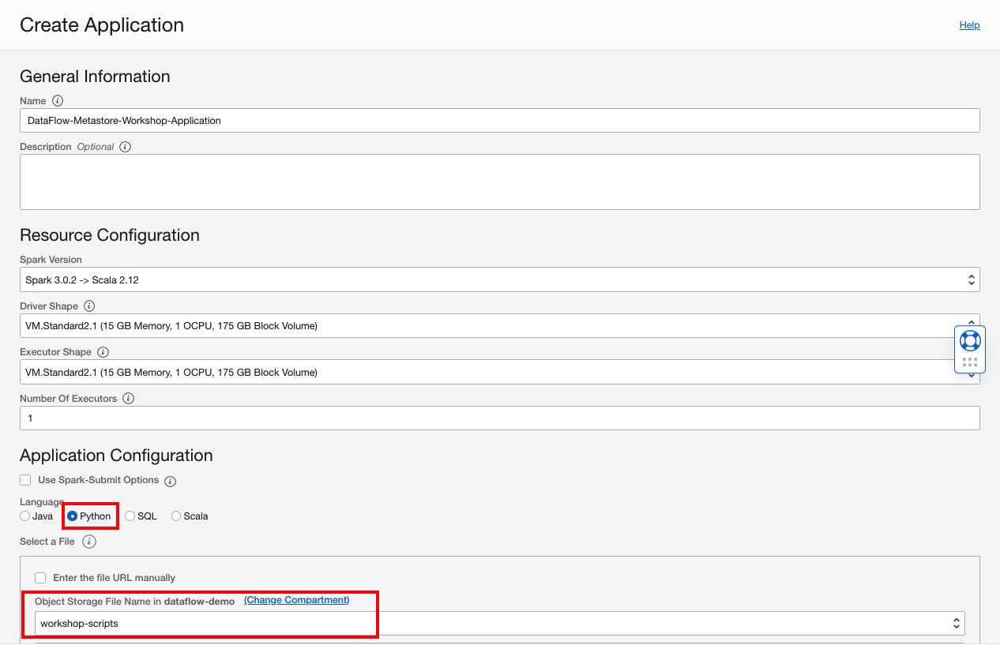

   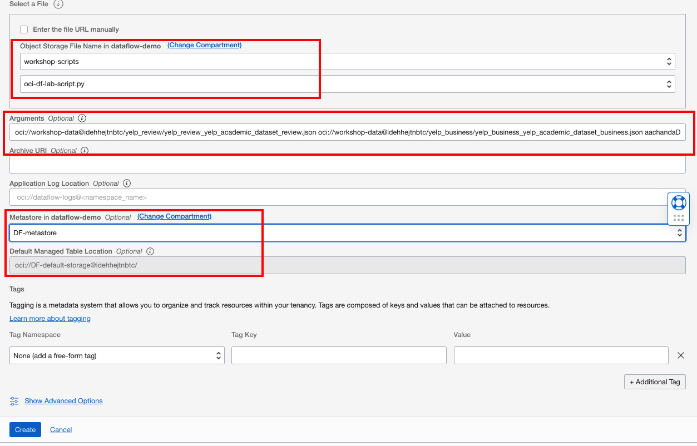

5. When done, click **Create**. When the Application is created, you should see it in the Application list.

   

## **STEP 4**: Run the Oracle Cloud Infrastructure Data Flow application

1. Highlight your Application in the list, click the **Actions** icon, and click **Run**

   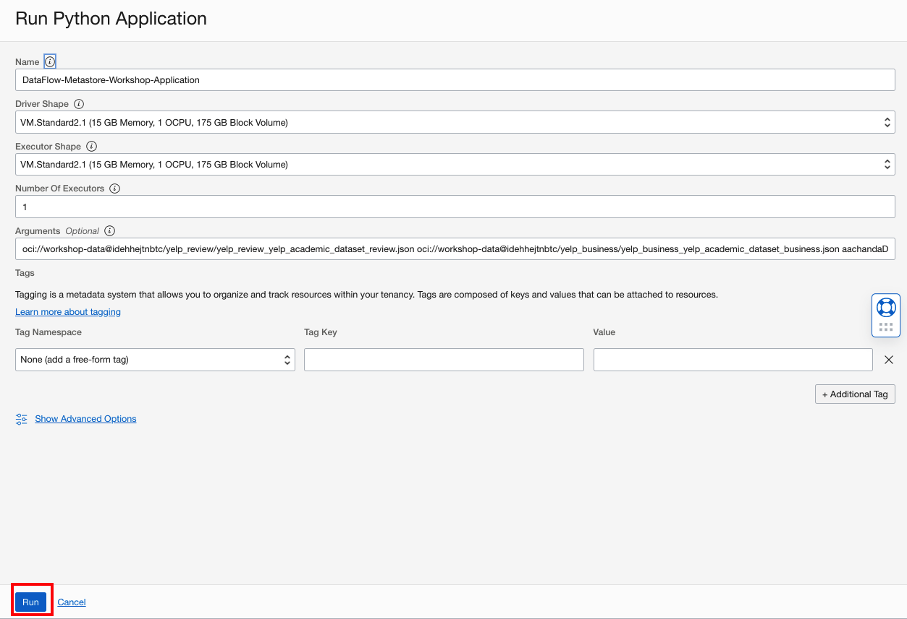

2. While the Application is running, you can optionally load the **Spark UI**  to monitor progress. From the **Actions** icon for the run in question, select **Spark UI**

   

3. You are automatically redirected to the Apache Spark UI, which is useful for debugging and performance tuning.

   

4. After few mins the  `Data Flow Run`  should complete and the State should change to ```Succeeded```:

   

5. Drill into the Run to see more details, and scroll to the bottom to see a listing of logs.

   

6. When you click the `spark_application_stdout.log.gz`  file, you should see the following log output

   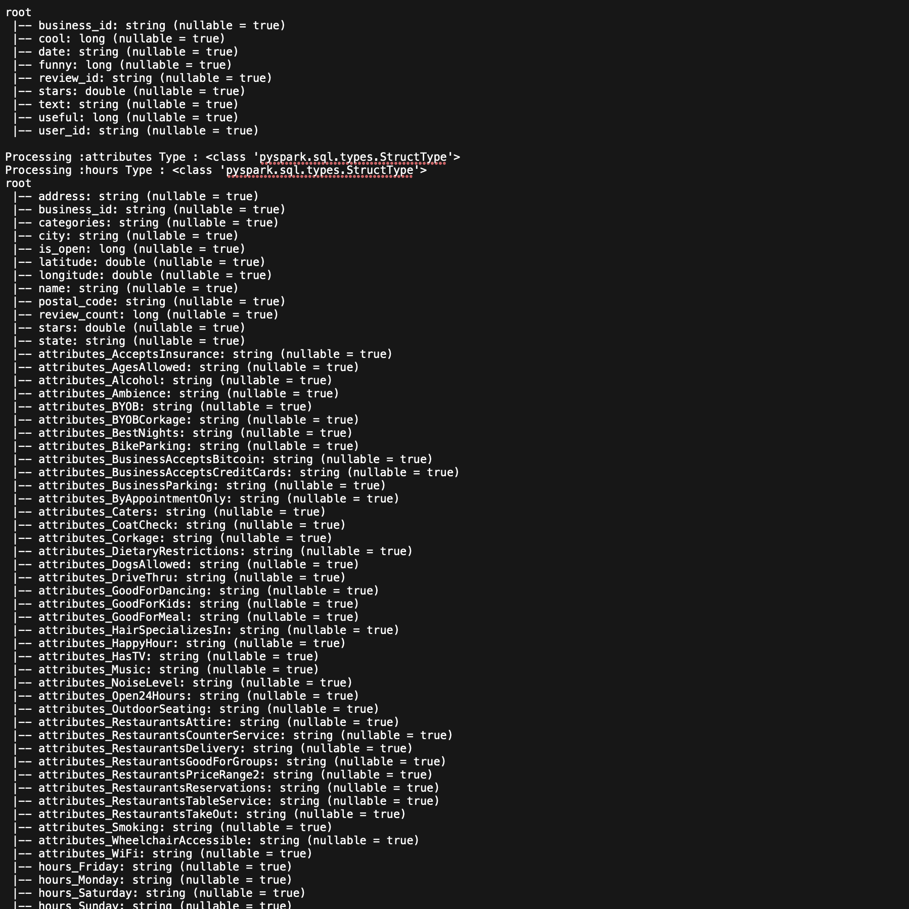

   

   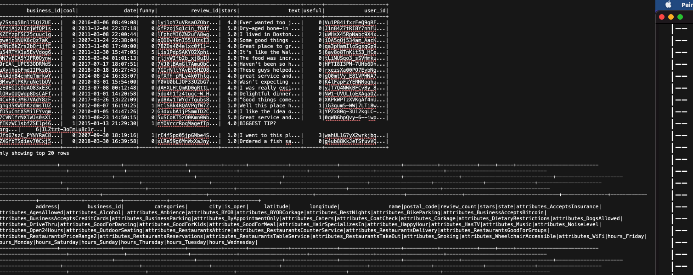

7. Navigate to the Object Store that was used as location for the tables and look at its content. It shows the table and the parquet files

   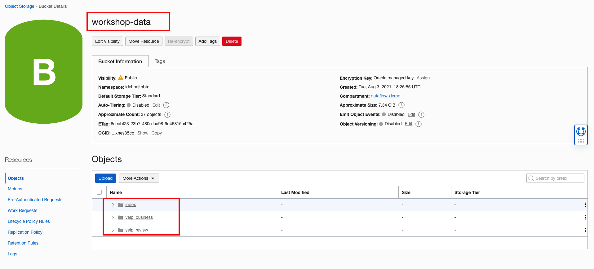

## **STEP 5**: Build a Sample PySpark Application to create Hive tables

1. Begin by importing the python modules

    ```python
       <copy>
       import os
       import traceback
       from pyspark import SparkConf
       from pyspark.sql import SparkSession
       from pyspark.sql.context import SQLContext
       from pyspark.sql.functions import *
       from pyspark.sql.types import *
     </copy>
    ```

2. In the main function we start with the program logic. The main function is a starting point of any python program. When the program is run, the python interpreter runs the code sequentially. As input we pass the the location of the object storage location that has the  netflix csv file.

    ```python
     <copy>
         if __name__ == "__main__":
         main()
     </copy>
    ```

    ```python
     <copy>

    def main():

   # Input Parquet files
    YELP_REVIEW_INPUT_PATH = sys.argv[1]
    YELP_BUSINESS_INPUT_PATH = sys.argv[2]
    db_name = sys.argv[3]

    YELP_REVIEW_OUTPUT_PATH = os.path.dirname(YELP_REVIEW_INPUT_PATH) + "/parquet"
    YELP_BUSINESS_OUTPUT_PATH = os.path.dirname(YELP_BUSINESS_INPUT_PATH) + "/parquet"


    # Set up Spark.
    # Set up Spark.
    spark_session = get_dataflow_spark_session()

    spark_session.sql('show databases').show()

    # Load our data.

    review_input_dataframe = spark_session.read.option("header", "true").option(
        "mergeSchema", "true").json(YELP_REVIEW_INPUT_PATH)

    review_input_dataframe = flatten(review_input_dataframe)

    review_input_dataframe.printSchema()

    business_input_dataframe = spark_session.read.option("header", "true").option(
        "mergeSchema", "true").json(YELP_BUSINESS_INPUT_PATH)

    business_input_dataframe = flatten(business_input_dataframe)

    business_input_dataframe.printSchema()

    # Create Hive External Table
    createHiveTable(spark_session, review_input_dataframe,
                    business_input_dataframe, YELP_REVIEW_OUTPUT_PATH, YELP_BUSINESS_OUTPUT_PATH, db_name)

    def flatten(df):
    # compute Complex Fields (Lists and Structs) in Schema
    complex_fields=dict([(field.name, field.dataType)
                           for field in df.schema.fields
                           if type(field.dataType) == ArrayType or type(field.dataType) == StructType])
    while len(complex_fields) != 0:
        col_name=list(complex_fields.keys())[0]
        print("Processing :"+col_name+" Type : " +
              str(type(complex_fields[col_name])))

        # if StructType then convert all sub element to columns.
        # i.e. flatten structs
        if (type(complex_fields[col_name]) == StructType):
            expanded=[col(col_name+'.'+k).alias(col_name+'_'+k)
                        for k in [n.name for n in complex_fields[col_name]]]
            df=df.select("*", *expanded).drop(col_name)

        # if ArrayType then add the Array Elements as Rows using the explode function
        # i.e. explode Arrays
        elif (type(complex_fields[col_name]) == ArrayType):
            df=df.withColumn(col_name, explode_outer(col_name))

        # recompute remaining Complex Fields in Schema
        complex_fields=dict([(field.name, field.dataType)
                               for field in df.schema.fields
                               if type(field.dataType) == ArrayType or type(field.dataType) == StructType])
    return df                
     </copy>
    ```

3. Next, create a spark session and in the session config, add the OCI configuration. We pass the following configuration

     1. OCID of the user calling the API. To get the value, see [Required Keys and OCIDs](https://docs.oracle.com/en-us/iaas/Content/API/Concepts/apisigningkey.htm#Required_Keys_and_OCIDs).  

     2. Fingerprint for the public key that was added to this user. To get the value, see[Required Keys and OCIDs](https://docs.oracle.com/en-us/iaas/Content/API/Concepts/apisigningkey.htm#Required_Keys_and_OCIDs)  

     3. Full path and filename of the private key. The key pair must be in the PEM format. For instructions on generating a key pair in PEM forat, see [Required Keys and OCIDs](https://docs.oracle.com/en-us/iaas/Content/API/Concepts/apisigningkey.htm#Required_Keys_and_OCIDs)

     4. Passphrase used for the key, if it is encrypted.

     5. OCID of your tenancy. To get the value, see [Required Keys and OCIDs](https://docs.oracle.com/en-us/iaas/Content/API/Concepts/apisigningkey.htm#Required_Keys_and_OCIDs)

     6. An Oracle Cloud Infrastructure region. see [Regions and Availability Domains](https://docs.oracle.com/en-us/iaas/Content/General/Concepts/regions.htm#top)

    ```python
    <copy>
    def get_dataflow_spark_session(
    app_name="DataFlow", file_location=None, profile_name=None, spark_config={}
    ):
    """
    Get a Spark session in a way that supports running locally or in Data Flow.
    """
    if in_dataflow():
        spark_builder = SparkSession.builder.appName(app_name)
    else:
        # Import OCI.
        try:
            import oci
        except:
            raise Exception(
                "You need to install the OCI python library to test locally"
            )
        # Use defaults for anything unset.
        if file_location is None:
            file_location = oci.config.DEFAULT_LOCATION
        if profile_name is None:
            profile_name = oci.config.DEFAULT_PROFILE

        # Load the config file.
        try:
            oci_config = oci.config.from_file(
                file_location=file_location, profile_name=profile_name
            )
        except Exception as e:
            print("You need to set up your OCI config properly to run locally")
            raise e
        conf = SparkConf()
        conf.set("fs.oci.client.auth.tenantId", oci_config["tenancy"])
        conf.set("fs.oci.client.auth.userId", oci_config["user"])
        conf.set("fs.oci.client.auth.fingerprint", oci_config["fingerprint"])
        conf.set("fs.oci.client.auth.pemfilepath", oci_config["key_file"])
        conf.set(
            "fs.oci.client.hostname",
            "https://objectstorage.{0}.oraclecloud.com".format(oci_config["region"]),
        )
        spark_builder = SparkSession.builder.appName(app_name).config(conf=conf)

    # Add in extra configuration.
    for key, val in spark_config.items():
        spark_builder.config(key, val)

    # Create the Spark session. Enables Hive support, including connectivity to a persistent Hive metastore
     session = spark_builder.enableHiveSupport().getOrCreate()
    return session
    </copy>
    ```

4. Create Tables in Hive MetaStore.

```python
    <copy>
   def createHiveTable(spark_session, review_input_dataframe, business_input_dataframe, YELP_REVIEW_OUTPUT_PATH, YELP_BUSINESS_OUTPUT_PATH, db_name):

    try:
        spark_session.sql("CREATE DATABASE IF NOT EXISTS " + db_name)
    except:
        print(traceback.format_exc())
        print(traceback.print_stack())

    spark_session.sql("USE " + db_name)

    try:

        ddl = build_hive_ddl(review_input_dataframe, "yelp_review",
                             YELP_REVIEW_OUTPUT_PATH)
        spark_session.sql(ddl)
        review_input_dataframe.write.mode("overwrite").saveAsTable(
            db_name + ".yelp_review")
    except Exception as err:
        print(traceback.format_exc())
        print(traceback.print_stack())

    try:

        ddl = build_hive_ddl(
            business_input_dataframe, "yelp_business_raw", YELP_BUSINESS_OUTPUT_PATH)
        spark_session.sql(ddl)
        business_input_dataframe.write.mode("overwrite").saveAsTable(
            db_name + ".yelp_business_raw")
    except Exception as err:
        print(traceback.format_exc())
        print(traceback.print_stack())
        print("Table yelp_business_raw already exists")

    spark_session.sql("SHOW Tables").show()
    spark_session.sql("DESCRIBE TABLE yelp_review").show()
    spark_session.sql("DESCRIBE TABLE yelp_business_raw").show()
    spark_session.sql("SELECT (*) FROM yelp_review").show()
    spark_session.sql("SELECT * from yelp_business_raw limit 5").show()
    spark_session.sql("SELECT * from yelp_review limit 5;").show()
    spark_session.sql(
        "CREATE TABLE IF NOT EXISTS Restaurant_by_review_500 AS SELECT name, state, city, review_count from yelp_business_raw WHERE review_count > 500 order by review_count")
    spark_session.sql("SELECT * from Restaurant_by_review_500 limit 5;").show()


def build_hive_ddl(df, table_name, location):
    object_schema = df.schema
    columns = (','.join([field.simpleString()
               for field in object_schema])).replace(':', ' ')
    ddl = 'CREATE EXTERNAL TABLE '+table_name+' ('\
        + columns + ')'\
        + ' STORED AS PARQUET'\
        + ' LOCATION "'+location+'"'

    print('Generated Hive DDL:\n'+ddl)
    return ddl
    </copy>
 ```

## **STEP 5**: Connect to the Managed Table from a Spark Application

1. Create a Python Application to connect to the Managed table. Application connects to the database that was created in previous step, creates a dataframe and perform operations on the dataframe.

    ```python
    <copy>
    import os
    import sys 
    import traceback

    from pyspark import SparkConf
    from pyspark.sql import SparkSession
    from pyspark.sql.context import SQLContext
    from pyspark.sql.functions import *
    from pyspark.sql.types import *


    def main():

        # Set up Spark.
        spark_session = get_dataflow_spark_session()
        db_name = sys.argv[1]
        queryMetaStore(spark_session, db_name)
        
    def get_dataflow_spark_session(app_name="DataFlow", file_location=None, profile_name=None, spark_config={}):
        """
        Get a Spark session in a way that supports running locally or in Data Flow.
        """
        if in_dataflow():
            spark_builder=SparkSession.builder.appName(app_name)
        else:
            # Import OCI.
            try:
                import oci
            except:
                raise Exception(
                    "You need to install the OCI python library to test locally"
                )

            # Use defaults for anything unset.
            if file_location is None:
                file_location=oci.config.DEFAULT_LOCATION
            if profile_name is None:
                profile_name=oci.config.DEFAULT_PROFILE

            # Load the config file.
            try:
                oci_config=oci.config.from_file(
                    file_location=file_location, profile_name=profile_name
                )
            except Exception as e:
                print("You need to set up your OCI config properly to run locally")
                raise e
            conf=SparkConf()
            conf.set("fs.oci.client.auth.tenantId", oci_config["tenancy"])
            conf.set("fs.oci.client.auth.userId", oci_config["user"])
            conf.set("fs.oci.client.auth.fingerprint", oci_config["fingerprint"])
            conf.set("fs.oci.client.auth.pemfilepath", oci_config["key_file"])
            conf.set(
                "fs.oci.client.hostname",
                "https://objectstorage.{0}.oraclecloud.com".format(
                    oci_config["region"]),
            )
            spark_builder=SparkSession.builder.appName(
                app_name).config(conf=conf)

        # Add in extra configuration.
        for key, val in spark_config.items():
            spark_builder.config(key, val)

        # Create the Spark session.
        session=spark_builder.enableHiveSupport().getOrCreate()
        return session


    def in_dataflow():
        """
        Determine if we are running in OCI Data Flow by checking the environment.
        """
        if os.environ.get("HOME") == "/home/dataflow":
            return True
        return False   

    def queryMetaStore(spark_session, db_name):

        spark_session.sql("USE " + db_name)
        
        df = spark_session.table(db_name + ".yelp_business_raw")
        df.printSchema()
        print("####Show the Name of the Restaurants###\n")
        df.select("name").show()
        print("####Show the Name of the Restaurants having more than 300 review ###\n")
        df.filter(df['review_count'] > 300).show()
        print("####Count of review by City ###\n")
        df.groupBy("city").count().sort(desc("count")).show()

    if __name__ == "__main__":
        main()
    </copy>    
   ```

2. The above python file is present in bucket ```workshop-scripts``` as ```query_metastore.py```

   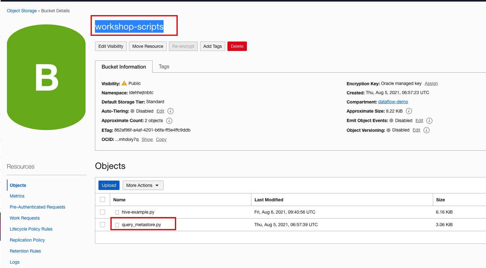

3. Create a Python Application in OCI Dataflow as described in the Step #4 above. Provide the following input :

   1. ```Name``` for the application

   2. Select the ```query_metastore.py``` from the bucket ```workshop-scripts```

   3. In the argument Pass the DBName that used to create the Managed Table.

   4. In the `Metastore in dataflow-demo` choose ```DF-metastore``` and you should the path of the Managed table getting populated automatically.

   5. The configuration should look like as shown in the snapshot

       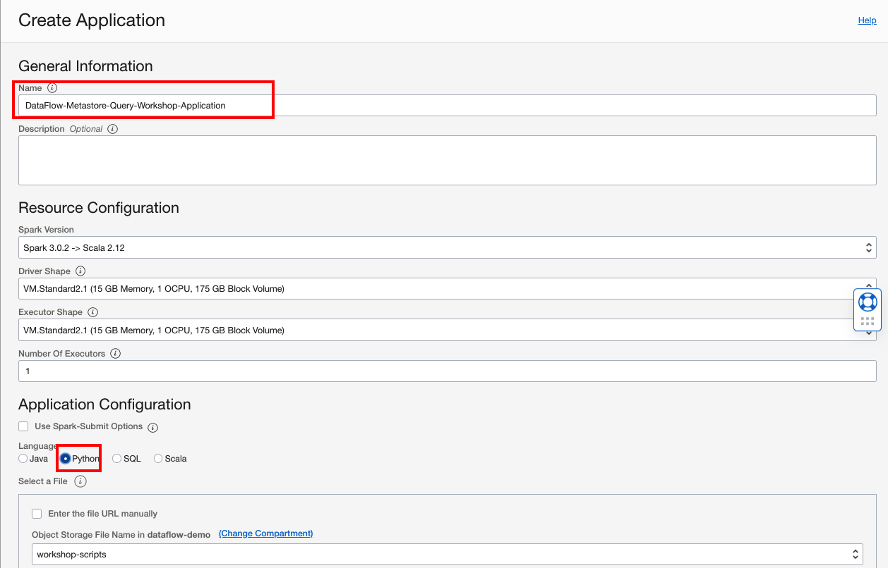

       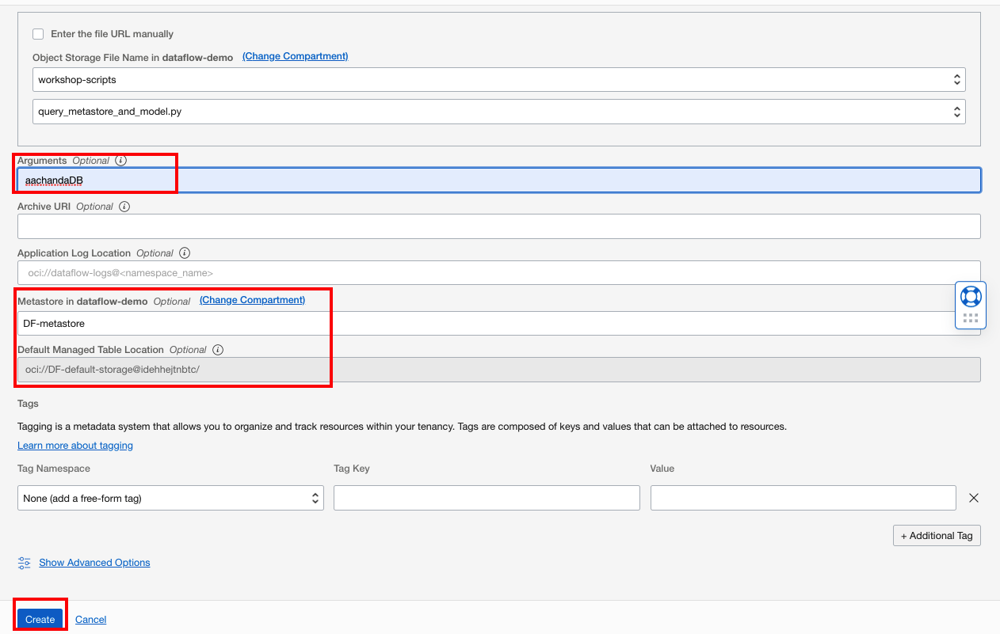

   6. Click ```Create``` and save the application.

   7. Next Run the Application, by launching the application and clicking on ```Run```

      

   8. Application status changes from ```Accepted``` to ```In-Progress``` and ```Succeeded```

   9. Open the logs and you should see the results as  below

    

## **STEP 6**: Connect to the table from Oracle Analytics Cloud (OAC)

1. From the Console navigate to  ```Analytics Cloud```

   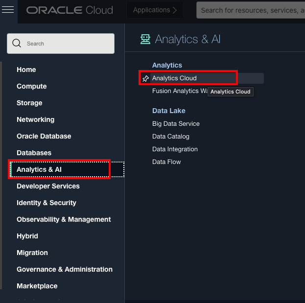

2. In the ```dataflow-demo``` compartment you should see the following instances created that are created for the workshop

   

3. Click on the Instance ```DFWorkshop1``` and click open the ```URL```

   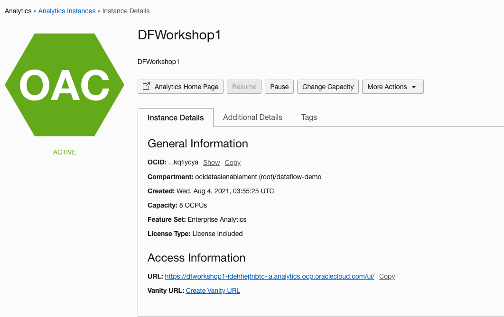

4. You should be re-directed to the OAC Console

   

5. On the console first we create a dataset

   1. Click ```Connect to Your Data```

       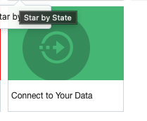

   2. Select the OAC instance ```DF-Workshop-1```

       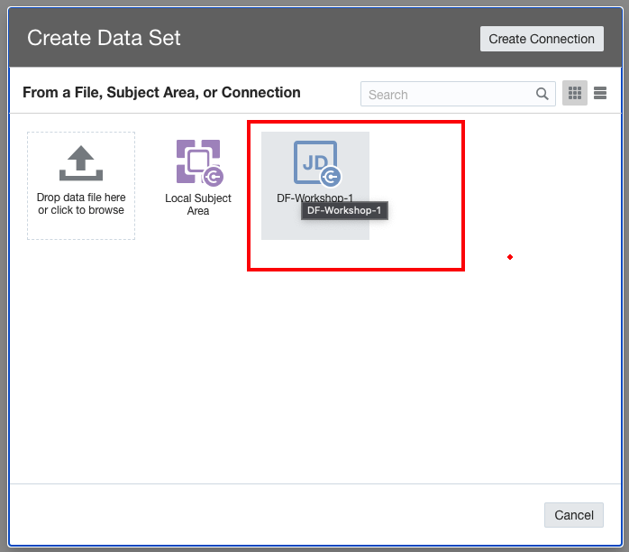

   3. It should show the databases that we created in Python Application. On this screen select ```Manual Query```

       

   4. Click the ```Manual Query``` option on the editor and right click on the ```Manual Query``` box and click ```Edit Definition```

        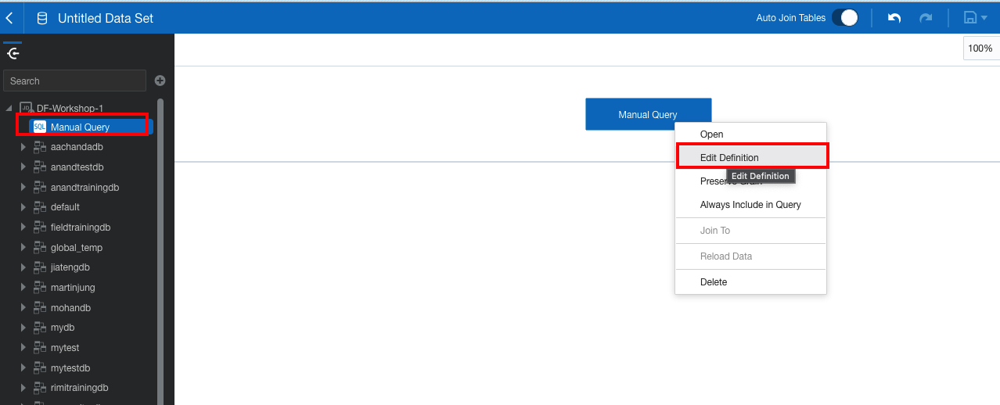

   5. On the Query Editor enter the following query (Replace the Database name with your DB Name)

      ~~~ sql
      SELECT business.name, year(date),business.state, business.attributes_Alcohol alcohol,attributes_GoodForKids goodForKids, business.attributes_RestaurantsTakeOut takeout, avg(review.stars) average_star FROM fieldtrainingDB.yelp_review review, fieldtrainingDB.yelp_business_raw business WHERE business.business_id = review.business_id GROUP BY business.name, year(date),business.state,business.attributes_Alcohol,business.attributes_GoodForKids, business.attributes_RestaurantsTakeOut
      ORDER BY average_star DESC;
      ~~~

      ***Note*** : Above example uses ```fieldtrainingDB``` Replace the DB in the query with the DB Name that you had used

   6. Enter a name for Dataset and Save.

   7. Open the Dataset and it should look as below
        

6. (Optional) Create a project to Visualize the data in Map Interface as described in [tutorial](https://docs.oracle.com/en/cloud/paas/analytics-cloud/tutorial-create-map-view-of-data/#background) and selecting ```state``` and ```average_start``` columns from  the dataset

## Acknowledgements

* **Author** - Anand Chandak

* **Adapted by** -  
* **Contributors** -

* **Last Updated By/Date** -

## Need Help?

Please submit feedback or ask for help using our [LiveLabs Support Forum](<https://community.oracle.com/tech/developers/categories/Data> flow). Please click the **Log In** button and login using your Oracle Account. Click the **Ask A Question** button to the left to start a *New Discussion* or *Ask a Question*.  Please include your workshop name and lab name.  You can also include screenshots and attach files.  Engage directly with the author of the workshop.

If you do not have an Oracle Account, [click](https://profile.oracle.com/myprofile/account/create-account.jspx) to create one.
