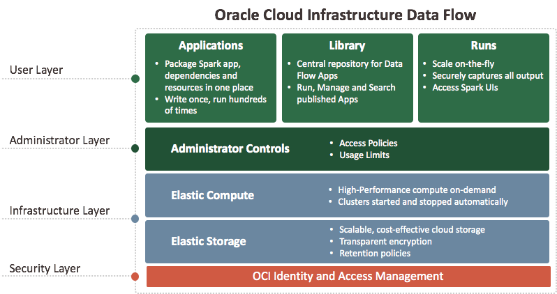

# Introduction

This tutorial introduces you to Oracle Cloud Infrastructure Data Flow, a service that lets you run any Apache Spark Application  at any scale with no infrastructure to deploy or manage. If you've used Spark before, you'll get more out of this tutorial, but no prior Spark knowledge is required. All Spark applications and data have been provided for you. This tutorial shows how Data Flow makes running Spark applications easy, repeatable, secure, and simple to share across the enterprise.

Estimated time: 15 minutes

## Oracle Cloud infrastructure Data Flow

Data Flow is a cloud-based serverless platform with a rich user interface. It allows Spark developers and data scientists to create, edit, and run Spark jobs at any scale without the need for clusters, an operations team, or highly specialized Spark knowledge. Being serverless means there is no infrastructure for you to deploy or manage. It is entirely driven by REST APIs, giving you easy integration with applications or workflows. You can:
- Connect to Apache Spark data sources.
- Create reusable Apache Spark applications.
- Launch Apache Spark jobs in seconds.
- Create Apache Spark applications using SQL, Python, Java, or Scala.
- Manage all Apache Spark applications from a single platform.
- Process data in the Cloud or on-premises in your data center.
- Create Big Data building blocks that you can easily assemble into advanced Big Data applications.

  

### Data Flow Advantages

Here’s why Data Flow is better than running your own Spark clusters, or other Spark Services out there.
- It's serverless, which means you don’t need experts to provision, patch, upgrade or maintain Spark clusters. That means you focus on your Spark code and nothing else.
- It has simple operations and tuning. Access to the Spark UI is a click away and is governed by IAM authorization policies. If a user complains that a job is running too slow, then anyone with access to the Run can open the Spark UI and get to the root cause. Accessing the Spark History Server is as simple for jobs that are already done.
- It is great for batch processing. Application output is automatically captured and made available by REST APIs. Do you need to run a four-hour Spark SQL job and load the results in - your pipeline management system? In Data Flow, it’s just two REST API calls away.
- It has consolidated control. Data Flow gives you a consolidated view of all Spark applications, who is running them and how much they consume. Do you want to know which applications are writing the most data and who is running them? Simply sort by the Data Written column. Is a job running for too long? Anyone with the right IAM permissions can see the job and stop it.

Watch the video below for a quick overview of Oracle Data Flow.

<figure class="video_container">
  <iframe src="https://secure.brightcove.com/services/mobile/streaming/index/master.m3u8?videoId=6144471608001&secure=true" frameborder="0" allowfullscreen="true" width="50%" height ="200%"> </iframe>
</figure>

## Additional Recommended Resources

1. [OCI Training](https://cloud.oracle.com/en_US/iaas/training)
2. [Familiarity with OCI console](https://docs.us-phoenix-1.oraclecloud.com/Content/GSG/Concepts/console.htm)
3. [Data Flow Overview](https://docs.oracle.com/en-us/iaas/data-flow/using/dfs_service_overview.htm)
4. [Object Storage](https://docs.oracle.com/iaas/Content/Object/Concepts/objectstorageoverview.htm)

*Please proceed to the next lab*

## Acknowledgements

- **Author** - Anand Chandak
- **Adapted by** -  
- **Last Updated By/Date** - Anand Chandak, Feb 2021

