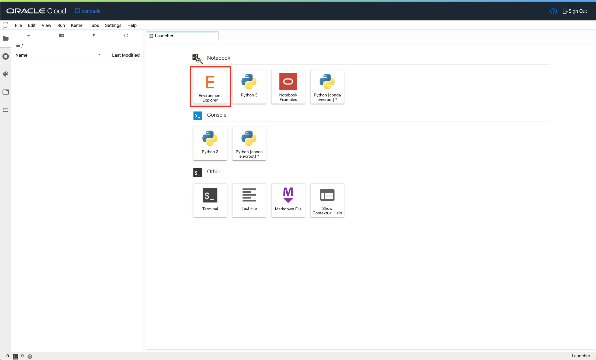
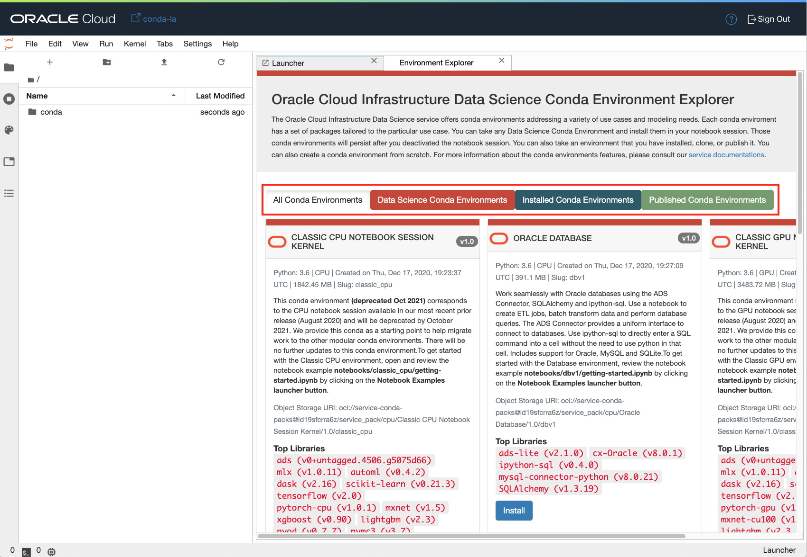
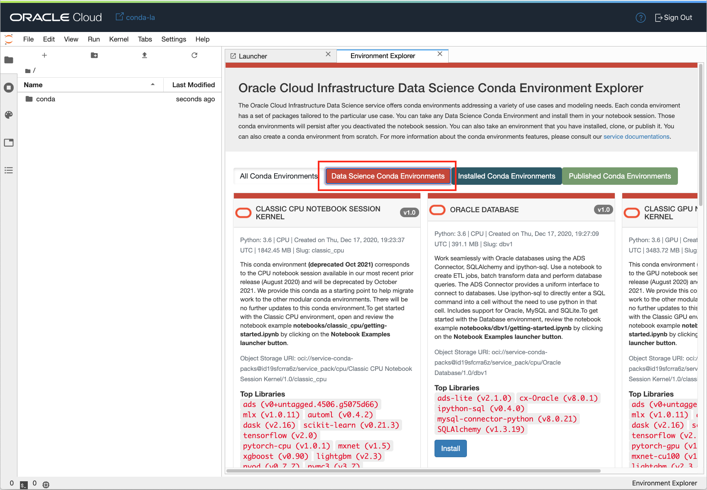
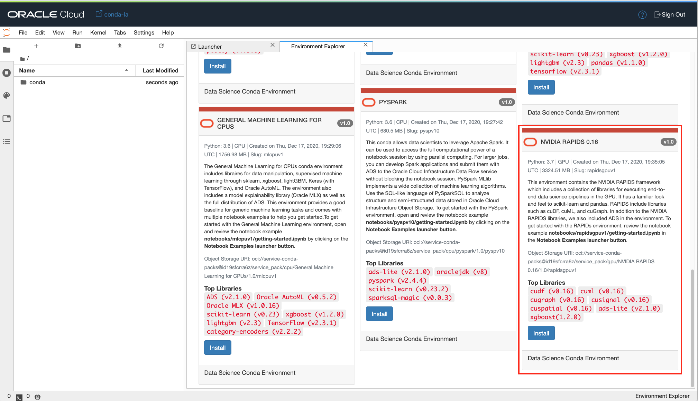
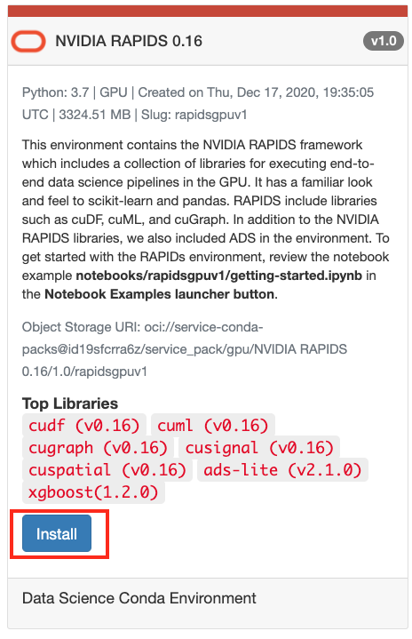
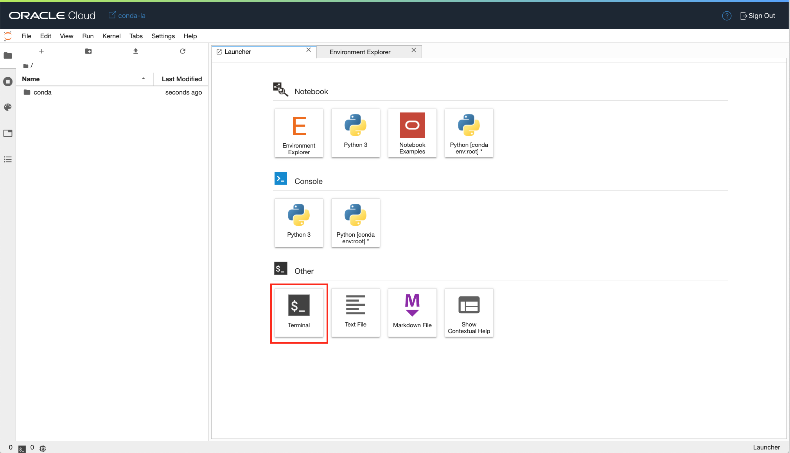
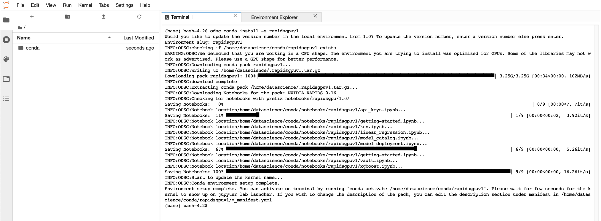
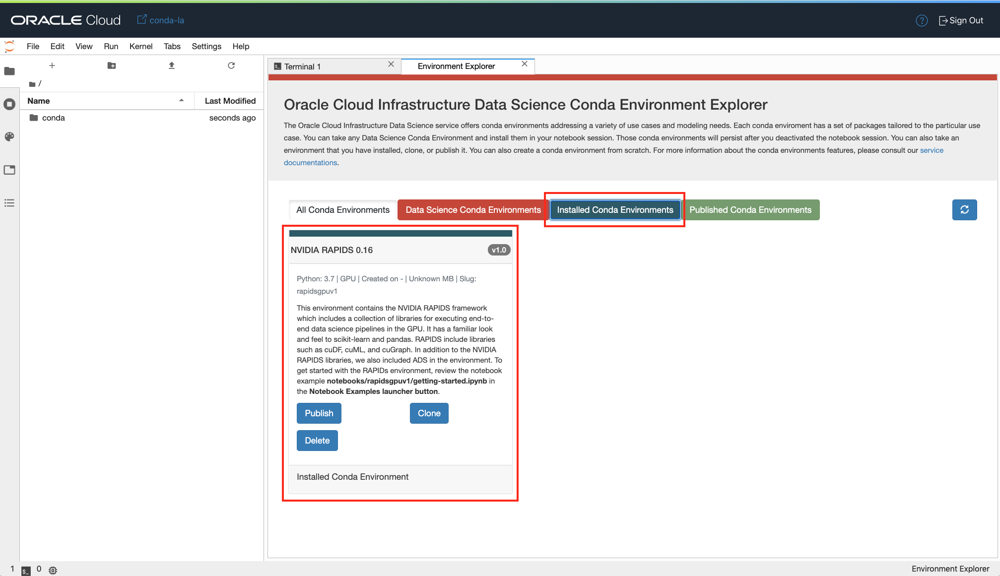
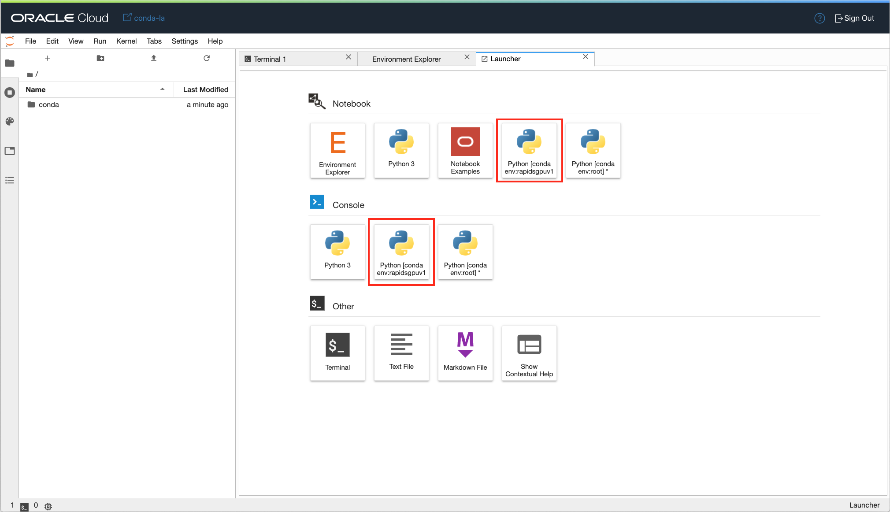

# Installing the NVIDIA RAPIDS Conda Environment

## Introduction

You can think of a [Conda environment](https://docs.conda.io/projects/conda/en/latest/user-guide/concepts/environments.html) somewhere between a Docker image and a Python virtual environment. Conda is like a virtual environment that lets you run Python processes in different environments with different versions of the same library. It’s more powerful than virtualenv, because it can also manage different versions of Python that aren’t installed system-wide, lets you upgrade libraries, and supports the installation of packages for R, Python, Node.js, Java, and so on. The process of building Conda environments is simpler and faster than building Docker images. For many ML and AI use cases, Conda environments offer the right level of isolation and flexibility.  

Within notebook sessions you can leverage the Environment Explorer extension available through the JupyterLab launcher tab, to list, install, publish, delete, and clone Conda environments. Each Explorer tab allows you to filter on either the Data Science, Installed, or Published Conda environments.

The [Data Science Conda Environments](https://docs.oracle.com/en-us/iaas/data-science/using/use-notebook-sessions.htm#conda_understand_environments) tab is in the Environment Explorer extension tab. This tab lists the conda environments that are offered in the Data Science service. These environments are curated by the Data Science service team. The environments are focused on providing a specific tool and framework (for example, PySpark) to do machine learning work (for example, General Machine Learning for GPUs). Or providing a comprehensive environment to solve business use cases.

Alternatively you can call the `odsc conda`  CLI  to list, create, install, delete, clone, and publish conda environments directly from the JupyterLab terminal window.

*Estimated Lab Time:* 10 minutes

### Objectives
In this lab, you:
* explore Data Science conda environments in the Environment Explorer
* install the RAPIDS 0.16 environment in your notebook session
* confirm that the installation was successful

### Prerequisites

## **Step 1:** Install the NVIDIA RAPIDS Conda Environment

You install the NVIDIA RAPIDS 0.16 conda environment in your notebook session to leverage the RAPIDS collection of libraires in your notebook.

1. You first see the JupyterLab interface. In the Launcher tab, of JupyterLab **click on the "Environment Explorer" button** in the "Notebook" section of the launcher tab.

   

1. Once you click on the Environment Explorer button, you will see a series of tabs ("All Conda Environments", "Data Science Conda Environments", "Installed Conda Environments", "Published Conda Environments").
   By default, the option "All Conda Environments" is activated. After one or two seconds, cards will appear under the tabs. Each card represents a different conda environment that is available to install in your notebook session.

   

1. Click on the "Data Science Conda Environments" red tab.

   

1. Scroll down the list of conda environments. Identify the "NVIDIA RAPIDS 0.16" conda environment.

   

1. Click on the install button of the "NVIDIA RAPIDS 0.16" conda environment card.

   

1. You see a command line and a copy button. **Click on the copy button**. This copy button will copy the command line to your clipboard.

   

1. Go back to the JupyterLab Launcher tab and open a terminal window.

   

1. **Paste the command line in the terminal window**. On a Mac, you can use `Command-V`. On Windows machines, use `Ctrl+V`.

   

   You should see the following command:

   ``odsc conda install -s rapidsgpuv1``

   **Execute the command by pressing "Enter" on your keyboard**. You should see a short blurb giving you the option to change the local version of that conda environment. **Ignore this for now by pressing Enter again**.

   

1. The RAPIDS conda environment is now being downloaded and installed into your notebook session. This generally takes two or three minutes to complete.
   You can follow the progress of the installation in the terminal window:

   

   Once the conda environment has been successfully installed, the terminal prompt will be available again:

   

   Congratulations! You have completed Step 1 successfully.

## **Step 2:** Confirm the Successful Installation of the RAPIDS Environment

You will confirm the successful installation of the RAPIDS environment in your notebook session.

1. To verify and confirm that the installation of the conda environment was successful, **go back to the Environment Explorer and click on the "Installed Conda Environments"**. You should see the card of the NVIDIA RAPIDS 0.16 environment.

   

   If you do not see the environment card under "Installed Conda Environments", press on the refresh button to the right of the "Published Conda Environments" tab.

1. The last step is to verify that the RAPIDS conda environment is available as a notebook kernel in JupyterLab. **Go back to the Launcher tab of JupyterLab.**

   If you do not have a Launcher tab available, you can launch a new one by pressing the "+" button right of the folder icon in the top left corner as shown here:

   

1. Stay on the launcher tab. Wait a few seconds. **You should see a new Python kernel appearing under "Notebook" and "Console" (``Python [conda env:rapidsgpuv1]``)**.

   

   Congratulations! You have completed the first lab successfully. You can now install a conda environment in the notebook session. You are ready to move on to the next lab.

## Acknowledgements

* **Author**: [Jean-Rene Gauthier](https://www.linkedin.com/in/jr-gauthier/), Sr. Principal Product Data Scientist
* **Last Updated By/Date**:
    * [Jean-Rene Gauthier](https://www.linkedin.com/in/jr-gauthier/), Sr. Principal Product Data Scientist, January 2021

## Need Help?

Please submit feedback or ask for help using our [LiveLabs Support Forum](https://community.oracle.com/tech/developers/categories/oracle-cloud-infrastructure-fundamentals). Please click the **Log In** button and login using your Oracle Account. Click the **Ask A Question** button to the left to start a *New Discussion* or *Ask a Question*.  Please include your workshop name and lab name.  You can also include screenshots and attach files.  Engage directly with the author of the workshop.

If you do not have an Oracle Account, click [here](https://profile.oracle.com/myprofile/account/create-account.jspx) to create one.
