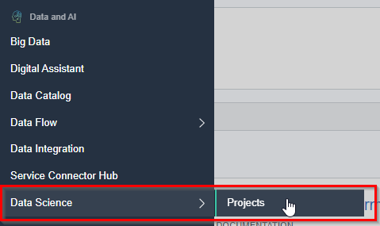
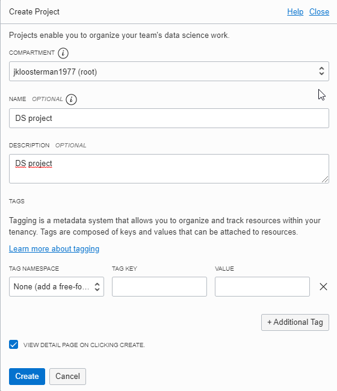
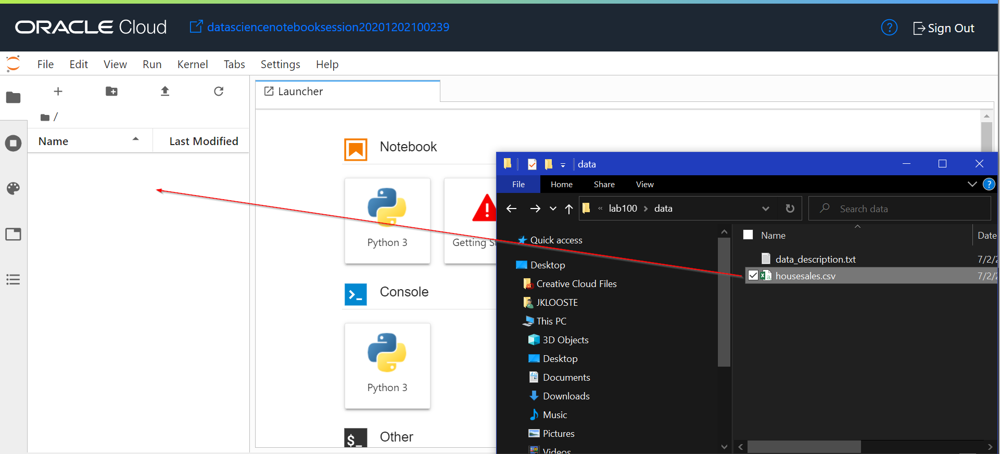
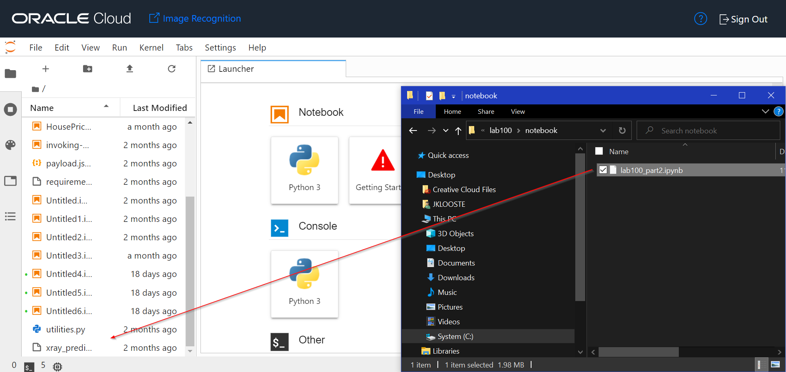
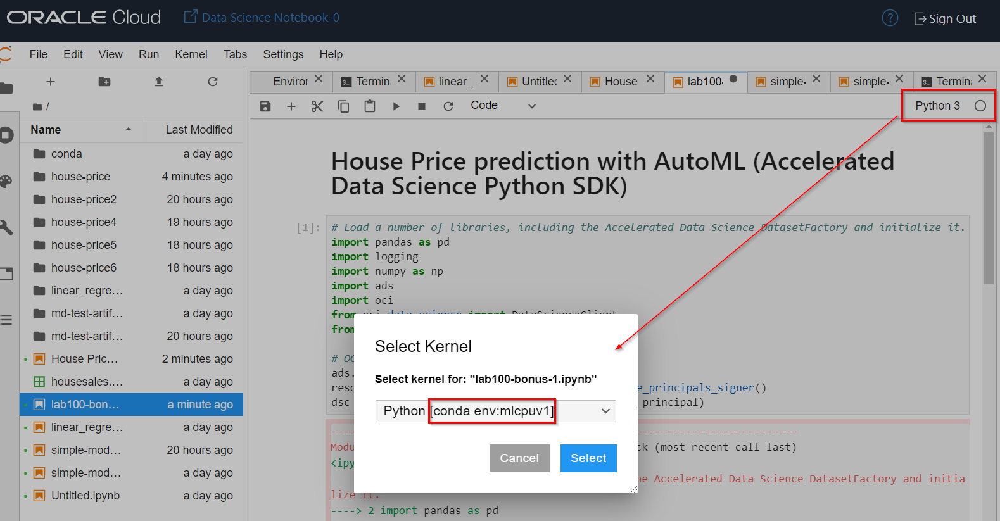

# Lab: Linear Regression (using OCI Data Science service)

## Introduction

This lab will guide you through a practical example of how to train and apply a regression model. You have access to a dataset with house sale data. The dataset includes the Sale Price and many attributes that describe some aspect of the house, including size, area, features, et cetera. You will use this dataset to build a regression model that can be used to estimate what a house with certain characteristics might sell for.

There are many applications of regression in business. The main use cases are around forecasting and optimization. For example, predicting future demand for products, estimating the optimal price for a product and fine-tuning manufacturing and delivery processes. In other words, the principles that you learn with this exercise are applicable to those business scenarios as well.

This video will cover additional theory that you require to be able to do the exercise.

[](youtube:y_GpyF-y1xw)

Estimated lab time: 90 minutes (video 8 minutes, exercise +/- 80 minutes)

### Objectives

In this lab you will:
* Become familiar with Data Exploration, Data Preparation, Model training and Evaluation techniques.
* Become familiar with Python and its popular ML libraries, in particular Scikit Learn.
* Become familiar with the OCI Data Science service.

### Prerequisites

* An Oracle Free Tier, Always Free, Paid or LiveLabs Cloud Account (see prerequisites in workshop menu)

## **STEP 1:** Provision OCI Data Science

This guide shows how to use the Resource Manager to provision the service using Resource Manager. This process is mostly automated. However, if you prefer a step-by-step manual approach to control every aspect of the provisioning, please follow the following instructions instead: [manual provisioning steps](https://docs.cloud.oracle.com/en-us/iaas/data-science/data-science-tutorial/tutorial/get-started.htm#concept_tpd_33q_zkb).

1. Download the terraform configuration source

    Download [Terraform configuration source](https://objectstorage.eu-frankfurt-1.oraclecloud.com/p/Y1AdqPkxQdFho1SEuMMO7W8DlMWAkr0FUwdnL-m3ysgXirfHz9IV48yyAkRARF-b/n/odca/b/datascienceworkshop/o/oci-ods-orm.zip) and store it on your local PC. Depending on the browser you might have to use Left/Right click to do this. Make sure the extension of the saved file is .zip

2. In your Oracle Cloud console, open the menu.
   

3. Select Resource Manager -> Stacks.

   

4. Click the "Create Stack" button.

   

5. Select the configuration source you download earlier

    Select ".ZIP" and drag the file you downloaded to the box.

    

6. Choose a compartment that you've created or use Root.

   

7. Click "Next".

   

8. Disable Project and Notebook creation

    In the section "Project and Notebook Configuration" *uncheck* the checkbox "Create a Project and Notebook Session" (we will create them using the console later).

    

9. Make sure "Enable Vault Support" is disabled

   

10. Make sure "Provision Functions and API Gateway" is disabled

   

11. Click "Next".

   

12. Click "Create".

   

13. Run the job

   Go to "Terraform Actions" and choose "Apply".

   

14. Click Apply once more to confirm the submission of the job.

   Provisioning should take about 5 minutes after which the status of the Job should become "Succeeded".

15. Create Oracle Data Science Project

    Open the OCI Data Science projects and choose "Create Project".

    

    

    Choose a name and description and press "Create".

    

16. Provision an Oracle Data Science notebook

    

    - Select a name.
    - We recommend you choose VM.Standard2.8 (*not* VM.Standard.*E*2.8) as the shape. This is a high performance shape, which will be useful for tasks such as AutoML.
    - Set blockstorage to 50 GByte.
    - Select defaults for VCN and subnet. These should point to the resources that were created earlier by the resource manager.

    

    Finally click "Create". The process should finish after about 5 minutes and the status of the notebook will change to "Active".

## **STEP 2:** Open the OCI Data Science notebook

1. Open the notebook that was provisioned

   The name of the notebook may be different than shown here in the screenshot.

   

   

## **STEP 3:** Install a Conda Package

   A Conda package is a collection of libraries, programs, components and metadata. It defines a reproducible set of libraries that are used in the data science environment. We are going to use the General Machine Learning for CPUs conda. The following commands will install this Conda.

   1. Open a terminal window by clicking on **File**, **New** and then **Terminal**.
   1. Run the command: `odsc conda install -s mlcpuv1`
   1. You will receive a prompt related to what version number you want. Press `Enter` to select the default.
   1. Wait for the conda package to be installed.

   This will take about 5 minutes.

## **STEP 4:** Prepare the House Sales Data for analysis

1. Download the dataset with the house prices and characteristics.

    Download [The training dataset](files/housesales.csv) (the dataset is public). Depending on the browser you might have to use Left/Right click to do this. Make sure the extension of the saved file is .csv

2. Review the dataset (e.g. use a text editor).

   The column names are explained [here](files/data-description.txt). This document also explains the possible list-of-values for categorical attributes.

3. Upload the dataset by dragging it to the left panel

   

## **STEP 5:** Start the Python notebook

1. Open Launcher

    If you don't have a launcher open yet, do so by going to File -> New Launcher. .

2. Start notebook

    It is **important** to select the Python environment with the right Conda environment that we just installed. Look for the notebook that uses Conda **"mlcpuv1"** and open it. 

## **STEP 6:** Data Exploration

The goals of Data Exploration are to identify what data you have and what is usable, identify issues such as missing values and outliers, and to form ideas of new features that could be calculated (Feature Engineering). Later on we'll use the knowledge that we gain during Data Exploration to decide which data transformations to perform.

1. Copy the code for loading the required Python libraries

    - `Pandas` is a library that's used for working with data, e.g. displaying it and doing data transformations.
    - `Numpy` is a library to work with arrays and for calculations.
    - `Sklearn` is the standard Python library for machine learning. It provides many unsupervised and supervised learning algorithms.
    - `Seaborn` is a Python data visualization library based on matplotlib.

    Press the copy button on the fragment below.

     ```python
     <copy>
     import pandas as pd
     import matplotlib.pyplot as plot
     import seaborn as sns
     import numpy as np
     from scipy.stats import norm
     from sklearn.preprocessing import StandardScaler
     from sklearn.model_selection import train_test_split
     from sklearn import linear_model
     from sklearn.metrics import mean_squared_error
     from scipy import stats
     import warnings
     warnings.filterwarnings('ignore')
     %matplotlib inline
     </copy>
     ```

2. Paste the code into the Notebook and run it

   

   Follow the copy-paste approach every time you see a piece of code like this.

3. Load the training data

   We'll split this into train and test later. All these type of data operations are handled by the Pandas library (named `"pd"` here)

    ```python
    <copy>
    alldata = pd.read_csv('./housesales.csv')
    </copy>
    ```

4. Check how much data we have

   Is the dataset large enough to train a model?

    ```python
    <copy>
    alldata.shape
    </copy>
    ```

    This shows that there are 1460 rows, which at first sight looks like a good enough to train an initial model. The data is not extensive enough for production use but would help establish a good baseline. We also see that there are 80 input features that we can potentially use to predict our target variable.

5. Review the target attribute: `SalePrice`

    Before we look at the input features, let's have a close look at our Target attribute: `SalePrice`.

    First, let's display some values. The `[:10]` selects only the first 10 rows.

    ```python
    <copy>
    alldata['SalePrice'][:10]
    </copy>
    ```

6. Let's check if there are any empty values

    ```python
    <copy>
    alldata['SalePrice'].isnull().sum()
    </copy>
    ```

7. Let's check the price range:

    ```python
    <copy>
    minPrice = alldata['SalePrice'].min()
    maxPrice = alldata['SalePrice'].max()

    print('Min Sales Price (%d) - Max Sales Price (%d)' % (minPrice,maxPrice))
    </copy>
    ```

    This tells us that *SalePrice* is an integer and has numbers in the range that we would expect from house prices. There are no empty values. We could see however that the price range is very wide from a 34900 up to 755000. This would require to scale the price to allow the algorithm to learn better.

8. Which columns will we select as input features for our model?

   Let's start by listing all the columns.

    ```python
    <copy>
    alldata.columns
    </copy>
    ```

9. Separate the columns into numerical and categorical

    Let's get a list of all numeric features first.

    ```python
    <copy>
    alldata.select_dtypes(include=np.number).columns.tolist()
    </copy>
    ```

    As we can see there are too many, maybe more useful will be to separate them and see only the numerical and the categorical ones.

10. Show a sample of numerical columns

   Now that we see the numeric columns we could also show a sample to get some impression about the data.

    ```python
    <copy>
    alldata.select_dtypes(include=[np.number])
    </copy>
    ```

11. Show a list of categorical columns

   We could do the same for all categorical variables, notice this time we use the property `exclude` in the `select_dtypes` function...

    ```python
    <copy>
    alldata.select_dtypes(exclude=np.number).columns.tolist()
    </copy>
    ```

12. Show a sample of categorical variables

    ```python
    <copy>
    alldata.select_dtypes(exclude=[np.number])
    </copy>
    ```

13. What can we conclude about the columns?

    There are many input features that we could potentially use. Some of these columns are self explanatory, others not so much. To understand what each column means, have a look at [data_description.txt](./files/data-description.txt) for background.

14. Which columns would we select intuitively?

    To start with, let's first take an intuitive approach. Ask yourself:

   "Which of these columns is likely of value to predict Sale Price?"
   "Which factors of a house would I look at yourself when making a buying decision?"
   "Is enough information available in these columns, are there any empty values?"

   Imagine that we've decide that we believe the following features are relevant: `GrLivArea` size of living area, `TotalBsmtSF` size of basement, `OverallQual` overall quality category, `YearBuilt` year house was built `MSZoning` A=Agriculture, C=Commercial, RH=Residential High Density, etc.

15. Are the columns we intuitively selected also actually correlated with the Sale Price?

   Let's test our theories that these input features are correlated with Sale Price. We'll start with the numerical variables first: `GrLivArea`, `TotalBsmtSF`, `OverallQual` and `YearBuilt`.
   Because all of these are numerical continuous attributes, we can use scatter plots here.

    ```python
    <copy>
    plot.scatter(alldata.GrLivArea, alldata.SalePrice)
    plot.xlabel("GrLivArea")
    plot.ylabel("SalePrice")
    plot.show()
    plot.scatter(alldata.TotalBsmtSF, alldata.SalePrice)
    plot.xlabel("TotalBsmtSF")
    plot.ylabel("SalePrice")
    plot.show()
    plot.scatter(alldata.OverallQual, alldata.SalePrice)
    plot.xlabel("OverallQual")
    plot.ylabel("SalePrice")
    plot.show()
    plot.scatter(alldata.YearBuilt, alldata.SalePrice)
    plot.xlabel("YearBuilt")
    plot.ylabel("SalePrice")
    plot.show()
    </copy>
    ```

      We can conclude that:
    `GrLivArea`: There is a linear correlation with `SalePrice`; We can draw a straight line from the bottom-left to the top-right.
    `TotalBsmtSF`: It appears to be an relationship between `TotalBsmtSF` and `SalePrice` too but not that obvious. It seems a higher basement sizes lead to higher prices but we could notice that there are some outliers.
    `OveralQual`: As expected, there is a higher sales price when overal quality perception is higher. But that is not nessary for the entire price range. Probably the quality of the house is not enough and the price would depend on the location or the zoning as well.
    `YearBuilt`: This relationship is a little less obvious, but there's a trend for higher prices for more recent construction.

    These attributes appear to be of predictive value and we definitely want to keep them in our training set!

    On another note, we see several `outliers`. In particular, the attribute `GrLivArea` shows that there are some houses with exceptionally large living areas given their price. We could notice this also for the `TotalBsmtSF`. Generally it is recommended to build the initial model with all the available values first and then start removing outliers to see if this would improve the prediction and make the model generalize better.

16. Is the categorical attribute `MSZoning` also correlated with `SalePrice`?

   This attribute contains the type of property (`A=Agriculture`, `C=Commercial`, `RH=Residential High Density`, et cetera). Correlation between a categorical and a continuous attribute (SalePrice) can be visualized as a boxplot.

    ```python
    <copy>
    var = 'MSZoning'
    data = pd.concat([alldata['SalePrice'], alldata[var]], axis=1)
    f, ax = plot.subplots(figsize=(10, 7))
    fig = sns.boxplot(x=var, y="SalePrice", data=data)
    fig.axis(ymin=0, ymax=800000)
    </copy>
    ```

   What can we conclude from this? The boxplots for the various types of properties look very different. From the plot we could see that the residential areas seems to be more expensive as expected than commercial but the price range is high. So, again, MSZoning appears to contain important
   information to predict the price.

17. What is the relationship between Neighborhood and SalePrice?

   Let's explore also the relationship of the Neighborhood to the price. We can plot the data using the same technique.

    ```python
    <copy>
    var = 'Neighborhood'
    data = pd.concat([alldata['SalePrice'], alldata[var]], axis=1)
    f, ax = plot.subplots(figsize=(30, 10))
    fig = sns.boxplot(x=var, y="SalePrice", data=data)
    fig.axis(ymin=0, ymax=800000)
    </copy>
    ```

   The plot is not necessary conclusive, but it appears that as expected some areas are more expensive than others. As such we should keep this columns and use it in the model. Notice that some areas shown very large range of prices and spikes like `NridgHt` or `StoneBr` or very large outliers like in `NoRidge` with prices more than double as the usual range for that neighborhood. After the initial model build you could try to remove these outliers and test if the model would have better performance.

18. A different approach: Systematically checking for correlation between input features and our target

   It becomes clear that manually investigating all of the attributes this way is very time consuming. Therefore, let's take a more systematic approach. Ideally, we would like to see the correlation between all input attributes and the target `SalePrice`.

    ```python
    <copy>
    corr = alldata.corr(method='spearman')
    corr.sort_values(["SalePrice"], ascending = False, inplace = True)
    corr.SalePrice
    </copy>
    ```

   The conclusion is that our intuition of thinking that `TotalBsmtSF`, `OverallQual`, `GrLivArea` and `YearBuilt` are of importance, was correct. However, there are other features listed as high correlation, such as `GarageCars`, `GarageArea` and `Fullbath`.

   Here's a list  of the features that are most correlated with our target:
    - `OverallQual`: Rates the overall material and finish of the house (1 = Very Poor, 10 = Very Excellent)
    - `GrLivArea`: Above grade (ground) living area square feet
    - `GarageCars`: Size of garage in car capacity
    - `GarageArea`: Size of garage in square feet
    - `TotalBsmtSF`: Total square feet of basement area
    - `1stFlrSF`: First Floor square feet
    - `FullBath`: Full bathrooms above grade
    - `TotRmsAbvGrd`: Total rooms above grade (does not include bathrooms)
    - `YearBuilt`: Original construction date

19. Is there data missing from some of the columns?

   Many machine learning models are unable to handle missing data. We have to find out how much data is missing.

   At the moment of replacing missing data, we should first find out whether that would cause some kind of distortion in the data and have a negative effect on model quality.

   Therefore, we have to see if the missing data follows certain patterns.

   Check how many Empty values each column has, and compute the percentage of the total number of rows.

    ```python
    <copy>
    total = alldata.isnull().sum().sort_values(ascending=False)
    percent = (alldata.isnull().sum()/alldata.isnull().count()).sort_values(ascending=False)
    missing_data = pd.concat([total, percent], axis=1, keys=['Total', 'Percent'])
    missing_data.head(20)
    </copy>
    ```

    There are a lot of attributes with missing values. This is especially the case for attributes `PoolQC`, `MiscFeature`, `Alley`, `Fence` and `FireplaceQu`.

20. Let's investigate the attributes with most missing values in detail

   Have a look at the [data description](files/data-description.txt) for these columsn in particular. The description of the attribute `PoolQC` (pool quality) is as follows:

    - `Ex - Excellent`
    - `Gd - Good`
    - `TA - Average/Typical`
    - `Fa - Fair`
    - `NA - No Pool`

   It seems sensible to assume that most houses don't have pools and therefore missing values simply mean `"No Pool"`. Therefore we make a note to replace those missing values with `"NA"`.
   Similarly, we make a note to replace the missing values for `MiscFeature`, `Alley`, `Fence` and `FireplaceQu` with `"NA"`.

   The next attribute with many hidden values is `LotFrontage`, which means `"Linear feet of street connected to property"`. This is a continuous measure, and we choose that we will replace missing values by with the mean of the existing values. We'll see more of this in the Data Preparation stage.

21. Check the distribution of the Target variable

    It's important that the target variable follows Normal Probability distribution. If it does not, this will negatively impact the model's performance. We can check for this using a histogram, and including a normal probability plot. The Seaborn library does this for us.

    ```python
    <copy>
    sns.distplot(alldata['SalePrice'], fit=norm);
    fig = plot.figure()
    </copy>
    ```

    We can conclude from this that the values of the Target variable currently deviate from the Normal Distribution. You see that it is left skewed. The regression algorithms that we will use later on has problems with such a distribution. We will have to address this problem.

## **STEP 7:** Data Preparation

   During Data Exploration, we have realized that several changes must be made to the dataset. Data Preparation is a logical result of Data Exploration; we will now take action based on the insights that we gained earlier.

1. Update missing values

   In the previous topic (identifying Missing Values) we made the decision that:

   We want to replace the missing values of `PoolQC`, `MiscFeature`, `Alley`, `Fence` and `FireplaceQu` with `"NA"`.
   We will replace missing values of `LotFrontage` with the mean of the existing values. Let's do this:

    ```python
    <copy>
    alldata = alldata.fillna({"PoolQC": "NA"})
    alldata = alldata.fillna({"MiscFeature": "NA"})
    alldata = alldata.fillna({"Alley": "NA"})
    alldata = alldata.fillna({"Fence": "NA"})
    alldata = alldata.fillna({"FireplaceQu": "NA"})
    meanlot = alldata['LotFrontage'].mean()
    alldata = alldata.fillna({"LotFrontage": meanlot})
    alldata = alldata.dropna()
    </copy>
    ```

2. Handling Outliers

   Do you remember that the scatter chart for `GrLivArea` showed several outliers? Let's remove these two outliers, by identifying the houses with the highest `GrLivArea`.

   Show the IDs of the houses with the highest GrLivArea.

    ```python
    <copy>
    alldata.sort_values(by = 'GrLivArea', ascending = False)[:2]
    </copy>
    ```

3. Remove the Outliers

    We are also plotting the chart again to check that the outliers have disappeared.

    ```python
    <copy>
    alldata = alldata.drop(alldata[alldata['Id'] == 1299].index)
    alldata = alldata.drop(alldata[alldata['Id'] == 524].index)
    plot.scatter(alldata.GrLivArea, alldata.SalePrice)
    plot.xlabel("GrLivArea")
    plot.ylabel("SalePrice")
    plot.show()
    </copy>
    ```

      You notice that those outliers have disappeared.

4. Handling the skewed distribution of the Target variable

   Do you remember that the histogram of `SalePrice` showed a positive skew? We can solve this problem by converting the target variable. We use a `-log-` transformation to make the variable fit normal distribution. Let's make the log transformation and show the histogram again to check the result.

    ```python
    <copy>
    y = np.log(alldata['SalePrice'])
    sns.distplot(y, fit=norm)
    fig = plot.figure()
    </copy>
    ```

    You will notice that the sales price now follows a normal distribution. We will use the newly created `y` variable later to fit our model.

5. Removing irrelevant features

   In any case we will remove the ID column, which does not carry any predictive value. We will also remove the attributes that showed very low correlation with `SalePrice` during Data Exploration. Note that this is a fairly brute approach, but it is again sufficient for our exercise. After the first model build, you could start adding back some of the features and observe if the model will generalize better.

    ```python
    <copy>
    alldata.drop("Id", axis = 1, inplace = True)
    alldata.drop("BsmtFullBath", axis = 1, inplace = True)
    alldata.drop("BsmtUnfSF", axis = 1, inplace = True)
    alldata.drop("ScreenPorch", axis = 1, inplace = True)
    alldata.drop("MoSold", axis = 1, inplace = True)
    alldata.drop("3SsnPorch", axis = 1, inplace = True)
    alldata.drop("PoolArea", axis = 1, inplace = True)
    alldata.drop("MSSubClass", axis = 1, inplace = True)
    alldata.drop("YrSold", axis = 1, inplace = True)
    alldata.drop("BsmtFinSF2", axis = 1, inplace = True)
    alldata.drop("MiscVal", axis = 1, inplace = True)
    alldata.drop("LowQualFinSF", axis = 1, inplace = True)
    alldata.drop("OverallCond", axis = 1, inplace = True)
    alldata.drop("KitchenAbvGr", axis = 1, inplace = True)
    alldata.drop("EnclosedPorch", axis = 1, inplace = True)
    </copy>
    ```

6. Separating Target and Input Features

    Scikit Learn expects that we deliver the data for training in two parts:

    - A dataset with a single column, the target, in this case `SalePrice`. We did this already earlier by taking the `log` of the `SalePrice` and storing it in `"y"` variable.
    - A dataset with all the input columns, in this case all columns apart from `SalePrice`. We will place this in variable "X".

    Get all the data with the exception of the `SalePrice` and place it in variable X:

    ```python
    <copy>
    X = alldata.drop(['SalePrice'], axis=1)
    </copy>
    ```

7. Convert categorical values to numbers

   Most ML algorithms can only work with numbers. Therefore we should convert categories to numbers first.

   For all attributes we will assume that they are Nominal (as opposed to Ordinal), meaning that there's no order/sequence in the values that it can take. The go-to method to encode Nominal categorical values is Onehot Encoding. This will convert each separate value of a category into its own column that can take a value of 1 or 0. The Pandas `get_dummies` function does OneHot encoding.

   You will see that after this the `SaleType` column has been converted into `SaleType_ConLw`, `SaleType_New`, et cetera. The dataset now only has numerical values.

    ```python
    <copy>
    X = pd.get_dummies(X)
    X.head()
    </copy>
    ```

## **STEP 8:** Building the model

   We will build a simple Linear Regression model. We will use the Scikit-Learn library for this.

1. Split Train and Test data so we can validate the model later

   After building the model, we will want to test its performance against new data. It's important that this data has not been seen before during the model training. To achieve this we have to reserve part of our dataset for testing, which will be removed from the training phase.

   We'll reserve 20% of the total dataset for testing. The random_state variable is for initializng the randomizer. By hardcoding it here we make sure that we select the same records everytime that we run the script.

    After this we will have 4 variables:
    - `X_train`: The input features of the training dataset.
    - `X_test`: The input features of the test dataset.
    - `y_train`: The target of the training dataset.
    - `y_train`: The target of the test dataset.

    ```python
    <copy>
    X_train, X_test, y_train, y_test = train_test_split(X, y, random_state=63, test_size=.20)
    </copy>
    ```

2. Build the model

   Now we're ready to build the model (on the training data only). Building the model is also called "fitting".

    ```python
    <copy>
    lr = linear_model.LinearRegression()
    model = lr.fit(X_train, y_train)
    </copy>
    ```

## **STEP 9:** Verifying the performance of the model

How accurate is our model? We will use the Test dataset for this.

1. First apply the predictions on the Test dataset

    ```python
    <copy>
    y_predicted = model.predict(X_test)
    </copy>
    ```

2. Look at the prediction of one particular house

    From the given test set we get the data of one house and check the predicted value.

    ```python
    <copy>
    y_predicted[0]
    </copy>
    ```

3. Convert the value back to an actual house price

    You would notice that the price above is strange, it shows a number that doesn't seem to be a normal house Sales Price. If you remember we scaled the SalePrice by using np.log(SalePrice) to get the prices in smaller range and help the algorithm generalize and learn better. To get the real price now we need to revert back this scale. To do so we have to use np.exp.

    ```python
    <copy>
    np.exp(y_predicted[0])
    </copy>
    ```

4. An intuitive, visual approach to verification

   To verify the quality of the predictions, let's first use an intuitive visual approach, which works well for linear regression models. For this we will display in one plot:

    - a. The actual `SalePrice` (according to the original data in the Test dataset)
    - b. The predicted `SalePrice` (the value according to our model)

    We're plotting this as a scatter.

    ```python
    <copy>
    plot.scatter(y_predicted, y_test)
    plot.xlabel('Predicted Sale Price')
    plot.ylabel('Actual Sale Price')
    plot.title('Comparing Predicted and Actual Sale Prices')
    plot.plot(range(11, 15), range(11, 15), color="red")
    plot.show()
    </copy>
    ```

    In ideal circumstances we'd like to see the predictions falling on the line of actual values. This would mean that Predicted and Actual Sale Prices are the same. In our case, although the points are not oriented in a perfectly straight line, the model appears to be fairly accurate.

5. A measurable approach to verification

    How can we express the accuracy of the model in a more mathematical way? For that we use a quality metric, in this case we could use [RMSE](https://en.wikipedia.org/wiki/Root-mean-square_deviation).

    `RMSE` measures the distance between the predictions and the actual values. A lower value for RMSE means a higher accuracy.

    RMSE by itself is not easy to interpret, but it can be used to compare different versions of a model, to see whether a change you've made has resulted in an improvement. Scikit-Learn has a function to calculate RMSE.

    ```python
    <copy>
    print('RMSE: ', mean_squared_error(y_test, y_predicted))
    </copy>
    ```

## **STEP 10:** Store the model in the catalog and deploy it

1. Make sure you have a working model

    The following requires that you built a model successfully in steps 1 to 9. If you had any problems, you can download a [prebuilt notebook](files/house-price-prediction.ipynb) with all the steps done for you. Depending on the browser you might have to use Left/Right click to do this. Make sure the extension of the saved file is .ipynb

    After you've downloaded it, drag it into OCI Data Science and open it (using the right Conda environment "mlcpuv1". Then  run all the cells before going to the next step.

2. Store the model in the model catalog

    If we want applications/business processes to make good use of our model, then we need to deploy it first. We start by publishing the model to the model catalog. The following will **serialize** the model along with some other artifacts and store it in the catalog under the name "house-price-model".

    ```python
    <copy>
    import ads
    from ads.common.model_artifact import ModelArtifact
    from ads.common.model_export_util import prepare_generic_model
    import os
    from os import path
    from joblib import dump
    import cloudpickle
    ads.set_auth(auth='resource_principal')
    path_to_model_artifacts = "house-price"
    generic_model_artifact = prepare_generic_model(
        path_to_model_artifacts,
        force_overwrite=True,
        function_artifacts=False,
        data_science_env=True)
    with open(path.join(path_to_model_artifacts, "model.pkl"), "wb") as outfile: cloudpickle.dump(model, outfile)
    catalog_entry = generic_model_artifact.save(display_name='house-price-model',
        description='Model to predict house prices')
    </copy>
    ```

3. Deploy the model

    Now we're going to deploy this model to its own compute instance. This will take the model from the catalog and create a runtime version of it that's ready to receive requests. This uses normal OCI compute shapes. Next, choose "Create Deployment".

    
    

    - Give the model deployment a name, e.g. "house price model deployment"
    - Choose the right model (house-price-model)
    - Choose a shape, one instance of VM.Standard2.1 is sufficient. Note that we could have chosen multiple instances, this is useful for models that are used very intensively.

    Finally, submit the deployment. This should take about 10 minutes. Finally, you should see that the compute instance is active.

    

## Bonus: Train the model using AutoML

   OCI Data Science comes with a Python library SDK called ADS (Accelerated Data Science) that allows you to streamline the entire lifecycle of machine learning models, from data acquisition to model evaluation and interpretation. It also comes with the Oracle AutoML engine, which automates Feature Selection, Algorithm Selection, Feature Encoding and Hyperparameter Tuning.

   We will use it to train a model for the same problem as above (House Price Prediction), but this time automating the process using the various AutoML features. Once we've done that we will evaluate it using the ADS evaluation features and compare it with our "manually" built model that we created earlier.

   This exercise will demonstrate how you can be more productive by using the various features of the ADS library.

   In this case, we've already prepared the notebook that you will run.

1. Download the notebook

  Download the [AutoML and Model Evaluation notebook](files/lab100-bonus-1.ipynb). Depending on the browser you might have to use Left/Right click to do this. Make sure the extension of the saved file is .ipynb

2. Upload the notebook to OCI Data Science by dragging it to the left panel.

    Open it by double clicking it.

    

3. Choose the right Conda environment

    You can do this by clicking on the Python icon on the top-right and selecting the mlcpuv1 environment.

    

4. Open the Notebook that you've just uploaded

   Now go through each of the cells and run them one by one.

   This notebook demonstrates how you can be more productive by using the various features of the ADS library. You need far less code to create a well performing model quickly.

[Proceed to the next section](#next).

## Acknowledgements
* **Authors** - Jeroen Kloosterman - Product Strategy Manager - Oracle Digital, Lyudmil Pelov - Senior Principal Product Manager - A-Team Cloud Solution Architects, Fredrick Bergstrand - Sales Engineer Analytics - Oracle Digital, Hans Viehmann - Group Manager - Spatial and Graph Product Management
* **Last Updated By/Date** - Jeroen Kloosterman, Oracle Digital, Jan 2021

## Need Help?
Please submit feedback or ask for help using our [LiveLabs Support Forum](https://community.oracle.com/tech/developers/categories/livelabsdiscussions). Please click the **Log In** button and login using your Oracle Account. Click the **Ask A Question** button to the left to start a *New Discussion* or *Ask a Question*.  Please include your workshop name and lab name.  You can also include screenshots and attach files.  Engage directly with the author of the workshop.

If you do not have an Oracle Account, click [here](https://profile.oracle.com/myprofile/account/create-account.jspx) to create one.
