# Lab: In-database ML (using Autonomous Database)

## Introduction

In this lab you create an in-database ML model and operationalize it with an APEX application. The actual machine learning logic takes place in the database and the APEX application will pick up the predictions.

As this example we will apply machine learning on a sales scenario, in this case we will predict which customers are most likely to buy a certain product.

Estimated lab time: 50 minutes (video 8 minutes, exercise +/- 40 minutes)

This video will cover the theory behind Neural Networks.
[](youtube:xiUmxdqJ5rA)

### Objectives

In this lab you will:
* Become familiar with in-database machine learning, in particular OML4SQL.
* Understand how APEX can be used to operationalize ML models.
* Get familiar with the business value of identifying customers that are likely to buy a certain product.

### Prerequisites

* An Oracle Free Tier, Always Free, Paid or LiveLabs Cloud Account (see prerequisites in workshop menu)

## **STEP 1:** Provision Autonomous Transaction Processing

1. On the left hand menu, choose Autonomous Transaction Processing.

   

2. Start the creation wizard

   Choose to create a new instance. Choose a specific compartment first, or keep using the root compartment.

   

3. Choose any name for the database, in this case "WORKSHOP".

   

4. Choose the Transaction Processing option

   This will optimize the database for daily transactional processing.

   

5. Choose the Shared Infrastructure deployment type.

   

6. Choose other options

    In order to have an equal performance over all of the ATP instances of all the workshop participants, we recommend that:
    - Keep the Always Free option turned off
    - Keep defaults for OCPU (1) and storage (1 TB)
    - __Disable__ Auto Scaling

    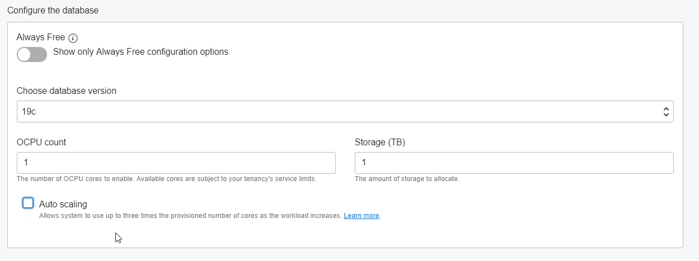

7. Set the admin password.

   *Make a note of this as you will need it.*

   

8. Other settings

    Keep default for "Access Type" and set "License Type" to "License Included".

9. Create the database

    

     This process typically completes within about 5 minutes, after which you will see the status "AVAILABLE".

## **STEP 2:** Prepare the APEX workspace

   The following assumes that you've already provisioned an Autonomous Transaction Processing instance (see Step 1).

1. Open Service Console

   Go to the details of the autonomous database and open the Service Console.
   

2. Open Development
   Select "Development".
   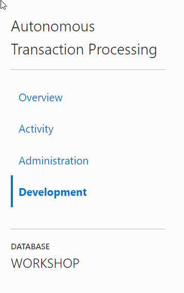

3. Open APEX

   Click on "Oracle APEX".
   

4. Log in

   You will see the login page of APEX Administration Services. Use the ADMIN password that you entered when you provisioned ATP. 

5. Create a new workspace

   Follow the instructions to create a new workspace. 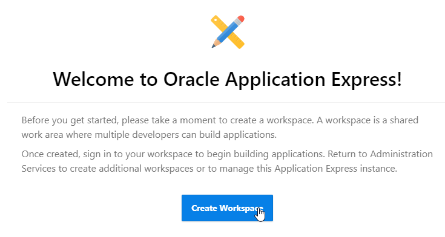

   The workspace (and database user) *must be* named "WORKSHOPATP" (there is some hardcoding in the installation scripts to use this schema name). Keep a note of the password as you will need it later. 

## **STEP 3:** Import the APEX application

1. Download prepared application

    First download the application that we will install. You can find it [here](files/f100.sql).

2. Logout from APEX if required
   If you're in APEX, then first __Log out__. You can do this by clicking on the icon of your user (top right), then choose "Sign Out".

3. Log in to the new workspace
   Now login to the workspace that we created earlier.

   Workspace name: WORKSHOPATP, User name: WORKSHOPATP, use the password that you entered when you created the workspace.

   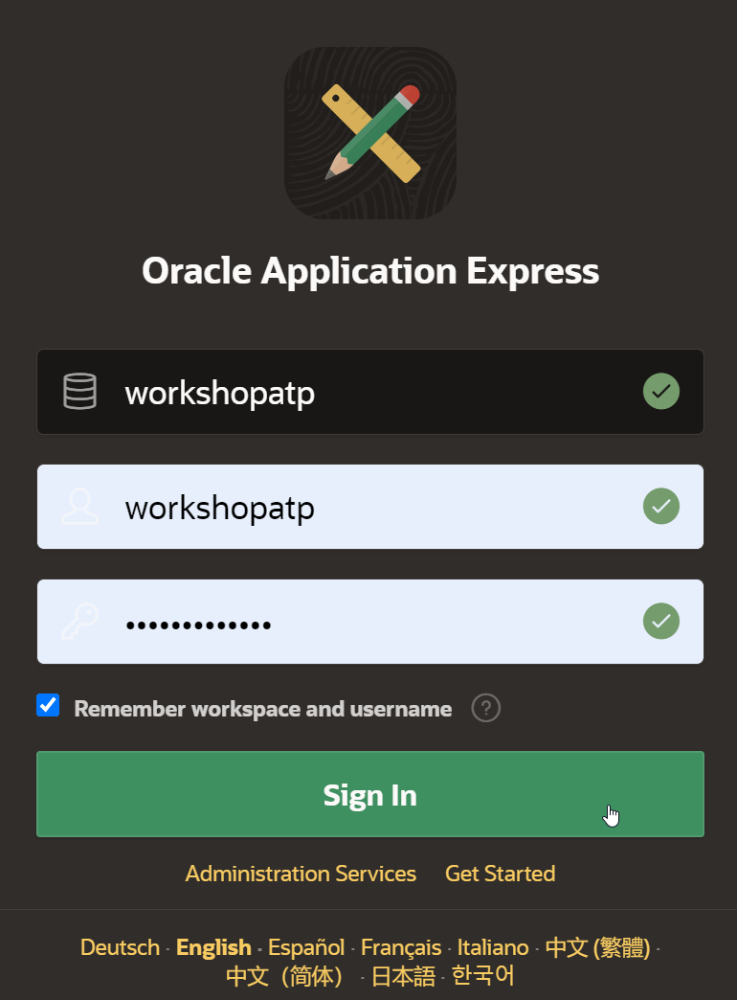

4. Start the import wizard

   Import the example APEX application. Go to "App Builder", then "Import".

   

   Drag the file that you downloaded earlier to the Drag and Drop area, then "Next", "Next" and "Install Application".

   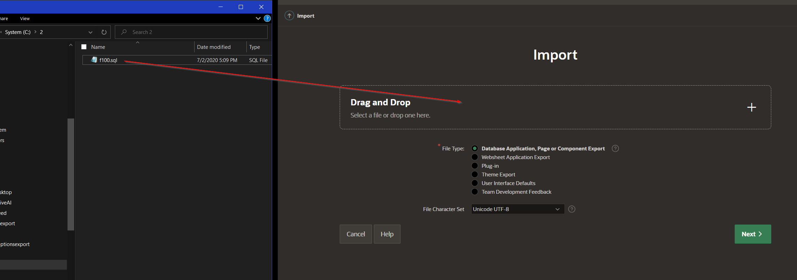

   On the dialog for supporting objects, choose "Next", then "Install". You should now see the following:

   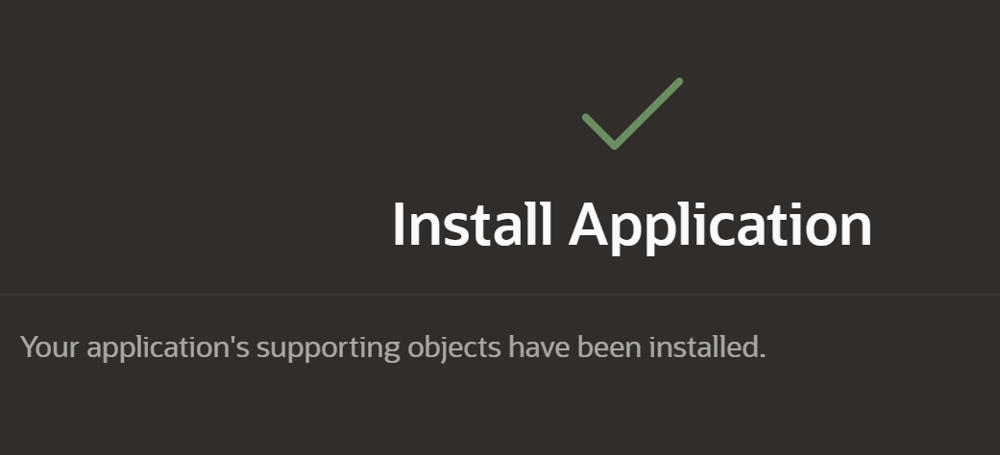

## **STEP 4:** Review the APEX application (situation before ML)

1. Start the application that you just imported

   Open the existing application by clicking on "Run Application".

   

2. Login

   Login using the password that you used when creating the workspace.

   

3. Review the application

   You see the Customer Service Application, with a list of customers.

   

   Our goal is to upsell something to these customers. We want to alert our employee whenever he/she has a customer on the screen that is a good candidate for a particular product that we're trying to sell.
   In practice this means that we want to add a column on this screen that shows whether it's a good idea to try to upsell to this customer.
   This will be the topic for the rest of the exercise.

   

## **STEP 5:** Create an Oracle Machine Learning user

   We will develop the machine learning model using Zeppelin, which comes included in the autonomous database. Zeppelin is a web-based notebook environment that allows us to analyze and experiment with data. In our case we will be using it to build a machine learning model.
   First we will set up a user for Zeppelin.

1. Open the Service Console

   Go to the Service Console of ATP.

   

2. Go to Administration

   Select "Administration" and "Manage ML Users".

   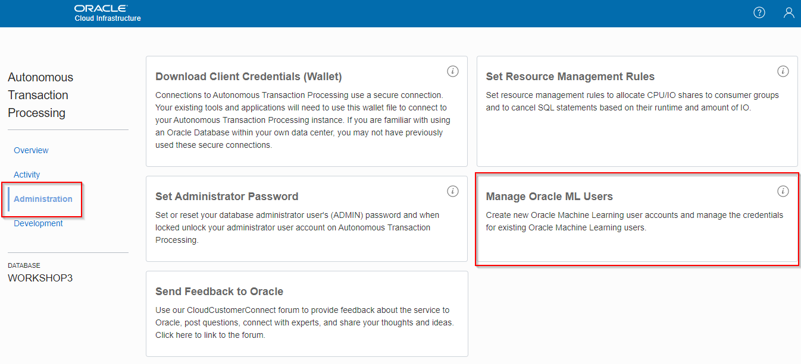

3. Create a new user

    Create a user called "MLUSER1".

    

    The fastest approach is to deselect "Generate password..." and enter a password yourself. Please *make a note of this* as you'll need it.

4. Open the Machine Learning Notebooks

   Go back to the Service Console, then Development, then Oracle Machine Learning Notebooks.

   

5. Sign in

   Sign in with the new user MLUSER1.

   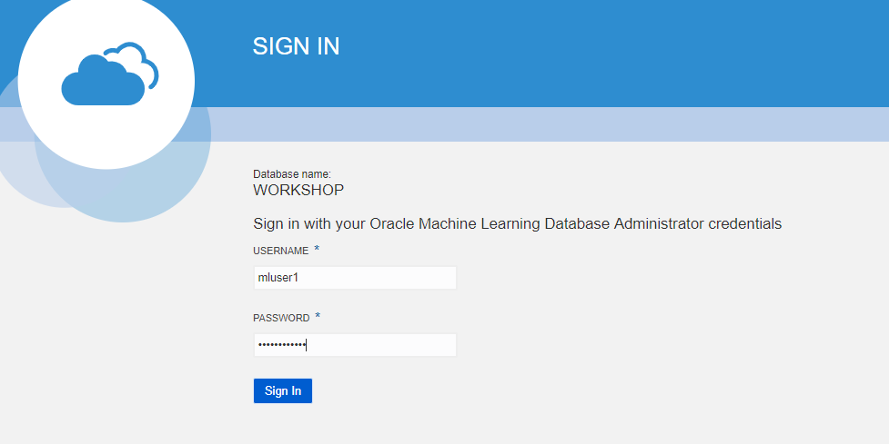

6. Review examples

   Navigate around to get familiar with the ML pages. Click on "Examples".

   

   Note the various ML notebook examples. Feel free to review some of these. We will be creating a new ML notebook in this lab.

   

7. Create a new notebook

   Click on the upper left icon to bring back the menu.  Then select "Notebooks" and "Create". Name the new notebook "Predict Y Box Games".

   

## **STEP 6:** Build the machine learning model with Zeppelin

   Our goal is to predict which customers are interested in buying Y Box Games. In this case we will build a model by letting it learn from existing customers purchasing behavior.

1. Review the input data

    Review the following table with customer information that we'll use as input data for the model:

    ```
    <copy>
    SELECT * FROM SH.SUPPLEMENTARY_DEMOGRAPHICS
    </copy>
    ```

    The result looks like this:

    

    See the column `Y_BOX_GAMES`, which tells us whether the customer already owns Y Box Games.
    And we see many other attributes of which we believe they may have some influence on whether a customer owns Y Box Games.
    For example, the level of education might be an influencing factor for Y Box Games ownership, and so may  Occupation, Household Size, et cetera.

    The magic of machine learning is that it will find out exactly what the relationships are between these variables and our target variable, Y Box Games.

2. Split the input data into test and training

   Split the input data into two sets: 60% for training and 40% for testing.

    ```
    <copy>
    CREATE TABLE N1_TRAIN_DATA AS SELECT * FROM SH.SUPPLEMENTARY_DEMOGRAPHICS SAMPLE (60) SEED (1);
    </copy>
    ```

    ```
    <copy>
    CREATE TABLE N1_TEST_DATA AS SELECT * FROM SH.SUPPLEMENTARY_DEMOGRAPHICS MINUS SELECT * FROM N1_TRAIN_DATA;
    </copy>
    ```

4. Prepare for training with a parameters table

   The model will contain the defintion of the relationship between the driving attributes and the target attribute (Y Box Games).
   Creating those relationships is done during the training phase.
   Defining a model requires several parameters. We first store those parameters in a table. This table can have any name.
   In our case the only parameter is to specify the type of algorithm, in this case a decision tree model.

   Enter the following SQL to create the parameters table.

    ```
    <copy>
    CREATE TABLE N1_BUILD_SETTINGS (SETTING_NAME VARCHAR2(30), SETTING_VALUE VARCHAR2(4000));
    </copy>
    ```

    ```
    <copy>
    INSERT INTO N1_BUILD_SETTINGS (SETTING_NAME, SETTING_VALUE) VALUES ('ALGO_NAME', 'ALGO_DECISION_TREE');
    </copy>
    ```

5. Execute the training process

   Now we are ready to create and train the model.
   Run the following PL/SQL to do this.

   The parameters mean the following:
   * The name that our model will have. This is stored in the database as a special type of object.
   * Whether it's a classification or a regression algorithm. In this case it's a classification algorithm, because we're predicting a class (ownership yes/no) rather than a continuous value.
   * The name of the table to use for training. We created this earlier when we split the dataset.
   * The name of the target column that we want to find the driving factors for, Y Box Games.
   * The name of the column that uniquely identifies each row in the training data. In this case the customer ID.
   * Lastly, the name of the hyperparameters table. In this case it only contains a parameter with the type of model (decision tree).

    ```
    <copy>
    %script
    CALL DBMS_DATA_MINING.CREATE_MODEL('N1_CLASS_MODEL', 'CLASSIFICATION',
      'N1_TRAIN_DATA', 'CUST_ID', 'Y_BOX_GAMES', 'N1_BUILD_SETTINGS');
    </copy>
    ```

   Check the result

   

## **STEP 7:** Validate the results and the quality of the model (using test set)

   We would like to know in what percentage of the cases, the model makes a correct prediction of Y Box Games ownership.
   This is where the test set, that we created earlier, comes in handy. Since the test set contains real customers, we know whether they actually own Y Box Games.
   We will verify the performance by letting our model predict Y Box Games for those same records.
   This will allow us to verify if the predicted value of Y Box Games is the same as the actual value.

1. Create a placeholder column

   First, create a new placeholder column in the test set that will hold the predicted value.

    ```
    <copy>
    ALTER TABLE N1_TEST_DATA ADD Y_BOX_GAMES_PRED NUMBER(1);
    </copy>
    ```

2. Run the prediction

   Next, actually make the prediction.

   You see that this uses special SQL syntax. The above means that we want to predict the value using model ```N1_CLASS_MODEL``` and all of the driving columns in the dataset will be used.

    ```  
    <copy>
    UPDATE N1_TEST_DATA SET Y_BOX_GAMES_PRED = PREDICTION(N1_CLASS_MODEL USING *);
    </copy>
    ```

3. View the result

    ```
    <copy>
    SELECT CUST_ID, Y_BOX_GAMES, Y_BOX_GAMES_PRED FROM N1_TEST_DATA;
    </copy>
    ```

   

4. Verify accuracy of the prediction

   Let's see in what percentage of cases our prediction is correct.

   The result is an accuracy of about 90%.

    ```
    <copy>
    SELECT TO_CHAR(((SELECT COUNT(*) FROM N1_TEST_DATA WHERE Y_BOX_GAMES = Y_BOX_GAMES_PRED)
                    / (SELECT COUNT(*) FROM N1_TEST_DATA)) * 100, '999.99') CORRECT_PRED_PERCENTAGE FROM DUAL;
    </copy>
    ```

5. Review the confusion matrix to understand model performance

   We can look into this number in more detail with a [confusion matrix](https://en.wikipedia.org/wiki/Confusion_matrix).

   This can easily be created by grouping on the two Y Box Games columns.

   You will see, from top to bottom: 1. The true negatives, 2. The false positives, 3. The false negatives and 4. The true positives.

    ```
    <copy>
    SELECT Y_BOX_GAMES, Y_BOX_GAMES_PRED, COUNT(*)
    FROM N1_TEST_DATA GROUP BY Y_BOX_GAMES, Y_BOX_GAMES_PRED ORDER BY 1, 2;
    </copy>
    ```

## **STEP 8:** Run the prediction

1. Choose between batch and single prediction

    So far we've built and validated the model.
    You can basically run the prediction in two ways:
    - In batch: Make a prediction for ALL customers at a certain point in time.
    - Single record: Make a prediction per customer when it is needed. For example when opening the customer details screen.

    We choose to run in batch and store the results in a table, so that the application can simply pick up the results from that table later.

2. Run the prediction in batch

    We select all the customers that don't have Y Box Games yet, then predict whether they are likely to be interested in a purchase.

    ```
    <copy>
    CREATE TABLE CUST_PREDICTION AS
      SELECT CUST_ID, PREDICTION(N1_CLASS_MODEL USING *) PREDICTION,
      PREDICTION_PROBABILITY(N1_CLASS_MODEL USING *) PRED_PROBABILITY
      FROM SH.SUPPLEMENTARY_DEMOGRAPHICS WHERE Y_BOX_GAMES = 0;
    </copy>
    ```

      Feel free to review the resulting table before we move on.

## **STEP 9:** Integrate the result into the APEX application

Now let's tie it all together by modifying the APEX application.

Remember, we want to show a recommendation to our employee when the customer he's speaking to it a likely candidate to buy Y Box Games.

1. Still in the Zeppelin notebook, grant the APEX application access to the schema with the predictions

   For the APEX application (schema WORKSHOPATP) to be able to access the prediction results, we have to give it access to the machine learning schema (MLUSER1).

    ```
    <copy>
    grant select on cust_prediction to workshopatp;
    </copy>
    ```

2. Open APEX

   Open APEX. You can do this from Service Console of the database, then Development, then APEX.

   

3. Login to the workspace with the application

    Login to the workspace that we created earlier.

    - Workspace name: WORKSHOPATP
    - User name: WORKSHOPATP
    - Use the password that you entered when you created the workspace.

4. Open the application

   Open the "Customer Service App" application for editing.

   

   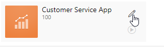

5. Open the Customers page for editing

   

6. Find out which database view we need to update

   Find out which database view is being used to show the customer information.

   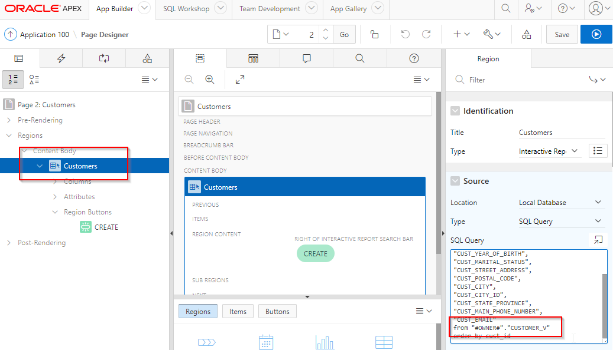

   You see that the data comes from the *CUSTOMER_V* view. Now we know which view we need to modify to include the prediction.

7. Open the view

   We are going to edit the definition of this view to add a column that contains our recommendation.

   Find the view in APEX. Open the SQL Workshop, then Object Browser, then select Views from the drop down, and click on our view "CUSTOMER_V".

    

8. Review the current view definition

   Click on the "Code" tab and have a look at the view definition. It basically selects all its values from the SH.CUSTOMERS table.

9. Download the new view definition (already prepared for you) to your local PC

   We will extend the view by adding a "RECOMMENDATION" column to it.

   Open the new view definition from [here](files/customers-v-new-SQL.sql).

   

   Review the SQL file in a text editor. Note how this SQL will add a column "Recommendation", and it will be a text that explains whether the employee should try to upsell Y Box Games to this customer. In addition, the recommendation will only be added when the probability of an upsell is high enough.

10. Overwrite the view definition

   Open the SQL Workshop, select SQL Commands and paste in the contents of the SQL script to overwrite the view with the new definition.

   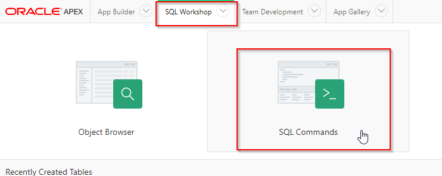

   Paste in the SQL that you have just downloaded. Execute it. You should see "View created" at the bottom of the page.

   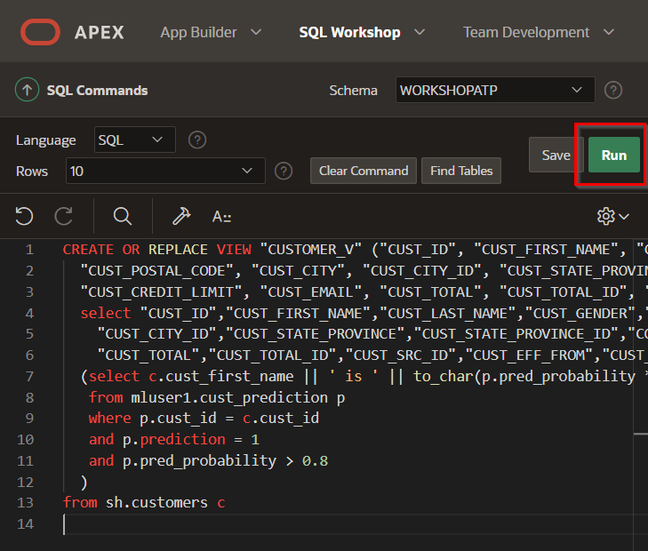

11. Modify the APEX application to add the new column

   Go back to the APEX application (App Builder, then edit "Customer Service App, then edit the Customers page). Choose Customers section in Content body. Add the "RECOMMENDATION" column in the select statement at the right.
   **Don't forget the comma just after the previous column.**
   Then Save the page.

   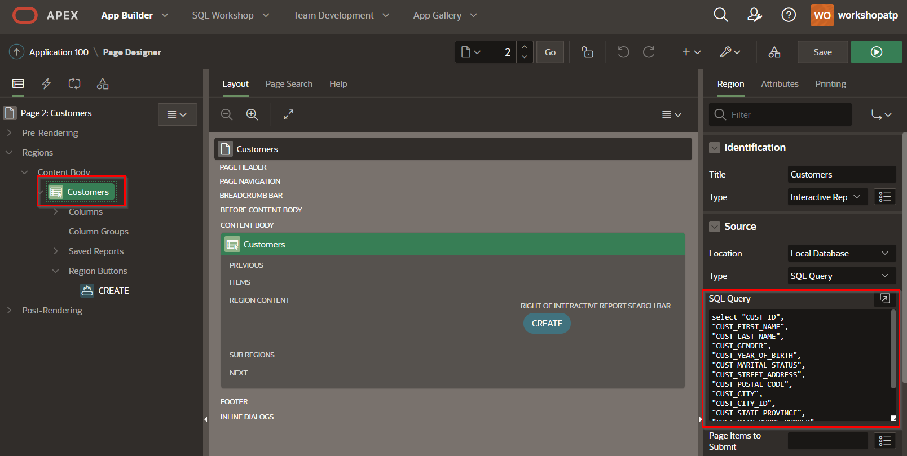

   

   

## **STEP 10:** Review the ML-enabled APEX application

1. Run the APEX application again

    

    In the main screen you see that for most customers it's not recommended to try to upsell Y Box Games.
    It's unlikely that these customers will be interested.

    

2. Look for a customer and verify whether they're interested in the offer

   Now look for a customer with first name "Connor" and last name "Clark".
   Note that in this case we see a recommendation to try to upsell Y Box Games, because the customer is very likely to be interested in this offer.

   

## **STEP 11:** Conclusion

   One added column in an application might not look like much, but the value to the business can be significant.
   In this case an employee receives very valuable advise on which customer to try to upsell a product to and he/she can use that to be more effective.

Congratulations on completing this lab!

[Proceed to the next section](#next).

## Acknowledgements
* **Authors** - Jeroen Kloosterman - Product Strategy Manager - Oracle Digital, Lyudmil Pelov - Senior Principal Product Manager - A-Team Cloud Solution Architects, Fredrick Bergstrand - Sales Engineer Analytics - Oracle Digital, Hans Viehmann - Group Manager - Spatial and Graph Product Management
* **Last Updated By/Date** - Jeroen Kloosterman, Oracle Digital, Jan 2021

## Need Help?
Please submit feedback or ask for help using our [LiveLabs Support Forum](https://community.oracle.com/tech/developers/categories/livelabsdiscussions). Please click the **Log In** button and login using your Oracle Account. Click the **Ask A Question** button to the left to start a *New Discussion* or *Ask a Question*.  Please include your workshop name and lab name.  You can also include screenshots and attach files.  Engage directly with the author of the workshop.

If you do not have an Oracle Account, click [here](https://profile.oracle.com/myprofile/account/create-account.jspx) to create one.
