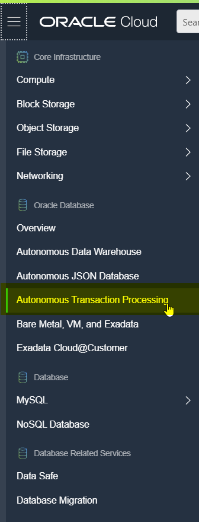
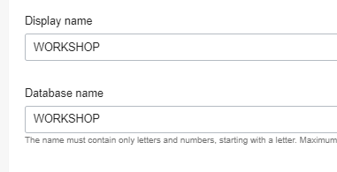

# Provision an Autonomous Transaction Processing instance

## Introduction

You will provision an Oracle Transaction Processing database.

This is only required if you want to do Lab 400 'In-database ML (Oracle Machine Learning)'.

Estimated lab time: +/- 5 minutes

## **STEPS**

- On the left hand menu, choose Autonomous Transaction Processing.

- Choose to create a new instance.

- Choose a specific compartment, or just keep using the root compartment.

- Choose any name for the database, in this case "WORKSHOP".

- Choose the Transaction Processing option. This will optimize the database for daily transactional processing.

- Choose the Shared Infrastructure deployment type.

- In order to have an equal performance over all of the ATP instances of all the workshop participants, we recommend that you keep the Always Free option turned off, keep defaults for OCPU (1) and storage (1 TB). __Disable__ Auto Scaling.

- Set the admin password. *Make a note of this as you will need it.*

- Keep defaults for "Access Type" and "License Type".

- Create the database.

This process typically completes within about 5 minutes, after which you will see the status "AVAILABLE".

[Proceed to the next section](#next).

## Acknowledgements
* **Authors** - Jeroen Kloosterman - Product Strategy Manager - Oracle Digital, Lyudmil Pelov - Consulting Solution Architect - A-Team Cloud Solution Architects, Fredrick Bergstrand - Sales Engineer Analytics - Oracle Digital, Hans Viehmann - Group Manager - Spatial and Graph Product Management
* **Last Updated By/Date** - Jeroen Kloosterman, Oracle Digital, Jan 2021

## Need Help?
Please submit feedback or ask for help using our [LiveLabs Support Forum](https://community.oracle.com/tech/developers/categories/livelabsdiscussions). Please click the **Log In** button and login using your Oracle Account. Click the **Ask A Question** button to the left to start a *New Discussion* or *Ask a Question*.  Please include your workshop name and lab name.  You can also include screenshots and attach files.  Engage directly with the author of the workshop.

If you do not have an Oracle Account, click [here](https://profile.oracle.com/myprofile/account/create-account.jspx) to create one.
