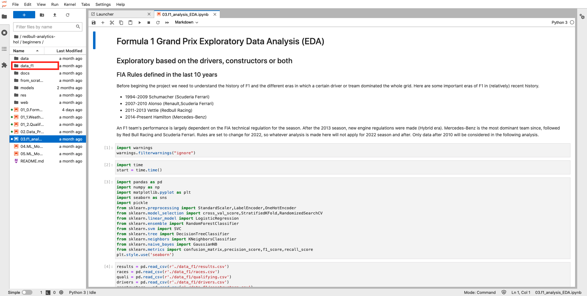
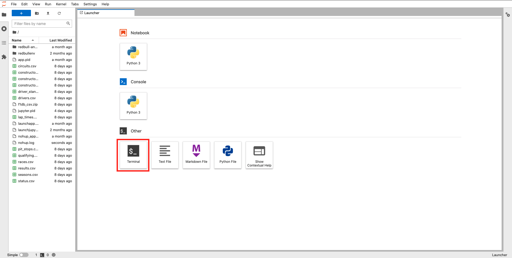
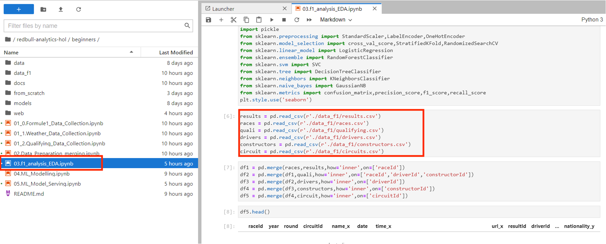
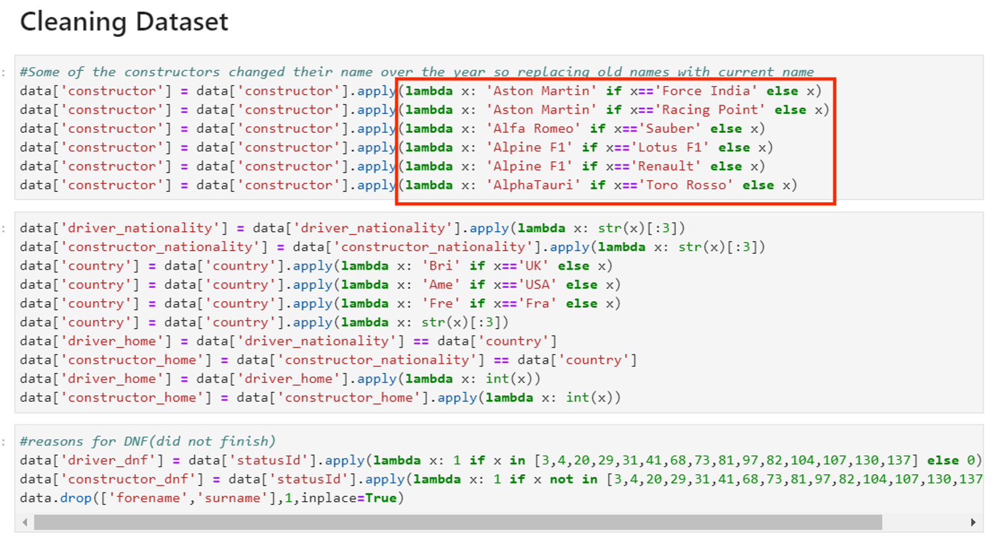
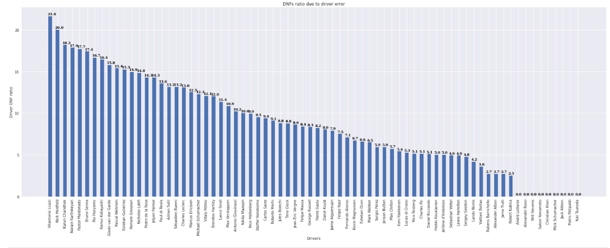
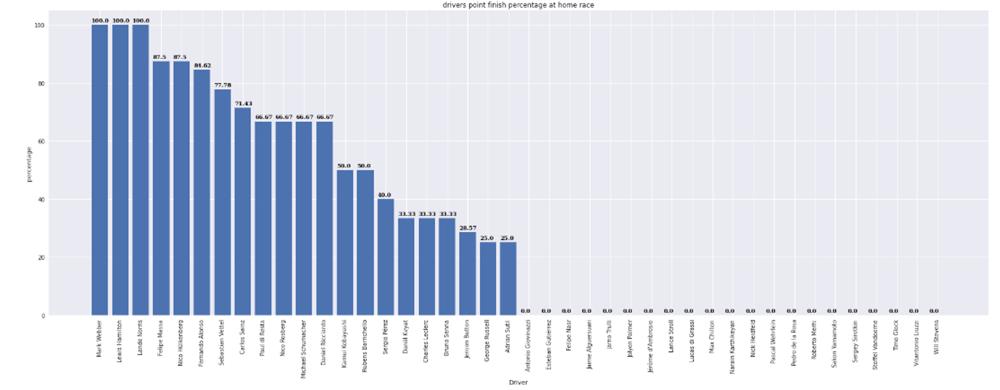
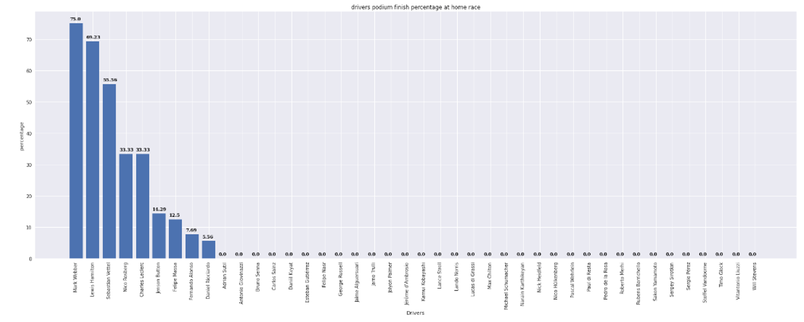
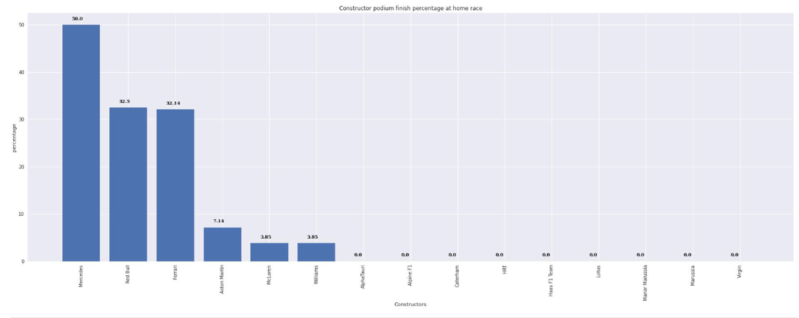

# Data Exploration 

## Introduction

This lab walks you through the data exploration process of the machine learning lifecycle. For this lab, we will do an Exploratory Data Analysis (EDA) on racing data based on the drivers, constructors or both. 

Before begining the project we need to understand the history of car racing (Grand Prix) and the different eras in which a certain driver or tream dominated the whole grid. Here are some important eras of Grand Prix in (relatively) recent history.
* 1994-2009 Schumacher (Scuderia Ferrari)
* 2007-2010 Alonso (Renault,Scuderia Ferrari)
* 2011-2013 Vettle (Redbull Racing)
* 2014-Present Hamilton (Mercedes-Benz)

An racing team's performance is largely dependent on the FIA technical regulation for the season. After the 2013 season, new engine regulations were made (Hybrid era). Mercedes-Benz is the most dominant team since, followed by Red Bull Racing and Scuderia Ferrari. Rules are set to change for 2022, so whatever analysis is made here will not apply for 2022 season and after. Only data after 2010 will be considered in the following analysis.

Estimated Time: 1 hr


<b> Objectives </b>

In this lab, you will:
  * Download racing dataset prepared by Ergast to simplify the Exploratory Data Analysis process by:

    * Execute the notebook ```03.f1_analysis_EDA.ipynb``` to perform Data Analysis using ERGAST Data Model

<b> Prerequisites </b>

* An Oracle Free Tier, Always Free, Paid or LiveLabs Cloud Account


## **STEP 1**:  Download racing dataset prepared by Ergast to simplify the Exploratory Data Analysis process

We will use the dataset “data_f1” prepared by Ergast to simplify the Exploratory, but we could use all CSV prepared in the folder “data”



1. Click on Terminal to open it. Download racing dataset:
  
  

    ``` 
    <copy>
    wget http://ergast.com/downloads/f1db_csv.zip
    unzip f1db_csv.zip
    </copy>
    ```

2. Prepare the environment with extended datasets from ERGAST. You can see the list of files prepared by ERGAST (like Pit Stops, Lap times, etc,. ) in your terminal window. 

  


## **STEP 2:** Execute the notebook 03.f1_analysis_EDA.ipynb to perform Data Analysis using ERGAST Data Model

1. Execute the notebook ```03.f1_analysis_EDA.ipynb``` (_Formula 1 Grand Prix Exploratory Data Analyis (EDA)_)

    * Read all files downloaded from ERGAST CSV file. 

    

  
2. Cleaning Dataset and Replace some data
    

3. Check “Did Not Finish” (DNF) Ratio per Driver
    

4. Check DNF Ratio per Constructor

  

5. Check Driver Points Percentage

  

6. Check Driver Podiums Percentage

  

7. Check Constructor Podiums
    

  
You may now [proceed to the next lab](#next).

## Acknowledgements
* **Author** - Ignacio Martinez, Principal Advanced Support Engineer
* **Last Updated By/Date** - Samrat Khosla, Advanced Data Services, September 2021

## Need Help?
Please submit feedback or ask for help using our [LiveLabs Support Forum](https://community.oracle.com/tech/developers/categories/livelabsdiscussions). Please click the **Log In** button and login using your Oracle Account. Click the **Ask A Question** button to the left to start a *New Discussion* or *Ask a Question*.  Please include your workshop name and lab name.  You can also include screenshots and attach files.  Engage directly with the author of the workshop.

If you do not have an Oracle Account, click [here](https://profile.oracle.com/myprofile/account/create-account.jspx) to create one.
