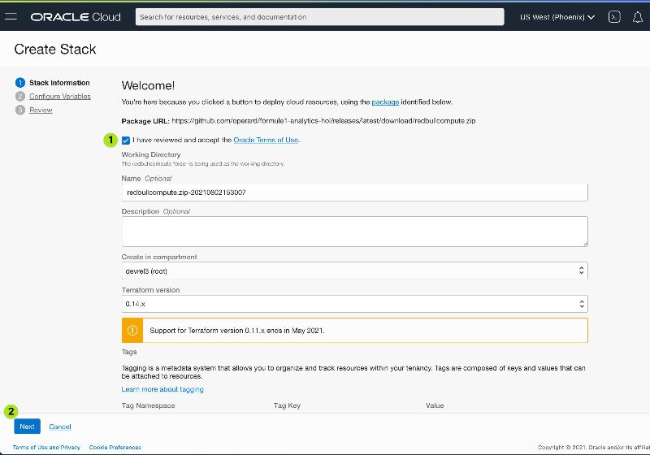
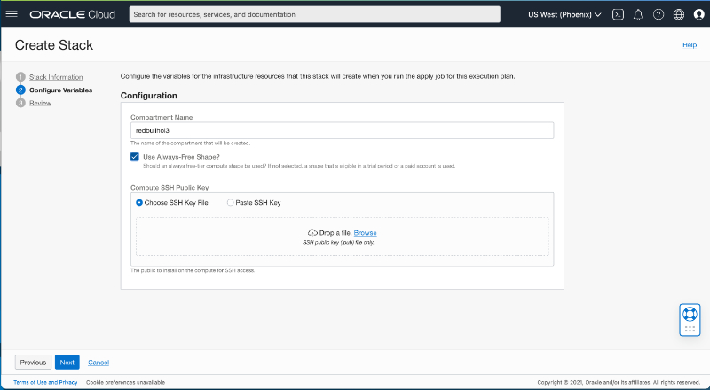
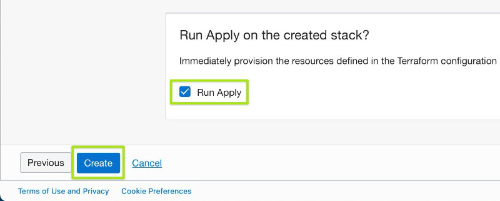
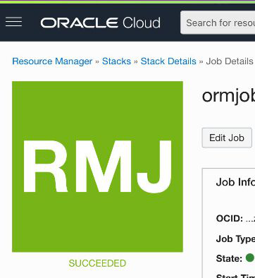
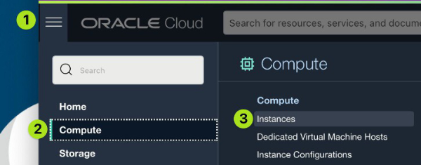
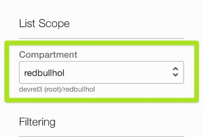
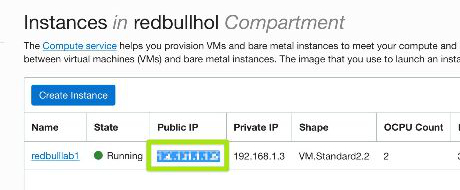

# Introduction

## About this Workshop

Red Bull Racing Honda, the four-time World Champion team, has chosen Oracle as their official cloud infrastructure and customer experience platform provider. [Read here for more information](https://www.oracle.com/redbullracing/)

Are you interested in learning machine learning (ML)? How about doing this in the context of the exciting world of racing?! Get your ML skills bootstrapped here with Oracle and Red Bull Racing! 


This tutorial teaches ML analytics with a series of hands-on labs (HOLs) using the [Data Science](https://docs.oracle.com/en-us/iaas/data-science/using/data-science.htm) service in [Oracle Cloud Infrastructure](https://cloud.oracle.com/). You'll learn how to get data from some public data sources, then how to analyze this data using some of the latest ML techniques. In the process you'll build ML models and test them out in a predictor application.


<b> Estimated Time: 5 hrs  </b>

  This estimate is for the entire workshop - it is the sum of the estimates provided for each of the labs included in the workshop.

<b> About Product/Technology </b>

  OCI Data Science is a fully managed and serverless platform for data science teams to build, train, and manage machine learning models using Oracle Cloud Infrastructure.

  The Data Science Service:

  * Provides data scientists with a collaborative, project-driven workspace.
  * Enables self-service, serverless access to infrastructure for data science workloads.
  * Helps data scientists concentrate on methodology and domain expertise to deliver models to production.


  [](youtube:WWyM432VPQY)

<b>Objectives</b>


  In this lab, you will to complete the following steps:
  * Data Collection - <i> Download datasets </i>
  * Data Preparation - <i> Merge all datasets </i>
  * Data Load - <i> Search insights in the Datasets </i>
  * Implement ML Models - <i> Develop, different ML models, evaluate best model and tune </i>
  * Model Serving - <i> Deploy the best trained model as a REST API </i>
  * UI Access - <i> Develop Web UI Access to predict the next winner </i>

<b> Prerequisites </b>

  This solution is designed to work with several OCI services, allowing you to quickly be up-and-running. You can read more about the services used in the lab here:
  * [Data Science](https://docs.oracle.com/en-us/iaas/data-science/using/data-science.htm)
  * [Resource Manager](https://docs.oracle.com/en-us/iaas/Content/ResourceManager/Concepts/landing.htm)

After creating your Oracle Cloud account, there is some infrastructure that must be deployed before you can enjoy this tutorial. 

***SSH Key***

  * You'll also need an SSH key pair to access the OCI Stack we're going to create. 

  * For Mac/Linux systems, you can [use](https://docs.oracle.com/en-us/iaas/Content/Compute/Tasks/managingkeypairs.htm#ariaid-title4) ```ssh-keygen```. 

  * On Windows, you'll [use PuTTY Key Generator](https://docs.oracle.com/en-us/iaas/Content/Compute/Tasks/managingkeypairs.htm#ariaid-title5). Again, right click the  appropriate link and open in a new tab so you don't lose this page.

  To summarize, on Mac/Linux:

    ```
    <copy>
    ssh-keygen -t rsa -N "" -b 2048 -C "key_name" -f path/root_name
    </copy>
    ``` 

  For Windows, and step-by-step instructions for Mac/Linux, please see the [Oracle Docs on Managing Key Pairs](https://docs.oracle.com/en-us/iaas/Content/Compute/Tasks/managingkeypairs.htm#Managing_Key_Pairs_on_Linux_Instances).


***Getting Started:***

1. Click the button below to begin the deploy of the Data Science stack and custom image:

  [](https://cloud.oracle.com/resourcemanager/stacks/create?region=home&zipUrl=https://github.com/oracle-devrel/redbull-analytics-hol/releases/latest/download/redbull-analytics-hol-latest.zip)

2. If needed, log into your account. You should then be presented with the **Create Stack** page.

  These next few steps will deploy a stack to your OCI tenancy. This will include a Compute instance and the necessary tools to deploy and run JupyterLab from within your OCI account.

  Under _Stack Information_ (the first screen), check the box _I have reviewed and accept the Oracle Terms of Use_. Once that box is checked, the information for the stack will be populated automatically.

  

3. Click **Next** at the bottom of the screen. This will take you to the Configure Variables page. On this page you'll need to provide the SSH key we created in the prerequisites if you want SSH access to your Compute instance.

  

4. On the Review page, be sure _Run Apply_ is checked, and click **Create**.

  

5. This will take you to the **Job Details** page, and OCI will begin creating the stack and deploying the custom image for the lab. This will take about 11 minutes. When it completes (assuming everything went smoothly), the **Job Details** will show a bright green square with "Succeeded" below it.

  

6. Once the Create Stack job has succeeded, click the hamburger menu in the upper left, select **Compute** in the sidebar, and click **Instances** in the menu.

  

7. On the Instances screen, make sure "redbullhol" is selected under _Compartment_. If "redbullhol" isn't in the dropdown menu, you may need to refresh the page for the new compartment to show up.

  

8. Once the "redbullhol" compartment is selected, you should see a running Instance in the list. The address you'll need to access it is in the Public IP column. Copy the IP address shown.

  

9. Next, open a new tab in your browser to load up the web UI for JupyterLab. Paste the IP address you just copied with     ```:8001``` added to the end. The URL should look like ``` http://xxx.xxx.xxx.xxx:8001 ``` (substituting the public IP we   copied in the previous step). JupyterLab is running on port 8001, so when you navigate to this URL you should see the Juypter login.

  _Note: You should not be on VPN when opening JupyterLab_.

  

10. Log in with the password ```Redbull1```.

11. You should now see the JupyterLab. Navigate in the sidebar to ```/redbull-analytics-hol/beginners/``` to see the Jupyter notebooks for this lab.


You may now [proceed to the next lab](#next).


## Acknowledgements
* **Author** - Ignacio Martinez, Principal Advanced Support Engineer
* **Last Updated By/Date** - Samrat Khosla, Advanced Data Services, September 2021

## Need Help?
Please submit feedback or ask for help using our [LiveLabs Support Forum](https://community.oracle.com/tech/developers/categories/livelabsdiscussions). Please click the **Log In** button and login using your Oracle Account. Click the **Ask A Question** button to the left to start a *New Discussion* or *Ask a Question*.  Please include your workshop name and lab name.  You can also include screenshots and attach files.  Engage directly with the author of the workshop.

If you do not have an Oracle Account, click [here](https://profile.oracle.com/myprofile/account/create-account.jspx) to create one.
