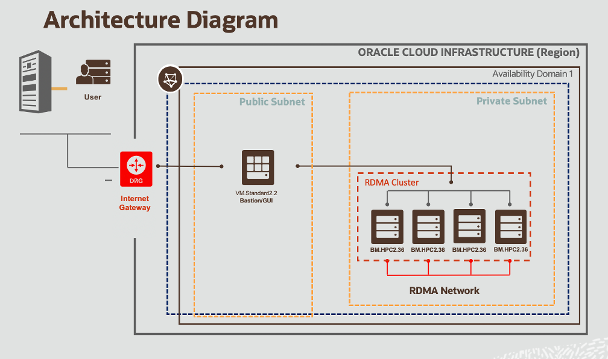

# Architecture

## Introduction

The architecture for this runbook is as follow, we have one small machine (bastion) that you will connect into. The compute nodes will be on a separate private network linked with RDMA RoCE v2 networking. The bastion will be accesible through SSH from anyone with the key (or VNC if you decide to enable it). Compute nodes will only be accessible through the bastion inside the network. This is made possible with 1 Virtual Cloud Network with 2 subnets, one public and one private.

## Objectives

In this lab, we will talk about the different OCI components and services you will need in order to run ANSYS Fluent on OCI, as well as briefly describe the acrhitecture of this setup. 

## Prerequisites

* Some understanding of cloud and database terms is helpful
* Familiarity with Oracle Cloud Infrastructure (OCI) is helpful
* Familiarity with networking is helpful

### Baseline Infrastructure

Cluster Networks are supported in the following regions. In each case, we recommend using the baseline reference architecture and then adjusting it, as required, to meet your specific requirements:

* VCN
    * Public Subnet, Security List, Route Table
    * Private Subnet, Security List, Route Table
    * Internet Gateway
    * NAT Gateway
* Compute Nodes
* Bastion Host in a Public Subnet
* HPC Compute Nodes in Private Subnet

The above baseline infrastructure provides the following specifications:

* Networking
    * 1 x 100 Gbps RDMA over converged ethernet (ROCE) v2
    * Latency as low as 1.5 µs

* HPC Compute Nodes (BM.HPC2.36)
    * 6.4 TB Local NVME SSD storage per node
    * 36 cores per node
    * 384 GB memory per node

## Optional Infrastructure

### **Storage** ###

On top of the NVME SSD storage that comes with the HPC shape, you can also attach block volumes at 32k IOPS per volume, backed by Oracle’s highest performance SLA. If you are using our solutions to launch the infrastructure, an nfs-share is installed by default on the NVME SSD storage in /mnt. You can also install your own parallel file system on top of either the NVME SSD storage or block storage, depending on your performance requirements.

### **Visualizer Node** ###

You can create a visualizer node, such as a GPU VM or BM machine, depending on your requirements. This visualizer node can be your bastion host or else it can be separate. Depending on the security requirements for the workload, the visualizer node can be placed in the private or public subnet.

## Acknowledgements

* **Author** - High Performance Compute Team
* **Contributors** -  Chris Iwicki, Harrison Dvoor, Gloria Lee, Selene Song, Bre Mendonca, Samrat Khosla
* **Last Updated By/Date** - Samrat Khosla, October 2020

## Need Help?
Please submit feedback or ask for help using our [LiveLabs Support Forum](https://community.oracle.com/tech/developers/categories/high-performance-computing-hpc). Please click the **Log In** button and login using your Oracle Account. Click the **Ask A Question** button to the left to start a *New Discussion* or *Ask a Question*.  Please include your workshop name and lab name. You can also include screenshots and attach files. Engage directly with the author of the workshop.

If you do not have an Oracle Account, click [here](https://profile.oracle.com/myprofile/account/create-account.jspx) to create one.