# Create Stack from Template

## Introduction

This lab details the creation of a stack from one of Oracle's provided templates; however, you can use Lab 3 to learn how to use your own terraform configurations to create a stack. The process for both is very similar but have been split into two labs in order to show the differing steps. 

In this lab, you will create configure identity access manager, create a resource manager stack, and execute the stack job.  As an optional exercise, you can migrate your Terraform configuration to Gitlab and redirect the source of your resource manager stack.

**Note:** *Some of the UIs might look a little different than the screenshots included in the instructions. However, you can still use the instructions to complete the hands-on labs.*

### Prerequisites

- Oracle Cloud Infrastructure account credentials (User, Password, and Tenant)
- Basic understanding of Terraform concepts
- (Optional) Gitlab.com account.

**Note:** You can skip the steps below if you are using an user with admin privileges. If this were a real production system, it's both more secure and practical to create additional groups with more granular permissions. For example, it is likely we'd need to create a development team group that can only use predefined stacks and run jobs against it (use-orm-stack and use-orm-job, respectively).
[Check Best Practices for IAM](https://docs.cloud.oracle.com/iaas/Content/Security/Concepts/security_features.htm#IdentityandAccessManagementIAMService).

If you are not the administrator, you have to request the admin to give you permissions to manage Resource Manager Stacks by creating the following IAM policies in a compartment of your choice with the following statements:

  - `Allow group <group_name> to manage orm-stacks in compartment <compartment_name>`
  - `Allow group <group_name> to manage orm-jobs in compartment <compartment_name>`

## **Step 1:** Create Resource Manager Stack

 A Stack represents definitions for a collection of OCI resources within a specific compartment. With this in mind, we're going to configure a new stack in the compartment of your choice and name it "Sample E-Commerce Application". This stack will create the resources needed to run a sample E-Commerce Application called MuShop. 
 

1. Click the **Navigation Menu** in the upper left, navigate to **Developer Services**, and select **Stacks**.

	

2. Click **Create Stack**.

      - Select **Template** and click **Select Template**. Go to the **Architecture** tab and select **Sample E-Commerce Application**. Click **Select Template**.

      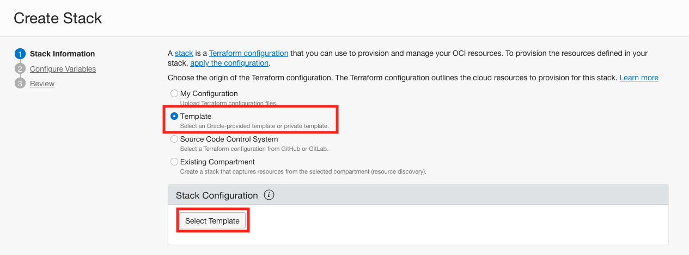 

      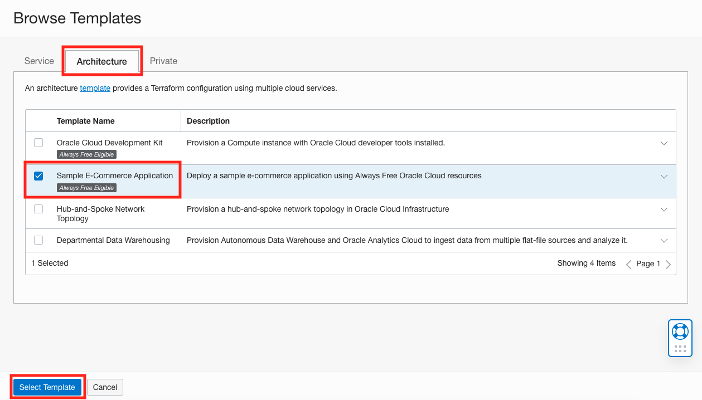 

      - **Name:** Sample E-Commerce Application
      - **Description:** A demo eCommerce example app (MuShop Basic) using Always-Free Oracle Cloud Infrastructure
      - **Create in Compartment:** Select an existing compartment
      - **Terraform Version:** Leave as default

    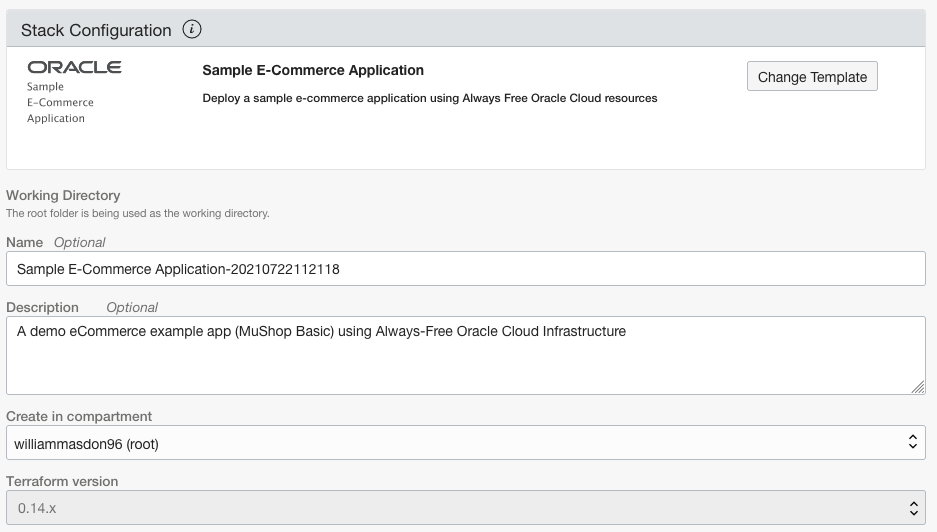

3. Click **Next**.   
      - **Configure Variables:** Configure the variables for the infrastructure resources that this stack will create when you run the apply job for this execution plan.
        - **Node Count:** 2
        - **Database Name:** MuShopDB
        - **Use only always free eligible resources?:** <*Check*>
        - **Show advanced options?:** <*Check*>
        - **Auto-generate public ssh key?:** <*Uncheck*>
        - **SSH Public Key:** <*Enter the content of your public ssh key*>
        - **Use in-transit encryption?:** <*Uncheck*>
        - **Encrypt boot volume and object storage bucket with a key that you manage?:** <*Uncheck*>

        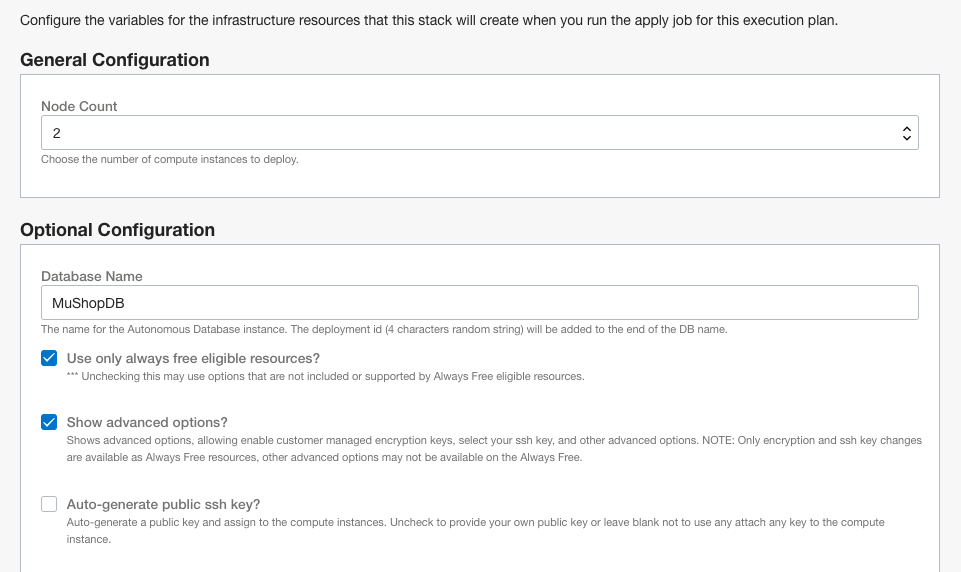

        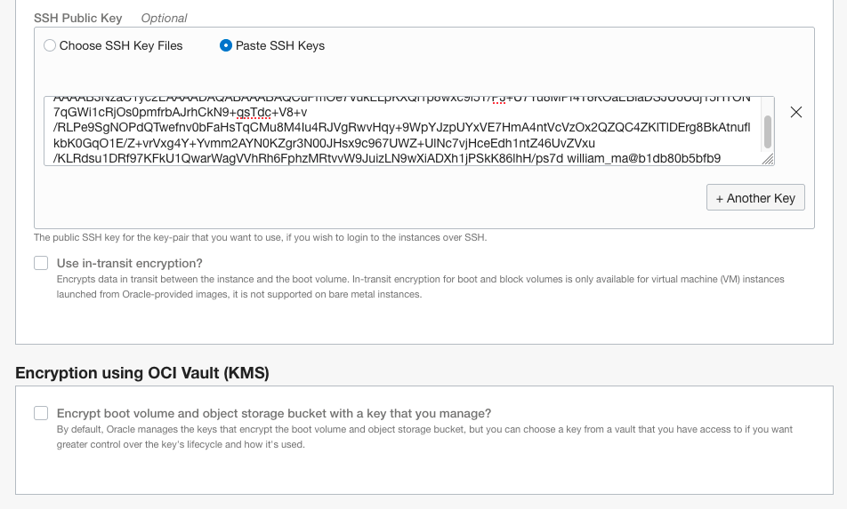

4. Click **Next**.
      - **Verify your configuration variables**
      - Click **Create**

     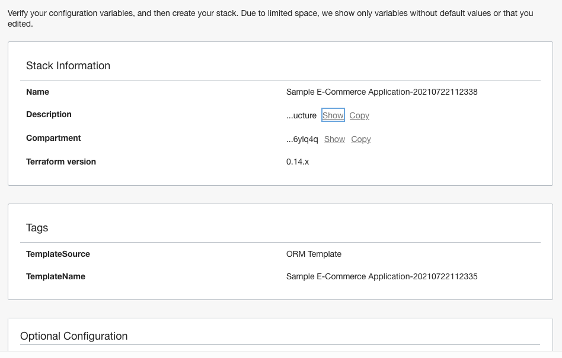

5. Before moving on to executing a job, quickly review the newly configured stack and then click on the hyperlinked stack name.

    

## **Step 2:** Execute Jobs: Plan & Apply

Jobs perform actions against the Terraform configuration files associated with a stack. You can perform 3 actions and they are plan, apply and destroy. Since Terraform command execution is not atomic, it is crucial to prevent any race conditions or state corruption from occurring due to parallel execution. To prevent this from happening, the Resource Manager ensures only one job can run against a stack at a given time against a single state file.

From the Stack Details page, we can completely manage the stack's configuration (i.e., update, delete, add tag/s, edit variables) and also download the zip archive containing the latest Terraform configuration - which can be especially helpful when troubleshooting.

1. Lets execute a plan by clicking on **Plan** and enter the following information:

      - **Name:** MuShop App Plan
      - Click **Plan**

    

    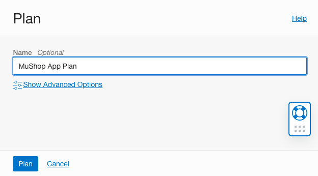

    **Note:** Once the modal closes, notice the job's state appears as "Accepted" - which indicates that the platform is spinning up resources needed for executing the command  - followed by "In Progress" and then either "Succeeded" or "Failed".

    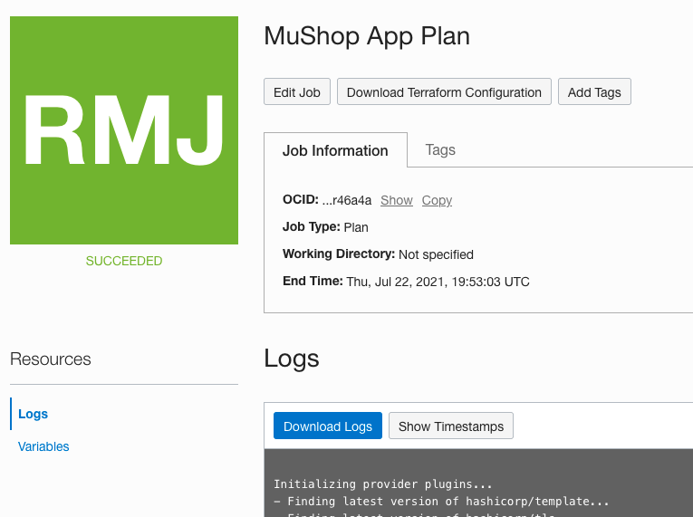

2. Once the job succeeded, on the Job Details page review the information and scroll through the logs containing the Terraform output. You may also edit the job or download the Terraform Configuration and logs.

3. Since the previous plan action succeeded, lets go back to the Stack page by clicking Stack Details breadcrumb on top of the page. On the Stack details page you can select the Apply button. Click on **Apply**.

    

4. Enter the following information:

      - **Name:** MuShop App Apply
      - **Apply Job Plan Resolution:** Automatically Approve
      - Click **Apply**

    

5. The job state is updated as the job execution nears completion:

   
   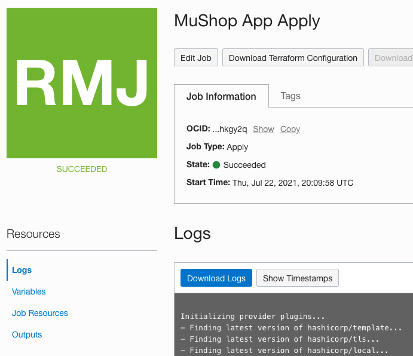
   
6. Once the apply action succeeds, verify the resources have been provisioned by reading the Terraform output contained with the logs or navigate to Networking and view the different resources that now exist (VCN, load balancer, subnets, database, etc.) and that the 2 instances are listed in Compute. The Health Status of the Load Balancer will need a few minutes to get into OK status.

    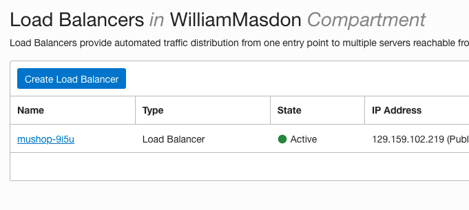
    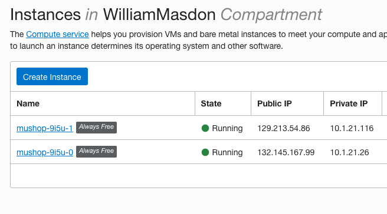
    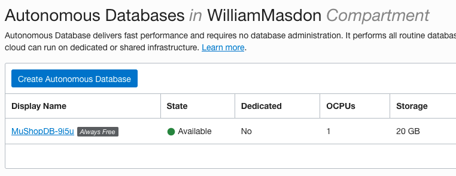
    

7. When you see the Load Balancer status change to OK, copy the **IP Address** and paste it into a new web browser tab.  You should see the sample web page load and atop the page it indicates which web server you are connected to.  Press **F5** a couple of times and see the web server change as you refresh the page.  Congratulations - your sample application deployed successfully.

## **Step 3:** Execute Jobs: Destroy

Now that we've successfully applied our Terraform to build out our cloud resources (and optionally completed the source migration to Gitlab), let's return to the Stack Details page and use the Resource Manager to tear it all down.

1. Start by clicking on  **Destroy** and enter the following information:

      - **Name:** MuShop App Destroy
      - Click **Destroy**

    

    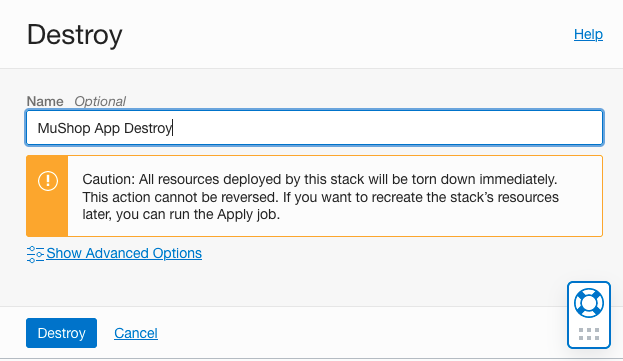

1. Once again, notice that the state change is reflected in the console:  

    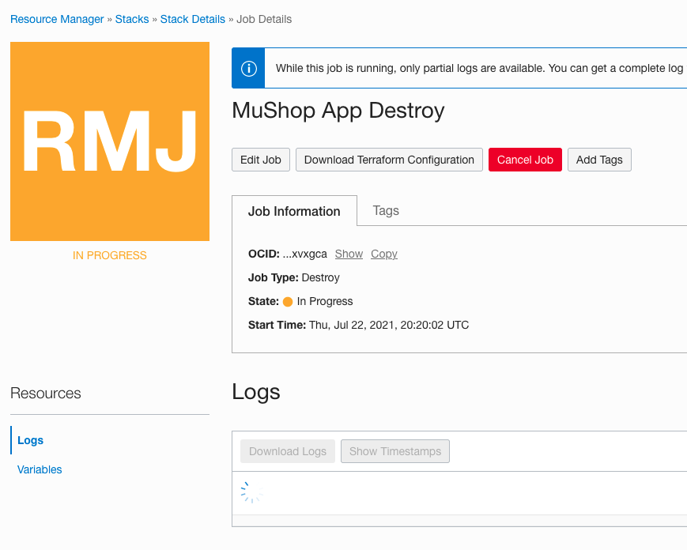
    Wait until the status shows **Succeeded** before proceeding.

1. The final step is to delete the stack by clicking on the More Actions button on Stack Details page. Click on **Delete Stack** and confirm it by clicking **Delete** on the modal window.

    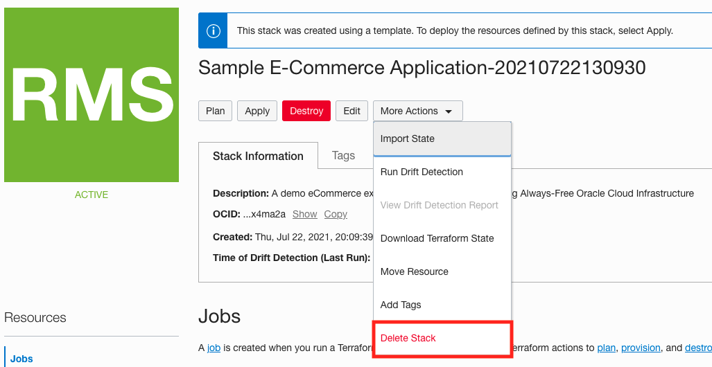
    

*Congratulations! You have successfully completed the lab.*

## Acknowledgements

- **Author** - Flavio Pereira, Larry Beausoleil, Eli Schilling
- **Adapted by** -  Yaisah Granillo, Cloud Solution Engineer
- **Contributors** - Arabella Yao, Kamryn Vinson, Orlando Gentil, William Masdon
- **Last Updated By/Date** - William Masdon, July 2021

