# Configure CloudGuard Firewalls

## Introduction

In this lab you will be configuring CloudGuard Security Management initial configuration, CloudGuard firewalls initial configuration, hostnames, interfaces, high availability, and route tables to support traffic between VCNs.

Estimated Lab Time: 20 minutes.

### Objectives

- Initial Configuration on CloudGuard Security Management
- Initial Configuration on Primary CloudGuard
- Initial Configuration on Secondary CloudGuard

### Prerequisites

- Oracle Cloud Infrastructure paid account credentials (User, Password, Tenant, and Compartment)

## **Task 1: Initial Configuration on CloudGuard Security Management**

1. Connect to **CloudGuard Security Management** instance public IP on your local machine's using SSH. **ssh -i PrivateKeyPath admin@public_ip**. Make sure you use private key associated to your public key. 

2. You will be setting up initial **admin** user password using below commands which will allow you to connect over browser: 

      ```
      <copy>
      ssh user admin password
      Enter a Unique Password, for example: Check@123
      save config
      </copy>
      ```

   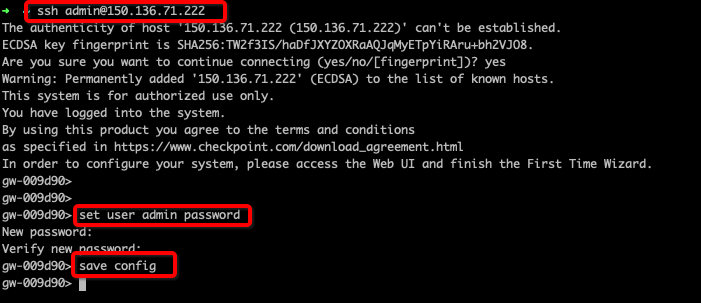

3. Now Connect to **CloudGuard Security Management** instance public IP on your local machine's web browser: **https://public_ip**. It will ask you to enter **username/password**, enter **admin** and password which you setup in this **step#2**:

   

4. Once you enter credentials, you will be setting up this instance to act as **Security Management**, you need to follow steps: 

      - Click on **Next** icon to accept **First Time Configuration** window: 

      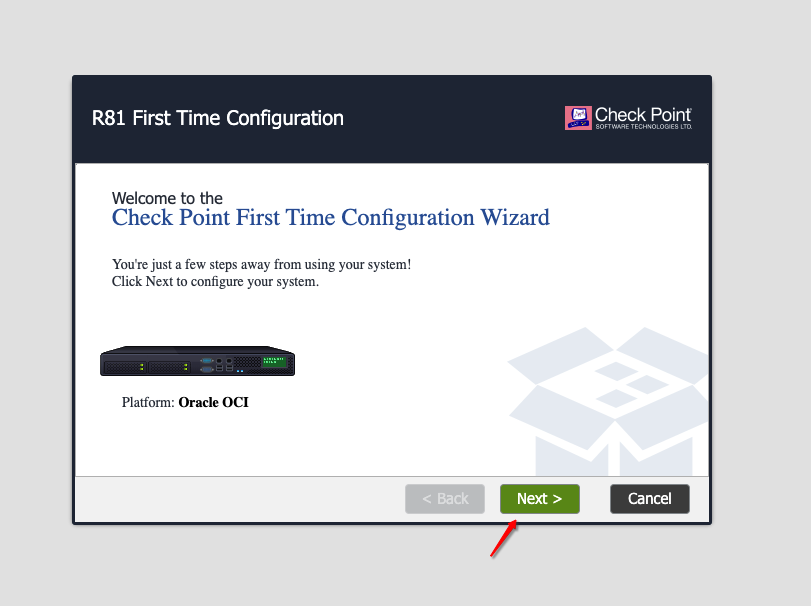

      - Continue with **R81 Configuration** deployment options and Click on **Next** icon: 

      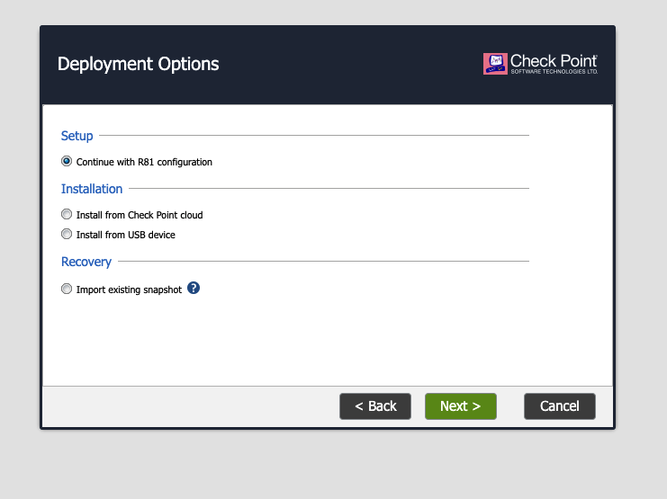

      - Continue with default value populated on management connection and Click on **Next** icon: 

      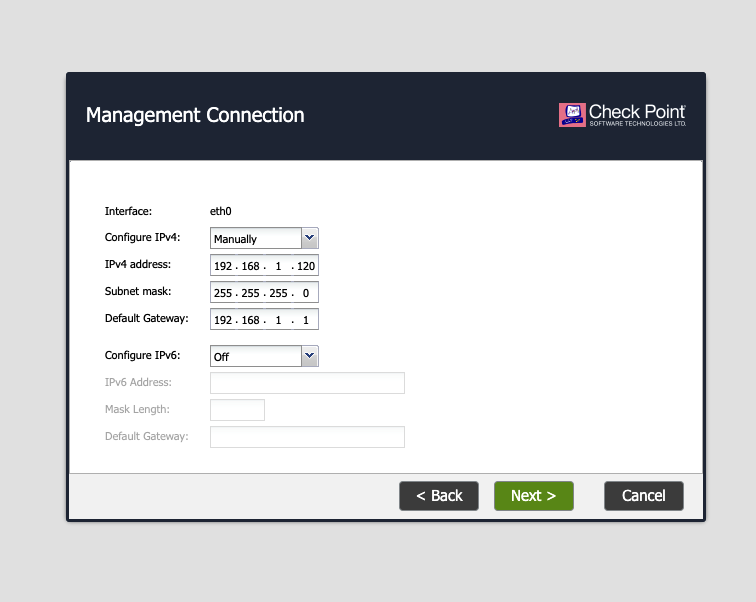

      - Update **Device Information** with Host name as **security-manager** and Click on **Next** icon: 

      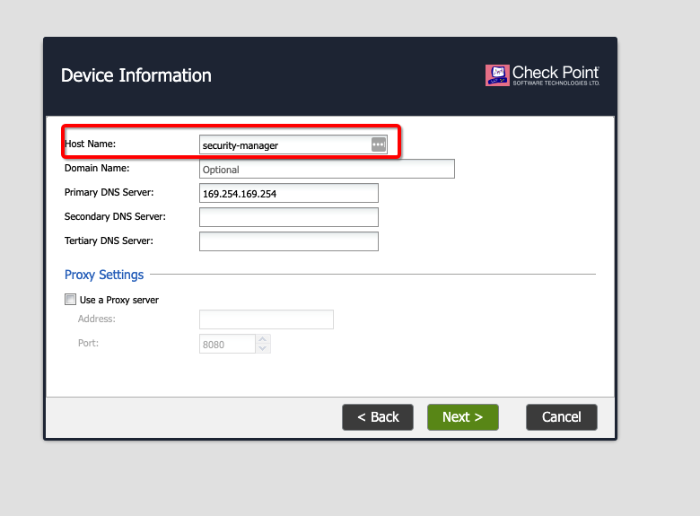

      - Verify Date ,Time, Time Zone information and Click on **Next** icon: 

      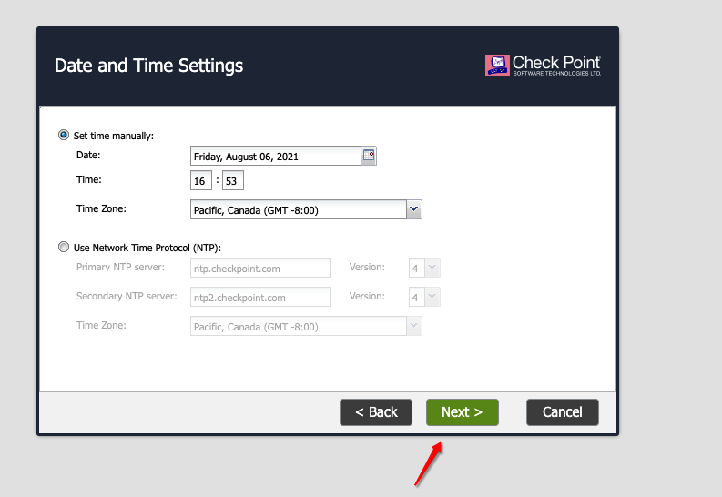

      - Select Security Gateway and/or Security Management as **Installation Type** and Click on **Next** icon: 

      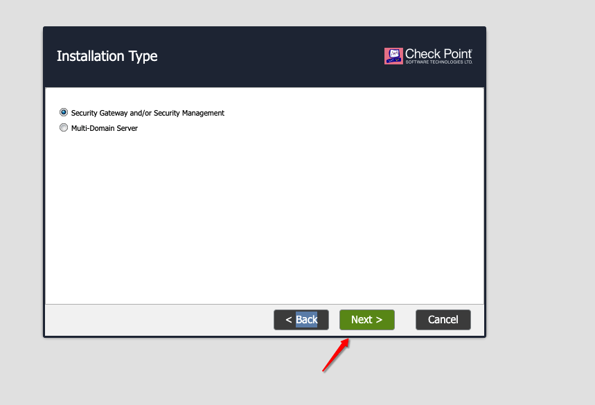

      - Make sure that you select Security Management as **Products** value and Click on **Next** icon: 

      

      - Choose **admin** user Gaia administrator and Click on **Next** icon: 

      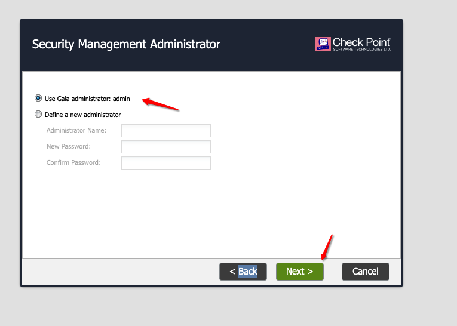

      - Choose Any IP Address for GUI access to Security Management platform and Click on **Next** icon: 

      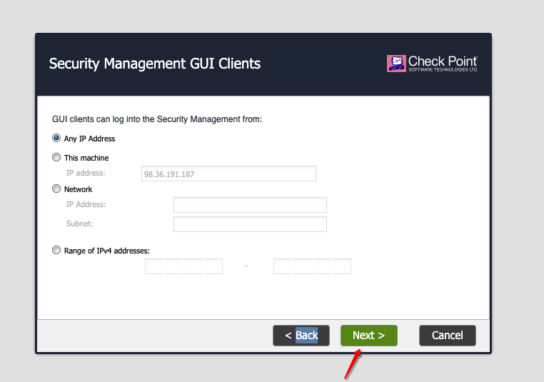

      - Complete the **First Time Configuration Wizard Summary** and Click on **Finish** icon: 

      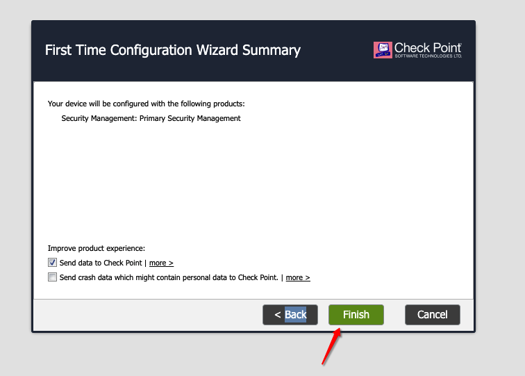

      - Confirm the First-Time configuration and click on **Yes** this will apply configuration and reboot your instance: 

      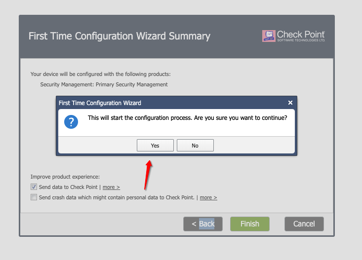

4. Once instance reboots successfully and connect to **CloudGuard Security Management** instance public IP on your local machine's web browser: **https://public_ip**. It will ask you to enter **username/password**, enter **admin** and password which you setup in this **step#2**:

## **Task 2: Initial Configuration on Primary CloudGuard**

1. Connect to **CloudGuard1** instance public IP on your local machine's using SSH. **ssh -i PrivateKeyPath admin@public_ip**. Make sure you use private key associated to your public key. 

2. You will be setting up initial **admin** user password using below commands which will allow you to connect over browser:

      -  Even though you have used **cloud-init** to setup admin password this configuration allow you to update password needed and gets you familiar with process:

         ```
         <copy>
         ssh user admin password
         Enter a Unique Password, for example: Check@123
         save config
         </copy>
         ```

      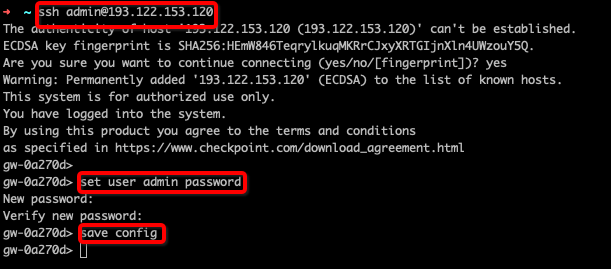

3. Now Connect to **CloudGuard1** instance public IP on your local machine's web browser: **https://public_ip**. It will ask you to enter **username/password**, enter **admin** and password which you setup in this **step#2**:

   

4. You will be setting up **static Routes** to support Spoke VCNs traffic. Click on **Lock** icon to unlock configuration changes and Navigate to **Network Management > IPv4 Static Routes**. Click on **Add** icon to add new static route: 

   

5. You will be entering a static route entery as per below table: 

   | Destination | Subnet Mask | Gateway     | Comment                                                      |
   |-------------|-------------|-------------|--------------------------------------------------------------|
   | 10.0.0.0    | 255.255.0.0 | 192.168.2.1 | Spoke VCNs traffic route via  Backend Subnet Default Gateway |

6. Enter values as per table and Click on **Save** icon to save route entry: 

   

## **Task 3: Initial Configuration on Secondary CloudGuard**

1. Connect to **CloudGuard2** instance public IP on your local machine's using SSH. **ssh -i PrivateKeyPath admin@public_ip**. Make sure you use private key associated to your public key. 

2. You will be setting up initial **admin** user password using below commands which will allow you to connect over browser:

      -  Even though you have used **cloud-init** to setup admin password this configuration allow you to update password needed and gets you familiar with process:

         ```
         <copy>
         ssh user admin password
         Enter a Unique Password, for example: Check@123
         save config
         </copy>
         ```

      

3. Now Connect to **CloudGuard2** instance public IP on your local machine's web browser: **https://public_ip**. It will ask you to enter **username/password**, enter **admin** and password which you setup in this **step#2**:

   

4. You will be setting up **static Routes** to support Spoke VCNs traffic. Click on **Lock** icon to unlock configuration changes and navigate to **Network Management > IPv4 Static Routes**. Click on **Add** icon to add new static route: 

   

5. You will be entering a static route entery as per below table: 

   | Destination | Subnet Mask | Gateway     | Comment                                                      |
   |-------------|-------------|-------------|--------------------------------------------------------------|
   | 10.0.0.0    | 255.255.0.0 | 192.168.2.1 | Spoke VCNs traffic route via  Backend Subnet Default Gateway |

6. Enter values as per table and Click on **Save** icon to save route entry: 

   

## **Task 4: Configure CloudGuard Firewall Clusters in Check Point Security Management**

1. You can manage **CloudGuard Security Gateways** in manay ways. In your case:

      - Using Check Point Management Server which is located in same Virtual Cloud Networks i.e. Hub VCN

2. You need a **Windows VM** to install **Check Point SmartConsole** software. 

3. [Optional] Deploy a Windows VM using available **Platform Images** on Oracle Cloud Infrastructure as per below table:

    | Name      | Placement | Image                                                |  Version | Shape          | Network      | Subnet      | Add SSH-Keys                |
    | ---------- | --------- | ---------------------------------------------------- | ------------- | -------------- | ------------ | ----------- | --------------------------- |
    | WindowsVM | AD1       | Platform Image: Windows | Server 2019 Standard         | VMStandard2.2  | firewall-vcn | frontend-subnet | Yours/CloudShell Public Key |

4. You have to make sure that you can connect to a **Windows VM** before proccedding to next steps/secions. And this VM should be either present in **firewall-vcn** or have reachability to **CloudGuard Security Management** instance.

5. Click or Copy below link to download the **.exe** file on your **Windows VM** and install SmartConsole software.

    - Click here: [smartconsole.exe](https://objectstorage.us-ashburn-1.oraclecloud.com/p/2-RdLPleO_mfBfinrGKEoeVcAdGCv44D-FIf8ysm-QfJ8m4zHzB1vaFnluPPnPxU/n/partners/b/files/o/smartconsole.exe) 
        - SmartConsole to support connectivity to **R81** Check Point Security Managment platform to support **CloudGuard High Availability** use-case.

6. Click on **SmartConsole** software installed on your Windows VM: 

   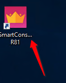

7. Connect to **CloudGuard Security Management** VM using **admin/password** and public IP address associated with your CloudGuard Security Management VM. Enter right password value which you have setup in this Lab's **Task 1**: 

   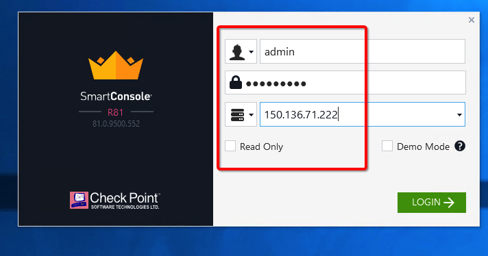

8. First time connection will ask you to confirm that if you want to proceed. Click on **Proceed**:

   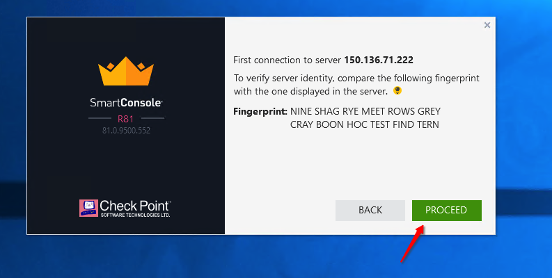

9. Navigate to **GATEWAYS && SERVERS > Cluster** and click on **Cluster** to add a new cluster:

   

10. New dialog box will pop and select **Wizard Mode** to add a new cluster:

   

11. Fill the dialog box and click on **Next** button:

    Enter the following information and accept all the defaults
       - **Cluster Name**: Enter a user-friendly name
       - **Cluster IPv4 Address**: Enter Secondary Public IP address associated to **primary/frontend** interface of **CloudGuard1** instance. 
         - You need to connect to **OCI Console** and on **CloudGuard1** navigate to **Attached VNICs > Primary VNIC > IPv4 Addresses** note down secondary Public IP address:

   

12. Click on **Add > New Cluster Member** to add **CloudGuard1** instance as part of cluster member:

   

13. Fill the dialog box for **CloudGuard1** and click on **Ok** button:

    Enter the following information and accept all the defaults
       - **Name**: Enter a user-friendly name; CloudGuard1
       - **IPv4 Address**: Enter Primary Interface Private IP address of **CloudGuard1** instance. 
       - **Secure Internal Communication**:
         - Enter **SIC** key associated to **CloudGuard1** instance which you added during instance launch either manually or by default via **Oracle Resource Manager**. It's **Check@1234** and confirm the same key in **Confirm Activation Key** field.
         - Click on **Initialize** to test communication and it should change to **Trust established**

   

   

14. Repeat the same step for adding another memeber and fill the dialog box for **CloudGuard2**. Click on **Ok** button:

    Enter the following information and accept all the defaults
       - **Name**: Enter a user-friendly name; CloudGuard1
       - **IPv4 Address**: Enter Primary Interface Private IP address of **CloudGuard1** instance. 
       - **Secure Internal Communication**:
         - Enter **SIC** key associated to **CloudGuard1** instance which you added during instance launch either manually or by default via **Oracle Resource Manager**. It's **Check@1234** and confirm the same key in **Confirm Activation Key** field.
         - Click on **Initialize** to test communication and it should change to **Trust established**

   

   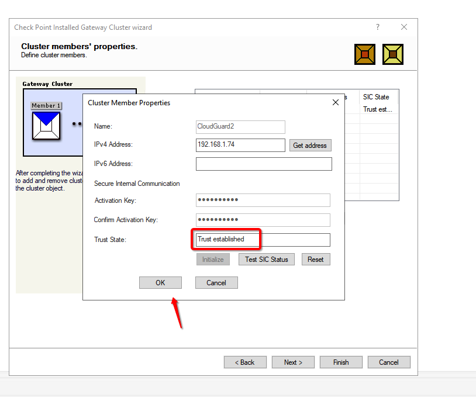

15. Verify that both **CloudGuard1 and CloudGuard2** are part of your cluster and click on **Finish** button to complete Cluster configuration:

   

16. View your created cluster and associate members are visible on **GATEWAYS & SERVERS** section: 

   

17. Click on **checkpoint-cluster** and navigate to **Network Management**. Click on **Get Interfaces** and select interface with topology. This will populate **eth0** and **eth1** interfaces for each member. Click on **eth0** interface and update values as per below configuration: 

    Enter the following information and accept all the defaults
       - **Network Type**: Cluster
       - **IPv4**: Enter Secondary Private IP Address of Primary Interface on **CloudGuard1** instance.

   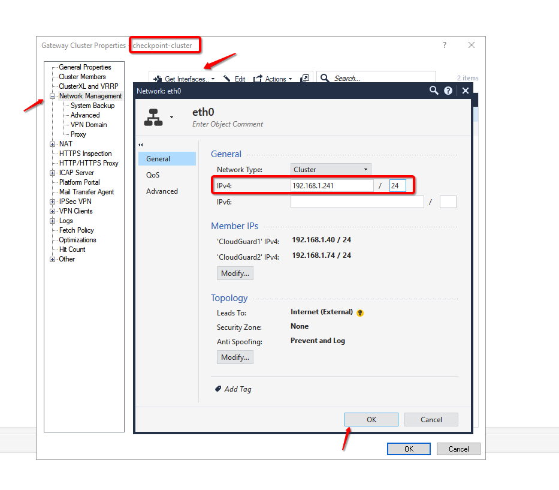

18. Click on **OK** button of **eth0** dialog box to save configuration. 

19. Click on **eth1** interface and update values as per below configuration: 

    Enter the following information and accept all the defaults
       - **Network Type**: Cluster
       - **IPv4**: Enter Secondary Private IP Address of Secondary Interface on **CloudGuard1** instance.

   

20. Click on **OK** button of **eth1** dialog box to save configuration. 

21. Click on **OK** button of **Gateway Cluster Properties checkpoint-cluster** to save configuration. 

22. At this point for test purpose you will update clean up policy to reflect **Allow ALL** name and update **Action** from **Drop** to **Accept**: 

   

23. Click on **Install Policy** which will prompt you to see policy target as **Cluster** which is expected. Select **publish and install** button to publish configuration and installing policy. 

24. Successful configuration policy push should like this:

   

25. You should see healthy check marks to Cluster and Cluster's members shortly: 

   

***Congratulations! You have successfully completed the lab.***

You may now [proceed to the next lab](#next).

## Learn More

1. [OCI Training](https://www.oracle.com/cloud/iaas/training/)
2. [Familiarity with OCI console](https://docs.us-phoenix-1.oraclecloud.com/Content/GSG/Concepts/console.htm)
3. [Overview of Networking](https://docs.us-phoenix-1.oraclecloud.com/Content/Network/Concepts/overview.htm)
4. [Overview of Marketplace Applications](https://docs.oracle.com/en-us/iaas/Content/Marketplace/Concepts/marketoverview.htm)
5. [OCI CloudGuard Deployment Guide](https://supportcenter.checkpoint.com/supportcenter/portal?eventSubmit_doGoviewsolutiondetails=&solutionid=sk142872)

## Acknowledgements

- **Author** - Arun Poonia, Senior Solutions Architect
- **Adapted by** - Check Point
- **Contributors** - N/A
- **Last Updated By/Date** - Arun Poonia, August 2021