# Traffics and High Availability Validation

## Introduction

In this lab you will be creating required security policies on CloudGuard Firewalls to support different use-case and validate traffics between and from VCNs. In the end you will stop/reboot primary **CloudGuard** instance to ensure that floating IPs moves to Secondary **CloudGuard** instance.

Estimated Lab Time: 20 minutes.

### Objectives

- Validate North-South Inbound
- Validate North-South Outbound
- Validate East-West (Web to Database & Database to Web)
- Validate East-West Traffic (Web & DB Application to Oracle Services Network)
- Validate HA Failover to Secondary CloudGuard Instance

### Prerequisites

- Oracle Cloud Infrastructure paid account credentials (User, Password, Tenant, and Compartment)

## **Task 1: North-South Inbound Traffic**

1. Connect to **CloudGuard Security Management** instance public IP using **SmartConsole** software installed on your Windows VM. Enter credentials as **admin/Check@123** or **password** which you have setup in **Lab3**

2. You will be creating **3** different Network Host Objects to support inbound connection to **Web App1 VM** and **DB App1 VM** as per below table:

    | Parameter                   | Value                                                                            |
    |-----------------------------|----------------------------------------------------------------------------------|
    | Frontend-Private-IP         | Primary CloudGuard Primary Interface Secondary Private IP;Example: 192.168.1.241 |
    | Web-App1-VM                 | Web Spoke App1 VM Private IP; Example: 10.0.0.79                                 |
    | DB-App1-VM                  | DB Spoke App1 VM Private IP; Example: 10.0.1.40                                  |

3. Navigate to top right option **New > Host** to add a new Host. 

   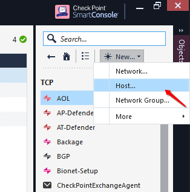

4. Fill out the dialog box and save configuration by clicking on **OK** button: 

    Enter the following information and accept all the defaults
       - **Name**: Enter a user-friendly name; Web-App1-VM
       - **IPv4 Address**: Enter Primary Interface Private IP address of **Web-App1** instance. 
   
   

5. Search your created new host and click on **clone** button to have a network object or create a new host directly. Fill out the dialog box and save configuration by clicking on **OK** button: 

    Enter the following information and accept all the defaults
       - **Name**: Enter a user-friendly name; Frontend-Private-IP
       - **IPv4 Address**: Enter Primary Interface Secondary Private IP address of **CloudGuard1** instance. 

   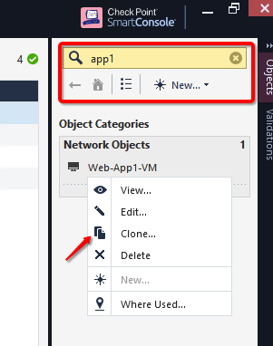

   

6. Search your created new host and click on **clone** button to have a network object or create a new host directly. Fill out the dialog box and save configuration by clicking on **OK** button: 

    Enter the following information and accept all the defaults
       - **Name**: Enter a user-friendly name; DB-App1-VM
       - **IPv4 Address**: Enter Primary Interface Private IP address of **DB-App1** instance. 

   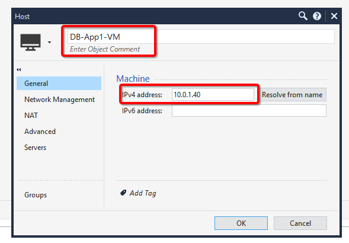

7. You will be creating **2** different TCP Service objects to support inbound connection to **Web App1 VM** and **DB App1 VM** on a certain port:

    | Name        | Value         |
    |-------------|---------------|
    | Web-VM-1777 | TCP Port 1777 |
    | DB-VM-1777  | TCP Port 1778 |

8. Navigate to top right option **New > More > Service > TCP Service** to add a new TCP Service.

   

9. Fill out the dialog box and save configuration by clicking on **OK** button: 

    Enter the following information and accept all the defaults
       - **Name**: Enter a user-friendly name; Web-VM-1777
       - **Match By**: Enter Port value as 1777. 

   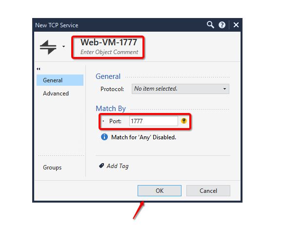

10. Search your created new TCP Service and click on **clone** button to have a network object or create a new TCP Service directly. Fill out the dialog box and save configuration by clicking on **OK** button: 

    Enter the following information and accept all the defaults
       - **Name**: Enter a user-friendly name; DB-VM-1778
       - **Match By**: Enter Port value as 1778. 

   

   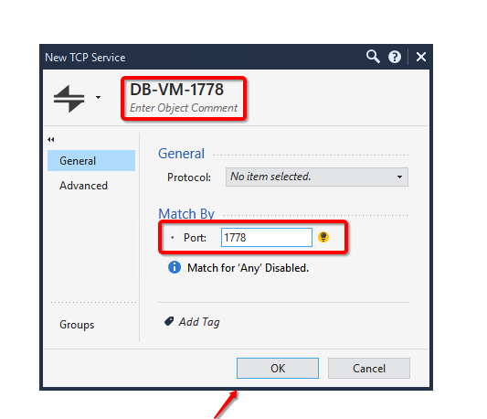

11. Add **eth0** interface as part of **ExternalZone** so when you assign inbound **NAT** policy you can choose Security Zone. Navigate to **checkpoint-cluster** which you created earlier and go to **Network Managment > Network eth0**. Click on **Modify** button to specifiy Security Zone, you should select ExternalZone from drop-down and click on **OK** button so save configuration:

   

12. [Optional] If you see below window which you have not ignored select **Don't show this message again** and click **Yes**: 

   

13. You must enable **Logging** on security Policy. Navigate to your security policy and update Track value from **None** to **Log**

   

14. You will be creating **3** different NAT policies to support inbound connection from outside to ensure that they go to right VMs and management traffic is not impacted. You can follow below table to support the **NAT Policies** configuration: 

    | Name                   | Original Source  | Original Destination | Original Services | Translated Source | Translated Destination | Translated Services | Install On     | Comment                                                      |
    |------------------------|------------------|----------------------|-------------------|-------------------|------------------------|---------------------|----------------|--------------------------------------------------------------|
    | No NAT Rules - Manager | security-manager | Any                  | Any               | Original          | Original               | Original            | Policy Targets | Ensure that Manager's traffic don't NAT                      |
    | Traffic to Web App1 VM | ExternalZone     | Frontend-Private-IP  | Web-VM-1777       | Original          | Web-App1-VM            | ssh                 | Policy Targets | Ensure that Port 1777 inbound connection goes to Web APP1 VM |
    | Traffic to DB App1 VM  | ExternalZone     | Frontend-Private-IP  | DB-VM-1778        | Original          | DB-App1-VM             | ssh                 | Policy Targets | Ensure that Port 1778 inbound connection goes to DB APP1 VM  |

15. Navigate to **SECURITY POLICIES > NAT** and click on **Rule** icon as below to add **NAT** policies on the top as per **Table** order: 

   

16. Your **NAT** policies should look like this as below:

   

17. Do a sanity check to make sure **TCP Services**, **Hosts**, **Security Policies** and **ExternalZones** are created/attached successfully. For example below images shows **TCP Services** and **Hosts**:

   

   

18. Public your changes by clicking on **Publish** icon present on SmartConsole application: 

   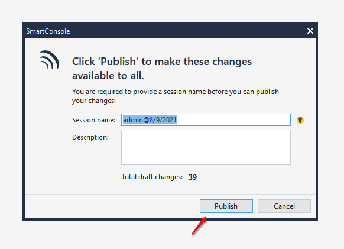

19. Install your policy on cluster target by Navigating to **SECURITY POLICIES > Policy** screen and make sure that policy gets applied successfully: 

   

   

   

20. Connect to **Web APP1** and **DB APP1** using **CloudGuard1 Frontend Interface Floating Public IP** over **SSH** unique port as per your configuration: 

    | VM       | Port  | IP                                   | Example                       |
    |----------|-------|--------------------------------------|-------------------------------|
    | Web App1 | 1777  | Frontend Interface Floating Public IP | ssh opc@129.159.79.108 -p 1777 |
    | DB App1  | 1778  | Frontend Interface Floating Public IP | ssh opc@129.159.79.108 -p 1778 |

21. Below diagram validates that Inbound traffic is working towards your DB and Web Spoke VMs. 

   

22. You can also verify traffic from **Policy** screen on your **SmartConsole** application. You can filter ports 1777 and/or 1778:

   

## **Task 2: North-South Outbound Traffic**

1. Connect to **CloudGuard Security Management** instance public IP using **SmartConsole** software installed on your Windows VM. Enter credentials as **admin/Check@123** or **password** which you have setup in **Lab3**

2. Navigate to **Security Policies > NAT**, you will be adding internet traffic NAT policies here. You can do that on Host Objects level too, as you have created **Web-App1-VM** and **DB-App1-VM** host object. 

3. Click on **Web-App1-VM** host object which you can search on top right corner. Navigate to **NAT** dialog box and select **Add automatic address translation value** as per below:

   

4. Click on **DB-App1-VM** host object which you can search on top right corner. Navigate to **NAT** dialog box and select **Add automatic address translation value** as per below: 

   

5. Do a sanity check to make sure **NAT Policies** are created successfully. 

   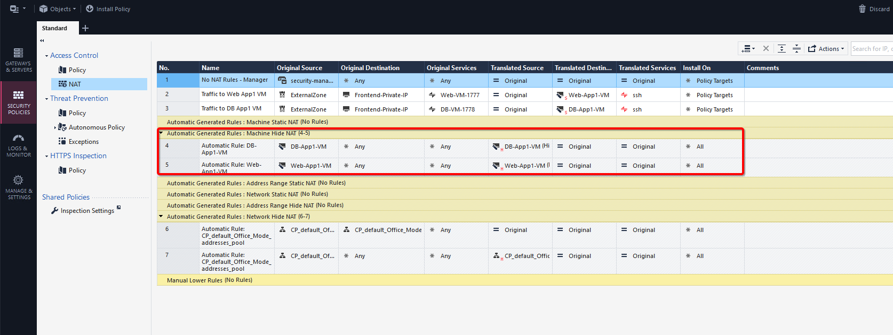

6. Publish and Install policies on your cluster: 

   

   

4. Connect to **Web APP1** and **DB APP1** using **CloudGuard1 Frontend Interface Floating Public IP** over **SSH** unique port as per your configuration: 

    | VM       | Port  | IP                                   | Example                       |
    |----------|-------|--------------------------------------|-------------------------------|
    | Web App1 | 1777  | Frontend Interface Floating Public IP | ssh opc@129.159.79.108 -p 1777 |
    | DB App1  | 1778  | Frontend Interface Floating Public IP | ssh opc@129.159.79.108 -p 1778 |

5. Initiate a ping to **google.com** or publicly available site connection as per below diagram which validates that Outbound traffic from Web and DB spoke VMs is working fine.

   

6. You can also verify traffic from **Policy** screen on your **SmartConsole** application. You can filter using **icmp** service too:

   

## **Task 3: East-West Traffic (Web to Database & Database to Web)**

1. Connect to **CloudGuard Security Management** instance public IP using **SmartConsole** software installed on your Windows VM. Enter credentials as **admin/Check@123** or **password** which you have setup in **Lab3**

2. You have already created necessary **Security Policies** and **Routes** to support traffic. Do a sanity check to make sure **Security Policy** is present: 

   

3. Connect to **Web APP1** and **DB APP1** using **CloudGuard1 Frontend Interface Floating Public IP** over **SSH** unique port as per your configuration: 

    | VM       | Port  | IP                                   | Example                       |
    |----------|-------|--------------------------------------|-------------------------------|
    | Web App1 | 1777  | Frontend Interface Floating Public IP | ssh opc@129.159.79.108 -p 1777 |
    | DB App1  | 1778  | Frontend Interface Floating Public IP | ssh opc@129.159.79.108 -p 1778 |

4. Initiate a ping between **Web App1** and **DB App1** VMs as per below diagram which validates that traffic between Web and DB spoke VMs (vice-versa) is working fine.

   

5. You can also verify traffic from **Policy** screen on your **SmartConsole** application. You can filter using **icmp** service too:

   

## **Task 4: East-West Traffic (Web & DB Application to Oracle Services Network)**

1. From the OCI Services menu, click **Buckets** under **Storage**. Select your region on right part of the screen:

   

2. Below table represents what you will be creating. Click on **Create Bucket** icon to create new **Bucket**:

      | Bucket Name               | Bucket Type    | Comment                                                    |
      |---------------------------|----------------|------------------------------------------------------------|
      | cloudguard-bucket         | Standard       | You will be adding an object and creating pre-auth URL     |

3. Fill out the dialog box:

      - **Bucket NAME**: Provide a name
      - **COMPARTMENT**: Ensure your compartment is selected
      - **Bucket Type**: Standard

   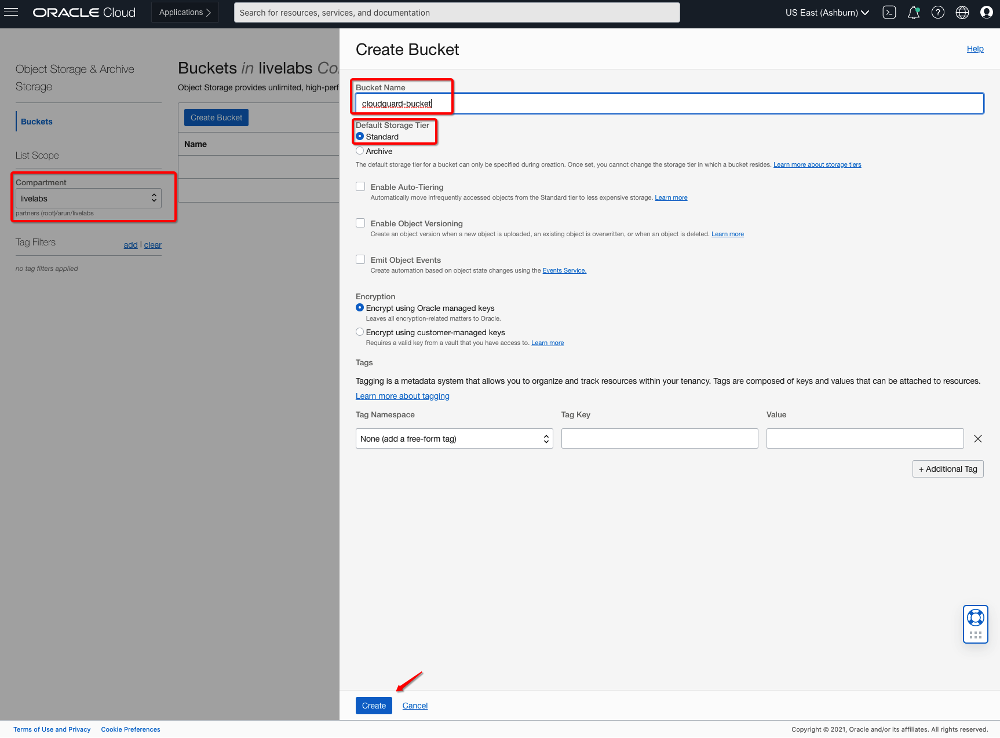

4. Verify all the information and Click **Create**.

5. This will create a Bucket with following components.

    *Standard Bucket*

6. Upload a Object and Create **Pre-Auth** URL which you will be using to access the object from **Web** or **DB** spoke VMs. 
   
    - In your case you can upload an image object for test purpose.

   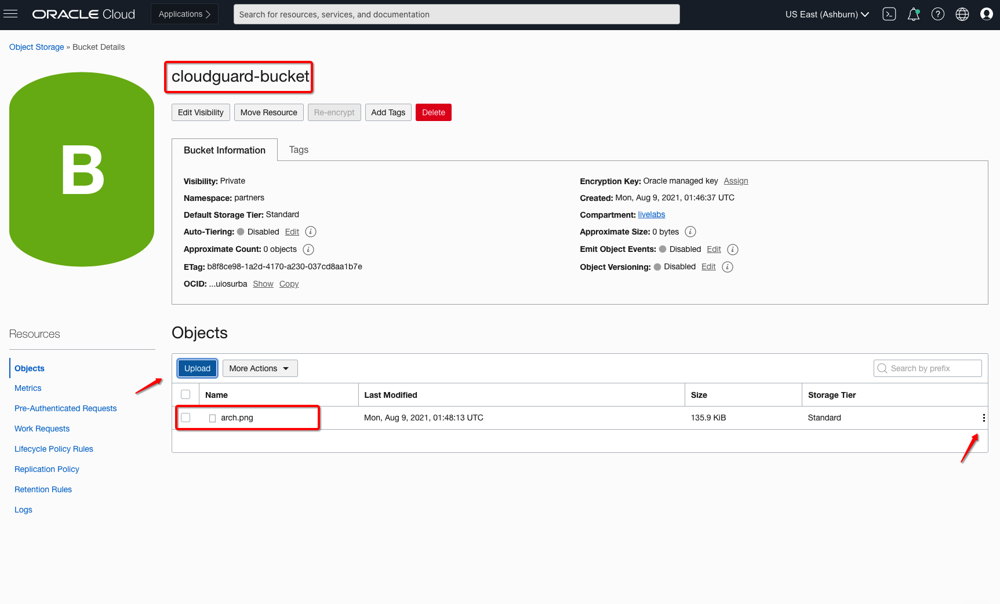

7. Once you complete **Pre-Authentication Request** a Details dialog box pops up, copy the URL which you will be using to access uploaded Object. 

8. Connect to **CloudGuard1** instance public IP on your local machine's web browser: **https://public_ip** using **admin/Check@123** or **password** which you have setup in **Lab3**

9. You will be setting up **static Routes** to support Object Storage traffics in a way that it goes to **CloudGuard** instances via **ServiceGateway**. Click on **Lock** icon (if configuration is locked) to unlock configuration changes and navigate to **Network Management > IPv4 Static Routes**. Click on **Add** icon to add new static route: 

10. You will be entering a static route entry as per below table: 

   | Destination | Subnet Mask | Gateway     | Comment                                                      |
   |-------------|-------------|-------------|--------------------------------------------------------------|
   | 134.70.0.0/16    | 255.255.0.0 | 192.168.2.1 | Object Storage traffic for Ashburn Region; Enter your region values |

11. Enter values as per table and Click on **Save** icon to save route entry: 

   

12. Connect to **CloudGuard2** instance public IP on your local machine's web browser: **https://public_ip** using **admin/Check@123** or **password** which you have setup in **Lab3**

13. You will be setting up **static Routes** to support Object Storage traffics in a way that it goes to **CloudGuard** instances via **ServiceGateway**. Click on **Lock** icon (if configuration is locked) to unlock configuration changes and navigate to **Network Management > IPv4 Static Routes**. Click on **Add** icon to add new static route: 

14. You will be entering a static route entry as per below table: 

   | Destination | Subnet Mask | Gateway     | Comment                                                      |
   |-------------|-------------|-------------|--------------------------------------------------------------|
   | 134.70.0.0/16    | 255.255.0.0 | 192.168.2.1 | Object Storage traffic for Ashburn Region; Enter your region values |

15. Enter values as per table and Click on **Save** icon to save route entry: 

   

16. You have already created necessary **Security Policies** and **Routes** to support traffic. Do a sanity check to make sure **Security Policy** is present on **Firewalls** and **BackendRouteTable** has an entry for Object Storage traffic via Service Gateway: 

   

   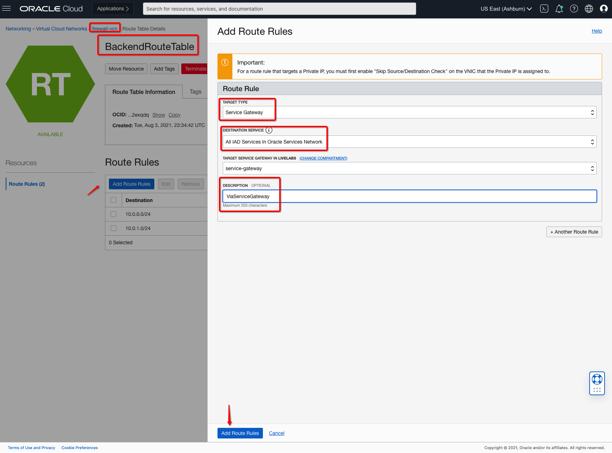

17. Connect to **Web APP1** and **DB APP1** using **CloudGuard1 Frontend Interface Floating Public IP** over **SSH** unique port as per your configuration: 

    | VM       | Port  | IP                                   | Example                       |
    |----------|-------|--------------------------------------|-------------------------------|
    | Web App1 | 1777  | Frontend Interface Floating Public IP | ssh opc@129.159.79.108 -p 1777 |
    | DB App1  | 1778  | Frontend Interface Floating Public IP | ssh opc@129.159.79.108 -p 1778 |

18. Do a **wget** to **Pre-Authentication Request** which you created earlier from Web and DB spoke VMs and you should get a response back.

   

19. You can also verify traffic from **Policy** screen on your **SmartConsole** application. You can filter using **443** port too:

   

## **Task 5: High Availability Failover Validation**

1. Navigate to **CloudGuard1** instance attached VNIC details page and verify that **Frontend/Primary** and/or **Backend** interface has floating secondary IPs are available on primary instance. 

   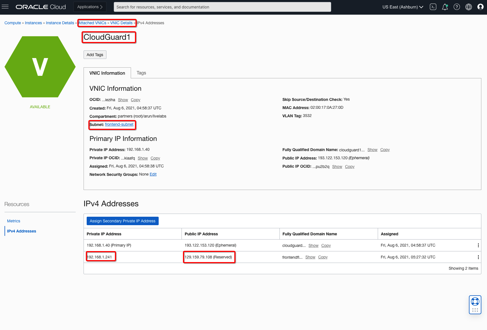

2. Since you are using **R81** release there is an additional step which you need to ensure that HA failover happens successfully. Go to **expert** mode and run below commands on each **CloudGuard1** and **CloudGuard2** instances over SSH: 

      ```
      <copy>
      set expert-password
      Enter a Unique Password, for example: Check@123
      expert
      $FWDIR/scripts/merge-bundle.sh
      $FWDIR/scripts/cloud_ha_cli.py restart
      </copy>
      ```

   Below image shows an example of above script on **CloudGuard1** instance. You have to make sure that you run on both CloudGuard instances.

   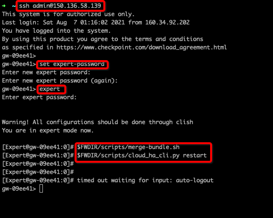

3. Reboot **CloudGuard1** instance or Suspend HA which will trigger failover automatically to **CloudGuard2** instance. 

   

4. Within few seconds **CloudGuard2** instance should come up online/reachable and once you connect to **CloudGuard2** GUI using **admin/Check@123** credentials or password which you had setup in **Lab3**. You should see it became primary instance. 

   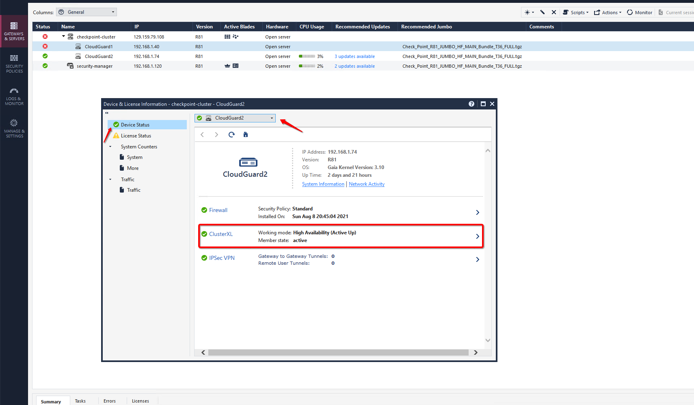

5. Navigate to **CloudGuard2** instance attached VNIC details page and verify that **Frontend/Primary** and/or **Backend** interface floating IPs has moved from **CloudGuard1** instance. 

   

   

6. You can verify that **CloudGuard2** is primary and **CloudGuard1** is secondary in your cluster:

   

   

***Congratulations! You have successfully completed the lab.***

You may now [proceed to the next lab](#next).

## Learn More

1. [OCI Training](https://www.oracle.com/cloud/iaas/training/)
2. [Familiarity with OCI console](https://docs.us-phoenix-1.oraclecloud.com/Content/GSG/Concepts/console.htm)
3. [Overview of Networking](https://docs.us-phoenix-1.oraclecloud.com/Content/Network/Concepts/overview.htm)
4. [Overview of Marketplace Applications](https://docs.oracle.com/en-us/iaas/Content/Marketplace/Concepts/marketoverview.htm)
5. [OCI CloudGuard Deployment Guide](https://supportcenter.checkpoint.com/supportcenter/portal?eventSubmit_doGoviewsolutiondetails=&solutionid=sk142872)

## Acknowledgements

- **Author** - Arun Poonia, Senior Solutions Architect
- **Adapted by** - Check Point
- **Contributors** - N/A
- **Last Updated By/Date** - Arun Poonia, August 2021