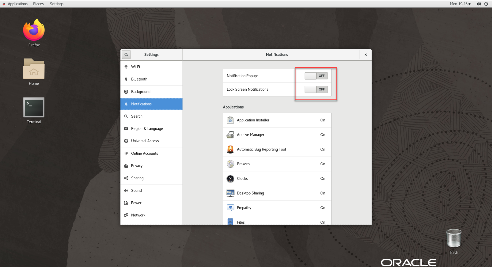
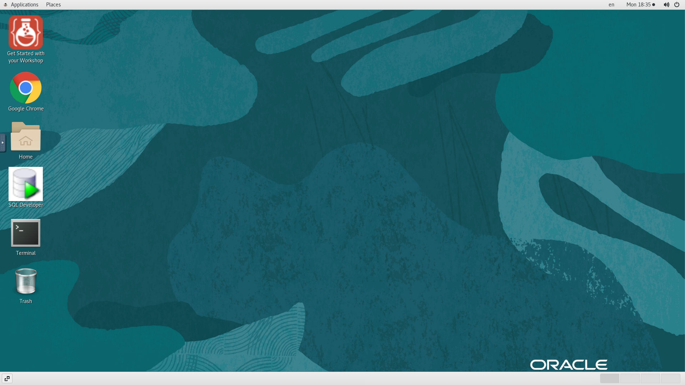
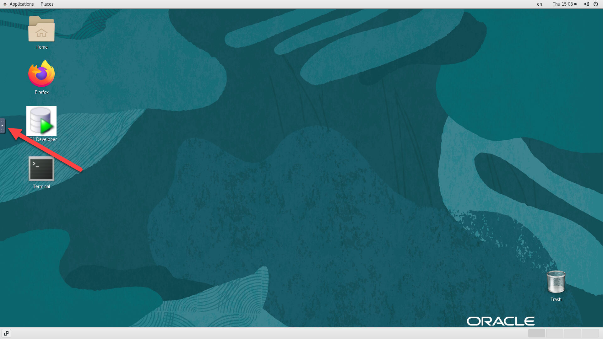

# OPTIONAL - Setup Graphical Remote Desktop

## Introduction
This lab will show you how to deploy and configure noVNC Graphical Remote Desktop on an Oracle Enterprise Linux (OEL) instance.

### Objectives
- Deploy NoVNC Remote Desktop
- Configure Desktop
- Add Applications Shortcuts to Desktop

### Prerequisites
This lab assumes you have:
- An Oracle Enterprise Linux (OEL) that meets requirement for marketplace publishing

## **STEP 1**: Deploy noVNC
1.  As root, create script */tmp/novnc-1.sh* to perform the first set of tasks.

    ```
    <copy>
    sudo su - || sudo sed -i -e 's|root:x:0:0:root:/root:.*$|root:x:0:0:root:/root:/bin/bash|g' /etc/passwd; sudo su -

    </copy>
    ```

    ```
    <copy>
    cat > /tmp/novnc-1.sh <<EOF
    #!/bin/bash
    export appuser=\$1

    echo "Installing X-Server required packages ..."
    yum -y groupinstall "Server with GUI"

    echo "Installing other required packages ..."
    yum -y install \
    tigervnc-server \
    numpy \
    mailcap \
    nginx

    yum -y localinstall \
    http://mirror.dfw.rax.opendev.org:8080/rdo/centos7-master/deps/latest/noarch/novnc-1.1.0-6.el7.noarch.rpm \
    http://mirror.dfw.rax.opendev.org:8080/rdo/centos7-master/deps/latest/noarch/python2-websockify-0.8.0-13.el7.noarch.rpm

    echo "Updating VNC Service ..."
    cp /lib/systemd/system/vncserver@.service /etc/systemd/system/vncserver_\${appuser}@:1.service
    sed -i "s/<USER>/\${appuser}/g" /etc/systemd/system/vncserver_\${appuser}@:1.service

    firewall-cmd --zone=public --permanent --add-service=vnc-server
    firewall-cmd --zone=public --permanent --add-port=5901/tcp
    firewall-cmd --zone=public --permanent --add-port=80/tcp
    firewall-cmd --permanent --add-port=6080/tcp

    firewall-cmd  --reload

    systemctl daemon-reload
    systemctl enable vncserver_\${appuser}@:1.service
    systemctl enable nginx
    systemctl daemon-reload

    echo "End of novnc-1.sh"
    EOF
    chmod +x /tmp/novnc-*.sh
    </copy>
    ```

2. Create script */tmp/novnc-2.sh* to perform the second set of tasks.

    ```
    <copy>
    cat > /tmp/novnc-2.sh <<EOF
    #!/bin/bash

    #Enable and Start services

    setsebool -P httpd_can_network_connect 1
    systemctl daemon-reload
    systemctl enable websockify.service
    systemctl start websockify.service
    nginx -s reload
    systemctl restart nginx

    echo "noVNC has been successfully deployed on this host and is using NGINX proxy. Open the browser and navigate to the URL below to validate"
    echo ""
    echo "#================================================="
    echo "#"
    echo "# http://`curl -s ident.me`/index.html?resize=remote"      
    echo "# or"
    echo "# http://`curl -s ident.me`/password=LiveLabs.Rocks_99&resize=remote&autoconnect=true"      
    echo "#================================================="
    echo ""
    EOF
    chmod +x /tmp/novnc-*.sh
    </copy>
    ```

3. Create websockify systemd service file

    ```
    <copy>
    cat > /etc/systemd/system/websockify.service <<EOF
    [Unit]
    Description=Websockify Service
    After=network.target cloud-final.service

    [Service]
    Type=simple
    User=oracle
    ExecStart=/bin/websockify --web=/usr/share/novnc/ --wrap-mode=respawn 6080 localhost:5901
    Restart=on-abort

    [Install]
    WantedBy=multi-user.target
    EOF
    </copy>
    ```

3. Create */etc/nginx/conf.d/novnc.conf* file

    ```
    <copy>
    pub_ip=`curl -s ident.me`
    cat > /etc/nginx/conf.d/novnc.conf <<EOF
    # nginx proxy config file for noVNC websockify

    upstream vnc_proxy {
                        server 127.0.0.1:6080;
    }

    server {
            listen 80;
            listen [::]:80;
            server_name $pub_ip;
            access_log  /var/log/nginx/novnc_access.log;
            error_log  /var/log/nginx/novnc_error.log;
            location / {
                        proxy_pass http://vnc_proxy/;
                        proxy_buffering off;
                        proxy_http_version 1.1;
                        proxy_set_header X-Forwarded-For \$proxy_add_x_forwarded_for;
                        proxy_set_header Upgrade \$http_upgrade;
                        proxy_set_header Connection "upgrade";
                        proxy_read_timeout 61s;
            }

    }
    EOF
    </copy>
    ```

4. Ensure that the *EPEL* Yum Repo is configured and enabled. i.e. contains the entry *enabled=1*. If not update it accordingly before proceeding with the next step

    ```
    <copy>
    sed -i -e 's|enabled=.*$|enabled=1|g' /etc/yum.repos.d/oracle-epel-ol7.repo
    cat /etc/yum.repos.d/oracle-epel-ol7.repo|grep enable
    </copy>
    ```

    

5. Run script *novnc-1.sh* with the desired VNC user as the sole input parameter. e.g. *oracle*

    ```
    <copy>
    export appuser=oracle
    /tmp/novnc-1.sh ${appuser}
    </copy>
    ```

6.  Set password for VNC user.

    ```
    <copy>
    vncpasswd ${appuser}
    </copy>
    ```

7. Provide password as prompted. e.g. "*LiveLabs.Rocks_99*". When prompted with *Would you like to enter a view-only password (y/n)?*, enter **N**

    ```
    <copy>
    LiveLabs.Rocks_99
    </copy>
    ```

8. Su over to the VNC user account and enforce the password.  when prompted

    ```
    <copy>
    sudo su - ${appuser}
    vncserver
    </copy>
    ```

9. Provide the same password as you did above. e.g. "*LiveLabs.Rocks_99*". When prompted with *Would you like to enter a view-only password (y/n)?*, enter **N**

    ```
    <copy>
    LiveLabs.Rocks_99
    </copy>
    ```

10. Stop the newly started VNC Server running on "**:1**" and exit (or *CTRL+D*) the session as vnc user to go back to *root*

    ```
    <copy>
    vncserver -kill :1
    exit
    </copy>
    ```

11. Start VNC Server using *systemctl*

    ```
    <copy>
    systemctl start vncserver_${appuser}@:1.service
    systemctl status vncserver_${appuser}@:1.service
    </copy>
    ```
12. Run script *novnc-2.sh* to finalize

    ```
    <copy>
    export appuser=oracle
    /tmp/novnc-2.sh
    </copy>
    ```

13. After validating successful setup from URL displayed by above script, remove all setup scripts from "*/tmp*"

    ```
    <copy>
    rm -rf /tmp/novnc-*.sh
    </copy>
    ```

## **STEP 2**: Configure Desktop   
LiveLabs compute instance are password-less and only accessible via SSH keys. As result it's important to adjust session settings some settings to ensure a better user experience.

1. Launch your browser to the following URL

    ```
    <copy>http://[your instance public-ip address]/index.html?resize=remote</copy>
    ```

    


2. Copy/Paste the Password below to login

    ```
    <copy>LiveLabs.Rocks_99</copy>
    ```

    

3. Navigate to "*Applications >> System Tools >> Settings*"

    

4. Click on "*Privacy*" and set **Screen Lock** to *Off*

    

5. Click on "*Power*" and set **Blank Screen** under Power Saving to *Never*

    

6. Click on "*Notifications*" and set **Notifications Popups** and **Lock Screen Notifications** to *Off*

    

7. Scroll-down, Click on "*Devices >> Resolution*" and select **1920 x 1080 (16:9)**

    
    

## **STEP 3**: Add Applications to Desktop   
For ease of access to desktop applications provided on the instance and needed to perform the labs, follow the steps below to add shortcuts to the desktop. In the example below, we will be adding a shortcut of *FireFox* browser.

1. On the desktop from the previous setup, click on *Home > Other Locations*, then navigate to *`/usr/share/applications`* and scroll-down to find *FireFox*

    

2. Right-click on *FireFox* and select *Copy to...*

    

3. Navigate to *Home > Desktop* and Click on *Select*

    

4. Double-click on the newly added icon on the desktop and click on *Trust and Launch*

    
    

5. Repeat steps above to add any other required Application the workshop may need to the Desktop (e.g. Terminal, SQL Developer, etc...)

    

## **STEP 4**: Enable Copy/Paste from Local to Remote Desktop (noVNC clipboard)
Perform the tasks below and add them to any workshop guide to instruct users on how to enable clipboard on the remote desktop for local-to-remote copy/paste.

During the execution of your labs you may need to copy text from your local PC/Mac to the remote desktop, such as commands from the lab guide. While such direct copy/paste isn't supported as you will realize, you may proceed as indicated below to enable an alternative local-to-remote clipboard with Input Text Field.

1. From your remote desktop session, click on the small gray tab on the middle-left side of your screen to open the control bar

    

2. Select the *clipboard* icon, Copy the sample text below and paste into the clipboard widget, then finally open up the desired application and paste accordingly using *mouse controls*

    ```
    <copy>echo "This text was copied from my local computer"</copy>
    ```

    

    *Note:* Please make sure you initialize your clipboard with steps *[1-3]* shown above before opening the target application in which you intend to paste the text. Otherwise will find the *paste* function grayed out in step 4 when attempting to paste.

You may now [proceed to the next lab](#next).

## Acknowledgements
* **Author** - Rene Fontcha, LiveLabs Platform Lead, NA Technology, September 2020
* **Contributors** - Robert Pastijn 
* **Last Updated By/Date** - Rene Fontcha, LiveLabs Platform Lead, NA Technology, May 2021
