# Setup Graphical Remote Desktop

## Introduction
This lab shows you how to deploy and configure noVNC Graphical Remote Desktop on an Oracle Enterprise Linux (OEL) instance prior
to capturing the custom image.

### Objectives
- Deploy NoVNC Remote Desktop
- Configure Desktop
- Add Applications Shortcuts to Desktop
- Configure remote clipboard
- Optimize Browser Settings
- Enable VNC password reset

### Prerequisites
This lab assumes you have:
- An Oracle Enterprise Linux (OEL) that meets requirement for marketplace publishing

## Task 1: Deploy noVNC
1.  As root, create script */tmp/set-os-user.sh* to perform the first set of tasks.

    ```
    <copy>
    sudo su - || sudo sed -i -e 's|root:x:0:0:root:/root:.*$|root:x:0:0:root:/root:/bin/bash|g' /etc/passwd; sudo su -

    </copy>
    ```

    ```
    <copy>
    cat > /tmp/set-os-user.sh <<EOF
    #!/bin/bash
    echo ""
    echo "Your input is required!"
    echo ""
    read -p 'Press *ENTER* to Accept *oracle* as the OS user to configure for remote desktop access or type in another valid user. If no input is provided *oracle* is assumed: ' appuser

    appuser=\${appuser:-oracle}

    getent passwd \$appuser > /dev/null

    if [ $? -eq 0 ]; then
      if [[ \${appuser} == root ]]; then
         echo ""
         echo "***ERROR****"
         echo "-- Not allowed for root. -- VNC must be on a non-root account. e.g oracle. Please start over and enter a valid non-root OS user when prompted"
         echo ""
         exit 20
      fi
       echo \$appuser >/tmp/.appuser
    else
        echo ""
        echo "***ERROR****"
        echo "-- Invalid OS user. -- Please start over and enter a valid non-root OS user when prompted"
        echo ""
    fi
    EOF
    chmod +x /tmp/set-os-user.sh

    </copy>
    ```

2.  Run */tmp/set-os-user.sh* to set the OS user to be configured for remote desktop access. The default user is *oracle*.

    ```
    <copy>
    /tmp/set-os-user.sh
    </copy>
    ```

3. Create script */tmp/novnc-1.sh* to perform the first set of tasks.

    ```
    <copy>
    export appuser=$(cat /tmp/.appuser)
    cat > /tmp/novnc-1.sh <<EOF
    #!/bin/bash

    if [[ -z "\${appuser}" ]]; then
      echo "A valid OS user must be provided. e.g. oracle "
      exit 10
      if [[ \${appuser} == root ]]; then
        echo "Not allowed for root. VNC must be on non root account. e.g oracle"
        exit 20
      fi
    fi

    echo "Proceeding with configuration for OS user \$appuser"

    ll_config_base=/home/\${appuser}/.livelabs
    epel_cfg=/etc/yum.repos.d/oracle-epel-ol7.repo
    mkdir -p "\${ll_config_base}"
    wget https://objectstorage.us-ashburn-1.oraclecloud.com/p/2Pvux7VWE_Cx0v66TohxVWL7KXv2uFNEzw0JYtfMGCcFWDxrY7pHkS6L7-Bcn5on/n/natdsecurity/b/misc/o/livelabs.ico -O "\${ll_config_base}"/livelabs.ico
    chown -R \${appuser} "\${ll_config_base}"

    if [[ -f "\${epel_cfg}" ]]; then
      sed -i -e 's|enabled=.*$|enabled=1|g' "\${epel_cfg}"
    else
      cat > "\${epel_cfg}" <<EPEL
    [ol7_developer_EPEL]
    name=Oracle Linux \$releasever EPEL Packages for Development (\$basearch)
    baseurl=https://yum\$ociregion.\$ocidomain/repo/OracleLinux/OL7/developer_EPEL/\$basearch/
    gpgkey=file:///etc/pki/rpm-gpg/RPM-GPG-KEY-oracle
    gpgcheck=1
    enabled=1
    EPEL

    fi

    echo "Updating packages ..."
    yum -y update

    echo "Installing X-Server required packages ..."
    yum -y groupinstall "Server with GUI"

    echo "Installing other required packages ..."
    yum -y install \
    tigervnc-server \
    numpy \
    mailcap

    yum -y localinstall \
    http://mirror.dfw.rax.opendev.org:8080/rdo/centos7-master/deps/latest/noarch/novnc-1.1.0-6.el7.noarch.rpm \
    http://mirror.dfw.rax.opendev.org:8080/rdo/centos7-master/deps/latest/noarch/python2-websockify-0.8.0-13.el7.noarch.rpm \
    https://dl.google.com/linux/direct/google-chrome-stable_current_x86_64.rpm

    echo "Updating VNC Service ..."
    cp /lib/systemd/system/vncserver@.service /etc/systemd/system/vncserver_\${appuser}@:1.service
    sed -i "s/<USER>/\${appuser}/g" /etc/systemd/system/vncserver_\${appuser}@:1.service
    sed -i "s/After=syslog.target network.target/After=syslog.target network.target resetvncpwd.service cloud-final.service/g" /etc/systemd/system/vncserver_\${appuser}@:1.service

    firewall-cmd --zone=public --permanent --add-service=vnc-server
    firewall-cmd --zone=public --permanent --add-port=5901/tcp
    firewall-cmd --permanent --add-port=6080/tcp

    firewall-cmd  --reload

    systemctl daemon-reload
    systemctl enable vncserver_\${appuser}@:1.service
    systemctl daemon-reload

    EOF
    cat >/usr/local/bin/resetvncpwd.sh <<EOF
    #!/bin/bash
    # Reset VNC password for user

    mypasswd=\$(curl -s -H "Authorization: Bearer Oracle" -L http://169.254.169.254/opc/v2/instance/metadata/vncpwd)

    if [[ \${#mypasswd} -ne 10  ]]; then
      echo "Required Random password string is missing from OCI metadata. No VNC password reset for user ${appuser} will be performed"
      exit 30
    else
      echo \$mypasswd | vncpasswd -f >/home/${appuser}/.vnc/passwd
      chmod 0600 /home/${appuser}/.vnc/passwd
      echo "VNC password for user ${appuser} reset successfully"
    fi
    EOF
    cat > /etc/systemd/system/websockify.service <<EOF
    [Unit]
    Description=Websockify Service
    After=network.target cloud-final.service

    [Service]
    Type=simple
    User=${appuser}
    ExecStart=/bin/websockify --web=/usr/share/novnc/ --wrap-mode=respawn 6080 localhost:5901
    Restart=on-abort

    [Install]
    WantedBy=multi-user.target
    EOF
    cat > /etc/systemd/system/resetvncpwd.service <<EOF
    [Unit]
    Description=ResetVncPwd Service
    After=syslog.target network.target

    [Service]
    Type=simple
    ExecStart=/usr/local/bin/resetvncpwd.sh ${appuser}

    [Install]
    WantedBy=multi-user.target
    EOF

    cat >> /etc/sudoers.d/90-cloud-init-users <<EOF

    # User rules for ${appuser}
    ${appuser} ALL=(ALL) NOPASSWD:ALL
    EOF

    cat >/usr/local/bin/livelabs-get_started.sh <<EOF
    #!/bin/bash
    ################################################################################
    #
    # Name: "livelabs-get_started.sh"
    #
    # Description:
    #   Script to Launch web browser window(s) preloaded with workshop guide and related
    #   web application(s)
    #
    #  Pre-requisite: Google Chrome installed.
    #
    #  AUTHOR(S)
    #  -------
    #  Rene Fontcha, Oracle LiveLabs Platform Lead
    #
    #  MODIFIED        Date                 Comments
    #  --------        ----------           -----------------------------------
    #  Rene Fontcha    08/07/2021           Initial Creation
    #
    # Copyright (c) 2021 Oracle and/or its affiliates. All rights reserved.
    ###############################################################################

    user_data_dir_base="/home/${appuser}/.livelabs"
    desktop_guide_url=\$(curl -s -H "Authorization: Bearer Oracle" -L http://169.254.169.254/opc/v2/instance/metadata/desktop_guide_url)
    desktop_app1_url=\$(curl -s -H "Authorization: Bearer Oracle" -L http://169.254.169.254/opc/v2/instance/metadata/desktop_app1_url)
    desktop_app2_url=\$(curl -s -H "Authorization: Bearer Oracle" -L http://169.254.169.254/opc/v2/instance/metadata/desktop_app1_url)

    #Drop existing sessions
    ll_windows_opened=\$(ps aux | grep 'disable-session-crashed-bubble'|grep -v grep |awk '{print \$2}'|wc -l)

    if [[ "\${ll_windows_opened}" -gt 0 ]]; then
     kill -2 \$(ps aux | grep 'disable-session-crashed-bubble'|grep -v grep |awk '{print \$2}')
    fi

    # "Launching the workshop guide"
    if [[ \${desktop_guide_url:0:4} = 'http' ]]; then
    google-chrome --password-store=basic --app=\${desktop_guide_url} --window-position=110,50 --window-size=887,912 --user-data-dir="\${user_data_dir_base}/chrome-window1" --disable-session-crashed-bubble >/dev/null 2>&1 &
    fi

    # "Launching Web App #1 page"
    if [[ \${desktop_app1_url:0:4} = 'http' ]]; then
    google-chrome --password-store=basic \${desktop_app1_url} --window-position=1010,50 --window-size=887,950 --user-data-dir="\${user_data_dir_base}/chrome-window2" --disable-session-crashed-bubble >/dev/null 2>&1 &
    fi

    # "Launching Web App #2 page"
    if [[ \${desktop_app2_url:0:4} = 'http' ]]; then
    google-chrome --password-store=basic \${desktop_app2_url} --window-position=1010,50 --window-size=887,950 --user-data-dir="\${user_data_dir_base}/chrome-window2" --disable-session-crashed-bubble >/dev/null 2>&1 &
    fi
    EOF

    cat >/usr/share/applications/livelabs-get_started.desktop <<EOF
    [Desktop Entry]
    Version=1.0
    Encoding=UTF-8
    GenericName=Get Started
    Name=Get Started with your Workshop
    Comment=Launch Apps and Workshop Guide
    Exec=/usr/local/bin/livelabs-get_started.sh
    StartupNotify=true
    Terminal=false
    Icon=/home/${appuser}/.livelabs/livelabs.ico
    Type=Application
    Categories=Network;WebBrowser;
    MimeType=application/pdf;application/rdf+xml;application/rss+xml;application/xhtml+xml;application/xhtml_xml;application/xml;image/gif;image/jpeg;image/png;image/webp;text/html;text/xml;x-scheme-handler/http;x-scheme-handler/https;
    EOF

    chmod +x /usr/local/bin/livelabs-get_started.sh
    chmod +x /usr/local/bin/resetvncpwd.sh
    chmod +x /tmp/novnc-*.sh
    </copy>
    ```

4. Create script */tmp/novnc-2.sh* to perform the second set of tasks.

    ```
    <copy>
    cat > /tmp/novnc-2.sh <<EOF
    #!/bin/bash

    #Enable and Start services

    systemctl daemon-reload
    systemctl enable websockify.service
    systemctl start websockify.service
    systemctl enable resetvncpwd.service
    systemctl start resetvncpwd.service

    echo "noVNC has been successfully deployed on this host. Open the browser and navigate to the URL below to validate"
    echo ""
    echo "#================================================="
    echo "#"
    echo "# http://`curl -s ident.me`:6080/vnc.html?password=LiveLabs.Rocks_99&resize=scale&quality=9&autoconnect=true"      
    echo "#================================================="
    echo ""
    EOF
    chmod +x /tmp/novnc-*.sh
    </copy>
    ```

    **Notes:** If the URL fails to load, verify that your VCN contains an *ingress* rule for port *6080*

5. Run script *novnc-1.sh* with the desired VNC user as the sole input parameter. e.g. *oracle*

    ```
    <copy>
    /tmp/novnc-1.sh
    </copy>
    ```

6.  Set password for VNC user.

    ```
    <copy>
    vncpasswd ${appuser}
    </copy>
    ```

7. Provide password as prompted. e.g. "*LiveLabs.Rocks_99*". When prompted with *Would you like to enter a view-only password (y/n)?*, enter **N**

    ```
    <copy>
    LiveLabs.Rocks_99
    </copy>
    ```

8. Su over to the VNC user account and enforce the password.  when prompted

    ```
    <copy>
    sudo su - ${appuser}
    rm -rf $HOME/.vnc
    vncserver
    </copy>
    ```

9. Provide the same password as you did above. e.g. "*LiveLabs.Rocks_99*". When prompted with *Would you like to enter a view-only password (y/n)?*, enter **N**

    ```
    <copy>
    LiveLabs.Rocks_99
    </copy>
    ```

10. Stop the newly started VNC Server running on "**:1**" and exit (or *CTRL+D*) the session as vnc user to go back to *root*

    ```
    <copy>
    vncserver -kill :1
    exit
    </copy>
    ```

11. Start VNC Server using *systemctl*

    ```
    <copy>
    systemctl start vncserver_${appuser}@:1.service
    systemctl status vncserver_${appuser}@:1.service
    </copy>
    ```

12. Run script *novnc-2.sh* to finalize

    ```
    <copy>
    /tmp/novnc-2.sh
    </copy>
    ```

13. After validating successful setup from URL displayed by above script, remove all setup scripts from "*/tmp*"

    ```
    <copy>
    rm -rf /tmp/novnc-*.sh
    rm -rf /tmp/set-os-user.sh
    </copy>
    ```

## Task 2: Add Applications to Desktop   
For ease of access to desktop applications provided on the instance and needed to perform the labs, follow the steps below to add shortcuts to the desktop. In the example below, we will be adding a shortcut called *Get Started with your Workshop* for launching the workshop guide and webapps if any.

1. Launch your browser to the following URL to access the remote desktop

    ```
    <copy>http://[your instance public-ip address]:6080/vnc.html?password=LiveLabs.Rocks_99&resize=scale&quality=9&autoconnect=true</copy>
    ```

2. On the remote desktop, click on *Home > Other Locations*, then navigate to *`/usr/share/applications`* and scroll-down to find *Get Started with your Workshop*

    

3. Right-click on *Get Started with your Workshop* and select *Copy to...*

    

4. Navigate to *Home > Desktop* and Click on *Select*

    

5. Double-click on the newly added icon on the desktop and click on *Trust and Launch*

    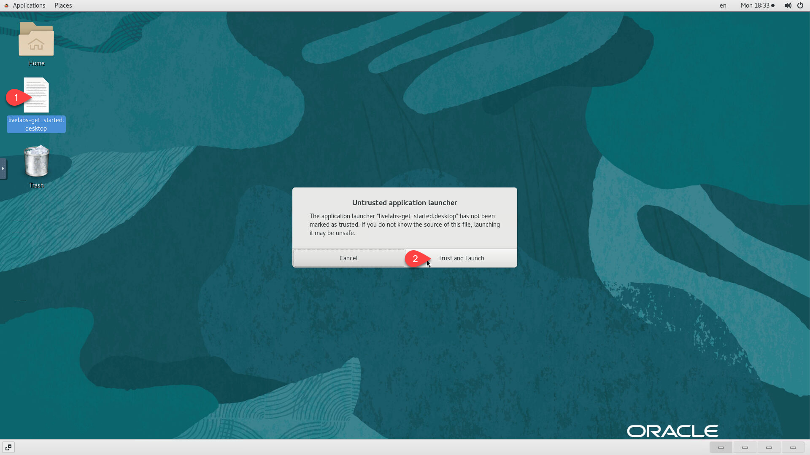
    

6. Repeat steps above to add *Google Chrome* browser and any other required Application the workshop may need to the Desktop (e.g. Terminal, SQL Developer, etc...)

    


## Task 3: Configure Desktop   
LiveLabs compute instance are password-less and only accessible optionally via SSH keys. As result it's important to adjust session settings to ensure a better user experience.

1. Follow steps in the screenshot below and run command provided below to resize desktop icons

    ```
    <copy>
    gsettings set org.gnome.nautilus.icon-view default-zoom-level small
    </copy>
    ```

    

2. Right-click anywhere on the desktop and select *Organize Desktop by Name*

    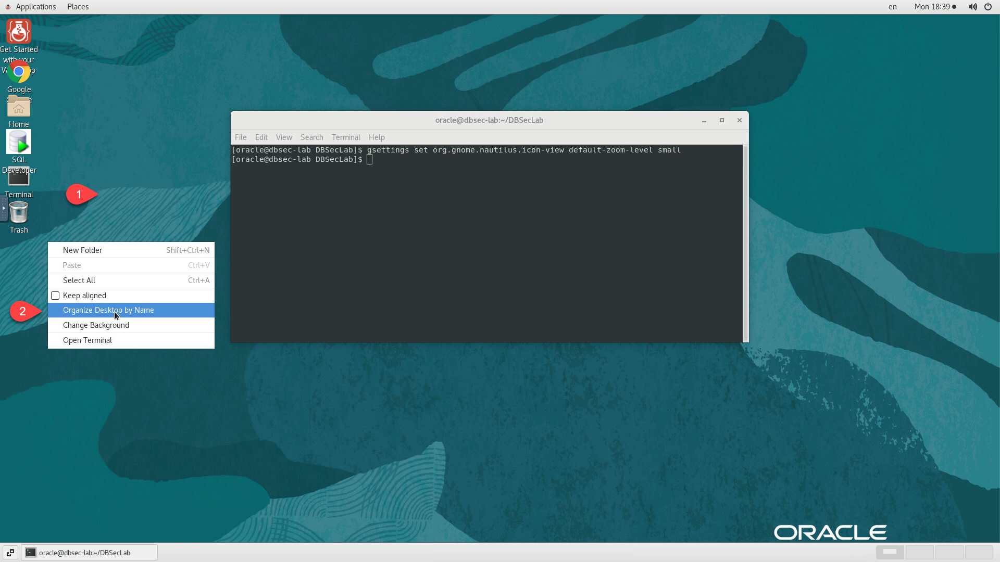

3. Navigate to "*Applications >> System Tools >> Settings*"

    

4. Click on "*Privacy*" and set **Screen Lock** to *Off*

    

5. Click on "*Power*" and set **Blank Screen** under Power Saving to *Never*

    

6. Click on "*Notifications*" and set **Notifications Popups**, **Lock Screen Notifications**, and **Automatic Bug Reporting Tool** to *Off*

    
    

7. Scroll-down, Click on "*Devices >> Resolution*" and select **1920 x 1080 (16:9)**

    
    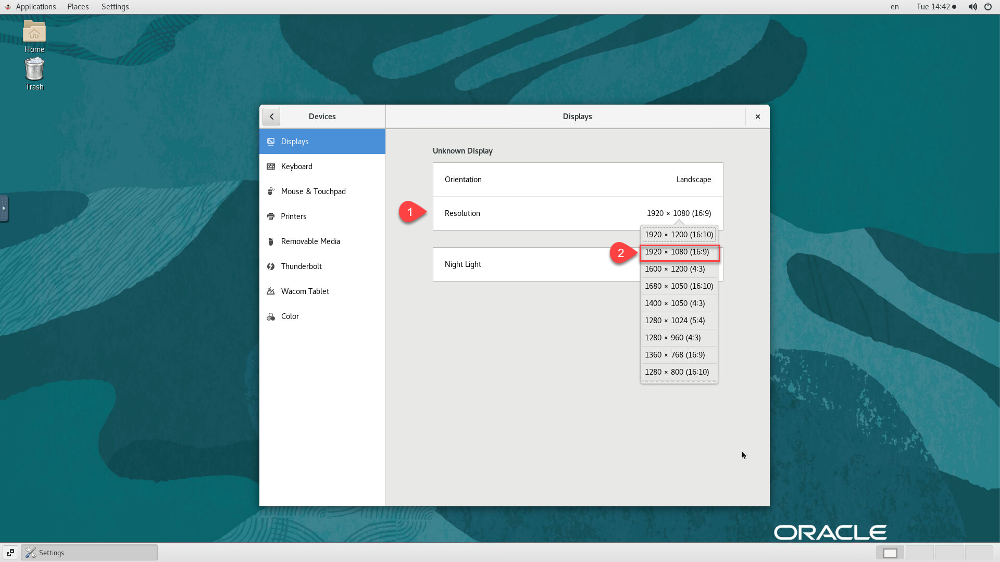

8. From the same Terminal window, run the following command to open *Startup Programs* configuration.

    ```
    <copy>
    gnome-session-properties
    </copy>
    ```

9. Fill in the details as shown below and click *Add* to add *Get Started with your Workshop* to the list of applications to be started automatically on *VNC* Startup

    - Name

    ```
    <copy>Get Started with your Workshop</copy>
    ```

    - Command

    ```
    <copy>/usr/local/bin/livelabs-get_started.sh</copy>
    ```

    - Comment

    ```
    <copy>Launch Workshop Guide and WebApps</copy>
    ```

    

10. Restart *vncserver* to test.

    ```
    <copy>sudo systemctl restart vncserver_$(whoami)@\:1</copy>

    ```

    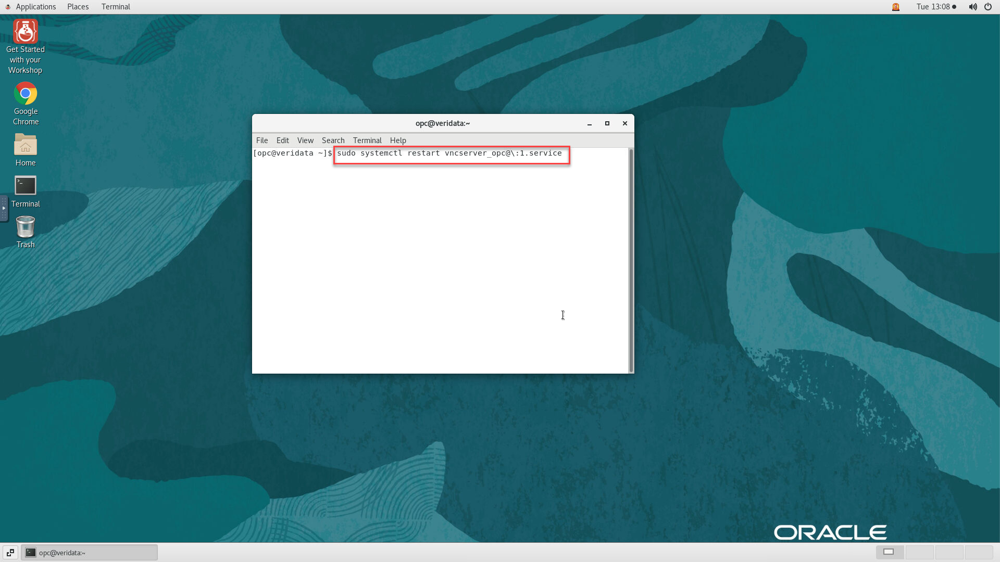

11. Click *Connect* to get back into the remote desktop

    

    *Notes:* Don't worry if the browser window(s) is(are) not loaded as expected on VNC startup at the moment. The required instance metadata is not yet present on the host but will be injected at provisioning to cover the following.

    - `DESKTOP_GUIDE_URL` - *required*
    - `DESKTOP_APP1_URL` - optional
    - `DESKTOP_APP2_URL` - optional

    The following is an example from the *GoldenGate Veridata* workshop

    

12. If there are no WebApps used in the workshop, configure *Startup Programs* for another application such as *SQL Developer* to open up on the right next to the workshop guide on *VNC* startup

    
    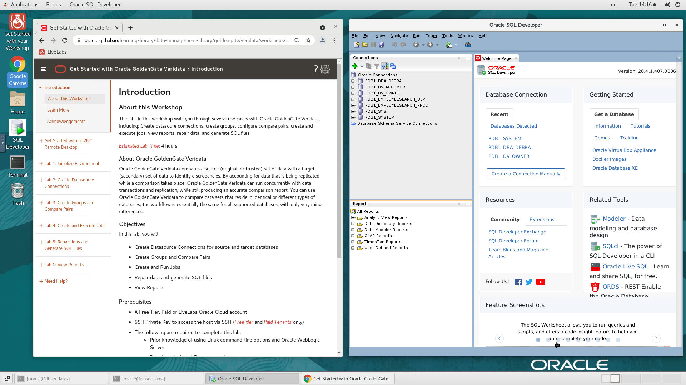

## Task 4: Optimize Chrome Browser
Perform the following to further customize and optimize *Chrome* Browser.

1. Right-click on *Google Chrome* browser icon, select *Properties*

    

2. Update the *command* field with the custom value below

    ```
    <copy>
    /usr/bin/google-chrome --password-store=basic --user-data-dir="/home/<os-user>/.livelabs/chrome-window2" --disable-session-crashed-bubble
    </copy>
    ```

    *Notes:* Replace *<os-user>* with the correct OS User that owns the remote desktop session. e.g. *opc* as in this example, or *oracle* for the vast majority

    

3. Double-click on *Google Chrome* browser icon to launch, Uncheck *Automatic Usage Statistics & Crash reporting* and click *OK*

    

4. Click on *Get Started*, on the next 3 pages click on *Skip*, and finally on *No Thanks*.

    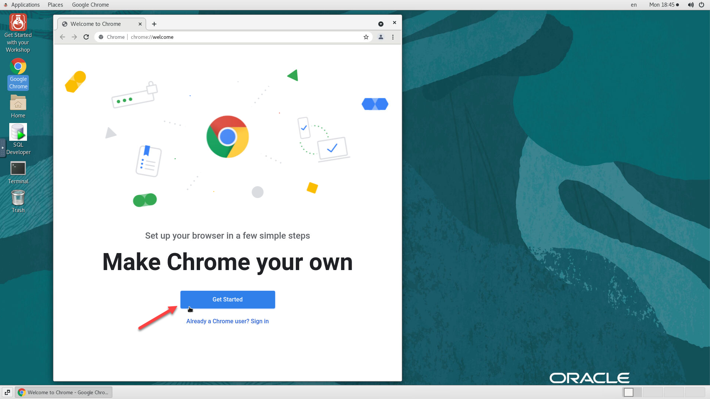
    
    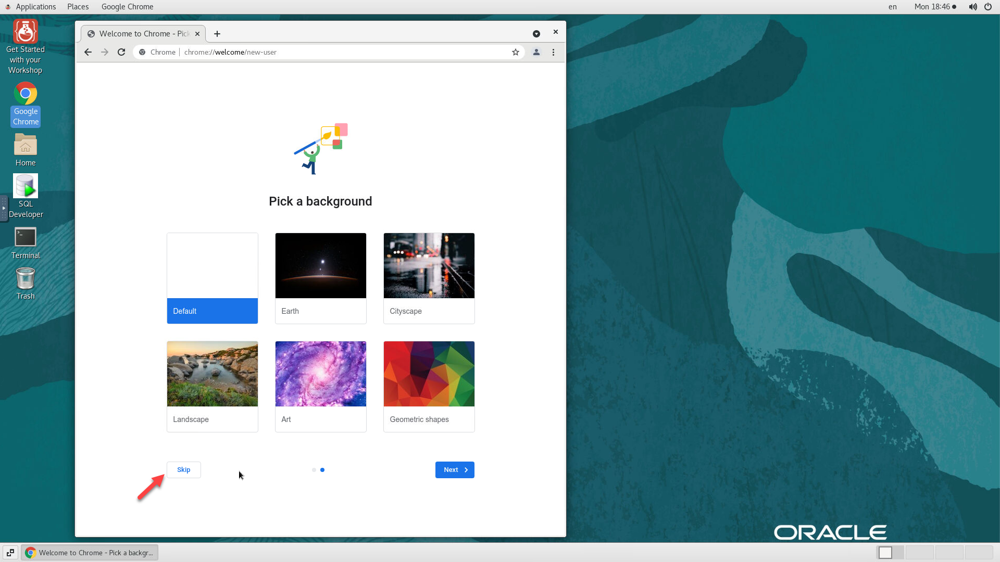
    

5. Click in the *Three dots* at the top right, then select *"Bookmarks >> Show bookmarks bar"*

    

6. Right-click anywhere in the *Bookmarks bar area*, then Uncheck *Show apps shortcuts* and *Show reading list*

    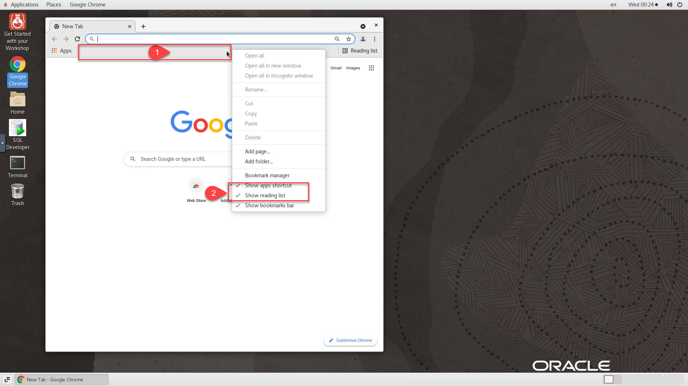

7. Right-click anywhere in the *Bookmarks bar area* and select *Add page*

    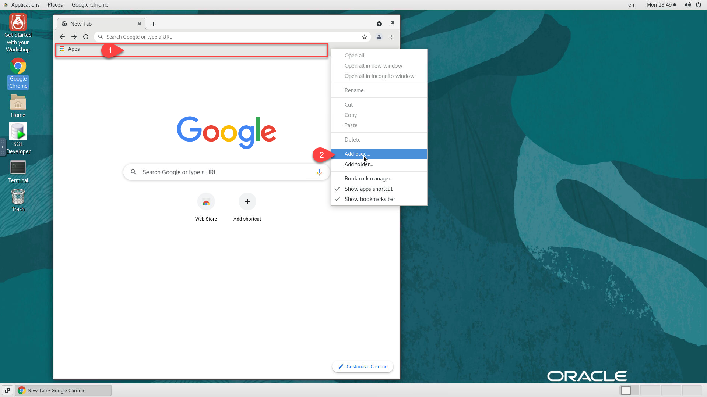

8. Provide the following two inputs, select *Bookmark bar* for destination, and click *Save* to create a bookmark to *LiveLabs*

    - Name

    ```
    <copy>Oracle LiveLabs</copy>
    ```

    - URL

    ```
    <copy>http://bit.ly/golivelabs</copy>
    ```

    

9. Click on the newly added bookmark to confirm successful page loading.

    

10. Click in the *Three dots* at the top right, then select *Settings*

    

11. Scroll down to *On Startup* section, select *open a specific page or set of pages*, and select *Use current pages* or simply add the *LiveLabs* address you set earlier as bookmark.

    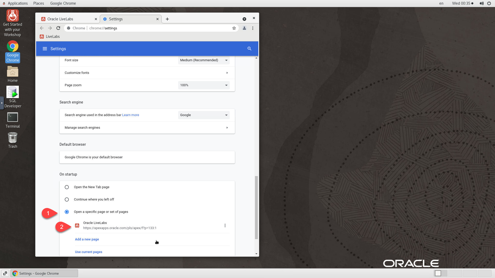

12. Create and run the script below to initialize LiveLabs browser windows.

    ```
    <copy>
    cat > /tmp/init_ll_windows.sh <<EOF
    #!/bin/bash
    # Initialize LL Windows

    #Drop existing sessions

    ll_windows_opened=\$(ps aux | grep 'disable-session-crashed-bubble'|grep -v grep |awk '{print \$2}'|wc -l)
    user_data_dir_base="/home/\$(whoami)/.livelabs"

    if [[ "\${ll_windows_opened}" -gt 0 ]]; then
     kill -2 \$(ps aux | grep 'disable-session-crashed-bubble'|grep -v grep |awk '{print \$2}')
    fi

    desktop_guide_url="https://oracle.github.io/learning-library/sample-livelabs-templates/sample-workshop/workshops/livelabs"
    desktop_app1_url="https://oracle.com"
    desktop_app2_url="https://bit.ly/golivelabs"
    google-chrome --password-store=basic --app=\${desktop_guide_url} --window-position=110,50 --window-size=887,912 --user-data-dir="\${user_data_dir_base}/chrome-window1" --disable-session-crashed-bubble >/dev/null 2>&1 &
    google-chrome --password-store=basic \${desktop_app1_url} --window-position=1010,50 --window-size=887,950 --user-data-dir="\${user_data_dir_base}/chrome-window2" --disable-session-crashed-bubble >/dev/null 2>&1 &
    google-chrome --password-store=basic \${desktop_app2_url} --window-position=1010,50 --window-size=887,950 --user-data-dir="\${user_data_dir_base}/chrome-window2" --disable-session-crashed-bubble >/dev/null 2>&1 &
    EOF
    chmod +x /tmp/init_ll_windows.sh
    /tmp/init_ll_windows.sh
    rm -f /tmp/init_ll_windows.sh
    
    </copy>
    ```
13. Close all browser windows opened.

You may now [proceed to the next lab](#next).

## Appendix 1: Enable VNC Password Reset, and Workshop Guide and WebApps URLs injection for each instance provisioned from the image
Actions provided in this Appendix are not meant to be performed on the image. They are rather intended as guidance for workshop developers writing terraform scripts to provision instances from an image configured as prescribed in this guide.

Update your Terraform/ORM stack with the tasks below to enable VNC password reset and add workshop URLs for each VM provisioned from the image.

1. Add provider *random* to *main.tf* or and any other *TF* file in your configuration if you not using *main.tf*

    ```
    <copy>
    terraform {
      required_version = "~> 0.13.0"
    }

    provider "oci" {
      tenancy_ocid = var.tenancy_ocid
      region       = var.region
    }

    provider "random" {}
    </copy>
    ```
2. Add the following variables to *variables.tf*.

    - `desktop_guide_url`
    - `desktop_app1_url`
    - `desktop_app2_url`

    The example below is from the *DB Security - Key Vault* workshop

    ```
    <copy>
    variable "desktop_guide_url" {
      default = "https://oracle.github.io/learning-library/security-library/database/advanced/workshops/main-key-vault"
    }

    variable "desktop_app1_url" {
      default = "https://kv"
    }

    variable "desktop_app2_url" {
      default = "https://dbsec-lab:7803/em"
    }
    </copy>
    ```
3. Add a *random* resource in your *instance.tf* or any *TF* of your choice to generate a 10 characters random password with a mix of Number/Uppercase/Lowercase characters.

    ```
    <copy>
    resource "random_string" "vncpwd" {
      length  = 10
      upper   = true
      lower   = true
      number  = true
      special = false
    }
    </copy>
    ```

4. Add *`random_string`* result and the URL variables to the metadata property for resource *`oci_core_instance`*. This will store the random value generated above as part of the instance metadata and used on first boot to reset VNC Password. The URLs will be used to preload the workshop guide and webapps on the remote desktop on VNC startup

    ```
    <copy>
    metadata = {
      vncpwd            = random_string.vncpwd.result
      desktop_guide_url = var.desktop_guide_url
      desktop_app1_url  = var.desktop_app1_url
      desktop_app2_url  = var.desktop_app2_url
    }
    </copy>
    ```

5. Add the entry *`remote_desktop`* to your *output.tf* to provide the single-click URL for remote desktop access with auto resizable window and auto-login. Replace [instance-name] from the snippet below with your real instance name as provided the resource *`oci_core_instance`* block of *instance.tf*

    ```
    <copy>
    output "remote_desktop" {
      value = format("http://%s%s%s%s",
        oci_core_instance.[instance-name].public_ip,
        ":6080/index.html?password=",
        random_string.vncpwd.result,
        "&resize=scale&autoconnect=true&quality=9&reconnect=true"
      )
    }
    </copy>
    ```
6. Add output entry *`remote_desktop`* to your *schema.yaml* file

    ```
    <copy>
    outputGroups:
      - title: Resources Access Information
        outputs:
          - ${remote_desktop}

    outputs:
      remote_desktop:
        type: string
        title: Remote Desktop
        visible: true

    </copy>
    ```

7. Add an *ingress* rule to your *network.tf* to enable remote access to port *6080* when the VCN is created

    ```
    <copy>
    ingress_security_rules {
      protocol = "6"
      source   = "0.0.0.0/0"
      tcp_options {
        min = 6080
        max = 6080
      }
    }

    </copy>
    ```

8. Test out your ORM Stack and verify the output for *`remote_desktop`* as shown below

    

9. From to the *Application Information Tab* as shown above, click on the single-click URL to test it out.

    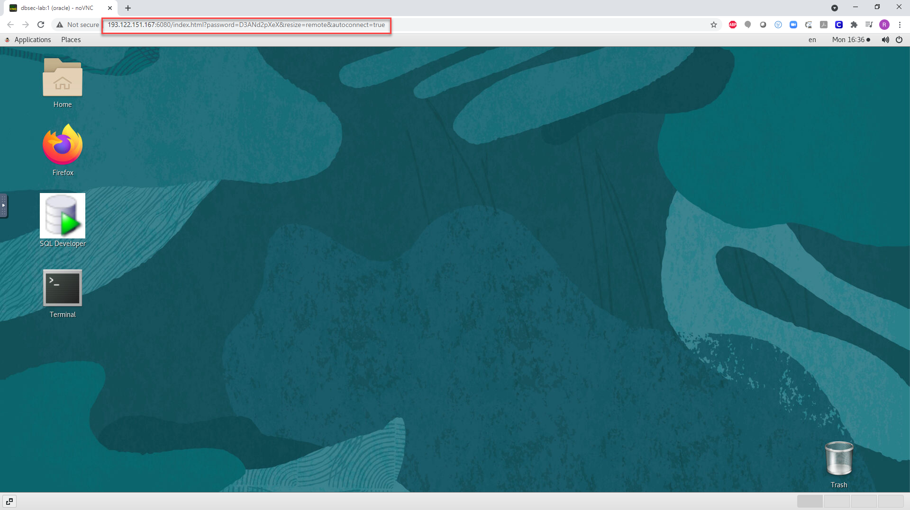

    **Note:** Your source image instance is now configured to generate a random VNC password for every instance created from it, provided that the provisioning requests include the needed metadata storing the random string.

## Appendix 2: Removing Guacamole from a previously configured LiveLabs image

Prior to noVNC some images were configured with *Apache Guacamole*. If this applies to your image, proceed as detailed below to remove it prior to deploying noVNC

1.  As root, create and run script */tmp/remove-guac.sh*.

    ```
    <copy>
    sudo su - || sudo sed -i -e 's|root:x:0:0:root:/root:.*$|root:x:0:0:root:/root:/bin/bash|g' /etc/passwd; sudo su -

    </copy>
    ```

    ```
    <copy>
    cat > /tmp/remove-guac.sh <<EOF
    #!/bin/sh
    # Copyright (c) 2019 Oracle and/or its affiliates. All rights reserved.

    cd /etc/systemd/system

    for i in `ls vncserver_*.service`
      do
    systemctl stop $i
    done

    cd /tmp

    systemctl disable guacd tomcat
    systemctl stop guacd tomcat

    yum -y remove \
    	guacd \
        libguac \
        libguac-client-ssh \
        libguac-client-vnc \
    	tomcat \
        tomcat-admin-webapps \
        tomcat-webapps \
        nginx
    EOF
    chmod +x /tmp/remove-guac.sh
    /tmp/remove-guac.sh

    rm -rf /etc/guac*
    rm -rf /etc/nginx*
    rm -f /tmp/remove-guac.sh
    </copy>
    ```

## Acknowledgements
* **Author** - Rene Fontcha, LiveLabs Platform Lead, NA Technology, September 2020
* **Contributors** - Robert Pastijn
* **Last Updated By/Date** - Rene Fontcha, LiveLabs Platform Lead, NA Technology, August 2021
