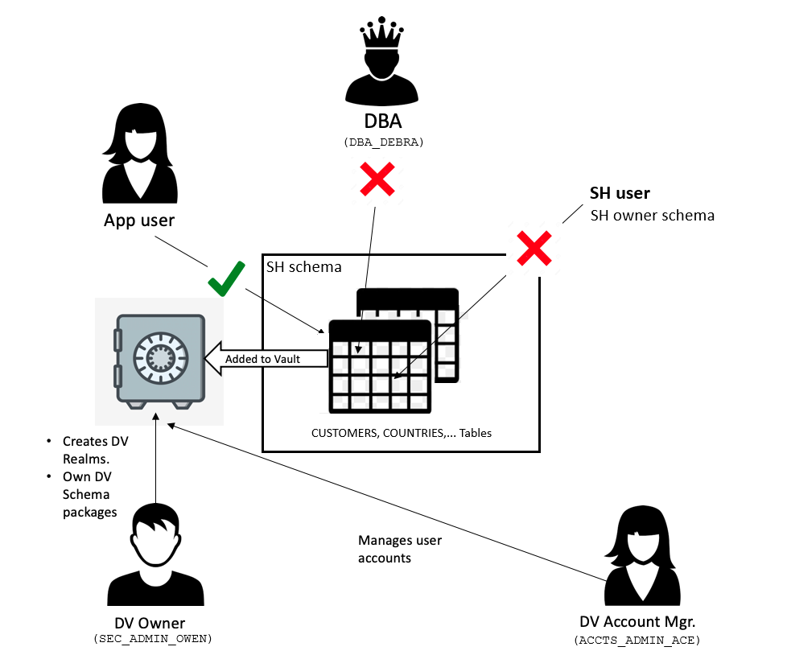
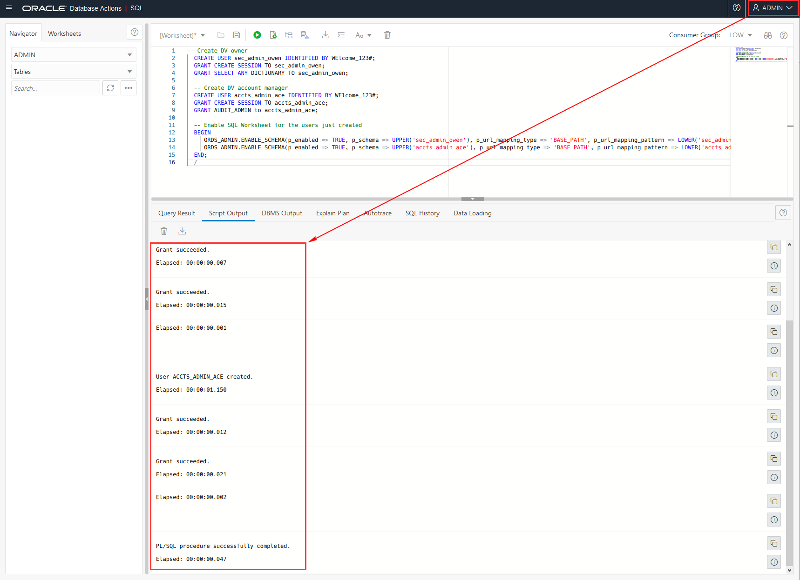
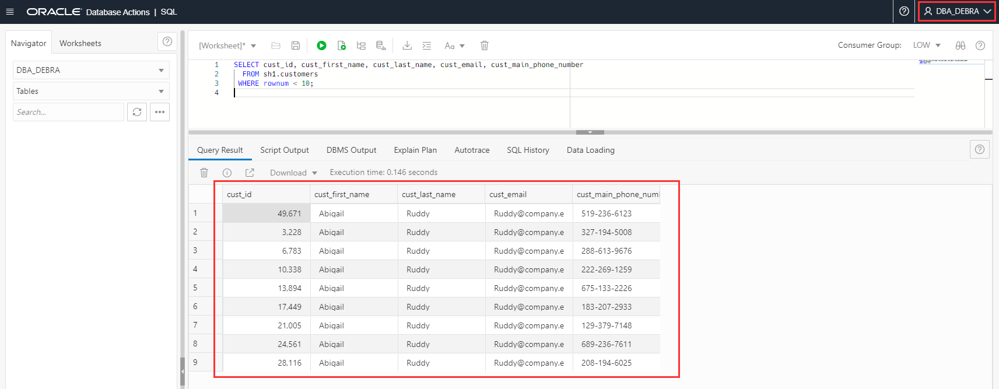
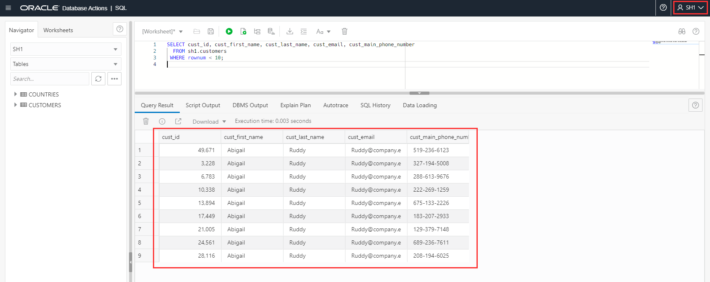
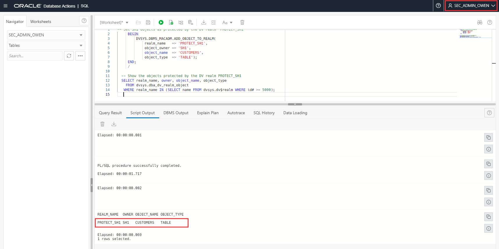
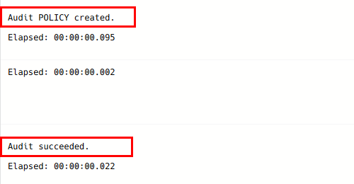
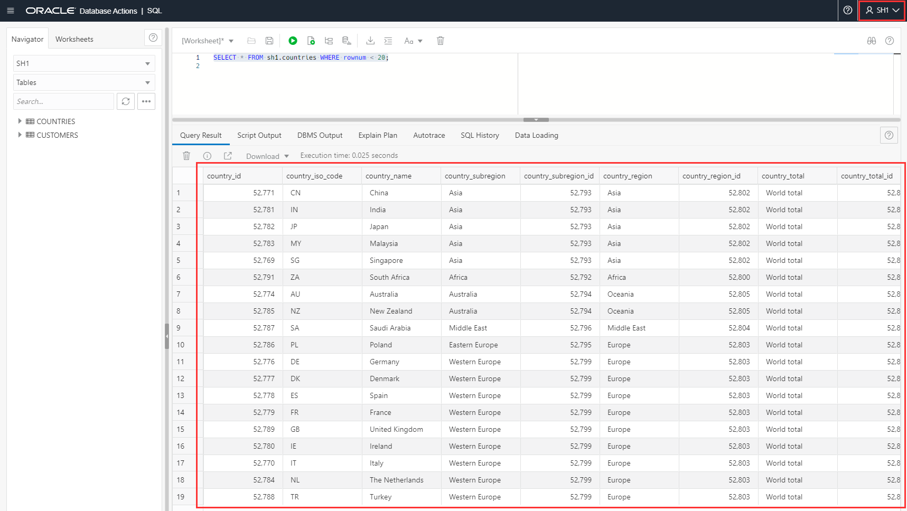

# Oracle Database Vault (DV)

## Introduction
This workshop introduces the various features and functionality of Oracle Database Vault (DV). It gives the user an opportunity to learn how to configure those features in an Autonomous Database to prevent unauthorized privileged users from accessing sensitive data.

Managed database services run the risk of 'Admin snooping', allowing privileged users - and especially compromised privileged user accounts - access to sensitive data. Oracle Autonomous Database with DB Vault provides powerful security controls, restricting access to application data by privileged database users, reducing the risk of insider and outsider threats and addressing common compliance requirements.

You can deploy controls to block privileged account access to application data and control sensitive operations inside the database. Trusted paths can be used to add additional security controls to authorized data access and database changes. Through the runtime analysis of privileges and roles, you can increase the security of existing applications by implementing least privileges and reducing the attack profile of your database accounts. IP addresses, usernames, client program names and other factors can be used as part of Oracle Database Vault security controls to increase security. **Oracle Database Vault secures existing database environments transparently, eliminating costly and time consuming application changes.**

*Estimated Lab Time:* 35 minutes

*Version tested in this lab:* Oracle Autonomous DB 19c

### Video Preview
Watch a preview of "*Understanding Oracle Database Vault (March 2019)*" [](youtube:oVidZw7yWIQ)

### Objectives
- Enable Database Vault in an Autonomous Database
- Protect sensitive data using a Database Vault realm
- Create an audit policy to capture realm violations
- Test Database Vault Controls with Simulation mode

### Prerequisites
This lab assumes you have:
- A Free Tier, Paid or LiveLabs Oracle Cloud account
- You have completed "Prepare Your Environment" step previously

### Lab Timing (estimated)
| Step No. | Feature | Approx. Time |
|--|------------------------------------------------------------|-------------|
| 1 | Enable Database Vault | <5 minutes |
| 2 | Create a Simple Realm | 10 minutes |
| 3 | Audit Policy to Capture Realm Violations | 5 minutes |
| 4 | Simulation Mode | 10 minutes |
| 5 | Disabling Database Vault | <5 minutes |

## Task 1: Enable Database Vault

Oracle Database vault comes pre-installed with your Autonomous database. In this lab we will enable Database Vault (DV), add required user accounts and create a DV realm to secure a set of user tables from privileged user access.

The HR schema contains multiple tables such as CUSTOMERS table which contains sensitive information and needs to be protected from privileged users such as the schema owner (user HR) and DBA (user ADMIN). But the data in these tables should be available to the application user (user APPUSER).

   

We start with creating the two DV user accounts - DV Owner and DV Account Manager. The dv_owner account is mandatory as an owner of DV objects. DV account manager is an optional but recommended role. Once DV is enabled, it immediately begins enforcing separation of duties - the user 'ADMIN' loses its ability to create/drop DB user accounts and that privilege is then with the DV Account Manager role. While DV Owner can also become DV account manager, it is recommended to maintain separation of duties via two different accounts.

1. Open a SQL Worksheet on your **ADB Security** as *admin* user
    
    - In OCI, select your ADB Security database created at the "Prepare Your Environment" step

       

    - In your ADB Security database's details page, click the **Tools** tab

       

    - The Tools page provides you access to database administration and developer tools for Autonomous Database: Database Actions, Oracle Application Express, Oracle ML User Administration, and SODA Drivers. In the Database Actions box, click [**Open Database Actions**]

       

    - A sign-in page opens for Database Actions. For this lab, simply use your database instance's default administrator account (user *`admin`*) and click [**Next**]

       

    - Enter the admin Password you specified when creating the database (here *`WElcome_123#`*)
    
      ````
      <copy>WElcome_123#</copy>
      ````

    - Click [**Sign in**]

       

    - The Database Actions page opens. In the Development box, click [**SQL**]

       

2. Create the Database Vault owner and account manager users

      ````
      <copy>
      -- Create dbv_owner
      CREATE USER dbv_owner IDENTIFIED BY WElcome_123#;
      GRANT CREATE SESSION TO dbv_owner;
        
      -- Create dbv_acctmgr
      CREATE USER dbv_acctmgr IDENTIFIED BY WElcome_123#;
      GRANT CREATE SESSION TO dbv_acctmgr;
      </copy>
      ````

    **Note:**
       - Copy/Paste the following SQL queries into SQL Worksheet
       - Press [**F5**] or click on the "Run Scripts" icon
       - Check that there are no errors

       

3. Configure the Database Vault user accounts

      ````
      <copy>EXEC DBMS_CLOUD_MACADM.CONFIGURE_DATABASE_VAULT('dbv_owner', 'dbv_acctmgr');</copy>
      ````

   


4. Verify that Database Vault is configured but not yet enabled

      ````
      <copy>SELECT * FROM DBA_DV_STATUS;</copy>
      ````

   

    **Note:** `DV_CONFIGURE_STATUS` must be **TRUE**

5. Now, enable Database Vault

      ````
      <copy>EXEC DBMS_CLOUD_MACADM.ENABLE_DATABASE_VAULT;</copy>
      ````

       
    
6. You must “restart” the database to complete the Database Vault enabling process

    - Restart the database from the console by selecting "**Restart**" in "More Actions" drop-list as shown

       

    - Once restart completes, log in to SQL Worksheet as *admin* user and verify DV is enabled

      ````
      <copy>SELECT * FROM DBA_DV_STATUS;</copy>
      ````

       

    **Note:** `DV_ENABLE_STATUS` should be **TRUE**

7. Now, Database Vault is enabled!

## Task 2: Create a Simple Realm

Next we create a realm to secure the HR.CUSTOMERS table from acces by ADMIN and HR (table owner) and grant access to APPUSER only.

1. In order to demonstrate the effects of this realm, it's important to execute the same SQL query from these 3 users before and after creating the realm:
    - To proceed, **open SQL Worksheet in 3 web-browser pages** connected with a different user (ADMIN, HR and APPUSER)
   
       **Note: Attention, only one SQL Worksheet session can be open in a standard browser windows at the same time, hence open each of your sessions in a new browser windows using the "Incognito mode"!**

    - Copy/Paste and execute the following query

      ````
      <copy>
         SELECT cust_id, cust_first_name, cust_last_name, cust_email, cust_main_phone_number
           FROM hr.customers
          WHERE rownum < 10;
      </copy>
      ````
 
       - as user **ADMIN**

          

       - as user **HR**

          

       - as user **APPUSER**

          

          **Note:** These 3 users can see the HR.CUSTOMERS table!

2. Now, let's create a realm to secure HR tables by executing this query as **ADMIN** user

      ````
      <copy>
      -- Create the "PROTECT_HR" DV realm
         BEGIN
            DVSYS.DBMS_MACADM.CREATE_REALM(
                realm_name => 'PROTECT_HR'
                ,description => 'A mandatory realm to protect HR tables'
                ,enabled => DBMS_MACUTL.G_YES
                ,audit_options => DBMS_MACUTL.G_REALM_AUDIT_FAIL
                ,realm_type => 1); 
         END;
         /

      -- Show the current DV realm
      SELECT name, description, enabled FROM dba_dv_realm WHERE id# >= 5000 ORDER BY 1;
      </copy>
      ````

   
 
       **Note:** Now the Realm `PROTECT_HR` is created and enabled!

3. Add objects to the Realm to protect (here, the CUSTOMERS table)

      ````
      <copy>
      -- Set HR objects as protected by the DV realm "PROTECT_HR"
         BEGIN
             DVSYS.DBMS_MACADM.ADD_OBJECT_TO_REALM(
                 realm_name   => 'PROTECT_HR',
                 object_owner => 'HR',
                 object_name  => 'CUSTOMERS',
                 object_type  => 'TABLE');
         END;
         /

      -- Show the objects protected by the DV realm PROTECT_HR
      SELECT realm_name, owner, object_name, object_type
        FROM dvsys.dba_dv_realm_object
       WHERE realm_name IN (SELECT name FROM dvsys.dv$realm WHERE id# >= 5000);
      </copy>
      ````

   

       **Note:** Now the table `CUSTOMERS` is protected and no one can access on it!

4. Check the effect of this realm
   
      - Execute again the following query in SQL Worsheet of each the 3 users (ADMIN, HR and APPUSER)

      ````
      <copy>
         SELECT cust_id, cust_first_name, cust_last_name, cust_email, cust_main_phone_number
           FROM hr.customers
          WHERE rownum < 10;
      </copy>
      ````
 
       - as user **ADMIN**

          

       - as user **HR**

          

       - as user **APPUSER**

          

       **Note:** No one can access on it with a "insufficient privileges" error, even the DBA user (ADMIN) and the owner (HR)!

5. Now, make sure you have an authorized application user (APPUSER) in the realm by executing this query as "**ADMIN**" user

      ````
      <copy>
      -- Grant access to APPUSER only for the DV realm "PROTECT_HR"
         BEGIN
             DVSYS.DBMS_MACADM.ADD_AUTH_TO_REALM(
                 realm_name   => 'PROTECT_HR',
                 grantee      => 'APPUSER');
         END;
         /
      </copy>
      ````

   

6. Re-execute the SQL query to show that only `APPUSER` now can read the data

      ````
      <copy>
         SELECT cust_id, cust_first_name, cust_last_name, cust_email, cust_main_phone_number
           FROM hr.customers
          WHERE rownum < 10;
      </copy>
      ````
 
       - as user **ADMIN**

          

       - as user **HR**

          

       - as user **APPUSER**

          

      **Note:** APPUSER must be the only user who has access to the table from now!

## Task 3: Create an Audit Policy to Capture Realm Violations

You may also want to capture an audit trail of unauthorized access attempts to your realm objects. Since the Autonomous Database includes Unified Auditing, we will create a policy to audit database vault activities

1. Check that no audit trail log it exists

      ````
      <copy>
      -- Display the audit trail log
      SELECT os_username, dbusername, event_timestamp, action_name, sql_text 
        FROM unified_audit_trail
       WHERE DV_ACTION_NAME='Realm Violation Audit' order by 3;
      </copy>
      ````

   

    **Note:** It should be empty

2. Create an audit policy on the DV realm `PROTECT_HR` created earlier in Step 2

      ````
      <copy>
      -- Create the Audit Policy
         CREATE AUDIT POLICY dv_realm_hr
            ACTIONS SELECT, UPDATE, DELETE
            ACTIONS COMPONENT=DV Realm Violation ON "PROTECT_HR";

      -- Enable the Audit Policy
         AUDIT POLICY dv_realm_hr;
      </copy>
      ````

   


3. Like in Step 2, to demonstrate the effects of the audit, **re-execute the same SQL query in 3 different SQL Worksheet opened in 3 web-browser pages** connected with a different user (ADMIN, HR and APPUSER)
   
    **Note: Attention, only one SQL Worksheet session can be open in a standard browser window at the same time, hence open each of your sessions in a separate browser window the "Incognito mode"!**

    - Copy/Paste and execute the following query

      ````
      <copy>
         SELECT cust_id, cust_first_name, cust_last_name, cust_email, cust_main_phone_number
           FROM hr.customers
          WHERE rownum < 10;
      </copy>
      ````
 
       - as user **ADMIN**

       

       - as user **HR**

       

       - as user **APPUSER**

       

    **Note:** ADMIN and HR users cannot access the HR.CUSTOMERS table and should generate an audit record of their failed attempt to violate policy!

4. Review realm violation audit trail in SQL Worksheet as "**ADMIN**" user

      ````
      <copy>
      -- Display the audit trail log
      SELECT os_username, dbusername, event_timestamp, action_name, sql_text 
        FROM unified_audit_trail
       WHERE DV_ACTION_NAME='Realm Violation Audit' order by 3;
      </copy>
      ````

   

    **Note:** Now, you should see the ADMIN and HR failed attempts

5. When you have completed this lab, you can reset the environment

      ````
      <copy>
      -- Show the current DV realm
      SELECT name, description, enabled FROM dba_dv_realm WHERE id# >= 5000 order by 1;

      -- Purge the DB Vault audit trail logs
      DELETE FROM DVSYS.AUDIT_TRAIL$;

      -- Purge the audit trail logs
      BEGIN
          DBMS_AUDIT_MGMT.CLEAN_AUDIT_TRAIL(
             audit_trail_type         =>  DBMS_AUDIT_MGMT.AUDIT_TRAIL_UNIFIED,
             use_last_arch_timestamp  =>  FALSE);
      END;
      /

      -- Display the audit trail log
      SELECT os_username, dbusername, event_timestamp, action_name, sql_text 
        FROM unified_audit_trail
       WHERE DV_ACTION_NAME='Realm Violation Audit' order by 3;
       
      -- Disable the audit policy
      NOAUDIT POLICY dv_realm_hr;

      -- Drop the audit policy
      DROP AUDIT POLICY dv_realm_hr;
      
      -- Drop the "PROTECT_HR" DV realm
      BEGIN
          DVSYS.DBMS_MACADM.DELETE_REALM_CASCADE(realm_name => 'PROTECT_HR');
      END;
      /

      -- Show the current DV realm
      SELECT name, description, enabled FROM dba_dv_realm WHERE id# >= 5000 order by 1;

      </copy>
      ````

   

6. Now, you have no longer audit policy and DV realm!

## Task 4: Simulation Mode

1. First, query the simulation log to show that it has no current values

      ````
      <copy>
         SELECT violation_type, username, machine, object_owner, object_name, command, dv$_module
         FROM dba_dv_simulation_log;
      </copy>
      ````

   

2. Next, create a Command Rule that will simulate blocking all SELECT from the HR.COUNTRIES table

      ````
      <copy>
      BEGIN
          DBMS_MACADM.CREATE_COMMAND_RULE(
             command 	 => 'SELECT',
             rule_set_name   => 'Disabled',
             object_name       => 'COUNTRIES',
             object_owner       => 'HR',
             enabled         => DBMS_MACUTL.G_SIMULATION);
      END;
      /
      </copy>
      ````

   

3. Like in Step 2, to demonstrate the effects of the simulation, **re-execute the same SQL query in 3 different SQL Worksheet opened in 3 web-browser pages** connected with a different user (ADMIN, HR and APPUSER)
   
    **Note: Attention, only one SQL Worksheet session can be open in a standard browser window at the same time, hence open each of your sessions in a separate browser window using the "Incognito mode"!**

    - Copy/Paste and execute several time the following SELECT query to HR.COUNTRIES table

      ````
      <copy>
         SELECT * FROM hr.countries WHERE rownum < 20;
      </copy>
      ````
 
       - as user **ADMIN**

       

       - as user **HR**

       

       - as user **APPUSER**

       

    **Note:** All the users can access the HR.CUSTOMERS table!
      
4. Now, we query the simulation log again as "**ADMIN**" user to see what new entries we have. Remember we created a command rule to simulate blocking user select!

      ````
      <copy>
         SELECT violation_type, username, machine, object_owner, object_name, command, dv$_module
         FROM dba_dv_simulation_log;
      </copy>
      ````

   

    **Note**:
      - Although each user can see the results, the log shows all users who selected and would have been blocked by the rule
      - It also shows where they connected from and what client they used to connect

5. Before moving to the next lab, we will clean out the simulation logs and remove the Command Rule

      ````
      <copy>
      -- Purge simulation logs
      DELETE FROM DVSYS.SIMULATION_LOG$;

      -- Current simulation logs after purging
      SELECT count(*) FROM dba_dv_simulation_log;
      </copy>
      ````

    **Note:**
   

      ````
      <copy>
      -- Delete the Command Rule
      BEGIN
          DBMS_MACADM.DELETE_COMMAND_RULE(
             command        => 'SELECT', 
             object_owner   => 'HR', 
             object_name    => 'COUNTRIES',
             scope          => DBMS_MACUTL.G_SCOPE_LOCAL);
      END;
      /
      </copy>
      ````

   


## Task 5: Disabling Database Vault

1. Log as "**ADMIN**" user and disable DB Vault on the Autonomous Database

      ````
      <copy>EXEC DBMS_CLOUD_MACADM.DISABLE_DATABASE_VAULT;</copy>
      ````

   
    
2. You must “restart” the database to complete the Database Vault enabling process

    - Restart the database from the console by selecting "**Restart**" in "More Actions" drop-list as shown

       

    - Once restart completes, log in to SQL Worksheet as *admin* user and verify DV is enabled

      ````
      <copy>SELECT * FROM DBA_DV_STATUS;</copy>
      ````

       

    **Note:** `DV_ENABLE_STATUS` must be **FALSE**

3. Now, because DB Vaut is disabled, you can drop the Database Vault owner and account manager users

      ````
      <copy>
      DROP USER dbv_owner;
      DROP USER dbv_acctmgr;
      </copy>
      ````

   

4. Now, Database Vault is correctly disabled and you may now [proceed to the next lab](#next).

## **Appendix**: About the Product
### **Overview**
Oracle Database Vault provides controls to prevent unauthorized privileged users from accessing sensitive data. It also prevents unauthorized database changes.

The Oracle Database Vault security controls protect application data from unauthorized access, and help you comply with privacy and regulatory requirements.

   

You can deploy controls to block privileged account access to application data and control sensitive operations inside the database with Database Vault.

Through the analysis of privileges and roles, you can increase the security of existing applications by using least privilege best practices.

Oracle Database Vault secures existing database environments transparently, eliminating costly and time consuming application changes.

Oracle Database Vault enables you to create a set of components to manage security for your database instance.

These components are as follows:

- **Realms**

A realm is a protection zone inside the database where database schemas, objects, and roles can be secured. For example, you can secure a set of schemas, objects, and roles that are related to accounting, sales, or human resources.
After you have secured these into a realm, you can use the realm to control the use of system and object privileges to specific accounts or roles. This enables you to provide fine-grained access controls for anyone who wants to use these schemas, objects, and roles.

- **Command rules**

A command rule is a special security policy that you can create to control how users can execute almost any SQL statement, including SELECT, ALTER SYSTEM, database definition language (DDL), and data manipulation language (DML) statements.
Command rules must work with rule sets to determine whether the statement is allowed.

- **Factors**

A factor is a named variable or attribute, such as a user location, database IP address, or session user, which Oracle Database Vault can recognize and use to make access control decisions.
You can use factors in rules to control activities such as authorizing database accounts to connect to the database or the execution of a specific database command to restrict the visibility and manageability of data.
Each factor can have one or more identities. An identity is the actual value of a factor.
A factor can have several identities depending on the factor retrieval method or its identity mapping logic.

- **Rule sets**

A rule set is a collection of one or more rules that you can associate with a realm authorization, command rule, factor assignment, or secure application role.
The rule set evaluates to true or false based on the evaluation of each rule it contains and the evaluation type (All True or Any True).
The rule within a rule set is a PL/SQL expression that evaluates to true or false. You can have the same rule in multiple rule sets.

- **Secure application roles**

A secure application role is a special Oracle Database role that can be enabled based on the evaluation of an Oracle Database Vault rule set.

Oracle Database Vault provides a set of PL/SQL interfaces and packages that let you configure these components.
In general, the first step you take is to create a realm composed of the database schemas or database objects that you want to secure.
You can further secure your database by creating rules, rule sets, command rules, factors, identities, and secure application roles.
In addition, you can run reports on the activities these components monitor and protect.

### **Benefits of using Database Vault**
- Addresses compliance regulations to minimize access to data
- Protects data against misused or compromised privileged user accounts
- Design and enforce flexible security policies for your database
- Addresses Database consolidation and cloud environments concerns to reduce cost and reduce exposure sensitive application data by those without a true need-to-know
- Protect access to your sensitive data by creating a trusted path (see more by performing the [Full Database Vault lab](https://apexapps.oracle.com/pls/apex/dbpm/r/livelabs/view-workshop?wid=682&clear=180&session=4531599220675))

## Want to Learn More?
Technical Documentation:
  - [Oracle Database Vault 19c](https://docs.oracle.com/en/database/oracle/oracle-database/19/dvadm/introduction-to-oracle-database-vault.html#GUID-0C8AF1B2-6CE9-4408-BFB3-7B2C7F9E7284)

Video:
  - *Oracle Database Vault - Use Cases (Part1) (October 2019)* [](youtube:aW9YQT5IRmA)
  - *Oracle Database Vault - Use Cases (Part2) (November 2019)* [](youtube:hh-cX-ubCkY)

## Acknowledgements
- **Author** - Hakim Loumi, Database Security PM
- **Contributors** - Alan Williams, Rene Fontcha
- **Last Updated By/Date** - Hakim Loumi, Database Security PM - September 2021
