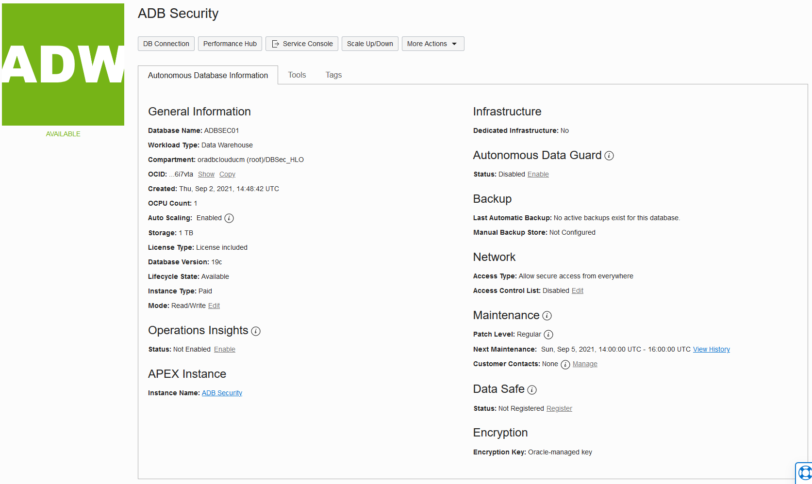
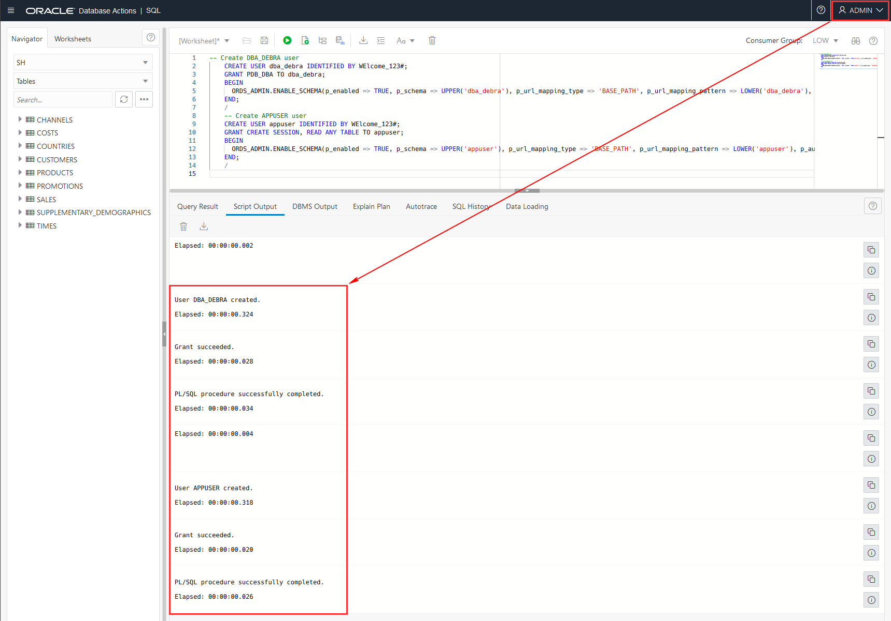

# Prepare Your Environment

## Introduction

This lab walks you through the steps to get started using the Oracle Autonomous Database and initialize it to use DB Vault.

Estimated time: 10 minutes

### Objectives

-   Learn how to provision a new Autonomous Database
-   Create owner and load dataset to perform the lab

## Task 1: Provisioning an Autonomous DB

  **Note:** If you plan to use an existing Autonomous DB in your own tenancy, or you are using an Oracle-provided environment, you can skip this step.

1. Login to the Oracle Cloud Infrastructure

2. Once you are logged in, you are taken to the cloud services dashboard where you can see all the services available to you. Click the navigation menu in the upper left to show top level navigation choices.

      **Note:** You can also directly access your Autonomous DB service in the **Quick Actions** section of the dashboard

    

3. The following steps apply similarly to either Autonomous Data Warehouse (ADW) or Autonomous Transaction Processing (ATP). So please **click on the provisioning of Autonomous DB of your choice** (here we choose an ADW but again you can also choose ATP if you prefer).

    

4. From the **Compartment** drop-down list, select your compartment

  **Note:**
     - This console shows that no databases yet exist
     - If there were a long list of databases, you could filter the list by the **State** of the databases (Available, Stopped, Terminated, and so on)
     - You can also sort by **Workload Type** (here, select **All**)

         


5. Click [**Create Autonomous Database**]

    

6. On the **Create Autonomous Database** page, provide basic information for your database:
    - **Compartment** - If needed, select your compartment
    - **Display name** - Enter a memorable name for the database for display purposes, for this lab, use *`ADB Security`*
    - **Database Name** - Enter *`ADBSEC01`*, it's important to use letters and numbers only, starting with a letter (the maximum length is 14 characters and Underscores are not supported)
    - **Workload Type** - Select the type of your Autonomous DB to be conform to your choice at step 3 above (here we select "Data Warehouse")
    - **Deployment Type** - Leave *`Shared Infrastructure`* selected

         

7. Configure the database:

    - **Always Free** - Leave this option deselected (the slider should be to the left)
    - **Database version** - Leave *`19c`* selected
    - **OCPU Count** - Select *`1`*
    - **Storage** - Leave *`1`* selected
    - **Auto scaling** - Leave this checkbox selected

      **Note:** You cannot scale up/down an Always Free Autonomous DB

         

8. Create administrator credentials:

    - **Password** and **Confirm Password** - Specify a password for the ADMIN database user and jot it down. The password must be between 12 and 30 characters long and must include at least one uppercase letter, one lowercase letter, and one numeric character. It cannot contain your username or the double quote (") character. For example : *`WElcome_123#`*

      ````
      <copy>WElcome_123#</copy>
      ````

      

9. Choose the network access and the license type:

    - **Network Access** - Leave *`Secure access from everywhere`* selected
    - **License Type** - Select *`License Included`*

         

10. Click [**Create Autonomous Database**]

11.  Your instance will begin provisioning. In a few minutes, the state will turn from Provisioning to Available. At this point, your Autonomous DB is ready to use! Have a look at your instance's details here including its name, database version, OCPU count, and storage size.

    


## Task 2: Set up Application Schema and Users

Although you can connect to your Autonomous DB using local PC desktop tools like Oracle SQL Developer, you can conveniently access the browser-based SQL Worksheet directly from your ADW or ATP

1. In your ADB Security database's details page, click the **Tools** tab

    

2. The Tools page provides you access to database administration and developer tools for Autonomous DB: Database Actions, Oracle Application Express, Oracle ML User Administration, and SODA Drivers. In the Database Actions box, click [**Open Database Actions**]

    

3. A sign-in page opens for Database Actions. For this lab, simply use your database instance's default administrator account, Username "*`admin`*", and click [**Next**]

    

4. Enter the admin Password you specified when creating the database, here *`WElcome_123#`*

      ````
      <copy>WElcome_123#</copy>
      ````

    

 5. Click [**Sign in**]
 
 6. The Database Actions page opens. In the Development box, click [**SQL**]

    

  **Note:** The first time you open SQL Worksheet, a series of pop-up informational boxes introduce you to the main features. Click [**Next**] to take a tour through the informational boxes

7. Run the init scripts into SQL Worksheet

    - Copy/Paste the following SQL queries

      ````
      <copy>
        -- Create HR schema
        CREATE USER hr IDENTIFIED BY WElcome_123#;
        GRANT CREATE SESSION, CREATE TABLE TO hr;
        GRANT UNLIMITED TABLESPACE TO hr;
        BEGIN
          ORDS_ADMIN.ENABLE_SCHEMA(p_enabled => TRUE, p_schema => UPPER('hr'), p_url_mapping_type => 'BASE_PATH', p_url_mapping_pattern => LOWER('hr'), p_auto_rest_auth => TRUE);
        END;
        /
        CREATE TABLE hr.customers AS SELECT * FROM sh.customers;
        CREATE TABLE hr.countries AS SELECT * FROM sh.countries;

      </copy>
      ````
      ````
      <copy>
        -- Create APPUSER user
        CREATE USER appuser IDENTIFIED BY WElcome_123#;
        GRANT CREATE SESSION, READ ANY TABLE TO appuser;
        BEGIN
          ORDS_ADMIN.ENABLE_SCHEMA(p_enabled => TRUE, p_schema => UPPER('appuser'), p_url_mapping_type => 'BASE_PATH', p_url_mapping_pattern => LOWER('appuser'), p_auto_rest_auth => TRUE);
        END;
        /

      </copy>
      ````

    - Press [**F5**] or click on the "Run Scripts" icon

         

         

    - Check that there are no errors

8. **Your environment is ready to use!** and you may now [proceed to the next lab](#next)

## Want to Learn More?

Click [here](https://docs.oracle.com/en/cloud/paas/autonomous-data-warehouse-cloud/user/autonomous-workflow.html#GUID-5780368D-6D40-475C-8DEB-DBA14BA675C3) for documentation on the typical workflow for using Autonomous Data Warehouse.

## Acknowledgements
- **Author** - Hakim Loumi, Database Security PM
- **Contributors** - Rene Fontcha
- **Last Updated By/Date** - Hakim Loumi, Database Security PM - September 2021
