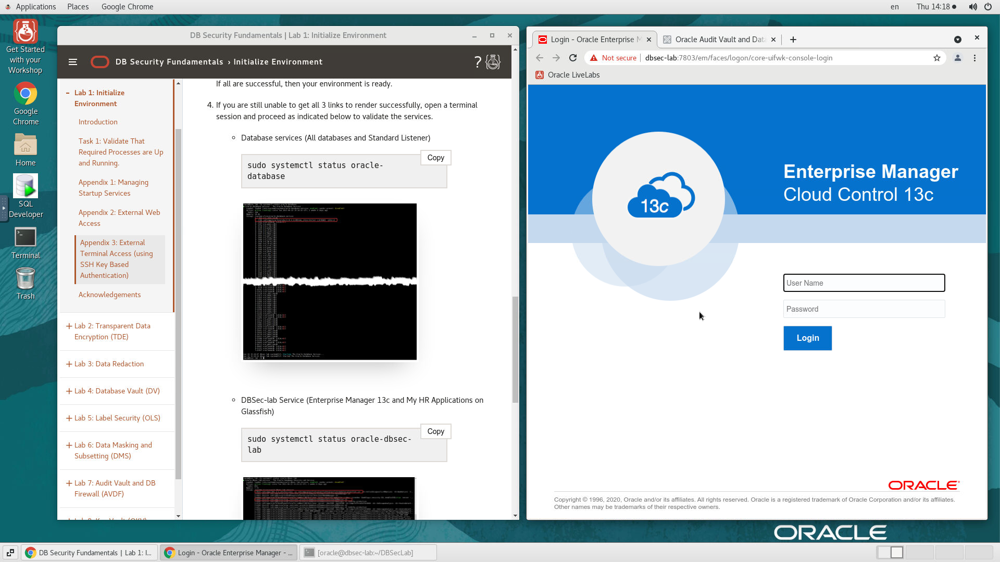
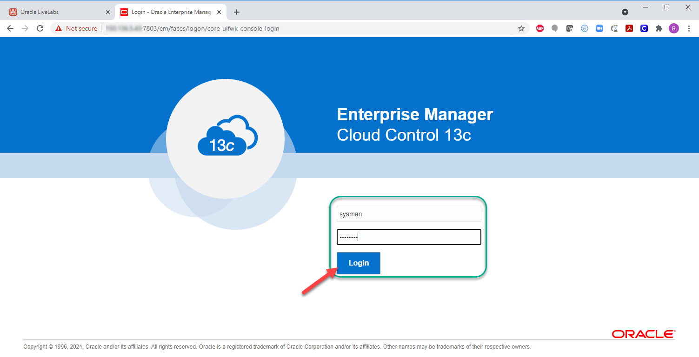

# Initialize Environment

## Introduction

In this lab we will review and startup all components required to successfully run this workshop.

*Estimated Lab Time:* 10 Minutes.

### Objectives
- Initialize the workshop environment.

### Prerequisites
This lab assumes you have:
- A Free Tier, Paid or LiveLabs Oracle Cloud account
- You have completed:
    - Lab: Prepare Setup (*Free-tier* and *Paid Tenants* only)
    - Lab: Environment Setup

## Task 1: Validate That Required Processes are Up and Running.

*Note:* All screenshots for SSH terminal type tasks featured throughout this workshop were captured using the *MobaXterm* SSH Client as described in this step. As a result when executing such tasks from within the graphical remote desktop session, skip steps requiring you to login as user *oracle* using *sudo su - oracle*, the reason being that the remote desktop session is under user *oracle*.

1. Now with access to your remote desktop session, proceed as indicated below to validate your environment before you start executing the subsequent labs. The following Processes should be up and running:

    - Database Listener
    - Database Servers (emcdb and cdb1)
    - Enterprise Manager - Management server (OMS)
    - Enterprise Manager - Management Agent (emagent)
    - My HR Applications on Glassfish

2. On the web browser window on the right is a tab preloaded with *Enterprise Manager*, login with the credentials below to validate that it's operational. If the login page is not displayed on first login to the remote desktop, refresh to reload. It takes ~15 minutes for all processes to fully start.

    ```
    Username: <copy>sysman</copy>
    ```

    ```
    Password: <copy>Oracle123</copy>
    ```

    

3. Open new browser tabs and confirm successful rendering of *My HR Applications* listed below.

    - PDB1

    ```
    Prod: <copy>http://dbsec-lab:8080/hr_prod_pdb1</copy>
    ```

    ```
    Dev: <copy>http://dbsec-lab:8080/hr_dev_pdb1</copy>
    ```

    - PDB2

    ```
    Prod: <copy>http://dbsec-lab:8080/hr_prod_pdb2</copy>
    ```

    ```
    Dev: <copy>http://dbsec-lab:8080/hr_dev_pdb2</copy>
    ```

    If all are successful, then your environment is ready.  

4. If you are still unable to get all *Enterprise Manager* and all links above to render successfully, open a terminal session and proceed as indicated below to validate the services.

    - Database services (All databases and Standard Listener)

        ```
        <copy>
        sudo systemctl status oracle-database
        </copy>
        ```

        
        

    - DBSec-lab Service (Enterprise Manager 13c and My HR Applications on Glassfish)

        ```
        <copy>
        sudo systemctl status oracle-dbsec-lab
        </copy>
        ```

        

5. If you see questionable output(s), failure or down component(s), restart the corresponding service(s) accordingly

    - Database and Listener

        ```
        <copy>
        sudo systemctl restart oracle-database
        </copy>
        ```

    - DBSec-lab Service

        ```
        <copy>
        sudo systemctl restart oracle-dbsec-lab
        </copy>
        ```

You may now [proceed to the next lab](#next).

## Appendix 1: Managing Startup Services

1. Database services (All databases and Standard Listener)

    - Start

    ```
    <copy>sudo systemctl start oracle-database</copy>
    ```
    - Stop

    ```
    <copy>sudo systemctl stop oracle-database</copy>
    ```

    - Status

    ```
    <copy>sudo systemctl status oracle-database</copy>
    ```

    - Restart

    ```
    <copy>sudo systemctl restart oracle-database</copy>
    ```

2. DBSec-lab Service (Enterprise Manager 13c and My HR Applications on Glassfish)

    - Start

    ```
    <copy>sudo systemctl start oracle-dbsec-lab</copy>
    ```

    - Stop

    ```
    <copy>sudo systemctl stop oracle-dbsec-lab</copy>
    ```

    - Status

    ```
    <copy>sudo systemctl status oracle-dbsec-lab</copy>
    ```

    - Restart

    ```
    <copy>sudo systemctl restart oracle-dbsec-lab</copy>
    ```

## Appendix 2: External Web Access

If for any reason you want to login from a location that is external to your remote desktop session such as your workstation/laptop, then refer to the details below.

1.  Enterprise Manager 13c Console

    ```
    Username: <copy>sysman</copy>
    ```

    ```
    Password: <copy>Oracle123</copy>
    ```

    ```
    URL: <copy>http://<Your Instance public_ip>:7803/em</copy>
    ```

    - *Note:* You may see an error on the browser while accessing the Web Console - “*Your connection is not private*” as shown below. Ignore and add the exception to proceed.

    
    

2. My HR Applications on Glassfish

    - PDB1
      - Prod        : `http://<YOUR_DBSECLAB-VM_PUBLIC-IP>:8080/hr_prod_pdb1`
      - Dev         : `http://<YOUR_DBSECLAB-VM_PUBLIC-IP>:8080/hr_dev_pdb1`   (bg: red)
    - PDB2
      - Prod        : `http://<YOUR_DBSECLAB-VM_PUBLIC-IP>:8080/hr_prod_pdb2`  (menu: red)
      - Dev         : `http://<YOUR_DBSECLAB-VM_PUBLIC-IP>:8080/hr_dev_pdb2`   (bg: red & menu: red)


## Acknowledgements
- **Author** - Rene Fontcha, LiveLabs Platform Lead, NA Technology
- **Contributors** - Hakim Loumi
* **Last Updated By/Date** - Rene Fontcha, LiveLabs Platform Lead, NA Technology, August 2021
