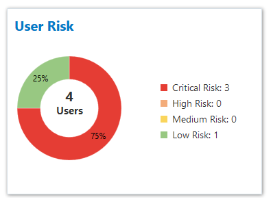
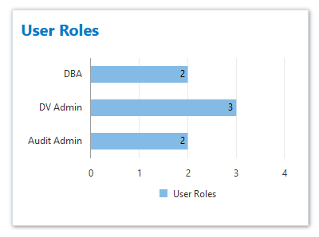
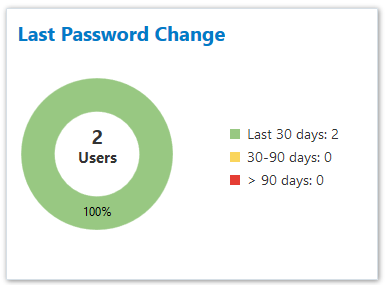
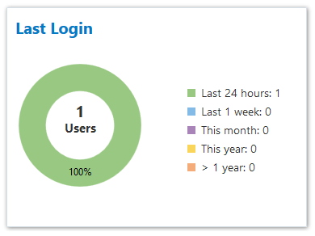
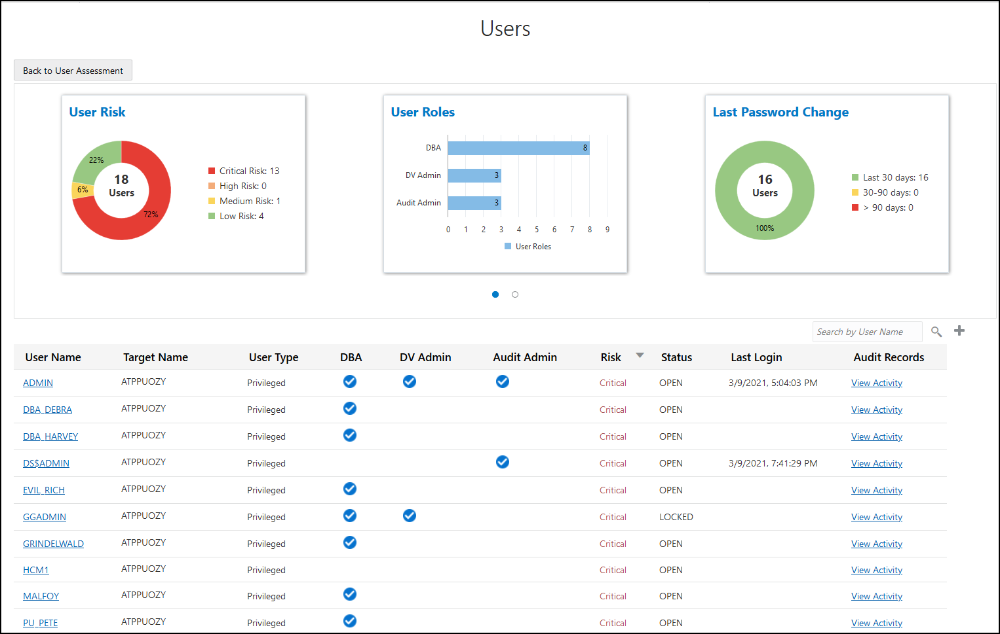
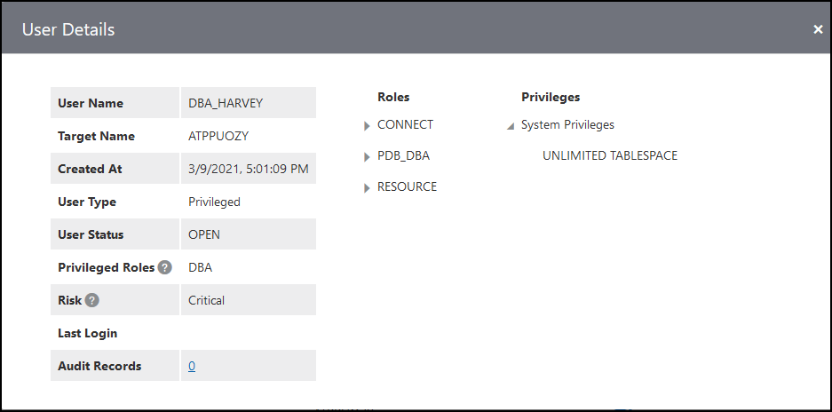
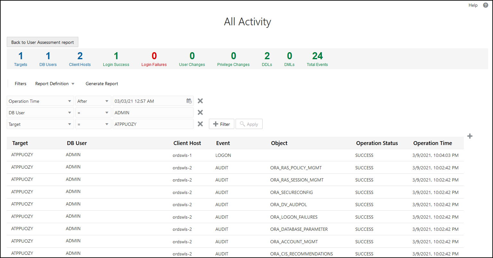

# Assess Database Configurations and Users

## Introduction

Security Assessment helps you assess the security of your database configurations. It analyzes database configurations, user accounts, and security controls, and then reports the findings with recommendations for remediation activities that follow best practices to reduce or mitigate risk. User Assessment helps you assess the security of your database users and identify high risk users. By default, Oracle Data Safe automatically generates a Security Assessment and User Assessment report for your target database during target registration.

Security Assessment also lets you monitor security drift on your target databases. By setting a baseline Comprehensive Assessment report, and comparing it to another report, you can generate a Comparison report.

Run Security Assessment and User Assessment jobs in Oracle Data Safe to assess the configuration and users in your Autonomous Transaction Processing (ATP) database. Generate a Comparison Report using the auto-generated Comprehensive Report as the baseline report.

Estimated Lab Time: 20 minutes

### Objectives

You learn how to do the following:

- Sign in to the Oracle Data Safe Console
- View the initial Security Assessment report for your database
- Schedule a Security Assessment job against your database
- Run a Security Assessment job immediately against your database and analyze the results
- View the history of Comprehensive Assessment reports
- Set a baseline report and generate a Comparison Report
- View the initial User Assessment report for your database
- Run a User Assessment job immediately and analyze the results

### Prerequisites

Before starting, be sure the following prerequisites are completed:

- You have an Oracle Cloud account and are signed in to the Oracle Cloud Infrastructure Console. If not, see [Getting Started](?lab=getting-started). In the LiveLabs and Luna environments, you are provided an additional temporary Oracle Cloud account.
- Your environment is prepared. If not, see [Prepare Your Environment](?lab=prepare-environment). It's important that your ATP database is registered with Oracle Data Safe, you have enabled the Activity Auditing, User Assessment, and Security Assessment features on your database, and you have the appropriate privileges in Oracle Data Safe to use the Activity Auditing, User Assessment, and Security Assessment features with your database.
- Your ATP database is registered in Oracle Data Safe and sample data is loaded into it. If not, see [Register an Autonomous Database](?lab=register-autonomous-database).
- Audit data collection is started in Oracle Data Safe for your ATP database. If not, see [Provision Audit and Alert Policies](?lab=provision-audit-alert-policies)

### Assumptions

- Your data values are most likely different than those shown in the screenshots.

## **STEP 1**: Sign in to the Oracle Data Safe Console

1. If you are already signed in to the Oracle Data Safe Console, click the **Oracle Data Safe** tab in your browser.

2. If you are not signed in to the Oracle Data Safe Console, do the following:

    1. Click the browser tab named **Oracle Cloud Infrastructure**, and sign in to the Console.
    2. From the navigation menu, select **Oracle Database**, and then **Data Safe**. The **Overview** page for the Oracle Data Safe service is displayed.
    3. Click **Service Console**. The **Home** tab in the Oracle Data Safe Console is displayed.

## **STEP 2**: View the initial Security Assessment report for your database

1. Click the **Home** tab, and then click **Security Assessment**.

2. In the **Last Generated Report** column, click **View Report**. The **Comprehensive Assessment** report for your target database is displayed.

  

3. At the top of the report, you can view the following:

    - Target database name, when the database was assessed, and the database version
    - The total number of findings per risk level (**High Risk**, **Medium Risk**, **Low Risk**, **Advisory**, **Evaluate**, and **Pass**). These totals give you an idea of how secure your database is. The risk levels are color coded to make them easier to identify.
    - The total number of findings for **Security Controls**, **User Security**, and **Security Configurations**. These are high level categories in the report.

  

4. Review the table in the **Summary** category.

    - The table compares the number of findings for each category in the report and counts the number of findings per risk level. These values help you to identify areas that need attention.

  

5. Expand **User Accounts** to view the list of findings that pertain to user accounts.

6. Expand the subcategories and review the findings.

    - You can find more information on the identified risk and how to mitigate it in the **Details** and **Remarks** sections of each risk.
    - On the right, indicators show whether a finding is recommended by the Center for Internet Security (**CIS**), European Union's General Data Protection Regulation (**GDPR**), and/or Security Technical Implementation Guide (**STIG**). These indications make it easy for you to identify the recommended security controls.

  

7. Collapse **User Accounts** and expand **Privileges and Roles**. Review the list of findings.

8. Scroll down and expand other categories. Each category lists related findings about your database and how you can make changes to improve its security.

9. To filter the findings by risk level, scroll to the top of the report, and click a risk level.

    - Each filter is a toggle. For example, if you click **Medium Risk**, only medium risk findings are displayed in the report. If you click **Medium Risk** again, the filter is removed.

## **STEP 3**: Schedule a Security Assessment job against your database

1. Click the **Home** tab, and then click the **Security Assessment** tab.

2. On the **Security Assessment** page, select the check box for your target database, and then click **Schedule Periodic Assessment**.

  

3. In the **Schedule Assessment** dialog box, configure the schedule for every Sunday at 11:00 PM:

    1. From the **Schedule Type** drop-down list, select **Weekly**.
    2. From the **Every** drop-down list, select **Sunday**.
    3. In the **At** field, click the **Select Time** button. Select **11:00 PM**, and then click **OK**.
    4. Click **Update Schedule**. A confirmation messages states that the scheduled periodic job is successful.

  

## **STEP 4**: Run a Security Assessment job immediately against your database and analyze the results

1. Deselect the check box for your database, and then select it again.

2. Click **Assess Now**.

3. Wait approximately one minute for the job to generate a new **Comprehensive Assessment** report.

4. When the job is finished, review the counts for high risk, medium risk, and low risk findings. These values are different than the initial report.

  

5. In the **Last Generated Report** column, click **View Report**. The **Comprehensive Assessment** report is displayed.

6. Review the information at the top of the report. Expand categories and review the findings.

  

## **STEP 5**: View the history of Comprehensive Assessment reports

You can access all of your Comprehensive Assessment reports by viewing the history.

1. Click the **Reports** tab.

2. Under **Security Assessment**, click **Comprehensive Assessment**.

3. In the **Last Generated Report** column, click **View History**. The **Assessment History** dialog box is displayed.

4. In the **Last Assessed On** column, view the list of dates on which you generated Comprehensive Assessment reports. The dates link to the reports so that you can view them again as needed.

  

5. Close the dialog box.

## **STEP 6**: Set a baseline report and generate a Comparison report

1. Click the **Home** tab, and then click **Security Assessment**.

2. On the **Security Assessment** page, in the **Differs from Baseline** column, click **Set Baseline** for your target database. The **Select report for baseline** dialog box is displayed.

  

3. In the **Baseline** column, select the baseline option button for the first report, and then click **Set as Baseline**.

  

4. In the **Differs from Baseline** column, click **Yes** to view the Comparison Report.

    - **Yes** means that the baseline report (the first report) differs from the current report (the report you just generated).
    - **No** means that there are no differences between the reports and the Comparison Report has no data.

  

5. Review the Comparison Report.

    - In the Summary table, the risk levels are categorized as **High Risk**, **Medium Risk**, **Low Risk**, **Advisory**, **Evaluate**, and **Pass**.
    - The categories in the first column represent types of findings. They are **User Accounts**, **Privileges and Roles**, **Authorization Control**, **Fine-Grained Access Control**, **Auditing**, **Encryption**, and **Database Configuration**.
    - You can view the number of new risks added and the number of risks remediated (removed). The upward-facing arrow represents new risks. The downward-facing arrow represents remediated risks.
    - The change value is the total count of modified risks, new risks, and remediated risks on the target database for each category/risk level.
    - In the details table, you can view the risk level of each change, the findings category to which the change belongs, and a description of the change.
    - The Comparison column is important because it provides explanations of what is changed, added, or removed from the target database since the baseline report was generated. The column also tells you if the change is a new risk or a remediated risk

  

## **STEP 7**: View the initial User Assessment report for your database

1. Click the **Home** tab, and then click **User Assessment**. The **User Assessment** page is displayed.

2. Review the number of **Critical Risk**, **High Risk**, **Medium Risk**, and **Low Risk** users.

  

3. Under **Last Generated Report**, click **View Report** to view the initial report. The **Users** page is displayed.

4. Review the four charts. You can click the small circles below the charts to navigate between the charts.

    - The **User Risk** chart shows you the number and percentage of users who are **Critical Risk**, **High Risk**, **Medium Risk**, and **Low Risk**.

    

    - The **User Roles** chart shows you the number of users with the **DBA**, **DV Admin**, and **Audit Admin** roles.

    

    - The **Last Password Change** chart shows you the number and percentage of users who changed their passwords within the last 30 days, within the last 30-90 days, and 90 days ago or more.

    

    - The **Last Login** chart shows you the number and percentage of users that signed in to the database within the last 24 hours, within the last week, within the current month, within the current year, and a year ago or more.

    

5. Review the table below the charts. This table lets you quickly identify critical and high risk users, such as DBAs, DV Admins, and Audit Admins.

  

## **STEP 8**: Run a User Assessment job immediately and analyze the results

1. Click **Back to User Assessment**.

2. On the **User Assessment** page, select the check box for your target database, and then click **Assess**.

  

3. Wait a moment for the assessment to finish. The assessment takes approximately 10 seconds.

4. When the user assessment is completed, observe the following on the **User Assessment** page:

    - A green check mark is displayed in the **Last Generated Report** column.
    - The numbers of **Critical Risk**, **High Risk**, **Medium Risk**, and **Low Risk** users are updated due to the sample data that you loaded into your database at the start of this workshop.

  

5. In the **Last Generated Report** column, click **View Report**. The **Users** page is displayed.

6. Review the charts and table.

    - There are more users in your target database, several of which are critical risk.
    - Many users are DBAs.

  

7. To view details for a user, click any user's name. The **User Details** dialog box shows you the following information:

    - The date and time the user was created
    - The user type (for example, Privileged)
    - The user status (for example, OPEN)
    - The privileged roles for the user (for example, DBA, DV Admin, Audit Admin)
    - The risk level for the user (for example, Critical)
    - The last date and time the user logged in to the target database
    - The number of audit records collected for the user
    - The roles and privileges granted to the user

    You can position your cursor over the question marks next to **Privileged Roles** and **Risk** to view more details about the values for these fields. The following screenshot shows you details for the `DBA_HARVEY` user. Close the dialog box.

  

8. To view audit records for the `ADMIN` user, do the following:

    1. Identify the row for the `ADMIN` user.
    2. Scroll to the right.
    3. In the **Audit Records** column for the `ADMIN` user, click **View Activity**.

  

9. Examine the **All Activity** report for the `ADMIN` user.

    - The report is automatically filtered to show you the audit records for the past week, for the `ADMIN` user, and for your target database.
    - At the top of the report, you can view totals for **Targets**, **DB Users**, **Client Hosts**, **Login Success**, **Login Failures**, **User Changes**, **Privilege Changes**, **DDLs**, **DMLs**, and **Total Events**.
    - The **Event** column in the table shows you the types of activities performed, for example, LOGON, AUDIT, CREATE AUDIT POLICY, and so on.
    - At the bottom of the page, click the page numbers to view more audit records.

  

10. At the top of the report, click **Back to User Assessment report**.

11. Identify an expired user, and then click **View Activity** for that user to view the user's audit records. The following example shows `VOLDEMORT` as expired.

  

12. If the user has no activity on the target database, there are no audit records displayed in the **All Activity** report. In this case, you might consider removing the user from the target database.

  

## Learn More

* [User Assessment Overview](https://docs.oracle.com/en-us/iaas/data-safe/doc/user-assessment-overview.html)
* [Security Assessment Overview](https://docs.oracle.com/en-us/iaas/data-safe/doc/security-assessment-overview.html)

## Acknowledgements
* **Author** - Jody Glover, Principal User Assistance Developer, Database Development
* **Last Updated By/Date** - Jody Glover, May 22 2021
