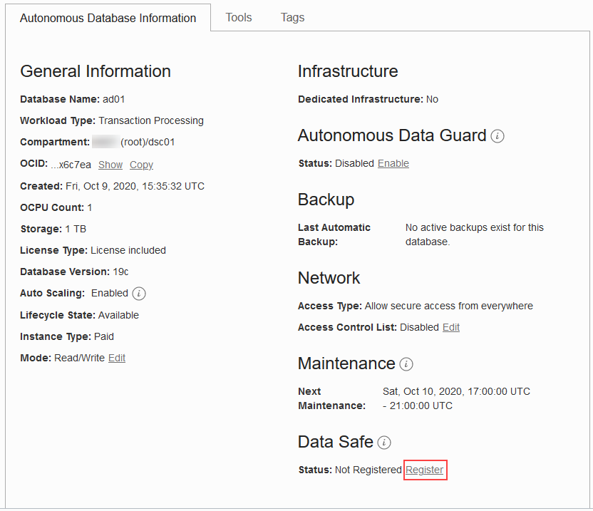
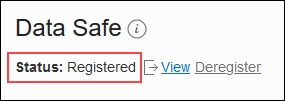
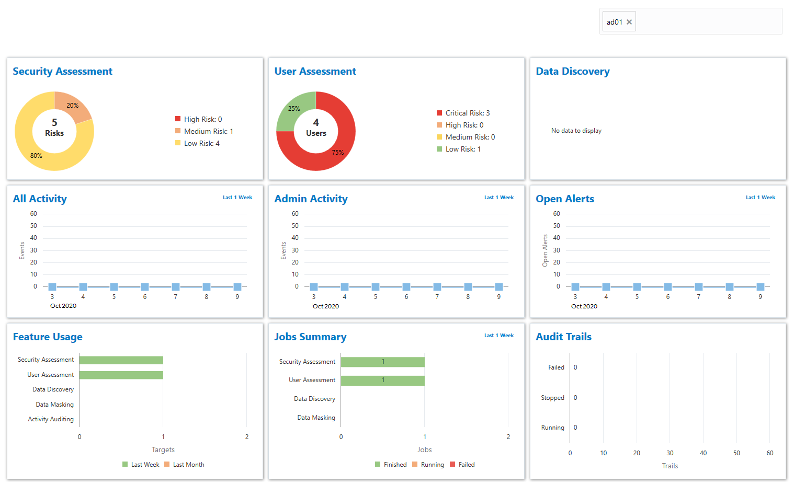

# Register an Autonomous Database with Oracle Data Safe

## Introduction

To use a database with Oracle Data Safe, you first need to register it with Oracle Data Safe. If there is no option to register database, it is because you are working in a region that does not have the Oracle Data Safe service enabled in it.

To following three security aspects need to be configured for you to use a database with Oracle Data Safe:
- A policy in Oracle Cloud Infrastructure Identity and Access Management (IAM) that grants you permission to use the Autonomous Database in your compartment. If you are a tenancy administrator, a policy is not required.
- One or more Oracle Data Safe roles are granted to the Oracle Data Safe service account on the Autonomous database. The roles enable Oracle Data Safe features on the database. By default, on an Autonomous Database, the Oracle Data Safe service account has all the roles granted, except for Data Masking.
- One or more privileges are granted to you in the Oracle Data Safe Console for your Autonomous Database. By default, when you register an Autonomous Database, your user account is automatically granted Oracle Data Safe privileges for that database. The privileges granted depend on whether you are a regular user or an administrator. A regular user can use the User Assessment, Security Assessment, and Activity Auditing features with the database. A tenancy administrator or an Oracle Data Safe administrator can use all of the Oracle Data Safe features on any database, which includes User Assessment, Security Assessment, Activity Auditing, Data Discovery, and Data Masking.

> **Note**: In the LiveLabs environment, your temporary Oracle Cloud account is not granted privileges in the Oracle Data Safe Console to use the Data Discovery and Data Masking features with your database.

Begin by registering your Autonomous Transaction Database (ATP) that you created when you prepared your environment. If you are working in a paid, LiveLabs, or Luna tenancy, then you can register the ATP database provided to you.

After you register your database, you run a SQL script to load sample data into your database. The `load-data-safe-sample-data_admin.sql` script creates several tables with sample data that you can use to practice with the Oracle Data Safe features. It also enables the Data Masking feature on your database. Keep in mind, however, that to use Data Masking with your database, it is not enough to just enable Data Masking on the database. You also require the Discovery and Masking privilege on your database in the Oracle Data Safe Console.

Finally, view the list of registered target databases from the Oracle Data Safe Console and from the Oracle Data Safe service page in the Oracle Cloud Infrastructure Console.

Estimated Lab Time: 30 minutes

### Objectives

You learn how to do the following:

- Register your ATP database with Oracle Data Safe
- Run a SQL script using Oracle Database Actions to load sample data into your database
- Sign in to the Oracle Data Safe Console and view the list of registered target databases
- View the list of registered target databases from the Oracle Data Safe service page in the Oracle Cloud Infrastructure Console

### Prerequisites
Before starting, be sure the following prerequisites are completed:

- You have an Oracle Cloud account. If you are using the LiveLabs or Luna environment, you are provided an additional temporary Oracle Cloud account.
- Your environment is prepared. If not, see [Prepare Your Environment](?lab=prepare-environment).
- You are signed in to the Oracle Cloud Infrastructure Console. If not, see [Getting Started](?lab=getting-started).

### Assumptions

- Your data values are most likely different than those shown in the screenshots.

## **STEP 1**: Register your Autonomous Database with Oracle Data Safe

1. Make sure that you have the correct region in Oracle Cloud Infrastructure selected.

2. From the navigation menu, select **Oracle Database**, and then **Autonomous Transaction Processing**.

3. From the **Compartment** drop-down list, select your compartment.

4. On the right, click your database. The **Autonomous Database Information** tab is displayed.

5. On the **Autonomous Database Information** tab, under **Data Safe**, click **Register**.

     

2. In the **Register Database with Data Safe** dialog box, click **Confirm**.

3. Wait for the registration process to finish. When registration is completed, the status reads **Registered**.

    

## **STEP 2**: Run a SQL script using Oracle Database Actions to load sample data into your database

1. On the **Autonomous Database Details** page, click the **Tools** subtab.

2. In the **Database Actions** section, click **Open Database Actions**. A new browser tab is opened displaying the **Oracle Database Actions \| Sign in** page.

3. In the **Username** field, enter `ADMIN`, and then click **Next**.

4. In the **Password** field, enter the password for the `ADMIN` account, and then click **Sign In**.

    - If you provisioned an Autonomous Database, enter the password that you specified for the `ADMIN` account.
    - If a tenancy administrator provided you an Autonomous Database, obtain the password from your tenancy administrator.
    - If you are using the LiveLabs tenancy, the `ADMIN` password is the same as your initial temporary Cloud account password, provided by LiveLabs.

5. Under **Development**, click **SQL**.

6. If a help note is displayed, click the **X** button to close it.

7. Download the [load-data-safe-sample-data_admin.sql](https://objectstorage.us-ashburn-1.oraclecloud.com/p/W0JmKtImWp4e_FXSg4gj0wlwnAEf3OJ75cCpCdicH38ly55qrPaaZbO1el3ayfyR/n/c4u03/b/security-library/o/load-data-safe-sample-data_admin.zip) script, and then unzip it in a directory of your choice. Then, open the file in a text editor, such as NotePad.

8. Copy the entire script to the clipboard and then paste it into a worksheet in Database Actions.

9. To view the script activities, in the bottom pane, click the **Script Output** tab.

10. On the toolbar, click the **Run Script** button.

    

    - The script takes approximately 1 minute to run.

    - In the bottom-left corner, a cog wheel turns as the script is processed. The script output is displayed after the script is finished running.

    - Don't worry if you see some error messages on the **Script Output** tab. These are expected the first time you run the script.

    - The script ends with the message **END OF SCRIPT**.

11. When the script is finished running, on the **Navigator** tab on the left, select the `HCM1` schema from the first drop-down list. In the second drop-down list, leave **Tables** selected.

12. If you don't see `HCM1` listed, you need to sign out and sign in again:

    1. In the upper-right corner, from the `ADMIN` drop-down list, select **Sign Out**.

    2. Click **Sign in**.

    3. In the **Username** field, enter `ADMIN`, and then click **Next**.

    4. In the **Password** field, enter your initial Cloud account password, and then click **Sign in**.

    5. Under **Development**, click **SQL**.

    6. On the **Navigator** tab, select the `HCM1` schema from the first drop-down list.

13. On the toolbar, click the **Clear** button (trash can icon) to clear the worksheet.

14. Click the **Script Output** tab. If needed, click the **Clear output** button (trash can icon) to clear the output.

15. For each table listed below, drag the table to the worksheet and run the script. Choose **Select** as your insertion type when prompted. Make sure that you have the same number of rows in each table as stated below.

    - `COUNTRIES` - 25 rows
    - `DEPARTMENTS` - 27 rows
    - `EMPLOYEES` - 107 rows
    - `EMP_EXTENDED` - 107 rows
    - `JOBS` - 19 rows
    - `JOB_HISTORY` - 10 rows
    - `LOCATIONS` - 23 rows
    - `REGIONS` - 4 rows
    - `SUPPLEMENTAL_DATA` - 149 rows

16. If your data is different than what is specified above, rerun the [load-data-safe-sample-data_admin.sql](https://objectstorage.us-ashburn-1.oraclecloud.com/p/W0JmKtImWp4e_FXSg4gj0wlwnAEf3OJ75cCpCdicH38ly55qrPaaZbO1el3ayfyR/n/c4u03/b/security-library/o/load-data-safe-sample-data_admin.zip) script.

17. Sign out of Database Actions and close the tab.

## **STEP 3**: Sign in to the Oracle Data Safe Console and view the list of registered target databases

1. Return to the browser tab where you are signed in to **Oracle Cloud Infrastructure**. You last left off on the **Tools** tab for your database. If you navigated away from the **Tools** tab, select **Oracle Database** and then **Autonomous Transaction Processing** from the navigation menu, and then click your database.

2. Click the **Autonomous Database Information** tab.

3. To access the Oracle Data Safe Console from here, under **Data Safe**, click **View**.

  

    A new **Oracle Data Safe | Home** tab is opened and you are presented with a dashboard. You can also view a list of new features with links to documentation as well as product announcements.

    

4. Review the dashboard.

      - The dashboard lets you monitor several activities at once.
      - Above the dashboard, there is a removable filter set on your database name so that the dashboard displays data for your database only.
      - When you first sign in to the Oracle Data Safe Console, the Security Assessment and User Assessment charts in your dashboard are automatically populated.

5. Click each top tab and review the content on the page.

    - The **Home** tab shows a dashboard.
    - The **Targets** tab lists your registered target databases.
    - The **Library** tab lets you access repository resources, which are used for discovering and masking sensitive data. Resources include sensitive types, sensitive data models, masking formats, and masking policies.
    - The **Reports** tab lets you access prebuilt and custom built reports for all Oracle Data Safe features.
    - The **Alerts** tab shows you all open alerts for the past week, by default. If you need to view more alerts, you can remove the filters.
    - The **Jobs** tab shows you all current, past, and scheduled jobs. Notice that you have two jobs started already - one for User Assessment and one for Security Assessment.

    

6. Click the **Home** tab, and then click each side tab and review the content on the page.

    - The side tabs provide quick access to the wizards for Oracle Data Safe's main features, including **Security Assessment**, **User Assessment**, **Data Discovery**, **Data Masking**, and **Activity Auditing**.
    - You should see your target database listed on each tab.
    - On the **Security Assessment** and **User Assessment** tabs there is a report generated. In a later lab, you review these reports.

    

7. Click the **Targets** tab. Notice that your database is listed as a target database.

8. Click the name of your target database to view its details.

9. In the **Target Details** dialog box, review the connection information for your database. The information is read only.
      - You cannot edit the registration details for an Autonomous Database.
      - You can view the compartment to which the database belongs. The compartment for an Autonomous Database is the same compartment in Oracle Cloud Infrastructure in which the database resides.
      - Oracle Data Safe connects to the database via a TLS connection.

10. Click **Cancel** to close the **Target Details** dialog box.

## **STEP 4**: View the list of registered target databases from the Oracle Data Safe service page in the Oracle Cloud Infrastructure Console

The **Registered Databases** page for the Oracle Data Safe service in the Oracle Cloud Infrastructure Console also lists registered target databases to which you have access.

1. Return to the **Oracle Cloud Infrastructure** browser tab.

2. If you are signed out, sign in again using your Oracle Cloud account credentials. You should be in the Oracle Cloud Infrastructure Console.

3. From the navigation menu, select **Oracle Database**, and then **Data Safe**.

      - The **Overview** page for the Oracle Data Safe service is displayed. From here you can access the Oracle Data Safe Console and find links to useful information.
      - There is a message in the upper-right corner stating that **Data Safe is enabled**.
      - If there is an error on the page, you need to sign in again to Oracle Cloud Infrastructure.

4. On the left, click **Registered Databases**. Your registered database is listed.

5. Click the three dots to the right of your database name, and select **Service Console**. This is another way that you can access the Oracle Data Safe Console.

    

## Learn More

  - [Provision Autonomous Data Warehouse](https://docs.oracle.com/en/cloud/paas/autonomous-data-warehouse-cloud/user/autonomous-provision.html#GUID-0B230036-0A05-4CA3-AF9D-97A255AE0C08)
  - [Loading Data with Autonomous Data Warehouse](https://docs.oracle.com/en/cloud/paas/autonomous-data-warehouse-cloud/user/load-data.html#GUID-1351807C-E3F7-4C6D-AF83-2AEEADE2F83E)
  - [Target Database Registration](https://docs.oracle.com/en-us/iaas/data-safe/doc/target-database-registration.html)

## Acknowledgements
  * **Author** - Jody Glover, Principal User Assistance Developer, Database Development
  * **Last Updated By/Date** - Jody Glover, May 22 2021
