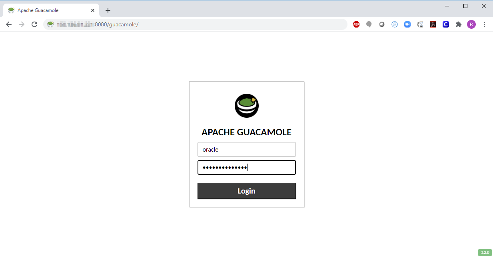
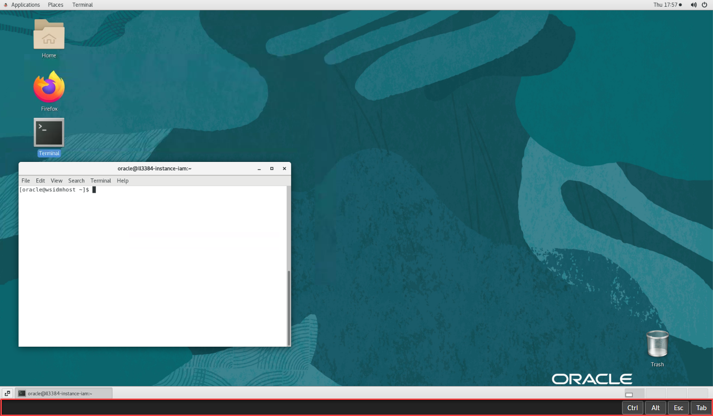
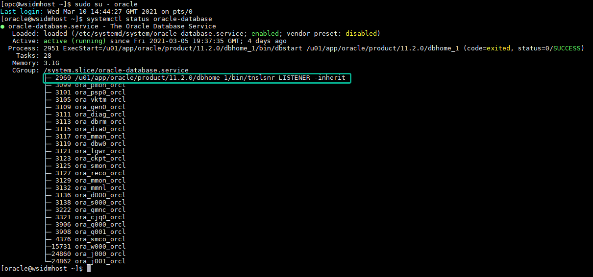
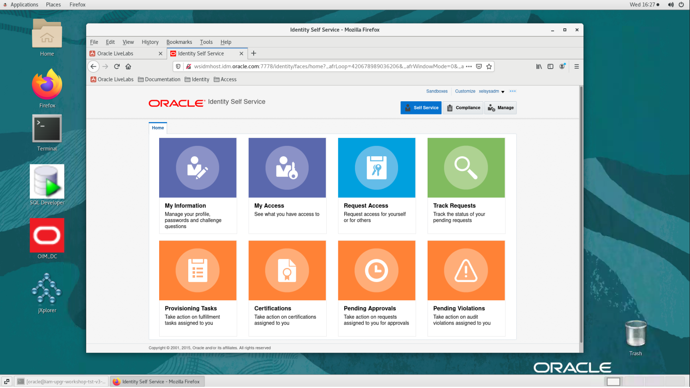

# Initialize the Environment

## Introduction

In this lab we will review and setup all components required to successfully upgrade IAM 11g to 12c version.  

*Estimated Lab Time*:  30 minutes

### Objectives
- Initialize the IAM 11g baseline workshop environment.

### Prerequisites
This lab assumes you have:
- A Free Tier, Paid or LiveLabs Oracle Cloud account
- SSH Private Key to access the host via SSH
- You have completed:
    - Lab: Generate SSH Keys (*Free-tier* and *Paid Tenants* only)
    - Lab: Prepare Setup (*Free-tier* and *Paid Tenants* only)
    - Lab: Environment Setup

## **STEP 0:** Running your Lab
### Access the graphical desktop
For ease of execution of this workshop, your instance has been pre-configured for remote graphical desktop accessible using any modern browser on your laptop or workstation. Proceed as detailed below to login.

1. Launch your browser to the following URL

    ```
    URL: <copy>http://[your instance public-ip address]:8080/guacamole</copy>
    ```

2. Provide login credentials

    ```
    Username: <copy>oracle</copy>
    ```
    ```
    Password: <copy>Guac.LiveLabs_</copy>
    ```

    

    *Note*: There is an underscore `_` character at the end of the password.

3. To launch *Firefox* browser or a *Terminal* client, click on respective icon on the desktop

    

### Enable Copy/Paste from local to remote desktop (Guacamole clipboard)
During the execution of your labs you may need to copy text from your local PC/Mac to the Guacamole remote desktop, such as commands from the lab guide. While such direct copy/paste isn't supported as you will realize, you may proceed as indicated below to enable an alternative local-to-remote clipboard with Input Text Field.

1. From your remote desktop session, enter CTRL+ALT+SHIFT (*Windows*) or CTRL+CMD+SHIT (*Mac*)

2. Select *Text Input*

    

3. Notice the black Text Input field added at the bottom of your screen after you made the selection in the previous step. This is the field to paste any text copied from your local environment.

    

4. Test copy/pasting the text below. Prior to pasting ensure that the cursor has been placed at the location where the intended text is to be pasted, then right-click inside the black *Text Input* field and paste it

    ```
    <copy>echo "This text was copied from my local desktop on to my remote session"</copy>
    ```

    

### Login to Host using SSH Key based authentication
While all command line tasks included in this workshop can be performed from a terminal session from the remote desktop session as shown above, you can optionally use your preferred SSH client.

Refer to *Lab Environment Setup* for detailed instructions relevant to your SSH client type (e.g. Putty on Windows or Native such as terminal on Mac OS):
  - Authentication OS User - “*opc*”
  - Authentication method - *SSH RSA Key*
  - OS User – “*oracle*”.

1. First login as “*opc*” using your SSH Private Key

2. Then sudo to “*oracle*”. E.g.

    ```
    <copy>sudo su - oracle</copy>
    ```

## **STEP 1**: Validate the environment
1. As user *oracle* from any of the sessions started above, verify that the DB listener and all databases are up and running.

    ```
    <copy>
    systemctl status oracle-database
    </copy>
    ```
    

    ***Note***: The host is preconfigured to automatically start the database and database listener.

2. Review environment details

    This existing environment was set up using the LCM Automated setup utility for 11.1.2.3. This VM contains an 11g database, plus an integrated setup of OUD and OAM and OIM all at the 11.1.2.3 level. Some pertinent info for the existing setup is:

    - **Domain locations**: /u01/app/oracle/config/domains
    - **Instances**: /u01/app/oracle/config/instances
    - **Access MW_HOME**: /u01/app/oracle/products/access
    - **Identity MW_HOME**: /u01/app/oracle/products/identity
    - **Directory MW_HOME**: /u01/app/oracle/products/dir

3. Review key authentication details

    - User connections in SQL Developer and jXplorer are pre-defined for some of the users.
    - Password for all users is "*IAMUpgrade12c##*" with the exception of Guacamole remote desktop access provided above.
    - Key users:
        - **WLS Domain User**: weblogic
        - **OAM User**: oamadmin
        - **OIM User**: xelsysadm
        - **OUD User**: Directory Manager

4. As user *oracle*, review staged software needed for all labs.
    For your convenience all IAM 12c software you will need for upgrading the suite have been staged on the instance under */home/oracle/Downloads*

    ```
    <copy>ls -ls ~oracle/Downloads</copy>
    ```
    

## **STEP 2**: Start IAM 11g Suite

1.  From any of the terminal session started above, proceed as shown below to start all components as “*oracle*” user

    ```
    <copy>/u01/app/oracle/config/scripts/startall.sh</copy>
    ```

    

    ***Note:*** This will take between 20-30 minutes.

2. Launch *Firefox* from the remote desktop session and test the base installation by accessing the Identity Manager Admin Console:

    ```
    URL: <copy>http://wsidmhost.idm.oracle.com:7778/oim</copy>
    ```

    ```
    User: <copy>xelsysadm</copy>
    ```

    ```
    Password: <copy>IAMUpgrade12c##</copy>
    ```

    

    ***Note:*** Important URLs needed throughout the workshop have been bookmarked as you can see above under 3 groups. Documentation, Identity, and Access.

    
    

3. If for any reason you need to restart all processes you can use one of the following options:

    - Reboot the instance as user *opc* from the SSH terminal session you started using the SSH key (not the remote desktop session).

    ```
    <copy>sudo init 6</copy>
    ```

    - Restart processes

    ```
    <copy>/u01/app/oracle/config/scripts/stopall.sh</copy>
    ```
    ```
    <copy>systemctl restart oracle-database</copy>
    ```
    ```
    <copy>/u01/app/oracle/config/scripts/startall.sh</copy>
    ```

You may now [proceed to the next lab](#next).

## Learn More
Use these links to get more information about Oracle Identity and Access Management:
- [IAM 11g to 12c upgrade documentation](https://docs.oracle.com/en/middleware/idm/suite/12.2.1.4/upgrade.html).  
- [Oracle Identity Management Website](https://docs.oracle.com/en/middleware/idm/suite/12.2.1.4/index.html)
- [Oracle Identity Governance Documentation](https://docs.oracle.com/en/middleware/idm/identity-governance/12.2.1.4/index.html)
- [Oracle Access Management Documentation](https://docs.oracle.com/en/middleware/idm/access-manager/12.2.1.4/books.html)

## Acknowledgements
* **Author** - Anbu Anbarasu, Director, Cloud Platform COE  
* **Contributors** -  Eric Pollard, Rene Fontcha  
* **Last Updated By/Date** - Rene Fontcha, LiveLabs Platform Lead, NA Technology, March 2021
