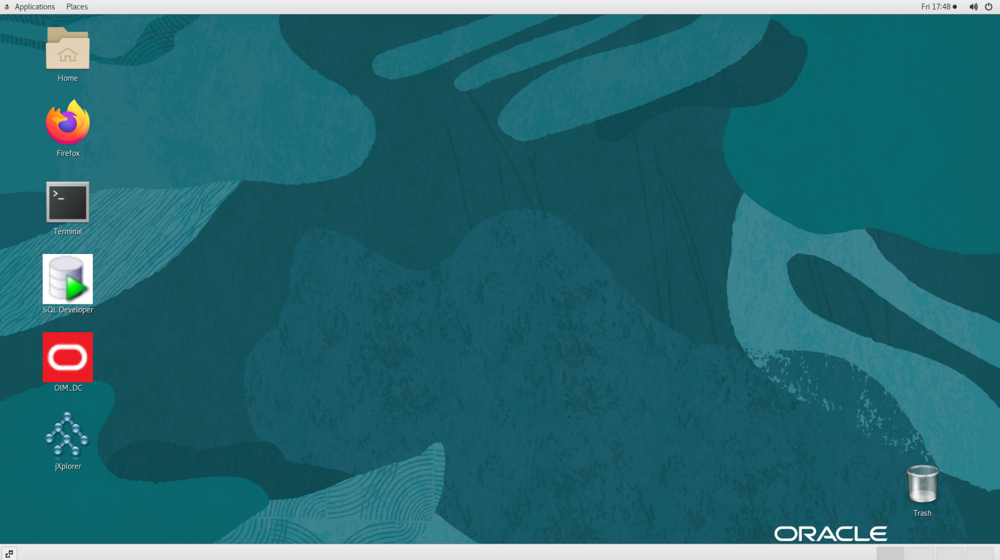

# Initialize the Environment

## Introduction

In this lab we will review and setup all components required to successfully upgrade IAM 11g to 12c version.  

*Estimated Lab Time*:  30 minutes

### Objectives
- Initialize the IAM 11g baseline workshop environment.

### Prerequisites
This lab assumes you have:
- A Free Tier, Paid or LiveLabs Oracle Cloud account
- SSH Private Key to access the host via SSH
- You have completed:
    - Lab: Generate SSH Keys
    - Lab: Prepare Setup
    - Lab: Environment Setup

## **STEP 1:** Running your Lab
### Access the graphical desktop
For ease of execution of this workshop, your instance has been pre-configured for remote graphical desktop accessible using any modern browser on your laptop or workstation. Proceed as detailed below to login.

1. Launch your browser to the following URL

    ```
    URL: <copy>http://[your instance public-ip address]:8080/guacamole</copy>
    ```

2. Provide login credentials

    ```
    Username: <copy>oracle</copy>
    ```
    ```
    Password: <copy>Guac.LiveLabs_</copy>
    ```

    

    *Note*: There is an underscore `_` character at the end of the password.

3. To launch *Firefox* browser or a *Terminal* client, click on respective icon on the desktop

    

### Login to Host using SSH Key based authentication
While all command line tasks included in this workshop can be performed from a terminal session from the remote desktop session as shown above, you can optionally use your preferred SSH client.

Refer to *Lab Environment Setup* for detailed instructions relevant to your SSH client type (e.g. Putty on Windows or Native such as terminal on Mac OS):
  - Authentication OS User - “*opc*”
  - Authentication method - *SSH RSA Key*
  - OS User – “*oracle*”.

1. First login as “*opc*” using your SSH Private Key

2. Then sudo to “*oracle*”. E.g.

    ```
    <copy>sudo su - oracle</copy>
    ```

Follow the steps below to initialize the IAM 11g components.

## **STEP 2**: Start IAM 11g Components

1.  From any of the terminal session started above, proceed as shown below to start all components as “*oracle*” user

    ```
    <copy>/u01/app/oracle/config/scripts/startall.sh</copy>
    ```

    **Note:** This will take between 20-30 minutes.

2. Test the base installation.
    Oracle Identity Manager Admin Console:

    ```
    URL         http://wsidmhost.idm.oracle.com:7778/oim
    User        xelsysadm
    Password    IAMUpgrade12c##
    ```

## Learn More About Identity and Access Management
Use these links to get more information about Oracle Identity and Access Management:
- [Oracle Identity Management 12.2.1.4.0](https://docs.oracle.com/en/middleware/idm/suite/12.2.1.4/index.html).  


## Acknowledgements
* **Author** - Anbu Anbarasu, Director, Cloud Platform COE  
* **Contributors** -  Eric Pollard, Sustaining Engineering  
* **Last Updated By/Date** - Anbu, COE, February 2021


## Need Help?
For all technical issues related to the IAM upgrade lab, please contact Oracle support through the same Proactive SR that was created to initiate this lab.  

For other issues, please submit feedback or ask for help using our [LiveLabs Support Forum](https://community.oracle.com/tech/developers/categories/goldengate-on-premises). Please click the **Log In** button and login using your Oracle Account. Click the **Ask A Question** button to the left to start a *New Discussion* or *Ask a Question*.  Please include your workshop name and lab name.  You can also include screenshots and attach files.  Engage directly with the author of the workshop.

If you do not have an Oracle Account, click [here](https://profile.oracle.com/myprofile/account/create-account.jspx) to create one.
