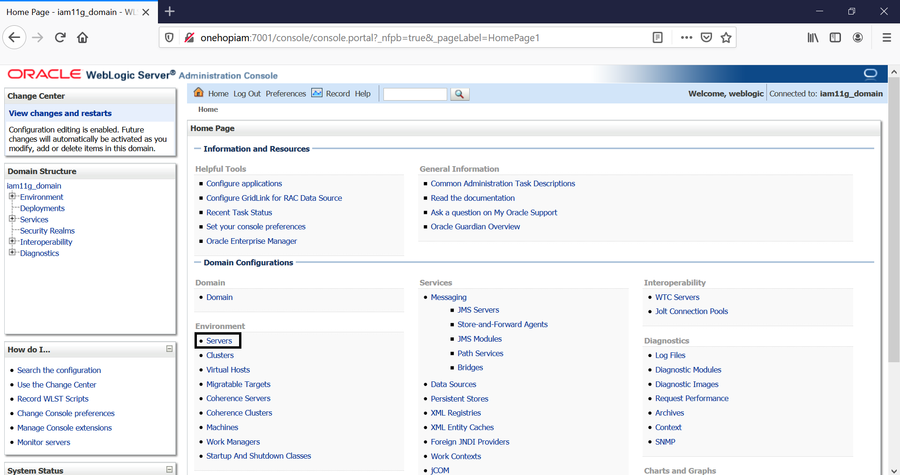
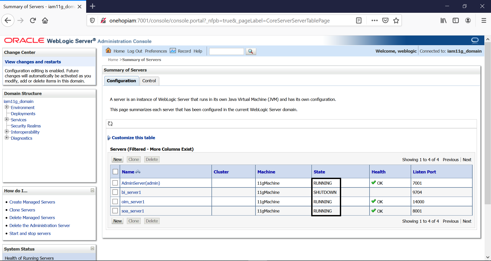
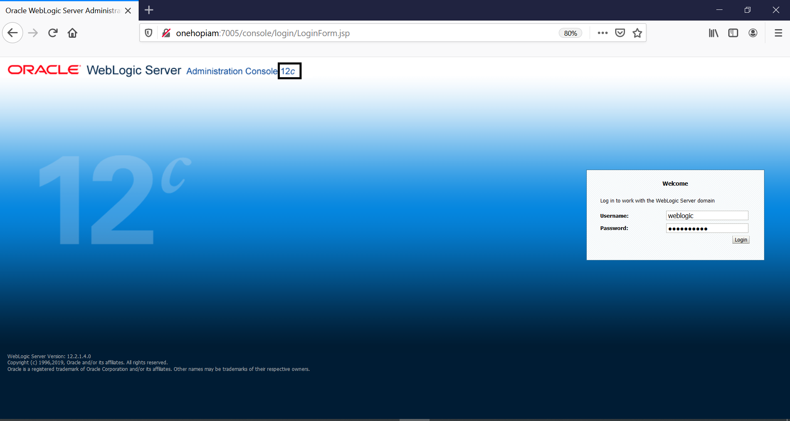
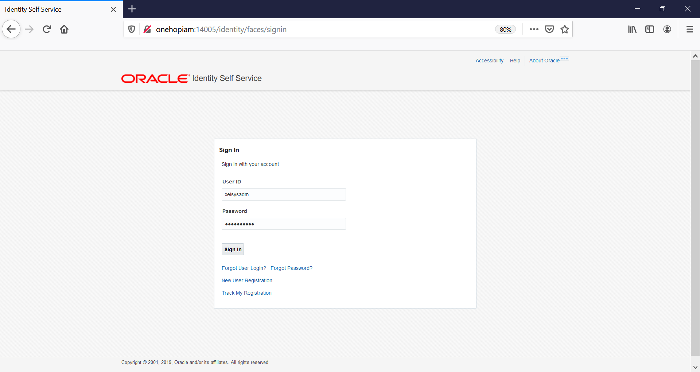
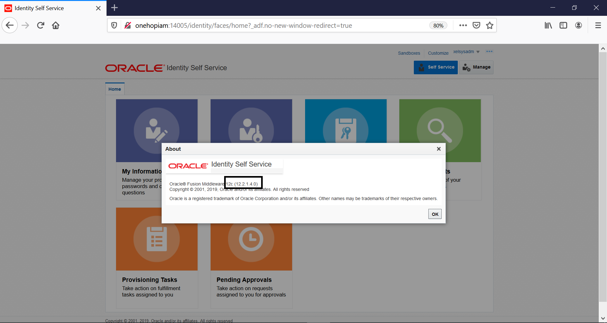

# Initialize the workshop environment

## Introduction

In this lab we will review and startup all components required to successfully run this workshop.

*Estimated Lab Time*: 20 minutes

### About Product/Technology
Oracle Identity Governance(OIG) is a powerful and flexible enterprise identity management system that automatically manages user's access privileges within enterprise IT resources.

### Objectives

In this lab, you will:
* Start the database
* Start and Verify 11g Domain available for upgrade
* Start and Verify 12c Domain

### Prerequisites

* An Oracle Cloud Account - Please view this workshop's LiveLabs landing page to see which environments are supported
* SSH Private Key to access the host via SSH

*Note: If you have a **Free Trial** account, when your Free Trial expires your account will be converted to an **Always Free** account. You will not be able to conduct Free Tier workshops unless the Always Free environment is available. **[Click here for the Free Tier FAQ page.](https://www.oracle.com/cloud/free/faq.html)***

## **STEP 1:** Login to the instance

1. Launch your browser to the following URL to access the instance

    ```
    http://[your instance public-ip address]:6080/index.html?password=LiveLabs.Rocks_99&resize=remote&autoconnect=true
    ```

## **STEP 2:** Verify that the Database is up and running

1. Verify that the Database has started

    ```
    <copy>lsnrctl status</copy>
    ```

    

## **STEP 3:** Verify the 11g Domain

1. Wait for the 11g domain to startup. The Admin server will take about 3-4 mins to start. It may take about 10mins for the SOA and OIM servers to start

2. Access the Weblogic console from your browser and verify the version

    - Click on the bookmark *Workshop Links* and click on *WLS11g* from the dropdown "OR" paste the following URL in the browser:

        ```
        <copy>http://onehopiam:7001/console</copy>
        ```
        ```
        Username: <copy>weblogic</copy>
        ```
        ```
        Password: <copy>Welcom@123</copy>
        ```

        

    - On the Weblogic console, Click on *Servers* under *Environment* and verify that all servers(OIM,SOA) are in the ‘RUNNING’ state.

        

        

3. Access the Identity Self Service console

    - Click on the bookmark *Workshop Links* and click on *OIG11g* "OR" paste the following URL in the browser:

        ```
        <copy>http://onehopiam:14000/identity</copy>
        ```
        ```
        Username: <copy>xelsysadm</copy>
        ```
        ```
        Password: <copy>Welcom@123</copy>
        ```

        

    - Click on *xelsysadm* on the top right corner and Click on *About* from the dropdown. Verify that the OIM version is 11g

        

    - Click on *Manage* on the top right corner. Then, click on *Users* and notice that 3 test users have been created (*TUSER1, TUSER2, TUSER3*)

        

        

## **STEP 4:** Verify the 12c Domain

1. Wait for the 12c Domain to startup. The Admin server will take about 3-4 mins to start. It may take about 10mins for the SOA and OIM servers to start.

2. Access the Weblogic console from your browser and verify the version as 12c

    - Click on the bookmark *Workshop Links* and click on *WLS12c* "OR" paste the following URL in the browser:

        ```
        <copy>http://onehopiam:7005/console</copy>
        ```
        ```
        Username: <copy>weblogic</copy>
        ```
        ```
        Password: <copy>Welcom@123</copy>
        ```

        

    - On the Weblogic console, Click on *Servers* under *Environment* and verify that all servers(OIM,SOA) are in the ‘RUNNING’ state.

        

3. Access the Identity Self Service console

    - Click on the bookmark *Workshop Links* and click on *OIG12c* "OR" paste the following URL in the browser:

        ```
        <copy>http://onehopiam:14005/identity</copy>
        ```
        ```
        Username: <copy>xelsysadm</copy>
        ```
        ```
        Password: <copy>Welcom@123</copy>
        ```

        

    - Click on *xelsysadm* on the top right corner and Click on *About* from the dropdown. Verify that the OIM version is 12c

        

    - Click on *Manage* on the top right corner. Then, click on *Users* and notice that there are no new users created.

        

You may now [proceed to the next lab](#next).

## Acknowledgements
* **Author** - Keerti R, Brijith TG, Anuj Tripathi, NATD Solution Engineering
* **Contributors** -  Keerti R, Brijith TG, Anuj Tripathi
* **Last Updated By/Date** - Keerti R, NATD Solution Engineering, June 2021
