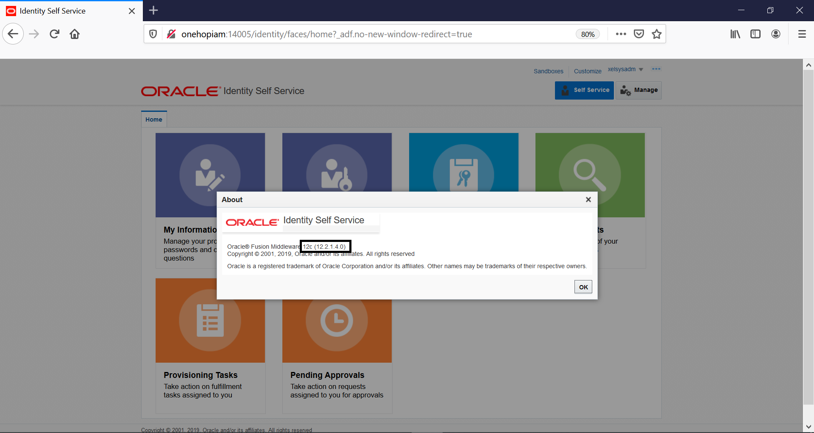
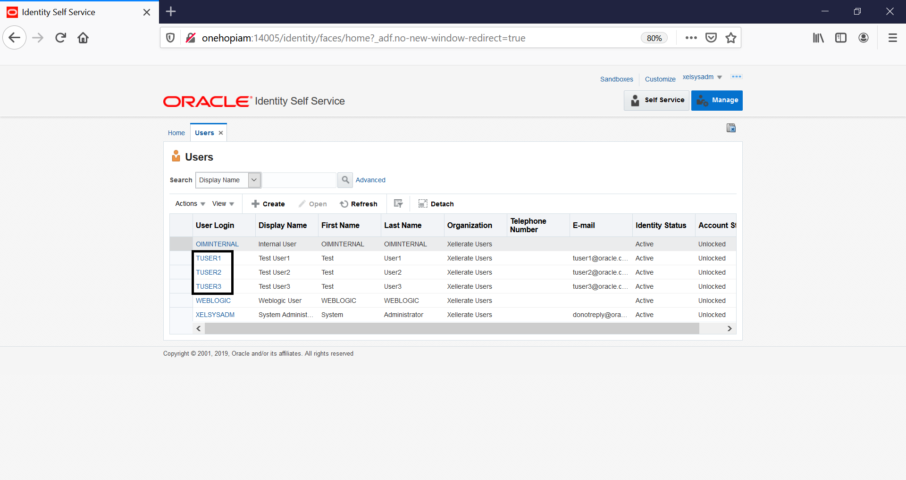

# Setup the Environment

## Introduction

This lab walks you through the steps to restart all the servers and complete the one-hop upgrade process.

*Estimated Lab Time*: 20 minutes

### Objectives

In this lab, you will:
* Restart the servers to complete the upgrade
* Verify the upgrade process

### Prerequisites
* A Free Tier, Paid or LiveLabs Oracle Cloud account
* SSH Private Key to access the host via SSH
* You have completed:
      - Lab 1: Initialize the workshop Environment
      - Lab 2: Pre-Upgrade Requirements
      - Lab 3: One-Hop Upgrade

## **STEP 1**: Start the 12c Admin Server and Managed Servers

1. Navigate to the 12c domain directory and Start the servers in the order given below
    ```
    <copy>cd /u01/oracle/middleware12c/user_projects/domains/iam12c_domain/bin</copy>
    ```

    - Start the Admin Server
    ```
    <copy>nohup ./startWebLogic.sh &</copy>
    ```
    Once the Admin Server starts up, access the Weblogic console from your browser.
    Click on the bookmark *IAM11g* and Click on *WLS* from the dropdown "OR" paste the following URL in the browser:

    ```
    <copy>http://onehopiam:7001/console</copy>
    ```
    ```
    Username: <copy>weblogic</copy>
    ```
    ```
    Password: <copy>Welcom@123</copy>
    ```

    On the Weblogic console, Click on *Servers* under *Environment* and notice that all servers(OIM,SOA) are in the ‘SHUTDOWN’ state

    - Open another tab in the terminal. Navigate to the */u01/oracle/middleware12c/user_projects/domains/iam12c_domain/bin* path and start the SOA server
    ```
    <copy>nohup ./startManagedWebLogic.sh soa_server1 t3://onehopiam:7005 -Dbpm.enabled=true &</copy>
    ```
    Refresh the Weblogic console and notice that the SOA server is now in the ‘RUNNING’ state. It may take about 5-8 minutes for the SOA server to start.

    - Open another tab in the terminal. Navigate to the */u01/oracle/middleware12c/user_projects/domains/iam12c_domain/bin* path and start the OIM server
    ```
    <copy>nohup ./startManagedWebLogic.sh oim_server1 t3://onehopiam:7005 &</copy>
    ```
    This time, OIM bootstrap process will be executed, and after successful bootstrap, OIM Managed Server will be shut down automatically.

    After the OIM server is shutdown automatically, verify that no OIM processes are running by issuing the following command:
    ```
    <copy>ps -ef |grep oim_server1</copy>
    ```

    - Stop the SOA Server. Navigate to the */u01/oracle/middleware12c/user_projects/domains/iam12c_domain/bin* path and stop the SOA server
    ```
    <copy>./stopManagedWebLogic.sh soa_server1</copy>
    ```
    - Stop the Admin Server.
    ```
    <copy>./stopWebLogic.sh</copy>
    ```

## **STEP 2:** Verify the Upgrade Process

1. Run the *startDomain12c.sh* script to restart the 12c Domain.
The Admin server will take about 3-4 mins to start. It may take about 10mins for the SOA and OIM servers to start.

    ```
    <copy>cd /u01/scripts</copy>
    ```

    ```
    <copy>./startDomain12c.sh</copy>
    ```
1. Access the 12c Weblogic console from your browser and verify the version as 12c

    - Click on the bookmark *IAM12c* and Click on *WLS* from the dropdown "OR" paste the following URL in the browser:

    ```
    <copy>http://onehopiam:7005/console</copy>
    ```
    ```
    Username: <copy>weblogic</copy>
    ```
    ```
    Password: <copy>Welcom@123</copy>
    ```

    - On the Weblogic console, Click on *Servers* under *Environment* and verify that all servers(OIM,SOA) are in the ‘RUNNING’ state.  

2. Access the Identity Self Service console

    - Click on the bookmark *IAM12c* and Click on *OIM* from the dropdown "OR" paste the following URL in the browser:

    ```
    <copy>http://onehopiam:14005/identity</copy>
    ```
    ```
    Username: <copy>xelsysadm</copy>
    ```
    ```
    Password: <copy>Welcom@123</copy>
    ```

    - Click on *xelsysadm* on the top right corner and Click on *About* from the dropdown. Verify that the OIM version is 12c

    

    - Click on *Manage* on the top right corner. Then, click on *Users* and notice that the three users *TUSER1, TUSER2, TUSER3* are migrated from 11g to 12c.

    

One-hop upgrade to Oracle Identity Manager 12c is complete.


## Acknowledgements
* **Author** - Keerti R, Brijith TG, Anuj Tripathi, NATD Solution Engineering
* **Contributors** -  Keerti R, Brijith TG, Anuj Tripathi
* **Last Updated By/Date** - Keerti R, NATD Solution Engineering, May 2021
