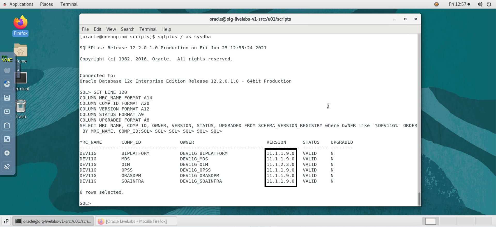
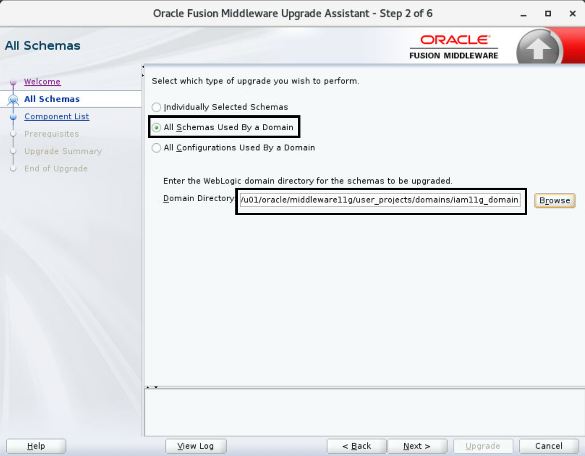
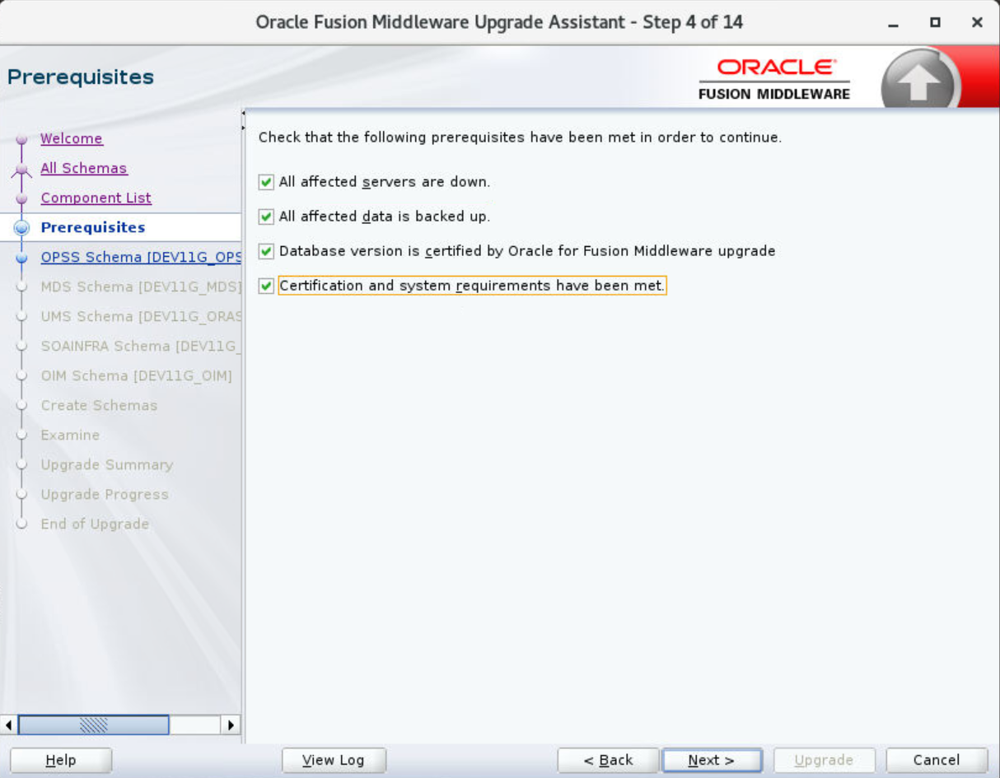
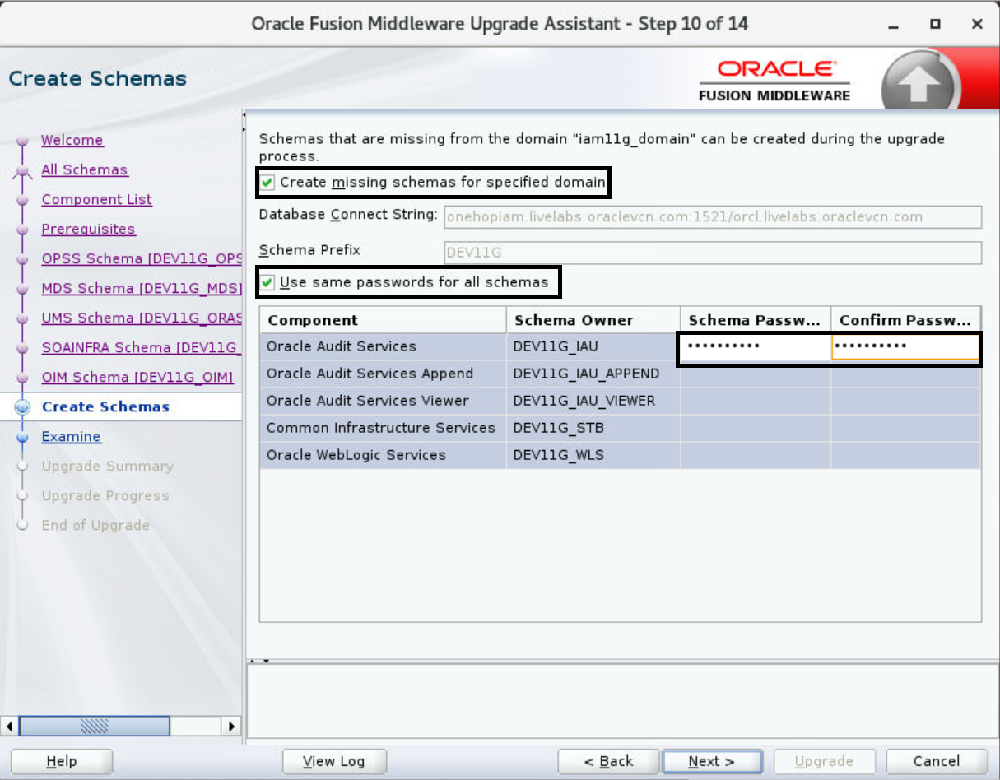
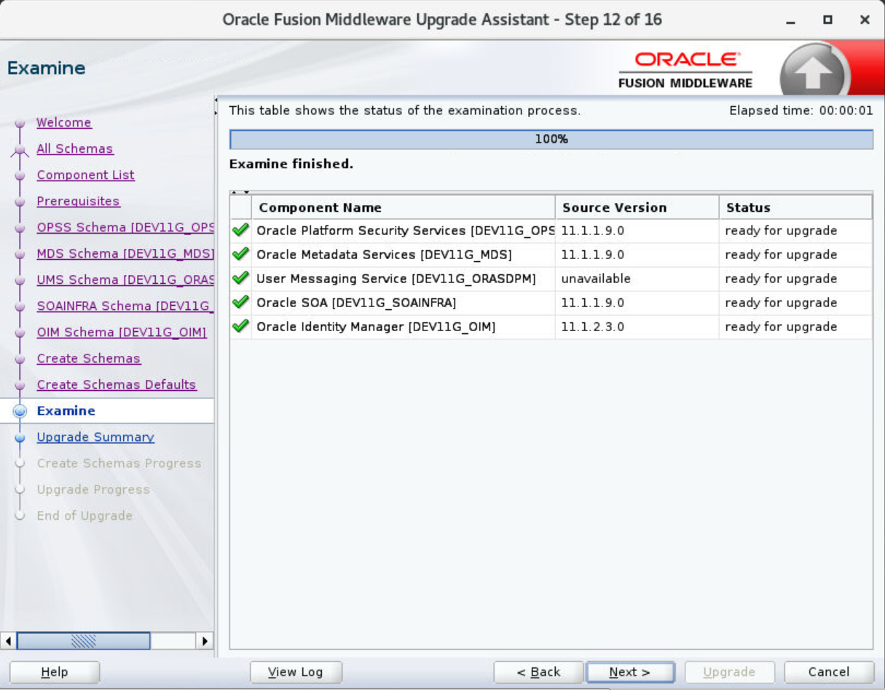
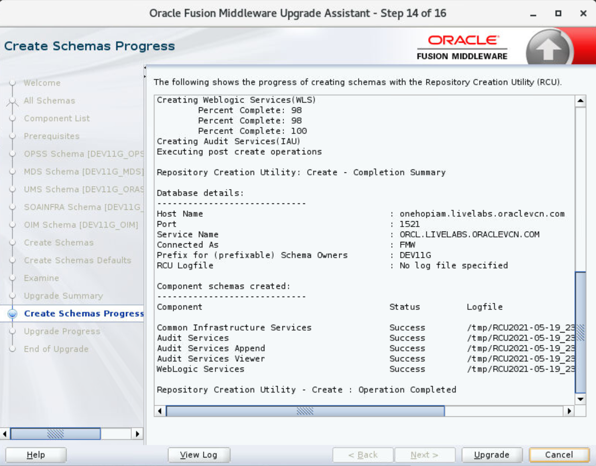
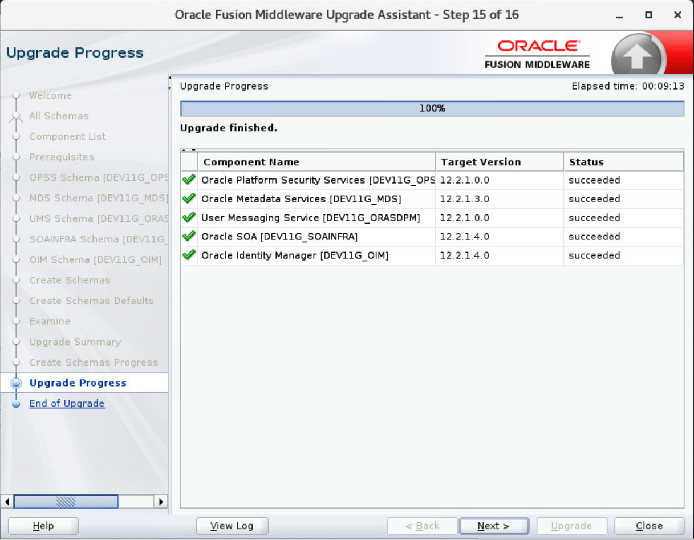
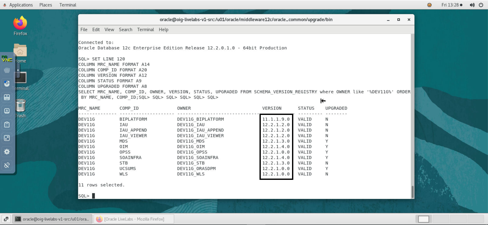
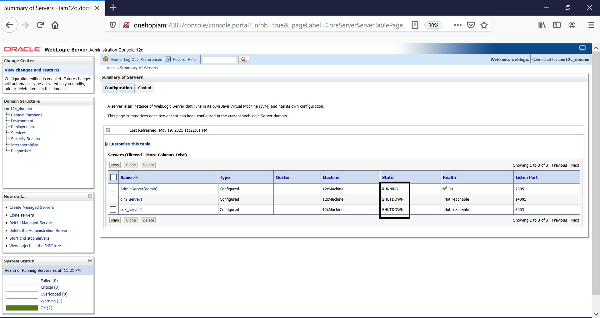
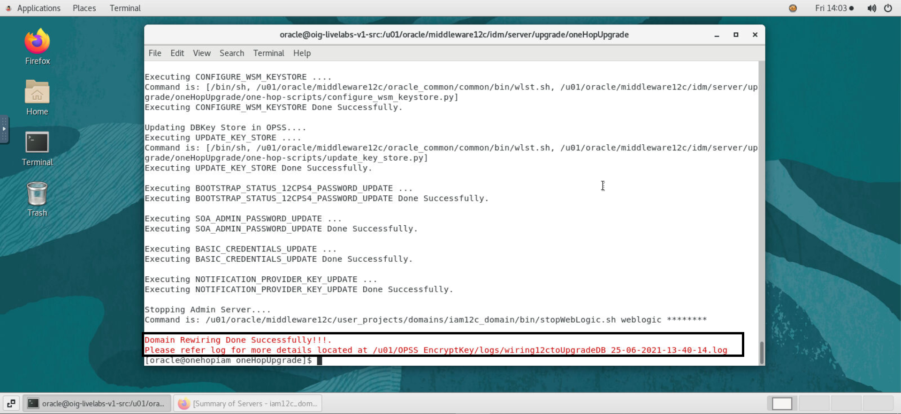

# One-Hop Upgrade

## Introduction

This lab walks you through the steps involved in one-hop upgrade of Oracle Identity Manager.

*Estimated Lab Time*: 50 minutes

### Objectives

In this lab, you will:
* Perform Schema Upgrade to 12c
* Rewire the upgraded schemas of the OIM 11g setup with the OIM 12c setup

### Prerequisites

* A Free Tier, Paid or LiveLabs Oracle Cloud account
* SSH Private Key to access the host via SSH
* You have completed:
      - Lab 1: Initialize the workshop Environment
      - Lab 2: Pre-Upgrade Requirements

## **STEP 1:** Identify existing schemas available for upgrade

1. Connect to the database as a *sys* user and Run the following SQL query to check the versions of the existing domains

    ```
    <copy>sqlplus / as sysdba</copy>
    ```
    ```
  SQL> <copy>SET LINE 120
	COLUMN MRC_NAME FORMAT A14
	COLUMN COMP_ID FORMAT A20
	COLUMN VERSION FORMAT A12
	COLUMN STATUS FORMAT A9
	COLUMN UPGRADED FORMAT A8
	SELECT MRC_NAME, COMP_ID, OWNER, VERSION, STATUS, UPGRADED FROM SCHEMA_VERSION_REGISTRY where OWNER like '%DEV11G%' ORDER BY MRC_NAME, COMP_ID;</copy>
    ```

  We can observe that version 11g is displayed

    

    ```
    <copy>exit</copy>
    ```

## **STEP 2:** Run the upgrade assistant to perform schema upgrade

1. Navigate to the *oracle_common/upgrade/bin* directory

    ```
    <copy>cd /u01/oracle/middleware12c/oracle_common/upgrade/bin/</copy>
    ```

2. Set a parameter for the Upgrade Assistant to include the JVM encoding requirement

    ```
    <copy>export UA_PROPERTIES="-Dfile.encoding=UTF-8"</copy>
    ```

3. Start the Upgrade Assistant

    ```
    <copy>./ua</copy>
    ```
  The Upgrade Assistant is launched.

4. Upgrade type - *All schemas used by a domain*. Browse to 11g Domain home - */u01/oracle/middleware11g/user_projects/domains/iam11g_domain/*

    

5. Component list - Click *Next*

6. Prerequisite check - Make sure all the prerequisites have been met.

    

7. OPSS Schema

    ```
    DBA Username: <copy>FMW</copy>
    ```
    ```
    DBA Password: <copy>Welcom#123</copy>
    ```

    

8. MDS Schema - The same Username and Password is updated automatically - Click *Next*

9. UMS Schema - The same Username and Password is updated automatically - Click *Next*

10. SOAINFRA schema - The same Username and Password is updated automatically - Click *Next*

11. OIM Schema - The same Username and Password is updated automatically - Click *Next*

12. Create schemas - Make sure *Create missing schemas for specified domain* is checked. Click *Use same password for all schemas* and Enter the Schema password as *Welcom#123*

    ```
    Schema Password: <copy>Welcom#123</copy>
    ```

    

13. Examine - Click *Next*

    

14. Create schema progress - Once the schema creation is completed, click on *Upgrade*

    

15. Close the upgrade assistant once the upgrade is successfully completed.

    

## **STEP 3:** Verify the schema Upgrade

1. Connect to the database as a *sys* user and Run the following SQL query to check the version

    ```
    <copy>sqlplus / as sysdba</copy>
    ```
    ```
  SQL> <copy>SET LINE 120
	COLUMN MRC_NAME FORMAT A14
	COLUMN COMP_ID FORMAT A20
	COLUMN VERSION FORMAT A12
	COLUMN STATUS FORMAT A9
	COLUMN UPGRADED FORMAT A8
	SELECT MRC_NAME, COMP_ID, OWNER, VERSION, STATUS, UPGRADED FROM SCHEMA_VERSION_REGISTRY where OWNER like '%DEV11G%' ORDER BY MRC_NAME, COMP_ID;</copy>
    ```
  We can verify that the schema upgrade was successful by checking that the schema version has been properly updated to 12c.

    

## **STEP 4:** Cleaning the temporary folder

1. As the */tmp* directory is set against the JVM *java.io.tmpdir* property, any unwanted files in the */tmp* folder can interfere with the OIG upgrade process and may result is MDS corruption. Hence, clean the */tmp* folder before starting the upgrade process.

    ```
    <copy>rm -rf /tmp/*</copy>
    ```

## **STEP 5:** Stopping 12c Managed Servers

1. Stop the SOA, OIM Managed Servers before rewiring the domain. Ensure that the Admin Server and Database are up and running. First, stop the OIM Server

    ```
    <copy>cd /u01/oracle/middleware12c/user_projects/domains/iam12c_domain/bin</copy>
    ```

    ```
    <copy>./stopManagedWebLogic.sh oim_server1</copy>
    ```

2. Once the OIM Server is shut down, stop the SOA server

    ```
    <copy>./stopManagedWebLogic.sh soa_server1</copy>
    ```

    Observe the Weblogic 12c console to verify that all the managed servers are in the ‘SHUTDOWN’ state.

    

## **STEP 6:** Rewiring the domain

1. Verify the values for the various properties in the *oneHop.properties* file

    ```
    <copy>vi /u01/Upgrade_Utils/oneHop.properties</copy>
    ```

2. Copy the *oneHop.properties* file to the *<12c_ORACLE_HOME>/idm/server/upgrade/oneHopUpgrade* location

    ```
    <copy>cp /u01/Upgrade_Utils/oneHop.properties /u01/oracle/middleware12c/idm/server/upgrade/oneHopUpgrade/</copy>

    ```
3. Navigate to the *<12c_ORACLE_HOME>/idm/server/upgrade/oneHopUpgrade* directory to invoke the *oneHopUpgrade.sh* script

    ```
    <copy>cd /u01/oracle/middleware12c/idm/server/upgrade/oneHopUpgrade/</copy>
    ```

    ```
    <copy>sh oneHopUpgrade.sh -p Welcom@123</copy>
    ```

  At runtime, provide the passwords as follows:
  - Admin server : **Welcom@123**
  - DEV11G_OIM : **Welcom#123**
  - DEV11G_SOAINFRA : **Welcom#123**
  - DEV11G_STB : **Welcom#123**
  - DEV11G_ORASDPM : **Welcom#123**
  - DEV11G_WLS : **Welcom#123**
  - DEV11G_MDS : **Welcom#123**
  - DEV11G_IAU_APPEND : **Welcom#123**
  - DEV11G_IAU_VIEWER : **Welcom#123**
  - DEV11G_OPSS : **Welcom#123**
  - Password which was used for Exporting OPSS encryption key from 11g : **Welcom@123**
  - ".xldatabasekey" keystore's password of OIG12csp4 setup : **Welcom@123**
  - ".xldatabasekey" keystore's key password of OIG12csp4 setup : **Welcom@123**
  - ".xldatabasekey" keystore's password of OIG11gR2PS3 setup : **Welcom@123**
  - ".xldatabasekey" keystore's key password of OIG11gR2PS3 setup : **Welcom@123**

  Rewiring takes about 10-15 minutes to complete.
  Wait until the following message is displayed – “Rewiring done successfully”

      

  The 12c domain is now wired to the upgraded 11g schema. At this point, all the servers of 12c domain are shut down. Proceed to the next lab to restart all the servers and complete the upgrade process.

You may now [proceed to the next lab](#next).

## Acknowledgements
* **Author** - Keerti R, Brijith TG, Anuj Tripathi, NATD Solution Engineering
* **Contributors** -  Keerti R, Brijith TG, Anuj Tripathi
* **Last Updated By/Date** - Keerti R, NATD Solution Engineering, June 2021
