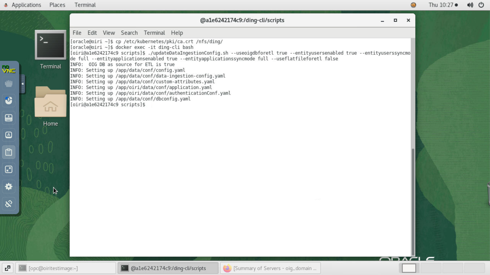
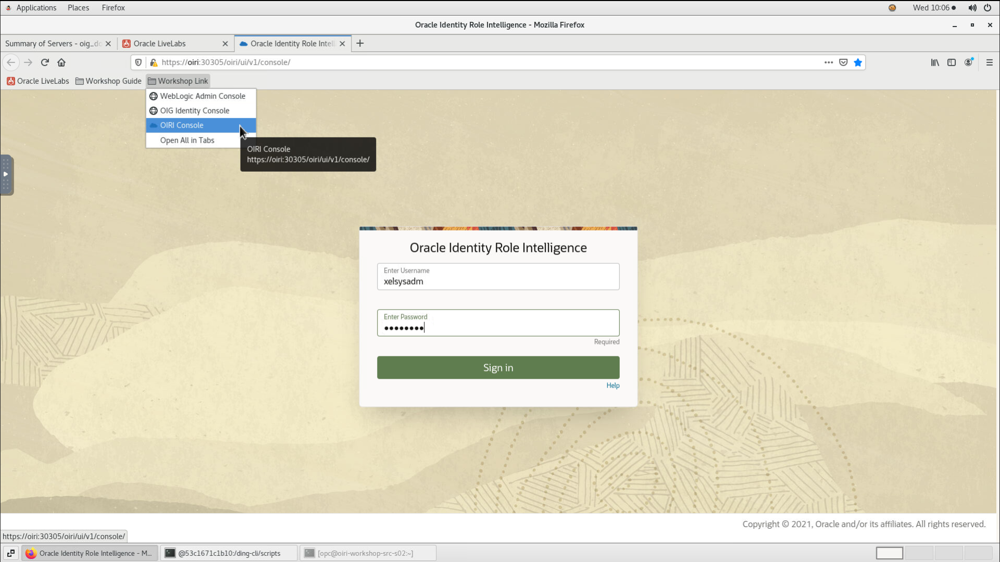
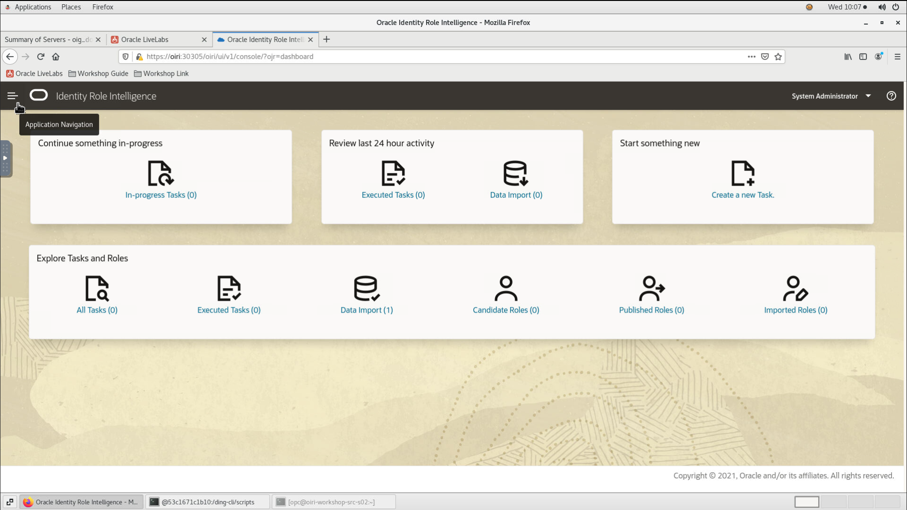
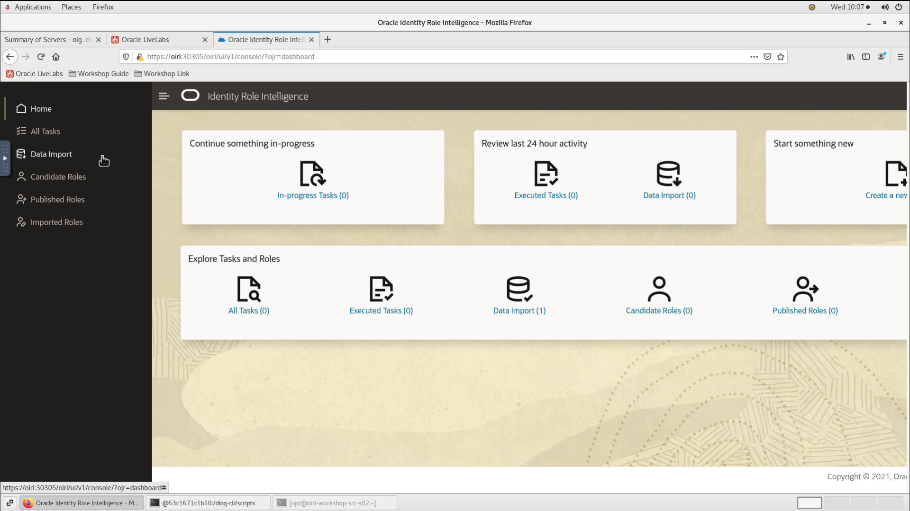
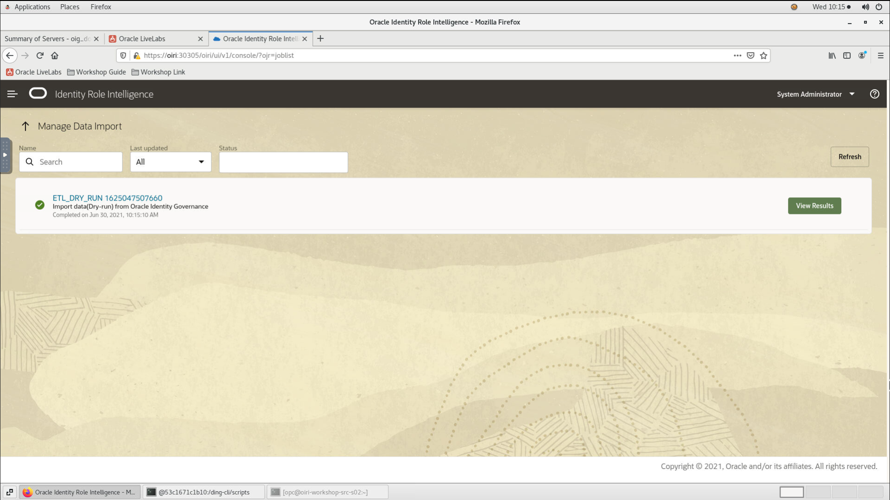
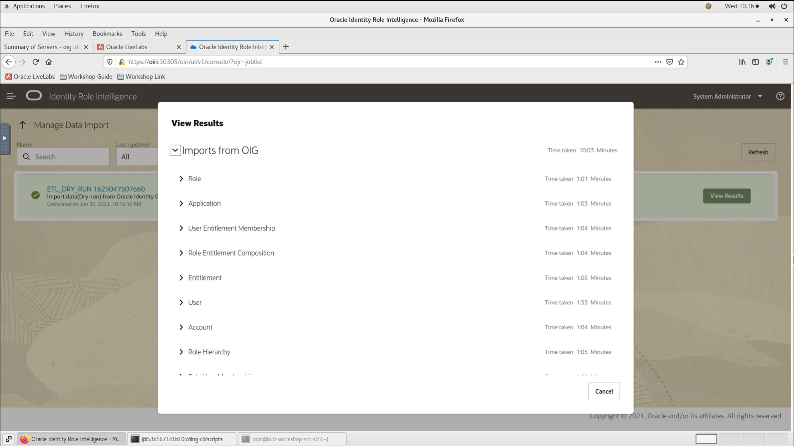
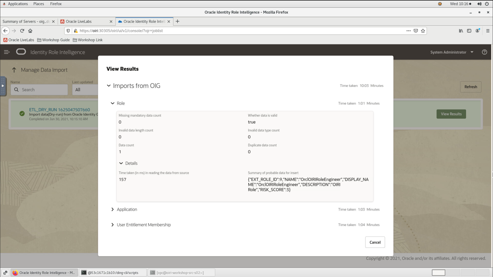
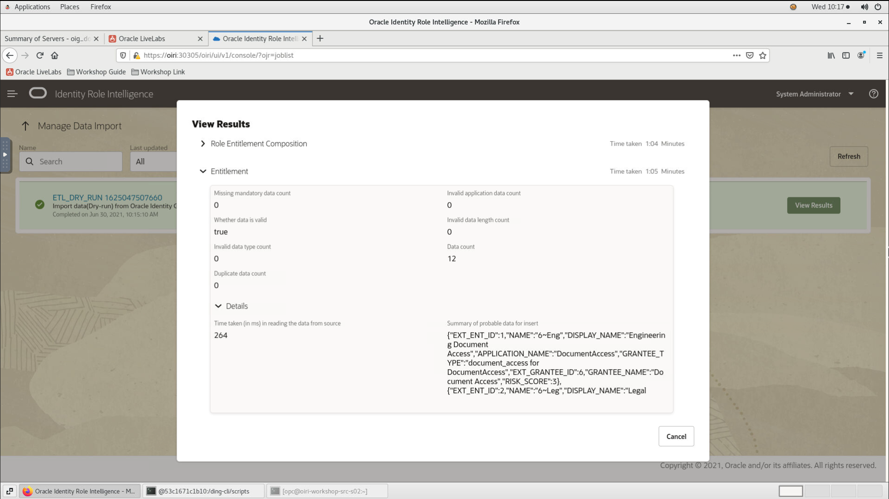
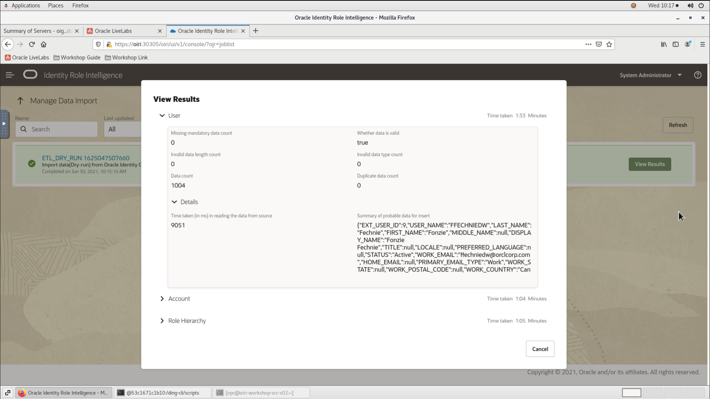
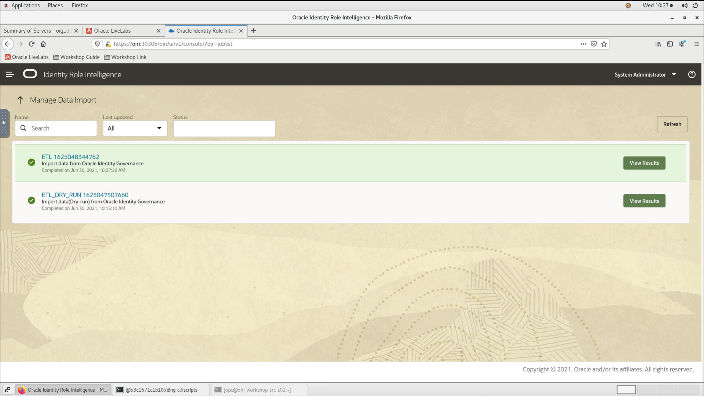

# Import data into OIRI from Oracle Identity Governance

## Introduction

Data import, also called data ingestion, is the process of importing entity data from a source to the Oracle Identity Role Intelligence (OIRI) database. OIRI uses a data ingestion command-line tool (DING CLI) to fetch and load entity data from third-party sources, namely Oracle Identity Governance (OIG) database or flat files.
As part of the data import process, data from the source, such as OIG database or flat files, is loaded into the following tables of the OIRI database:
`USERS`, `APPLICATIONS`, `ACCOUNTS`, `ENTITLEMENTS`, `ASSIGNED_ENTS`, `ROLES`, `ROLE_USER_MSHIP`, `ROLE_ENT_COMPOSI`, `ROLE_HIERARCHY`, `ORGANIZATIONS`

*Estimated Lab Time*:

### Objectives

In this lab, you will:
* Configure Data Import from Oracle Identity Governance Database
* Perform a dry data import run
* Perform an actual data import run to extract the entity data from the OIG database and load it to the OIRI database tables
* Verify and review the data import process

### Prerequisites

* A Free Tier, Paid or LiveLabs Oracle Cloud account
* SSH Private Key to access the host via SSH
* You have completed:
      - Lab 1: Initialize the workshop Environment
      - Lab 2: Deploy OIRI in the local Kubernetes node

## **STEP 1:** Starting the data load process

1. Copy ca.crt from K8S Master

    ```
    <copy>cp /etc/kubernetes/pki/ca.crt /nfs/ding/</copy>
    ```

2. Run ding-cli container and update the existing data load configuration to import entity data from Oracle Identity Governance database

    ```
    <copy>docker exec -it ding-cli bash</copy>
    ```
    ```
    <copy>./updateDataIngestionConfig.sh --useoigdbforetl true --entityusersenabled true --entityuserssyncmode full --entityapplicationsenabled true --entityapplicationssyncmode full --useflatfileforetl false</copy>
    ```


    


## **STEP 2:** Perform a Dry Import Run

1. Before data import (or data ingestion), perform a dry run to validate if the data fits into the OIRI database. This will fetch data from Oracle Identity Governance database and validate it against the metadata of the OIRI database

    ```
    <copy>ding-cli --config=/app/data/conf/config.yaml data-ingestion dry-run /app/data/conf/data-ingestion-config.yaml</copy>
    ```

## **STEP 3:** Sign in to the OIRI user interface and validate the dry data import

1. Sign in to Identity Role Intelligence user interface. Launch a browser window and click on the bookmark *OIRI*. The OIRI account sign in page appears. Enter the username and password

    ```
    Username: <copy>xelsysadm</copy>
    ```
    ```
    Password: <copy>Welcome1</copy>
    ```


    


2. Click the Application Navigation menu icon on the top left of the page, and click *Data Import* to open the Manage Data Import page with a list of all the data import tasks

    

        


3. Verify that the dry data import run has been completed successfully. Click *View Results* against the Import data(dry-run) from Oracle Identity Governance task. Alternatively, you can click the data import task name. The *View Results* window is displayed with the result for data import from Oracle Identity Governance database

    


4. Expand each entity to review the details of the data import of that entity, such as duplicate data count, whether or not dataset is valid, and the count of invalid data type

    

    

    

    

    

5. Click Cancel to close the View Results window


## **STEP 4:** Data Import from Oracle Identity Governance

1. Run the actual data import process

    ```
    <copy>ding-cli --config=/app/data/conf/config.yaml data-ingestion start /app/data/conf/data-ingestion-config.yaml</copy>
    ```

## **STEP 5:** Validate the data import task

1. Access the OIRI console from the browser window

2. Click the Application Navigation menu icon on the top left of the page, and click *Data Import* to open the Manage Data Import page with a list of all the data import tasks

3. Verify that the data import from OIG has been completed successfully. Click *View Results* against the Import data from Oracle Identity Governance task. Alternatively, you can click the data import task name. The *View Results* window is displayed with the result for data import from Oracle Identity Governance database

    

4. Expand each entity to review the details of the data import of that entity

    

5. Click Cancel to close the View Results window


You may now [proceed to the next lab](#next).

## Acknowledgements
* **Author** - Keerti R, Brijith TG, Anuj Tripathi, NATD Solution Engineering
* **Contributors** -  Keerti R, Brijith TG, Anuj Tripathi
* **Last Updated By/Date** - Keerti R, NATD Solution Engineering, June 2021
