# Deploy OIRI in the local Kubernetes node

## Introduction

This lab walks you through the steps required in configuring Oracle Identity Role Intelligence which involves setting up the configuration files, creating the wallet and installing the Helm chart.

*Estimated Lab Time*:

### Objectives

In this lab, you will:
* Load the OIRI docker images
* Set up the Kubernetes configuration files
* Create OIRI and ding Wallets
* Create and Seed the Database schema
* Install the OIRI Helm chart


### Prerequisites

* An Oracle Cloud Account - Please view this workshop's LiveLabs landing page to see which environments are supported
* SSH Private Key to access the host via SSH
* You have completed:
      - Lab 1: Initialize the workshop Environment


## **STEP 1:** Load the OIRI docker images

The OIRI service comprises of four images as follows:
  - oiri: OIRI service
  - oiri-cli: OIRI command line interface
  - oiri-ding: For data import
  - oiri-ui: Identity Role Intelligence user interface
Follow the steps below to load these docker images

1. Open a terminal session as *oracle* user

    ```
    <copy>sudo su - oracle</copy>
    ```
    ```
    <copy>cd /u01/setup/oiri/oiri-12.2.1.4.210423</copy>
    ```
    ```
    <copy>docker load --input oiri-12.2.1.4.210423.tar</copy>
    ```
    ```
    <copy>docker load --input oiri-ui-12.2.1.4.210423.tar</copy>
    ```
    ```
    <copy>docker load --input oiri-cli-12.2.1.4.210423.tar</copy>
    ```
    ```
    <copy>docker load --input oiri-ding-12.2.1.4.210423.tar</copy>
    ```

    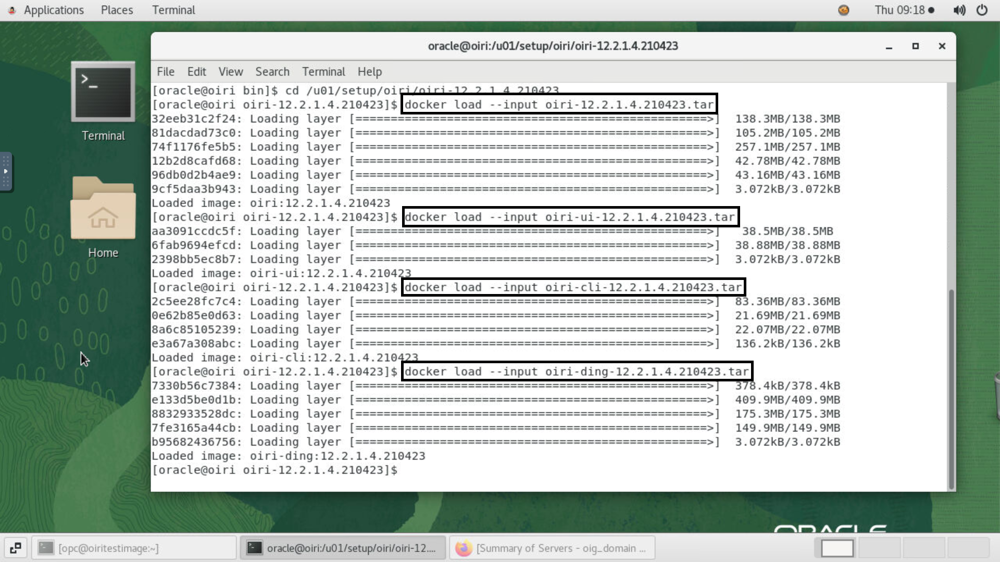

2. Verify the images

    ```
    <copy>docker images | grep 12.2.1.4.210423</copy>
    ```

    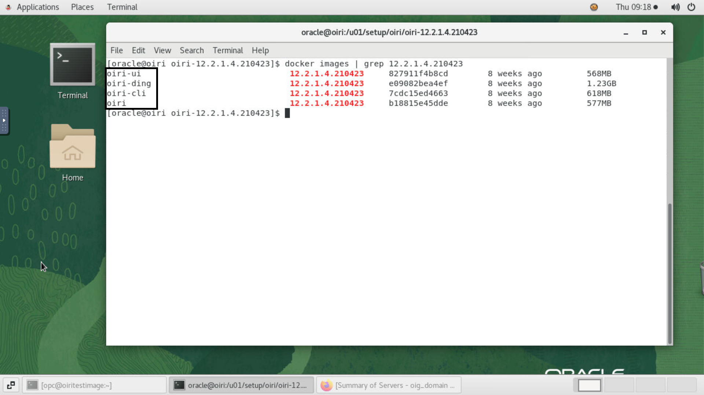

## **STEP 2:** Set up the configuration files

Set up the files required for configuring data import (or data ingestion) and Helm chart

1. Create the directories with appropriate write permissions

    ```
    <copy>mkdir /nfs/ding</copy>
    ```
    ```
    <copy>mkdir /nfs/oiri</copy>
    ```
    ```
    <copy>mkdir /u01/k8s/</copy>
    ```
    ```
    <copy>chmod -R 775 /nfs/ding/</copy>
    ```
    ```
    <copy>chmod -R 775 /nfs/oiri/</copy>
    ```
    ```
    <copy>chmod -R 775 /u01/k8s/</copy>
    ```

2. Note down the private IP of your instance as mentioned in the hosts file

    ```
    <copy>vi /etc/hosts</copy>
    ```
  For example:

    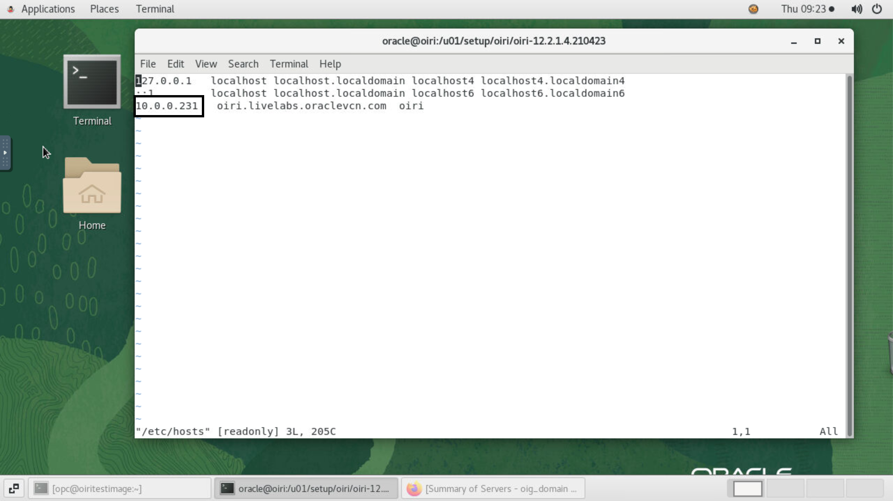


3. Run *oiri-cli* container

    ```
    <copy>docker run -d --name oiri-cli \
  -v /nfs/ding/:/app/ \
  -v /nfs/oiri/:/app/oiri \
  -v /u01/k8s/:/app/k8s \
  --group-add 54321 \
  oiri-cli:12.2.1.4.210423 \
  tail -f /dev/null</copy>
    ```

4. Copy the Kube config content from the Kubernetes cluster. Copy the contents of the */home/oracle/.kube/config* file into a notepad or clipboard. Make sure to zoom out and copy all the lines in the file

    ```
    <copy>vi /home/oracle/.kube/config</copy>
    ```

    

5. Go to *oiri-cli* container

    ```
    <copy>docker exec -it oiri-cli /bin/bash</copy>
    ```

6. Create the Kube config file. Insert the content copied from the */home/oracle/.kube/config* file and save the file

    ```
    <copy>vi /app/k8s/config</copy>
    ```

    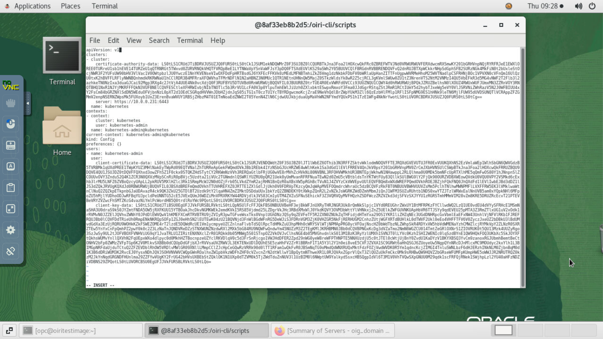


    ```
    <copy>chmod 400 /app/k8s/config</copy>
    ```

7. Verify the kubectl and helm version. Ensure that the *helm version* and *kubectl version* commands run successfully without any warning or error, and display the version.

    ```
    <copy>kubectl version</copy>
    ```
    ```
    <copy>helm version</copy>
    ```

    


  If there is an error, it could mean that the Kube config file content is not copied correctly. Copy and paste the kube config file content as per the previous steps 4-6 and try again

8. Set up configuration files. Replace the `<VM IP>` parameter with the instance private IP address noted from the */etc/hosts* file in step 2

    ```
    <copy>./setupConfFiles.sh -m prod \
  --oigdbhost <VM IP> \
  --oigdbport 1521 \
  --oigdbsname oiri.livelabs.oraclevcn.com \
  --oiridbhost <VM IP> \
  --oiridbport 1521 \
  --oiridbsname oiri.livelabs.oraclevcn.com \
  --useflatfileforetl true \
  --sparkmode k8s \
  --dingnamespace ding \
  --dingimage oiri-ding:12.2.1.4.210423 \
  --k8scertificatefilename ca.crt \
  --sparkk8smasterurl k8s://https://<VM IP>:6443 \
  --oigserverurl http://<VM IP>:14000 \</copy>
    ```

  For example:

    ```
  ./setupConfFiles.sh -m prod \
  --oigdbhost 10.0.0.231 \
  --oigdbport 1521 \
  --oigdbsname oiri.livelabs.oraclevcn.com \
  --oiridbhost 10.0.0.231 \
  --oiridbport 1521 \
  --oiridbsname oiri.livelabs.oraclevcn.com \
  --useflatfileforetl true \
  --sparkmode k8s \
  --dingnamespace ding \
  --dingimage oiri-ding:12.2.1.4.210423 \
  --k8scertificatefilename ca.crt \
  --sparkk8smasterurl k8s://https://10.0.0.231:6443 \
  --oigserverurl http://10.0.0.231:14000 \
    ```

    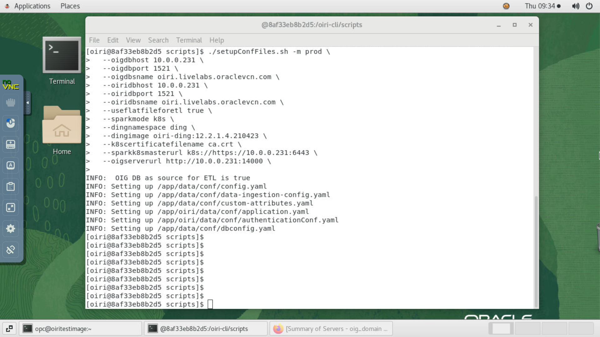

9. Verify that the configuration files have been generated

    ```
    <copy>ls /app/data/conf/</copy>
    ```
    ```
    <copy>ls /app/oiri/data/conf</copy>
    ```

    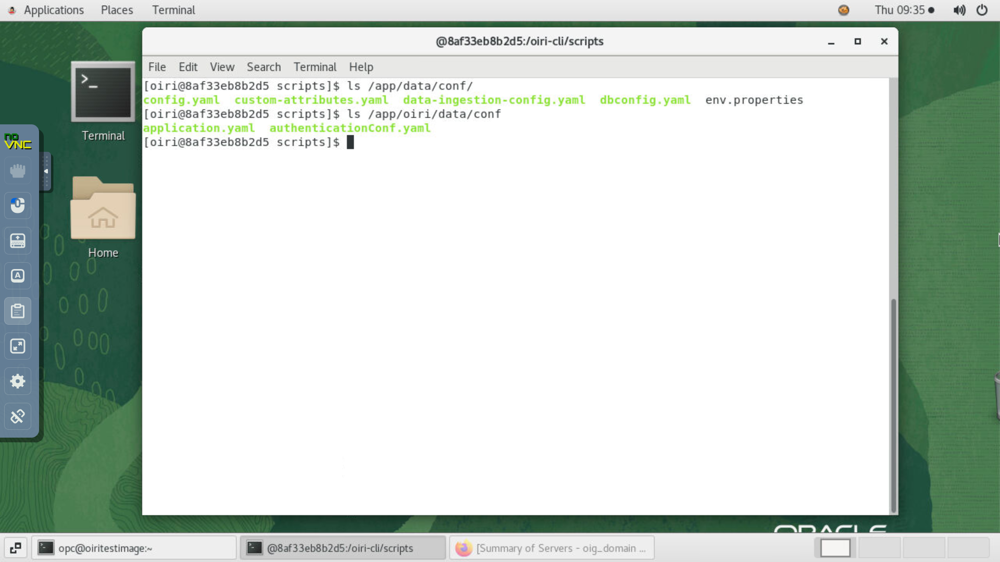

10.	Set up the values.yaml file to be used for Helm chart. Replace the `<VM IP>` parameter with the instance private IP address noted from the */etc/hosts* file in step 2

    ```
    <copy>./setupValuesYaml.sh \
   --oiriapiimage oiri:12.2.1.4.210423 \
   --oirinfsserver <VM IP> \
   --oirinfsstoragepath /nfs/oiri \
   --oirinfsstoragecapacity 10Gi \
   --oiriuiimage oiri-ui:12.2.1.4.210423 \
   --dingimage oiri-ding:12.2.1.4.210423 \
   --dingnfsserver <VM IP> \
   --dingnfsstoragepath /nfs/ding \
   --dingnfsstoragecapacity 10Gi \
   --ingresshostname oiri \
   --sslsecretname "oiri-tls-cert"</copy>
    ```

  For example:

    ```
  ./setupValuesYaml.sh \
   --oiriapiimage oiri:12.2.1.4.210423 \
   --oirinfsserver 10.0.0.231 \
   --oirinfsstoragepath /nfs/oiri \
   --oirinfsstoragecapacity 10Gi \
   --oiriuiimage oiri-ui:12.2.1.4.210423 \
   --dingimage oiri-ding:12.2.1.4.210423 \
   --dingnfsserver 10.0.0.231 \
   --dingnfsstoragepath /nfs/ding \
   --dingnfsstoragecapacity 10Gi \
   --ingresshostname oiri \
   --sslsecretname "oiri-tls-cert"
    ```

11.	Verify that values.yaml has been generated and exit from the container

    ```
    <copy>ls /app/k8s/</copy>
    ```
    ```
    <copy>exit</copy>
    ```

    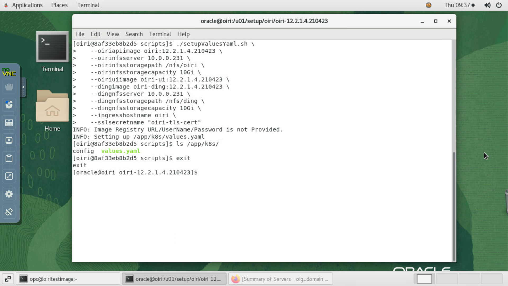


## **STEP 3:** Update entity parameters for data import

1. Run the following command to be able to update entity parameters for data import

    ```
    <copy>docker run -d --name ding-cli \
  -v /nfs/ding/:/app/ \
  -v /nfs/oiri/:/app/oiri \
  -v /u01/k8s/:/app/k8s \
  oiri-ding:12.2.1.4.210423 \
  tail -f /dev/null</copy>
    ```

## **STEP 4:** Wallet creation

1. Import the OIG certificate in the keystore. To do so, Export OIG certificate for signature verification

    ```
    <copy>cd /u01/oracle/config/domains/oig_domain/config/fmwconfig/</copy>
    ```
    ```
    <copy>keytool -export -rfc -alias xell -file xell.pem -keystore default-keystore.jks</copy>
    ```

  Enter the keystore password when prompted
      ```
      Password: <copy>Welcome1</copy>
      ```

  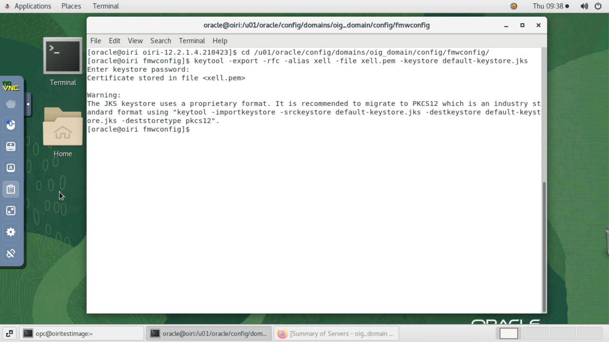

  The *default-keystore.jks* is located at *DOMAIN_HOME/config/fmwconfig*. The certificate you are exporting here protects the OIG REST API. It is not the same as the OIG server certificate.

2. Copy the *xell.pem* file exported from the OIG keystore to the */nfs/oiri/data/keystore/* directory.

    - Launch another terminal tab as *opc* user to copy the file

        ```
        <copy>sudo cp /u01/oracle/config/domains/oig_domain/config/fmwconfig/xell.pem /nfs/oiri/data/keystore/</copy>
        ```
        ```
        <copy>sudo chown opc:users /nfs/oiri/data/keystore/xell.pem</copy>
        ```
        ```
        <copy>ls -latr /nfs/oiri/data/keystore</copy>
        ```

        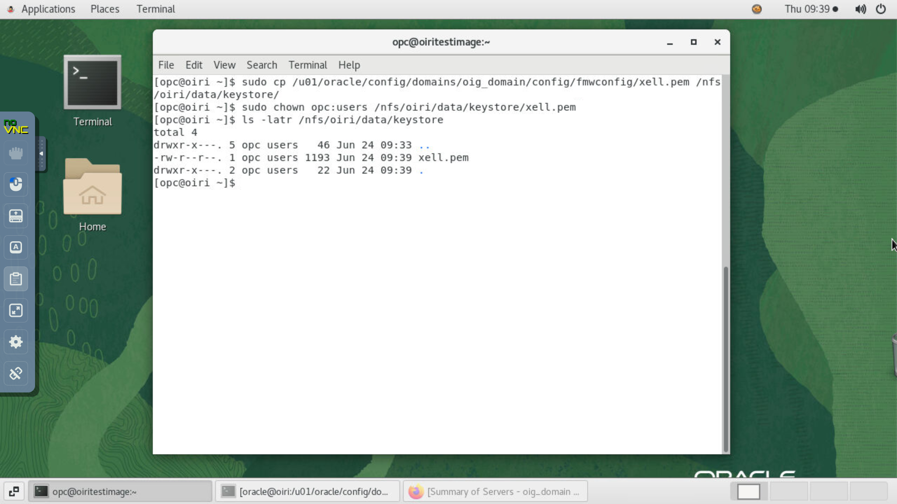


3. Switch back to the terminal session with *oracle* user and Generate a keystore inside the *oiri-cli* container

    ```
    <copy>sudo su - oracle</copy>
    ```
    ```
    <copy>docker exec -it oiri-cli /bin/bash</copy>
    ```
    ```
    <copy>keytool -genkeypair \
  -alias oirikey \
  -keypass Welcome1 \
  -keyalg RSA \
  -keystore /app/oiri/data/keystore/keystore.jks \
  -storetype pkcs12 \
  -storepass Welcome1</copy>
    ```

  The output is:

    ```
    What is your first and last name?
    [Unknown]:
    What is the name of your organizational unit?
    [Unknown]:
    What is the name of your organization?
    [Unknown]:
    What is the name of your City or Locality?
    [Unknown]:
    What is the name of your State or Province?
    [Unknown]:
    What is the two-letter country code for this unit?
    [Unknown]:
    Is CN=Unknown, OU=Unknown, O=Unknown, L=Unknown, ST=Unknown, C=Unknown correct?
    [no]:  yes
    ```

    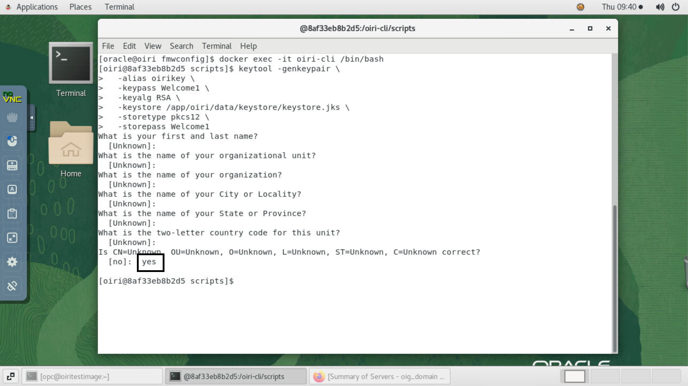

4. Import the certificate into OIRI keystore

    ```
    <copy>keytool -import \
   -alias xell \
   -file /app/oiri/data/keystore/xell.pem \
   -keystore /app/oiri/data/keystore/keystore.jks</copy>
    ```

    Enter the keystore password when prompted

    ```
    Password: <copy>Welcome1</copy>
    ```

    The output is:

    ```
    Trust this certificate? [no]: yes
    ```

    

5. Create the wallet

    ```
    <copy>oiri-cli --config=/app/data/conf/config.yaml wallet create</copy>
    ```

    Enter the following information when prompted:

    - OIRI DB UserName Prefix. Ex: dev,test,prod. Schema name will be <prefix> _OIRI: **DEV**
    - OIRI DB password: **Welcome1**
    - OIG DB UserName: **DEV_OIM**
    - OIG DB password: **Welcome1**
    - OIG Service Account UserName: **xelsysadm**
    - OIG Service Account password: **Welcome1**
    - OIRI KeyStore password: **Welcome1**
    - OIRI JWT Key Alias: **oirikey**
    - OIRI JWT Key password: **Welcome1**

    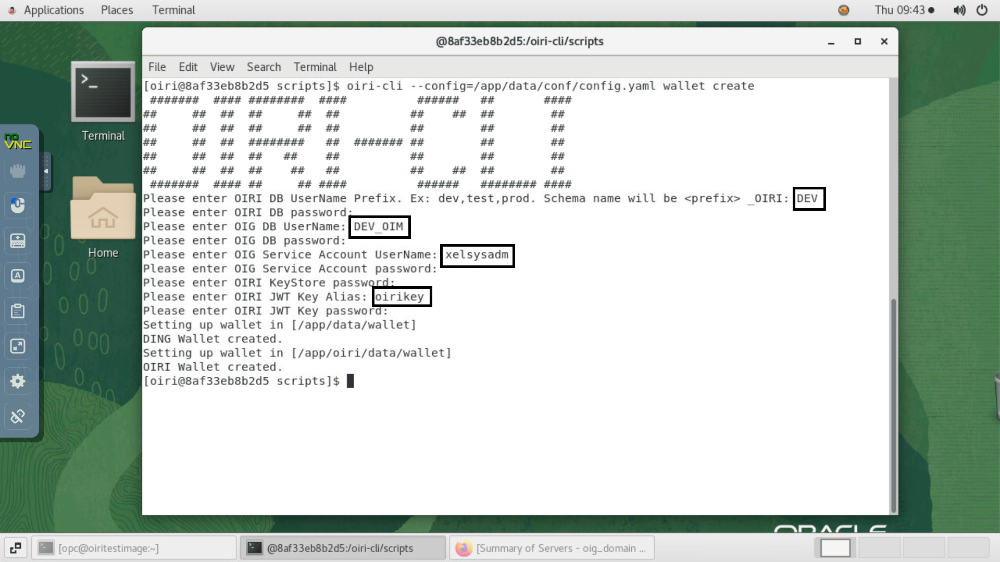


6. Verify that the OIRI and Ding wallets have been created

    ```
    <copy>ls /app/data/wallet</copy>
    ```
    ```
    <copy>ls /app/oiri/data/wallet</copy>
    ```

    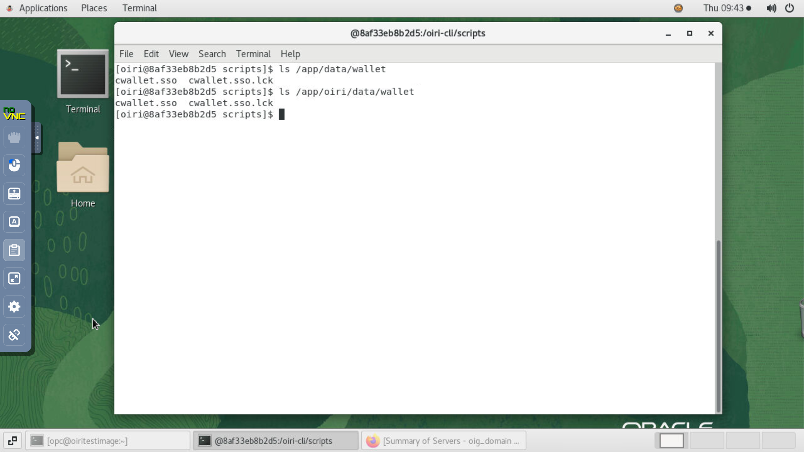


## **STEP 5:** Create and Seed OIRI Database Schema

1. Create the database user schema

    ```
    <copy>oiri-cli --config=/app/data/conf/config.yaml schema create /app/data/conf/dbconfig.yaml</copy>
    ```
  Enter the SYS User password when prompted.

    ```
    Password: <copy>Welcome1</copy>
    ```

    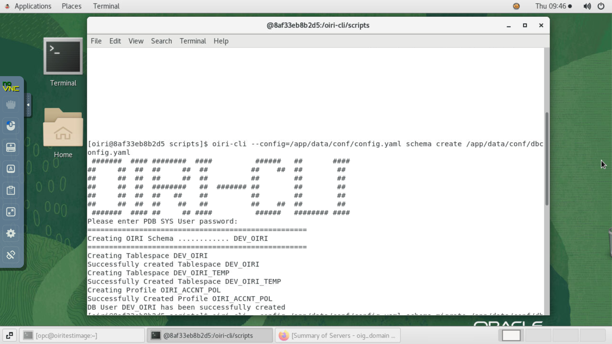

2. Seed the database schema

    ```
    <copy>oiri-cli --config=/app/data/conf/config.yaml schema migrate /app/data/conf/dbconfig.yaml</copy>
    ```

3. Verify the wallet

    ```
    <copy>./verifyWallet.sh</copy>
    ```

    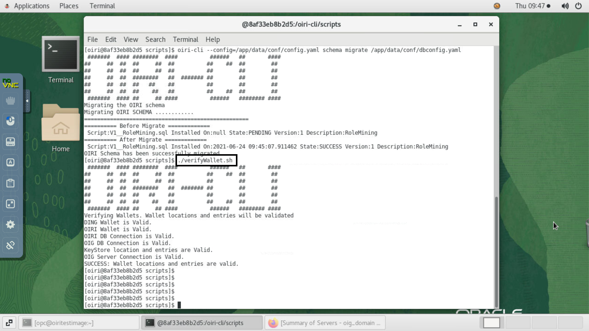

## **STEP 6:** Install the OIRI Helm chart

1. Create the following namespaces

    ```
    <copy>kubectl create namespace oiri</copy>
    ```
    ```
    <copy>kubectl create namespace ding</copy>
    ```
    ```
    <copy>exit</copy>
    ```

2. Enable SSL from a Docker container host machine that is outside the oiri-cli container

    ```
    <copy>cd ~</copy>
    ```
    ```
    <copy>openssl req -x509 -nodes -days 365 -newkey rsa:2048 -keyout tls.key -out tls.crt -subj "/CN=oiri"</copy>
    ```
    ```
    <copy>kubectl create secret tls oiri-tls-cert --key="tls.key" --cert="tls.crt"</copy>
    ```

3. Install the helm chart

    ```
    <copy>docker exec -it oiri-cli /bin/bash</copy>
    ```
    ```
    <copy>helm install oiri /helm/oiri -f /app/k8s/values.yaml</copy>
    ```

4. List the pods and ensure that all the pods are running

    ```
    <copy>kubectl get pods --all-namespaces</copy>
    ```
    ```
    <copy>exit</copy>
    ```

    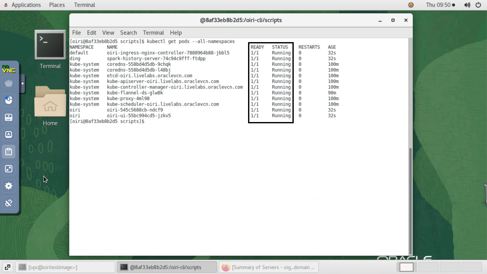


You may now [proceed to the next lab](#next).

## Acknowledgements
* **Author** - Keerti R, Brijith TG, Anuj Tripathi, NATD Solution Engineering
* **Contributors** -  Keerti R, Brijith TG, Anuj Tripathi
* **Last Updated By/Date** - Keerti R, NATD Solution Engineering, June 2021
