# Deploy Kubernetes Cluster And Start OIG Server

## Introduction

In this lab we will review and start all and deploy Kubernetes nodes required to successfully run this workshop.

*Estimated Lab Time*: 20 minutes

### Objectives

In this lab, you will:
* Create and Initialize Kubernetes Cluster
* Start the OIG 12c domain. Analyze different roles and entitlements created in OIG

### Prerequisites

* An Oracle Cloud Account - Please view this workshop's LiveLabs landing page to see which environments are supported
* SSH Private Key to access the host via SSH

*Note: If you have a **Free Trial** account, when your Free Trial expires your account will be converted to an **Always Free** account. You will not be able to conduct Free Tier workshops unless the Always Free environment is available. **[Click here for the Free Tier FAQ page.](https://www.oracle.com/cloud/free/faq.html)***


## **STEP 1:** Initialize the Kubernetes cluster and the pod network add-on

1. Open a terminal session.

    ```
    <copy>sudo swapoff -a</copy>
    ```
    ```
    <copy>sudo setenforce 0</copy>
    ```
    ```
    <copy>sudo sed -i --follow-symlinks 's/SELINUX=enforcing/SELINUX=disabled/g' /etc/sysconfig/selinux</copy>
    ```

2. Deploy and initialize the pod network and make sure that the pod network does not overlap with any of the host networks.

    ```
    <copy>sudo kubeadm init --pod-network-cidr=10.244.0.0/16</copy>
    ```

3. Enable kubectl to work with non-root users.

    ```
    <copy>sudo cp -i /etc/kubernetes/admin.conf /home/oracle/.kube/config</copy>
    ```
    ```
    <copy>sudo chown oracle:oinstall /home/oracle/.kube/config</copy>
    ```

4. Launch another terminal session and schedule Pods on the control-plane node.

    ```
    <copy>kubectl taint nodes --all node-role.kubernetes.io/master-</copy>
    ```

5. List all pods in all namespaces.

    ```
    <copy>kubectl get pods --all-namespaces</copy>
    ```

6. Update the resources in the cluster and make sure all pods are in the “Running” state.

    ```
    <copy>kubectl apply -f https://raw.githubusercontent.com/coreos/flannel/master/Documentation/kube-flannel.yml</copy>
    ```
    Wait for 1-2 minutes and list all the pods and make sure they are in the *Running* state.

    ```
    <copy>kubectl get pods --all-namespaces</copy>
    ```

    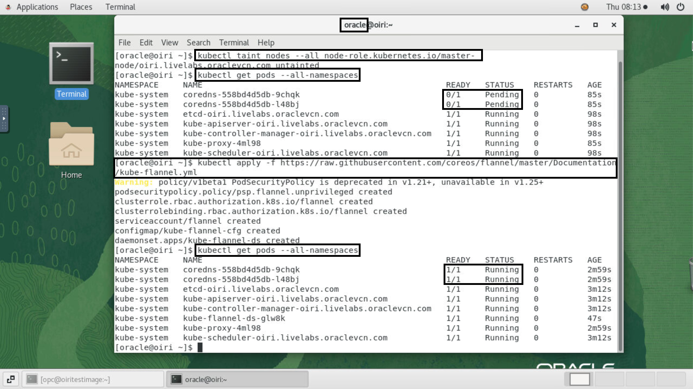

## **STE 2:** Start the Oracle Identity Governance (OIG) Server and analyze the roles in OIG

<!-- 1. Verify that the OIG Database is running.

    ```
    <copy>systemctl status oracle-database.service</copy>
    ```

     -->

1. Verify that the Admin Server is running. Open a browser window and Click on the bookmark *Workshop links* and click on *Weblogic Admin Console* to access the Weblogic console.

    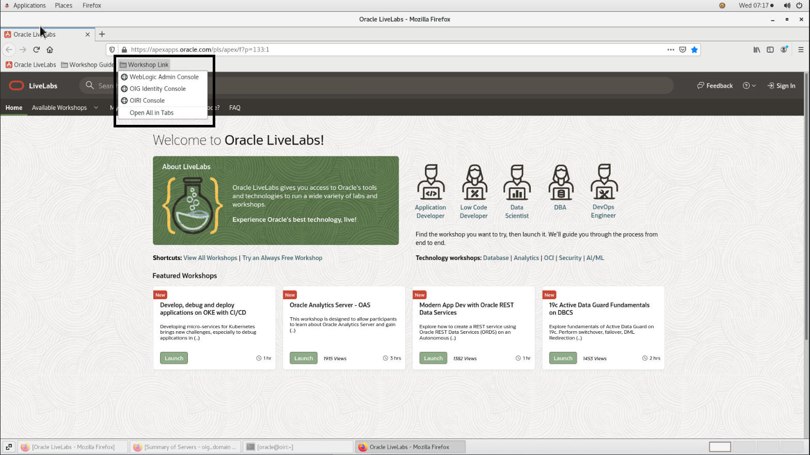

2. Sign in to the console with the weblogic credentials.

    ```
    Username:<copy>weblogic</copy>
    ```
    ```
    Password:<copy>Welcome1</copy>
    ```

    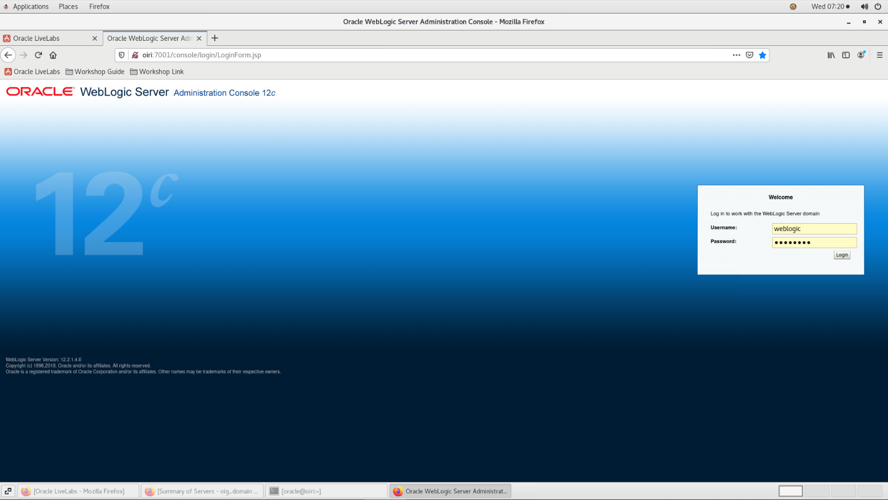

3. On the Weblogic console, Click on *Servers* under *Environment*. Under Summary of servers, click on *Control*.

    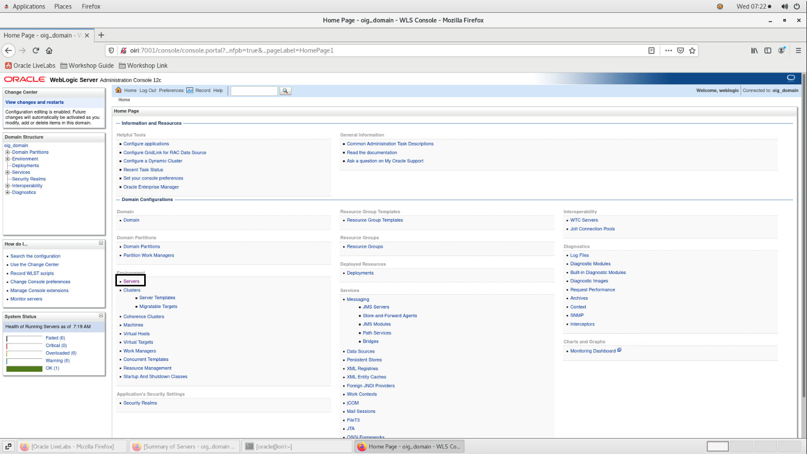

    Select SOA and OIM server and click on *Start*.

    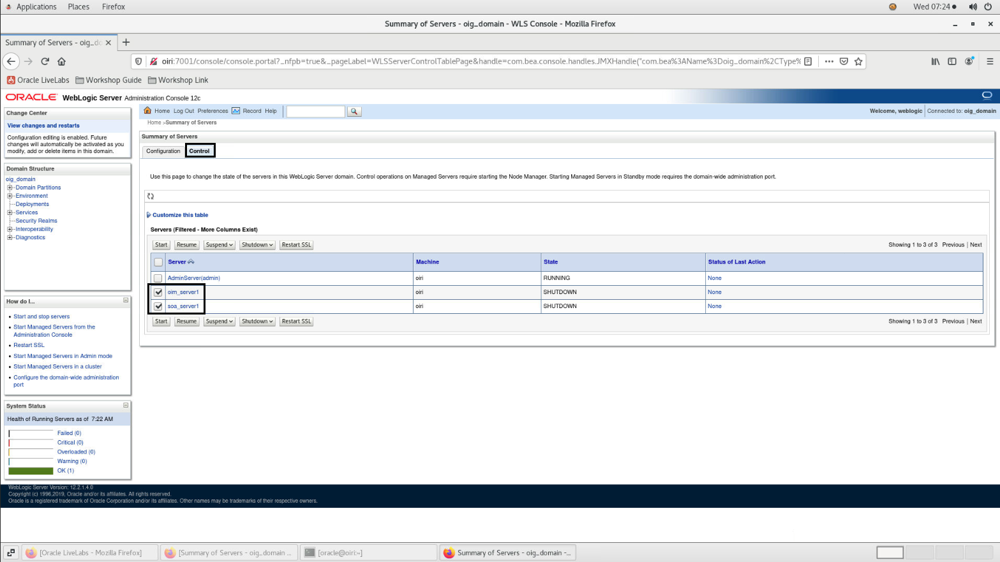
    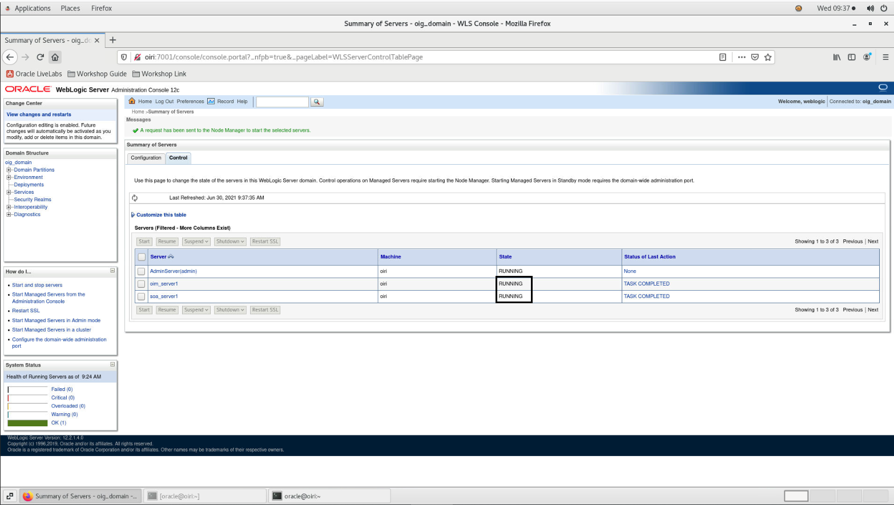

4. Open another browser tab and Click on the bookmark *Workshop links* and click on *OIG Identity Console*. Login to the Identity console using the following credentials:

    ```
    Username: <copy>xelsysadm</copy>
    ```
    ```
    Password: <copy>Welcome1</copy>
    ```

    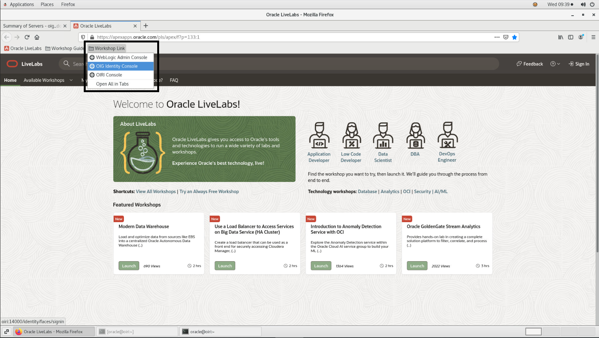

    

5. Click on *Manage* on the top right corner. Then, click on *Users* and notice that about 1000 test users have been created with respective roles and entitlements. Also notice that the users are provisioned to the "Document Access" application.

    

    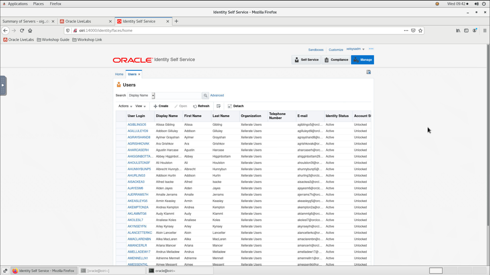

    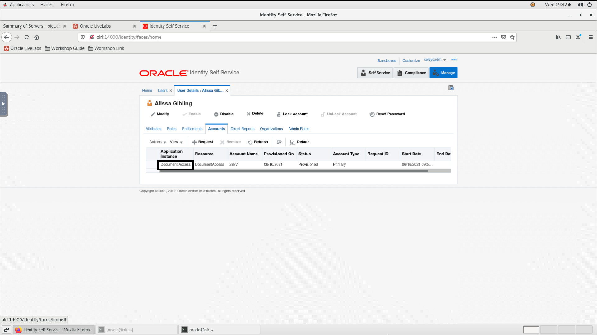


6. Now click on *Home*. Then, click on *Roles and Access policies* and select *Roles*. Notice that the role *OrclOIRIRoleEngineer* is created and assigned to the application user so that the user can login to the OIRI application. In this example, this role is assigned to the *xelsysadm* user.

    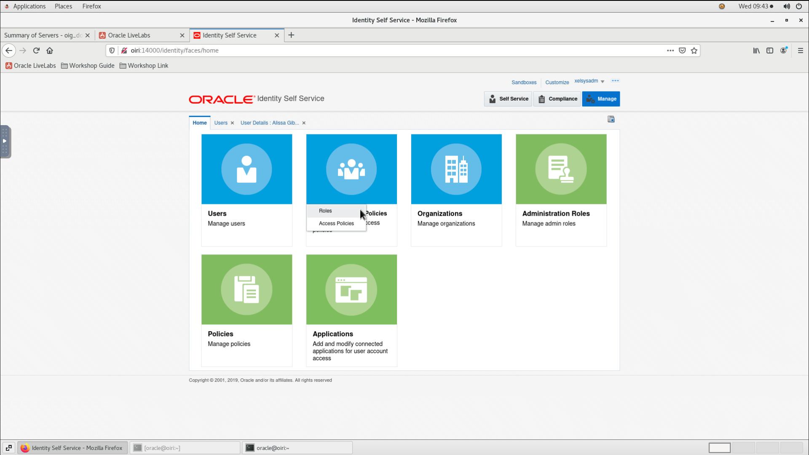

    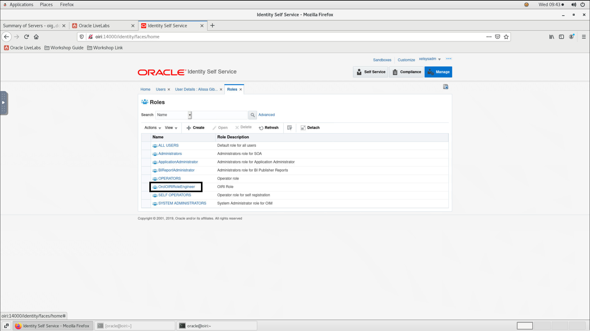

You may now [proceed to the next lab](#next).

## Acknowledgements
* **Author** - Keerti R, Brijith TG, Anuj Tripathi, NATD Solution Engineering
* **Contributors** -  Keerti R, Brijith TG, Anuj Tripathi
* **Last Updated By/Date** - Ashish Kumar, NATD Solution Engineering (LiveLabs), June 2021
