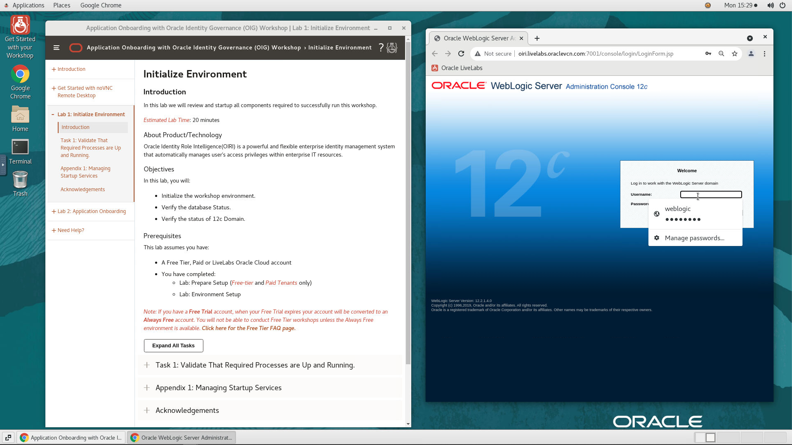
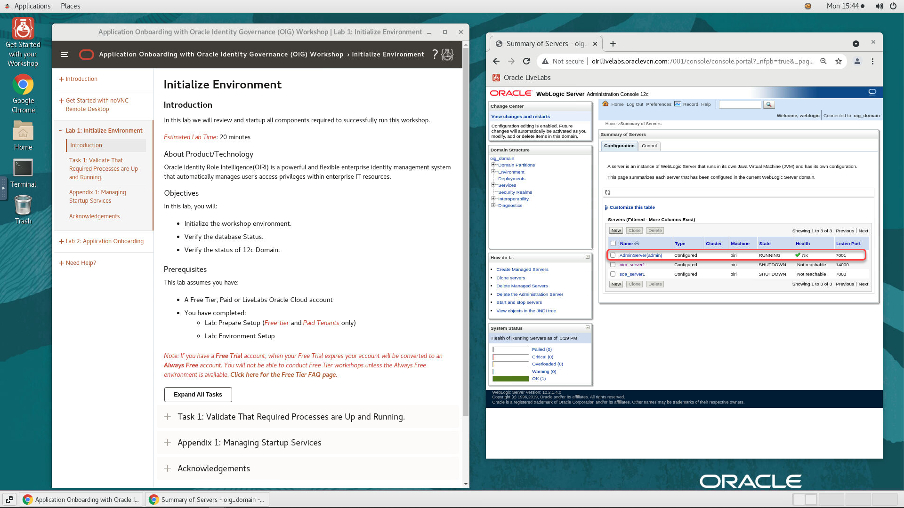
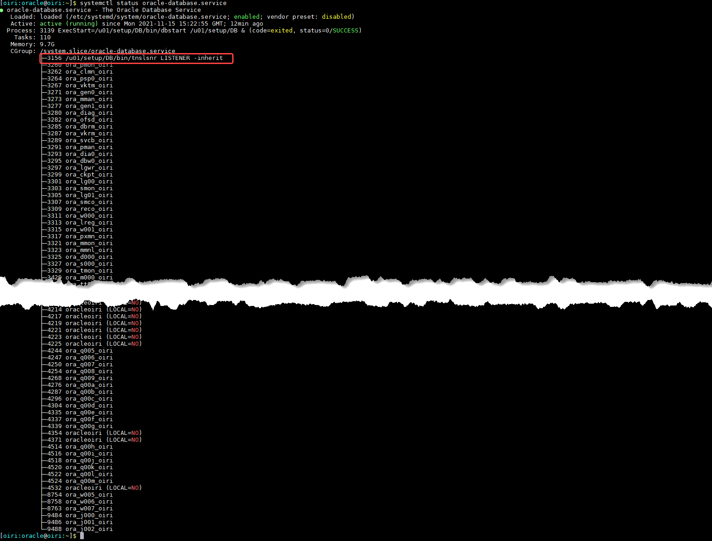

# Initialize Environment

## Introduction

In this lab we will review and startup all components required to successfully run this workshop.

*Estimated Lab Time*: 20 minutes

### About Product/Technology
Oracle Identity Role Intelligence(OIRI) is a powerful and flexible enterprise identity management system that automatically manages user's access privileges within enterprise IT resources.

### Objectives

In this lab, you will:
* Initialize the workshop environment.
* Verify the database Status.
* Verify the status of 12c Domain.
* You have completed:
      - Lab : Generate SSH Keys (Free-tier and Paid Tenants only)
      - Lab : Prepare Setup (Free-tier and Paid Tenants only)
      - Lab : Environment Setup

### Prerequisites

* An Oracle Cloud Account - Please view this workshop's LiveLabs landing page to see which environments are supported
* SSH Private Key to access the host via SSH
*

*Note: If you have a **Free Trial** account, when your Free Trial expires your account will be converted to an **Always Free** account. You will not be able to conduct Free Tier workshops unless the Always Free environment is available. **[Click here for the Free Tier FAQ page.](https://www.oracle.com/cloud/free/faq.html)***


## **STEP 1:** Validate That Required Processes are Up and Running.
1. Now with access to your remote desktop session, proceed as indicated below to validate your environment before you start executing the subsequent labs. The following Processes should be up and running:

    - Database Listener
    - Database Server
    - Admin Server (Admin server will take about 3-4 mins to start)

2. On the *Firefox* window on the right preloaded Weblogic 12c console, if not then refresh the page or wait 2-3min to start Admin server then click on the *Username* field and select the saved credentials to login. These credentials have been saved within *Firefox* and are provided below for reference.

    ```
    Username: <copy>weblogic</copy>
    ```

    ```
    Password: <copy>Welcome1</copy>
    ```

    

3. Confirm successful login. Please note that it takes about 5 minutes after instance provisioning for all processes to fully start.
    - On the Weblogic console, Click on *Servers* under *Environment* and verify that the Admin server is in the ‘RUNNING’ state.
    

    If successful, the page above is displayed and as a result your environment is now ready.  

    You may now [proceed to the next lab](#next).

4. If you are still unable to login or the login page is not functioning after reloading from the *Workshop Links* bookmark folder, open a terminal session and proceed as indicated below to validate the services.

    - Database and Listener
        ```
        <copy>
        sudo systemctl status oracle-database
        </copy>
        ```
        

    - WLS Admin Server And Node Manager

        ```
        <copy>
        sudo systemctl status oiri-weblogic.service
        </copy>
        ```
        

        ```
        <copy>
        sudo systemctl status oiri-node.service
        </copy>
        ```
        

5. If you see questionable output(s), failure or down component(s), restart the corresponding service(s) accordingly

    - Database and Listener
        ```
        <copy>
        sudo systemctl restart oracle-database
        </copy>
        ```

    - WLS Admin Server And Node Manager

        ```
        <copy>
        sudo systemctl restart oiri-weblogic.service
        </copy>
        ```
        ```
        <copy>
        sudo systemctl restart oiri-node.service
        </copy>
        ```

You may now [proceed to the next lab](#next).

## Appendix 1: Managing Startup Services

1. Database Service (Database and Listener).

    ```
    Start: <copy>sudo systemctl start oracle-database</copy>
    ```
    ```
    Stop: <copy>sudo systemctl stop oracle-database</copy>
    ```
    ```
    Status: <copy>sudo systemctl status oracle-database</copy>
    ```
    ```
    Restart: <copy>sudo systemctl restart oracle-database</copy>
    ```
2. OIRI Service (WLS Admin Server)

    ```
    Start: <copy>sudo systemctl start  oiri-weblogic.service</copy>
    ```
    ```
    Stop: <copy>sudo systemctl stop oiri-weblogic.service</copy>
    ```
    ```
    Status: <copy>sudo systemctl status oiri-weblogic.service</copy>
    ```
    ```
    Restart: <copy>sudo systemctl restart oiri-weblogic.service</copy>
    ```
3. OIRI Service (Node Manager Service)

    ```
    Start: <copy>sudo systemctl start oiri-node.service</copy>
    ```
    ```
    Stop: <copy>sudo systemctl stop oiri-node.service</copy>
    ```
    ```
    Status: <copy>sudo systemctl status oiri-node.service</copy>
    ```
    ```
    Restart: <copy>sudo systemctl restart oiri-node.service</copy>
    ```

## Acknowledgements
* **Author** - Keerti R, Brijith TG, Anuj Tripathi, NATD Solution Engineering
* **Contributors** -  Keerti R, Brijith TG, Anuj Tripathi
* **Last Updated By/Date** - Ashish Kumar, NATD Solution Engineering, June 2021
