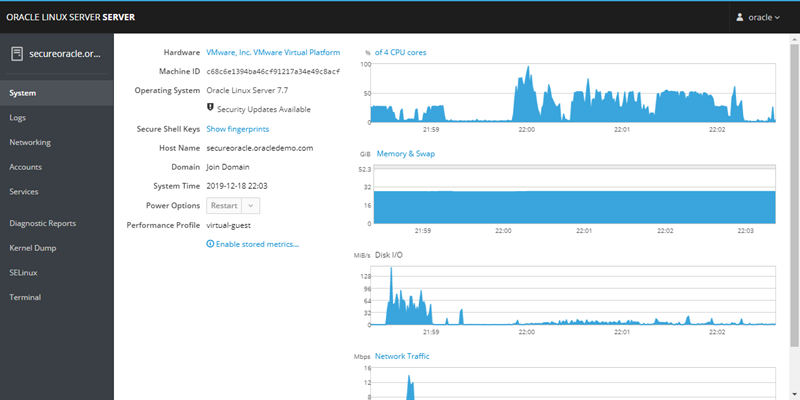
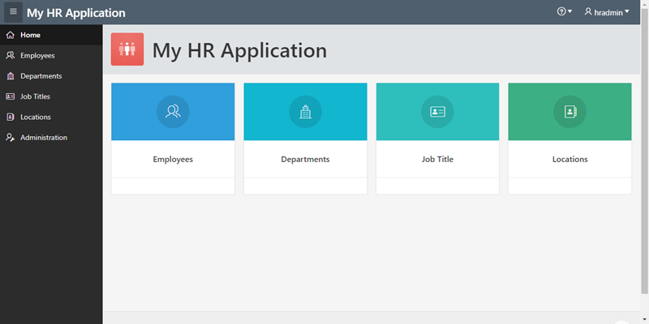
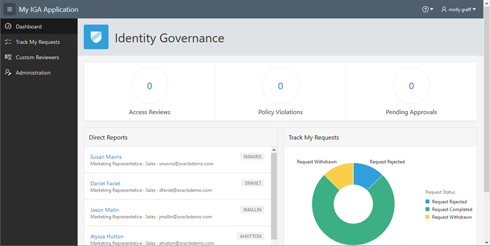
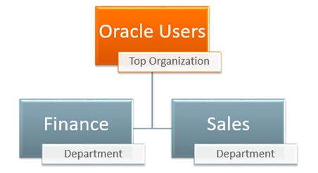

# Getting Started with SecureOracle

## Introduction

In this lab we will review what is new in SecureOracle 8.0 demonstration platform and learn how to start the different components, run the development tools and access the different administration consoles and demo applications.

*Estimated Lab Time*:  60 minutes

### Objectives
- Become familiar with SecureOracle demonstration environment

### Prerequisites
This lab assumes you have:
- A Free Tier, Paid or LiveLabs Oracle Cloud account
- SSH Private Key to access the host via SSH
- You have completed:
    - Lab: Generate SSH Keys
    - Lab: Prepare Setup
    - Lab: Environment Setup

## What is New in Version 8.0
Version 8.0 of SecureOracle include the following features:
* Fresh installation of Oracle IAM Suite 12c R2 PS4 (12.2.1.4.0)
* Oracle Access Management includes the following services:
	* Adaptive Authentication Service
	* OAuth and OpenIDConnect Service
	* Identity Federation
	* Access Portal Service
* By default the communication between OAM and WebGate is OAP over REST
* [HTTPie](https://httpie.org/) open source command line HTTP client to interact with RESTful APIs, Web Services and HTTP servers.
* Oracle Identity Governance includes the following 12c connectors:
	* Box, Concur, DB Applications Table, Oracle/MySQL DB User Management, Flat File, Google Apps, GoToMeeting, IDCS, Microsoft AD User Management, Office365, EBS Employee Reconciliation, EBS User Management, OID/ODSEE/OUD/LDAP, Salesforce, SAP Success Factor, SAP User Management, SAP User Management Engine, ServiceNow, Unix, WebEx
* [Cockpit](https://cockpit-project.org/) open source tool to manage servers using an easy to use web console. Cockpit comes pre-installed with SecureOracle and allows to start all components without having to use an SSH client.

  <a name="image-01"></a>

  Figure 1. Cockpit Web Console

* Oracle Unified Directory include the following services:
	* REST APIs for accessing identity information and managing directory data
* Pre-configured connectors
	* 12c IDCS connector for integration with IDCS provisioning and governance
	* 12c ODSEE/OUD/LDAP connector for integration with OUD
	* 12c DBAT connector for integration with My HR Application
* Updated SecureOracle documentation including:
	* Getting Started Guide
	* Deploying SecureOracle in OCI
	* Deploying SecureOracle in VMware-VirtualBox
	* Employee Lifecycle Management
	* RESTful OIM and OAM APIs
	* OAM Hybrid Scenario
	* Identity Certifications
	* Android Emulator NoxPlayer Guide
* Open source email server and client to support demo use cases
	* Webmail client: [Roundcube 1.4.1](https://roundcube.net/ "Roundcube") with support for HTML content
	* Email server: [Hedwig Mail Server](http://hwmail.sourceforge.net/ "Hedwig") with simple web console for maintaining email accounts
* SecureOracle images are available for deployment on:
	* OCI Compute
	* VirtualBox or VMware
* Updated Demonstration Assets to APEX 19.2
	* My HR Application - developed entirely in APEX and running in the Oracle Database, help demonstrate HR employee life cycle management and integration with OIG. Full HTML5 interface supporting modern browsers.
	* My IGA Application - also developed in APEX aimed to showcase governance capabilities using OIG REST APIs and certifications like custom reviewers. Full HTML5 interface supporting modern browsers.

    <a name="image-02"></a>

    Figure 2. My HR Application

    <a name="image-03"></a>

    Figure 3. My IGA Application

* Support for hybrid use cases on integration with IDCS, including:
	* OIG 12c connector for provisioning with IDCS
	* OAM Webgate configured in cloud-mode for integration with IDCS

## **STEP 0:** Running your Lab
### Login to Host using SSH Key based authentication
Refer to *Lab Environment Setup* for detailed instructions relevant to your SSH client type (e.g. Putty on Windows or Native such as terminal on Mac OS):
  - Authentication OS User - “*opc*”
  - Authentication method - *SSH RSA Key*
  - OS User – “*oracle*”.

1. First login as “*opc*” using your SSH Private Key

2. Then sudo to “*oracle*” user. E.g.

    ```
    <copy>sudo su - oracle</copy>
    ```
Follow the steps below to Start and Stop the different SecureOracle components.

## **STEP 1**: Start and Stop SecureOracle Components

1.  Login as “*oracle*” user and start the different components. E.g. start **Oracle Identity Manager, SOA Server and BI Publisher** by running the following command

    ```
    <copy>sc start oim_bip</copy>
    ```

    **Note:** the time to start the OIG components varies between 15-20 minutes.

    Additional commands are available to start or stop the different components and applications. E.g. use the following command syntax:

    ```
    <copy>
    sc <start|stop|status> oim          // start, stop or status OIG, SOA Server and OUD
    sc <start|stop|status> oim_bip      // start, stop or status OIG, SOA Server, OUD and BIP Server
    sc <start|stop|status> oam          // start, stop or status OAM, OUD and both OHS Servers
    sc <start|stop|status> oam_ohs1     // start, stop or status OAM, OUD and OHS Server 1
    sc <start|stop|status> oam_ohs2     // start, stop or status OAM, OUD and OHS Server 2
    sc <start|stop|status> all          // start, stop or status all OIG and OAM components
    </copy>
    ```

2. The **OIG Design Console** can be started from a remote machine or host computer using an X terminal tool like [MobaXterm](https://mobaxterm.mobatek.net/ "MobaXterm") or [Putty](https://www.putty.org/) + [Xming X Server for Windows](https://sourceforge.net/projects/xming/ "Xming X Server for Windows"). E.g start OIG Design Console by running the following commands:

    ```
    <copy>
    cd /home/oracle/products/oim/idm/designconsole
    ./xlclient.sh
    </copy>
    ```

3. The **Hedwig Mail Server** can be re-started if you experience issues when connecting with the Roundcube email client. E.g run the following commands to re-start the Hedwig Mail Server:

    ```
    <copy>
    cd /home/oracle/demo/hedwig-0.7/bin
    sudo -E ./run.sh stop
    sudo -E ./run.sh start
    </copy>
    ```

## **STEP 2**: Running Development Tools

1. The development tools in SecureOracle are aimed to support use cases like editing SOA composites for OIG workflow approvals but also to help in customizing and configuring the different components as needed. Login as “*oracle*” user using an X terminal utility like [MobaXterm](https://mobaxterm.mobatek.net/ "MobaXterm") or [Putty](https://www.putty.org/) + [Xming X Server for Windows](https://sourceforge.net/projects/xming/ "Xming X Server for Windows").

2. To star **Oracle JDeveloper with SOA extensions** run the following commands:

    ```
    <copy>
    cd ~
    ./startJDEVSOA.sh
    </copy>
    ```

    **Note**: you can find sample applications showcasing SOA composites with OIG workflows available under folder **/home/oracle/jdevhome**.

    ```
    NAME                                 DESCRIPTION
    RoleOwnerApproval.jws                Role single approval
    MultiRoleOwnerApproval.jws           Role multi-approval
    CustomDisconnectedProvisioning.jws   Disconnected app approval based on Sales Role
    ```

    Additionally you can find OIM out-of-the-box SOA composites in the following folder:

    ```
    /home/oracle/products/oam/idm/server/workflows/composites
    ```

3. To start **Oracle SQLDeveloper** run the following commands:

    ```
    <copy>
    cd ~
    ./startJDEVSOA.sh
    </copy>
    ```

    **Notes**: three connections: `HR`, `HEDWIG` and `IAMDB` are already defined to access My HR, Hedwig and IAM database schemas. Alternatively you can install SQL Developer in your local host computer to access the different database schemas.

4. To start **Apache Studio** and manage the OUD/LDAP instance run the following commands:

    ```
    <copy>
    cd ~
  	./startAStudio.sh
    </copy>
    ```

    **Note**: a connection `IAM-OUD` is already defined to access OUD.

5. To start **Oracle PL/SQL** command line tool pointing to the IAM database, run the following commands:

    ```
    <copy>
    cd ~
    . ./setDBenv.sh
    ./startPLSQL.sh
    </copy>
    ```

## **STEP 3**: Admin Consoles, Applications and User Credentials
1. Use the following URLs and credentials to access all the different web consoles:

    Oracle Identity Manager Web Admin Console:

    ```
    URL         http://secureoracle.oracledemo.com:14000/sysadmin
    User        xelsysadm
    Password    Oracle123
    ```

    Oracle Identity Manager Self Service:

    ```
    URL         http://secureoracle.oracledemo.com:14000/identity
    User        xelsysadm
    Password    Oracle123
    ```

    Oracle Identity Manager Design Console. First run the following commands to start the design console:

    ```
    <copy>
    cd /home/oracle/products/oim/idm/designconsole
    ./xlclient.sh
    </copy>
    ```

    When prompted, enter the following URL and credentials:

    ```
    URL         t3://secureoracle.oracledemo.com:14000
    User        xelsysadm
    Password    Oracle123
    ```

    Oracle BI Publisher Admin Console:

    ```
    URL         http://secureoracle.oracledemo.com:9502/xmlpserver
    User        xelsysadm
    Password    Oracle123
    ```

    Oracle Identity Manager EM Console:

    ```
    URL         http://secureoracle.oracledemo.com:7001/em
    User        weblogic
    Password    Oracle123
    ```

    Oracle Access Manager Admin Console:

    ```
    URL         http://secureoracle.oracledemo.com:8001/oamconsole
    User        oamadmin
    Password    Oracle123
    ```

    Oracle Access Manager EM Console:

    ```
    URL         http://secureoracle.oracledemo.com:8001/em
    User        weblogic
    Password    Oracle123
    ```

    Email Server Admin Console (Hedwig Mail Server):

    ```
    URL         http://secureoracle.oracledemo.com:7001/hedwig-web-0.6/
    User        admin
    Password    Oracle123
    ```

    Email Web Client (Roundcube):

    ```
    URL         http://secureoracle.oracledemo.com/roundcubemail-1.4.1/
    User        admin
    Password    Oracle123
    Server      secureoracle.oracledemo.com
    ```

    My HR Application:

    ```
    URL         http://secureoracle.oracledemo.com:7001/ords/f?p=100
    User        hradmin
    Password    Oracle123
    ```

    My IGA Application:

    ```
    URL         http://secureoracle.oracledemo.com:7001/ords/f?p=102
    User        mgraff
    Password    Oracle123
    ```

    APEX Admin Console

    ```
    URL         http://secureoracle.oracledemo.com:7001/ords/apex_admin
    User        admin
    Pass        #Oracle123
    ```

    APEX HR Workspace

    ```
    URL         http://secureoracle.oracledemo.com:7001/ords/
    Workspace   HRSPACE
    User        hradmin
    Pass        Oracle123
    ```

    **Note**: My HR and My IGA Applications are available after the OIG domain is started as the service (Oracle REST Data Services) supporting these applications is deployed in the OIG Admin Server.

2. The following credentials are available to access other middleware components.

    Oracle IAM database:

    ```
    Host/port       secureoracle.oracledemo.com:1521
    Service name    iamdb.oracledemo.com
    User            sys as SYSDBA
    Password        Oracle123
    ```

    My HR Application database:

    ```
    Host/port       secureoracle.oracledemo.com:1521
    Service name    iamdb.oracledemo.com
    User            hr
    Password        Oracle123
    ```

    Oracle Unified Directory (OUD):

    ```
    Host/port       secureoracle.oracledemo.com:1389
    User            cn=Directory Manager
    Password        Oracle123
    ```

## **STEP 4**: About the Sample Organization
1. SecureOracle includes a sample top OIM organization **Oracle Users** and two child departments **Sales** and **Finance**. For each department an administrator account has been defined to demonstrate delegated administration. In addition, sample users have been added to demonstrate manager approval, escalation and organizational transfers.

    <a name="image-04"></a>

    Figure 4. Sample OIG Organization

2. The following is a quick reference to the demo users included in SecureOracle, please refer to the use cases documentation for more details in how these users and organizations are used in the sample demonstrations.

    ```
    USERNAME        ORGANIZATION     TITLE                        ADMIN ROLE      SCOPE OF CONTROL
    FINANCEADM      Finance          Administration Assistant     FinanceAdmin    Finance             
    SALESADM        Sales            Administration Assistant     SaleseAdmin     Sales
    MGRAFF          Sales            Sales Manager
    HDANIELS        Sales            Sales Manager
    JSMITH          Finance          Finance Manager
    ```

3. In addition, email accounts has been created for all demo users, you can access their in-boxes using the [Roundcube](http://secureoracle.oracledemo.com/roundcubemail-1.4.1/) email client with credentials **USERNAME/Oracle123**.

    ```
    USERNAME     EMAIL
    AHUTTON      ahutton@oracledemo.com
    JMALLIN      jmallin@oracledemo.com
    DFAVIET      dfaviet@oracledemo.com
    SMAVRIS      smavris@oracledemo.com
    MCHAN        mchan@oracledemo.com
    HDANIELS     hdaniels@oracledemo.com
    MGRAFF       mgraff@oracledemo.com
    SALESADM     salesadm@oracledemo.com
    ECLARK       eclark@oracledemo.com
    JSMITH       jsmith@oracledemo.com
    PSONG        psong@oracledemo.com
    PCAR         pcar@oracledemo.com
    FINANCEADM   financeadm@oracledemo.com
    DCOBY        dcoby@oracledemo.com
    GMARTON      gmarton@oracledemo.com
    RLAURIA      rlauria@oracledemo.com
    RMAINOR      rmainor@oracledemo.com
    ```

## **STEP 5**: Branding SecureOracle
1. Use the following instructions to customize the logo in the OIG Self Service interface.

    Copy using [WinSCP](https://winscp.net/eng/download.php "WinSCP") the image file (e.g. **.gif**, **.png** or **.jpg** file) you will like to use as logo in the Self Service interface.

    E.g. copy the image file to the following location:

    ```
    <copy>
    /home/oracle/products/oim/idm/server/apps/oim.ear/iam-consoles-faces.war/images
    </copy>
    ```

    **Note:** an image size of 145 x 38 pixels is recommended.

2. Login to the OIG Self Service console as user **xelsysadm**. Click on the **Sandboxes** link located in the top right corner of the Self Service page.

3. In the **Manage Sandboxes** tab, click on **Create Sandbox**, enter a name and click on **Save and Close** and then **OK**.

4. Click on the **Customize** link located in the top right corner of the current page.

5. The customization panel is displayed at the top of the page. Click on **Structure** and then click on the Oracle logo image, in the pop-up window **Confirm Shared Component Edit** click on **Edit** button.

6. Next, click in the **Gear and Pencil** icon located in the top of the right panel.

7. In the **Component Properties: commandImageLink** window, click the **Down Arrow** icon next to the Icon property, and select **Expression Builder**.

8. Enter the path image as follow.

    E.g. enter the path using the following format:

    ```
    <copy>
    /../oim/images/<my-custom-logo.png>
    </copy>
    ```

    **Note:** replace <my-custom-logo.png> with the file name of your image file.

9. Click **OK** to close the expression builder window, and then **OK** again to confirm the changes. The custom logo image should be displayed instead of the Oracle logo image.

10. Click in the **Close** button located in the top right corner to close the customization panel.

11. Go back to the **Manage Sandboxes** tab, select the sandbox name you created and click on **Publish Sandbox** and then click **Yes** to confirm.

You may now *proceed to the next lab*.

## Learn More About Identity and Access Management
Use these links to get more information about Oracle Identity and Access Management:
- <a href="https://docs.oracle.com/en/middleware/idm/suite/12.2.1.4/index.html" target="\_blank">Oracle Identity Management Website</a>
- <a href="https://docs.oracle.com/en/middleware/idm/identity-governance/12.2.1.4/index.html" target="\_blank">Oracle Identity Governance Documentation</a>
- <a href="https://docs.oracle.com/en/middleware/idm/access-manager/12.2.1.4/books.html" target="\_blank">Oracle Access Management Documentation</a>

## Acknowledgements
- **Author** - Ricardo Gutierrez, Solution Engineering - Security and Management
- **Last Updated By/Date** - Ricardo Gutierrez, June 2020

## Need Help?
Please submit feedback or ask for help using our [LiveLabs Support Forum](https://community.oracle.com/tech/developers/categories/goldengate-on-premises). Please click the **Log In** button and login using your Oracle Account. Click the **Ask A Question** button to the left to start a *New Discussion* or *Ask a Question*.  Please include your workshop name and lab name.  You can also include screenshots and attach files.  Engage directly with the author of the workshop.

If you do not have an Oracle Account, click [here](https://profile.oracle.com/myprofile/account/create-account.jspx) to create one.
