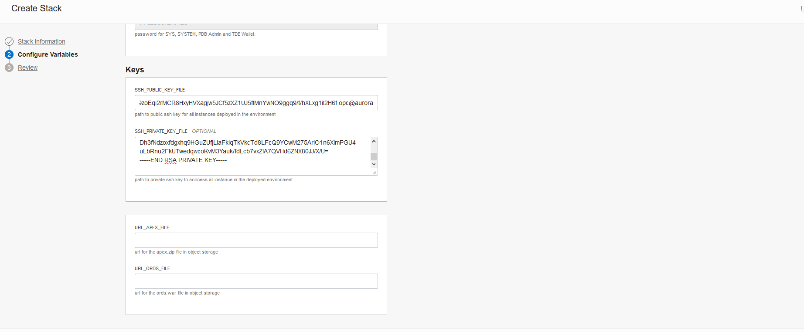
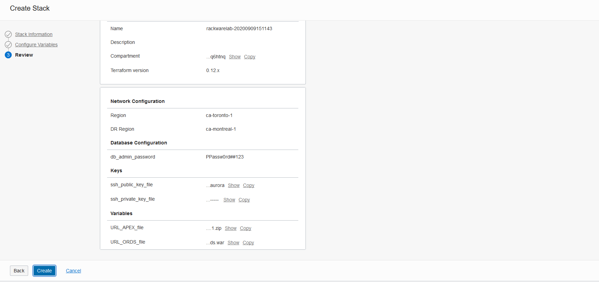
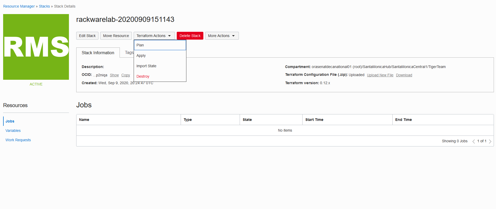
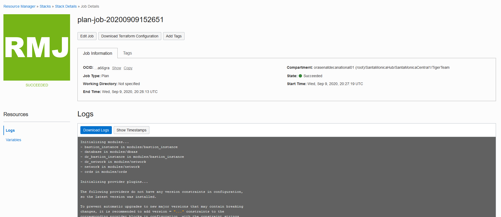

# Disaster Recovery Network and Connectivity Setup
## Introduction
This solution provides a Network Architecture deployment to demonstrate Disaster Recovery scenario across 2 regions [ examples are geared towards region Montreal & Toronto and can be used for any OCI regions].

Estimated Lab Time 45-60 minutes

### Objectives
- Deploy Terraform to setup necessary architechture for DR

### Prerequisites
1. Download & unzip the [Terraform zip file](https://objectstorage.us-ashburn-1.oraclecloud.com/p/doGqCx8nAES04cJcea1x-J9562_ViCXPWeeYXorD42R6E46hq7w6AMCpd_oonxLY/n/c4u04/b/solutions-library/o/DR-ORDS-RW.zip) to your local machine.

2.  Create your own private/public key pair on your local system.
3.  Zip up all of the files in to a zip folder. The zip file name is not important.
    Just make sure it has the follow structure.
    
        rackware/
        ├── data_sources.tf
        ├── dr-ords-schema.yaml
        ├── main.tf
        ├── modules
        │   ├── bastion_instance
        │   │   ├── main.tf
        │   │   ├── outputs.tf
        │   │   └── variables.tf
        │   ├── dbaas
        │   │   ├── main.tf
        │   │   ├── outputs.tf
        │   │   └── variables.tf
        │   ├── network
        │   │   ├── main.tf
        │   │   ├── outputs.tf
        │   │   └── variables.tf
        │   └── ords
        │       ├── main.tf
        │       ├── outputs.tf
        │       ├── README.md
        │       ├── remote-exec.tf
        │       └── variables.tf
        ├── outputs.tf
        ├── providers.tf
        ├── terraform.tfvars
        ├── userdata
        │   ├── bootstrap.sh
        │   ├── files_init
        │   │   └── config_init.sh
        │   ├── files_init.zip
        │   ├── files_jetty
        │   │   ├── apex_add_db.sh
        │   │   ├── apex_inst_check.sql
        │   │   ├── apex_setup_base.exp
        │   │   ├── config_apex1.sql
        │   │   ├── config_apex2.sql
        │   │   ├── config_cert.sh
        │   │   ├── config_jetty_apex.sh
        │   │   ├── config_jetty_ca-ssl.sh
        │   │   ├── config_jetty_init.sh
        │   │   ├── config_jetty_ords.sh
        │   │   ├── dns_ocidns.sh
        │   │   ├── ords_add_db.sh
        │   │   ├── ords_pu_check.sql
        │   │   ├── ords_setup_base.exp
        │   │   ├── ords_validate_base.exp
        │   │   ├── pw_prof_chk.sql
        │   │   ├── pw_verify_base.sql
        │   │   ├── pw_verify_null.sql
        │   │   ├── start_ords.sh
        │   │   └── stop_ords.sh
        │   └── files_jetty.zip
        └── variables.tf

4. Make sure to create a public bucket in object storage. Then upload apex.zip and the ords.war file to the bucket.
    The apex.zip file can be downloaded using the following link [apex](https://www.oracle.com/tools/downloads/apex-downloads.html). 
    The ords.war file can be downloaded using the following link [ords](https://www.oracle.com/database/technologies/appdev/rest-data-services-downloads.html)
        
    
## Task 1: Create Stack    
1. Navigate to the resource manager tab in OCI. Then create a new stack to import the zip file.

2. Import the zip file into the stack 
    

3. Input the configuration for the instances.
    

4. Input the configuration for the vcn.
    

5. Copy your public and private key. Make sure you are using the correct format.
    

6. Input the configuration for the object storage.
    

7. Review 
    

## Task 2: Plans

1.  Select plan from the dropdown menu.
    

2.  Make sure everything looks okay and then proceed
    

3.  Wait until the icon to turn green.
    

## Task 3: Apply

1.  Select plan from the dropdown menu.
    

2.  Wait unitl the icon to turn green.
    

## Task 4: Destroy
1.  First navigate to OCI Console and terminate the Standby database and once the termination is successfull then run the following command

2.  Select destroy from the dropdown menu.
    

3.  Wait unitl the icon to turn green.
    

You may now **proceed to the next lab.**

## Troubleshooting
   A possible issue you make face is not having enough resources. Test to make sure 
   that you can create a drg manual in both regions you want to deploy the resources
   in.

## Acknowledgements
- **Author** - Saul Chavez
- **Last Updated by/date** Will Bullock, October 2020

## See an issue?
Please submit feedback using this [form](https://apexapps.oracle.com/pls/apex/f?p=133:1:::::P1_FEEDBACK:1). Please include the *workshop name*, *lab* and *step* in your request. If you don't see the workshop listed, please enter it manually. If you would like for us to follow up with you, enter your email in the *Feedback Comments* section.

