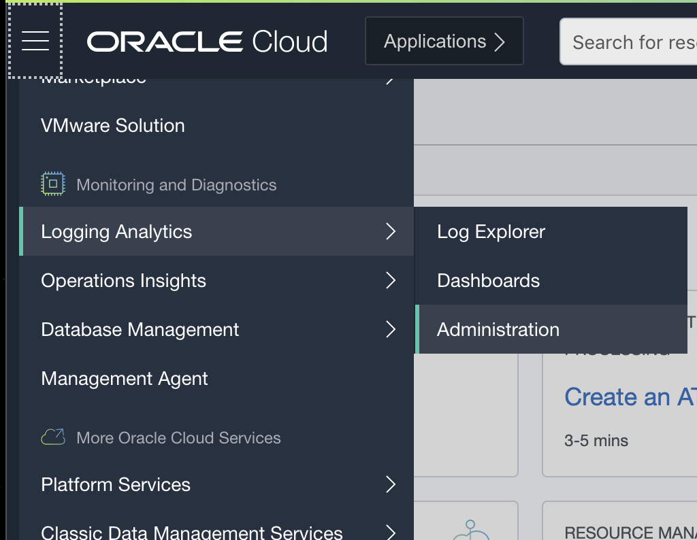
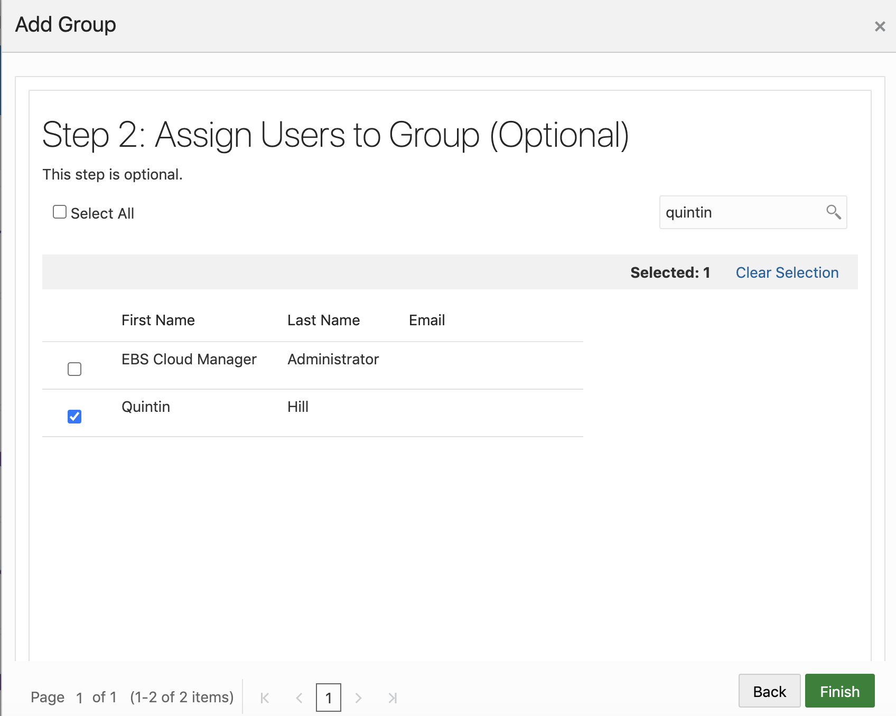
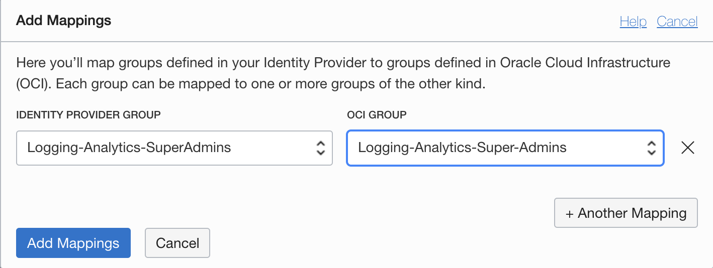
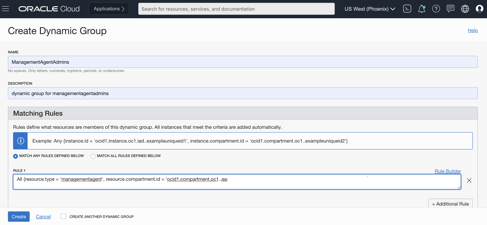
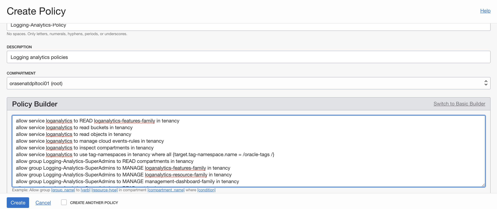

# Onboard Logging Analytics

## Introduction

This lab will onboard OCI Logging Analytics Service.

**Estimated Lab Time: 30 minutes**

### Objectives

**In this lab, you will:**
* Onboard Logging Analytics (including policies, users, groups, and dynamic groups for using Logging Analytics Service)
* At the end of this lab you will have Logging Analytics onboarded in your OCI tenancy

### Prerequisites

* An Oracle Cloud Environment
* EBS Cloud Manager, EBS 1-Click and Advanced Provisioned Instance, Network - All setup in previous labs

## **STEP 1:** Onboard Logging Analytics Service

1. Enable Logging Analytics
    
    a. Navigate to Logging Analytics - Administration

    

    b.Click the **Start Using Logging Analytics** (if this is not an option, it is already done)

    

    c. Click **Continue**

## **STEP 2:** (Optional) Create Logging Analytics Super Admin Group

(Optional) You can also use existing administrator user group. 
    
Create Logging Analytics Group Logging Analytics Super Admins

1. Navigate to Identity - Federation - OracleIdentityCloudService

2. Click on the Url following **Oracle Identity Cloud Service Console**

  

  a. From the IDCS console go to Groups

  b. Like in the first step of the EBS Lift and Shift Lab Click **+ Add**

  c. Create a Group called `Logging-Analytics-SuperAdmins`

  

  d. Click **Next**

  e. Add your OCI Admin User that you are using to navigate OCI not your EBS Cloud Manager

  

  f.  You can now close this page and go back to your OCI Console

3. From the OCI Console Navigate to Identity - Groups

  a. Create a new OCI Group with the same name `Logging-Analytics-SuperAdmins`

  b. Then Go to Identity - Federation - Group Mappings

  c. Click **Add Mapping**

  d. Associate the two `Logging-Analytics-SuperAdmins`

  

  e. Click **Add Mapping**

## **STEP 3:** Create Logging Analytics Dynamic Group: Management Agent Admins
    
1. Now navigate to Identity - Dynamic Groups 

  a. Click **Create Dynamic Group**

  b. Enter name: `ManagementAgentAdmins`

  c. Add Description

  d. Leave `MATCH ANY RULES DEFINED BELOW` checked

  e. Add the following rule:

  All {resource.type = 'managementagent', resource.compartment.id = '<Compartment OCID of ebshol_compartment>'}

  Note: Fill in the Compartment OCID with the OCID of the ebshol compartment.

  

  f. Click **Create**
    
## **STEP 4:** Create Logging Analytics Policy

1. Go to Identity - Policies

2. Make sure you change to the root compartment

3. Click **Create Policy**

  a. Enter name: `Logging-Analytics-Policy` and add description

  b. In the policy builder click **Customize(Advanced)** 

  c. Paste the following Policies into the Policy Builder as shown below

**Note: If you did note do the optional Step 2 and are using OCI Administrator Group use these policies**

```
<copy>
allow service loganalytics to READ loganalytics-features-family in tenancy
allow service loganalytics to read buckets in tenancy
allow service loganalytics to read objects in tenancy
allow service loganalytics to manage cloudevents-rules in tenancy
allow service loganalytics to inspect compartments in tenancy
allow service loganalytics to use tag-namespaces in tenancy where all {target.tag-namespace.name = /oracle-tags /}
allow group Administrators to MANAGE loganalytics-resources-family in tenancy
allow group Administrators to MANAGE management-dashboard-family in tenancy
allow dynamic-group ManagementAgentAdmins to MANAGE management-agents in tenancy
allow dynamic-group ManagementAgentAdmins to USE metrics in tenancy
allow dynamic-group ManagementAgentAdmins to {LOG_ANALYTICS_LOG_GROUP_UPLOAD_LOGS} in tenancy
allow dynamic-group ManagementAgentAdmins to USE loganalytics-collection-warning in tenancy
allow service loganalytics to {VNIC_READ} in tenancy
</copy>
```

**Note: If you did the Optional Step 2 to use the Logging Analytics Super Admin Group use these policies:**

```
<copy>
allow service loganalytics to READ loganalytics-features-family in tenancy
allow service loganalytics to read buckets in tenancy
allow service loganalytics to read objects in tenancy
allow service loganalytics to manage cloudevents-rules in tenancy
allow service loganalytics to inspect compartments in tenancy
allow service loganalytics to use tag-namespaces in tenancy where all {target.tag-namespace.name = /oracle-tags /}
allow group Logging-Analytics-SuperAdmins to READ compartments in tenancy
allow group Logging-Analytics-SuperAdmins to MANAGE loganalytics-features-family in tenancy
allow group Logging-Analytics-SuperAdmins to MANAGE loganalytics-resources-family in tenancy
allow group Logging-Analytics-SuperAdmins to MANAGE management-dashboard-family in tenancy
allow group Logging-Analytics-SuperAdmins to READ metrics in tenancy
allow group Logging-Analytics-SuperAdmins to MANAGE management-agents in tenancy
allow group Logging-Analytics-SuperAdmins to MANAGE management-agent-install-keys in tenancy
allow group Logging-Analytics-SuperAdmins to READ users in tenancy
allow dynamic-group ManagementAgentAdmins to MANAGE management-agents in tenancy
allow dynamic-group ManagementAgentAdmins to USE metrics in tenancy
allow dynamic-group ManagementAgentAdmins to {LOG_ANALYTICS_LOG_GROUP_UPLOAD_LOGS} in tenancy
allow dynamic-group ManagementAgentAdmins to USE loganalytics-collection-warning in tenancy
allow service loganalytics to {VNIC_READ} in tenancy
</copy>
```



## **STEP 5:** Create Log Groups

1. Go to Logging Analytics - Administration - Log Groups

  a. Click **Create Log Group**

  b. For Name enter: `EBS_VCN_Logs` and a description

  c. Click **Create**

  d. Create another Log Group named `Audit_Logs`

  

  e. We will use these log groups when ingesting logs from a service connector in the next step.
    

This will now complete the Onboarding of Logging Analytics Lab for this workshop.

## Acknowledgements
* **Author** - Quintin Hill, Cloud Engineering, Packaged Applications
* **Contributors** -  Kumar Varun, Logging Analytics Product Management
* **Last Updated By/Date** - Quintin Hill, Cloud Engineering, Mar 8 2021


