# Creating the Source Oracle E-Business Suite Environment

## Introduction

In this 30-minute tutorial, you will use an image hosted in Oracle Cloud Infrastructure (OCI) to provision an Oracle E-Business Suite 12.2.10 with Oracle Database 12.1.0.2 demonstration instance on a single virtual machine (VM) on OCI.

Create an Oracle Cloud Infrastructure Compute instance (virtual machine) containing the Release 12.2.10 database and application tiers from the provided image. Use this single-node Vision demonstration instance to evaluate and test standard Oracle E-Business Suite functionality, and demonstrate the standard business flows delivered with the applications. Also use it to become familiar with the technology components of Oracle E-Business Suite Release 12.2 and train your users.

The Oracle E-Business Suite 12.2.10 Demo Install Image can be found in the OCI Console Marketplace and also in the OCI Oracle Images list in your tenancy. Instructions for the OCI Console Marketplace are provided in this document.

**Estimated Lab Time:** 30 minutes


### **Objectives**

In this lab, you will:

* Create and configure a Subnet in which to host your source E-Business Suite environment
* Create an Oracle E-Business Suite Instance using an Image from the OCI Marketplace
* Configure and Start the EBS environment 

### **Prerequisites**

* Complete Workshop: [Lift and Shift On-Premises EBS to OCI Workshop](https://apexapps.oracle.com/pls/apex/dbpm/r/livelabs/view-workshop?wid=672&clear=180&session=5980193088668)
* An SSH key pair
* OCI Tenancy admin privileges
* A Virtual Cloud Network (VCN) which will be associated with the Oracle E-Business Suite Instance (created as a part of the prerequisite workshop)


## **STEP 1:** Create a Subnet for the Source Environment in OCI

Follow these steps to create a subnet for your source EBS environment. This subnet will be located within the Virtual Cloud Network that was created as a part of the **OCI EBS Cloud Manager Lab**.

1. Login to Oracle Cloud Infrastructure and navigate to the **Networking** > **Virtual Cloud Networks** tab. 

    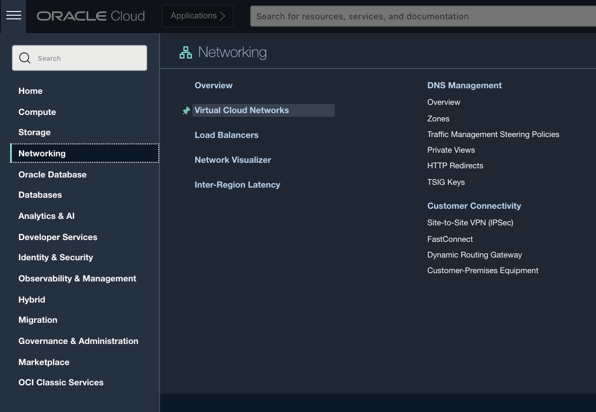

2. Select the **ebshol\_compartment** that was created in the previous workshop in the dropdown on the left of the screen. Then select the **ebshol\_vcn**.

    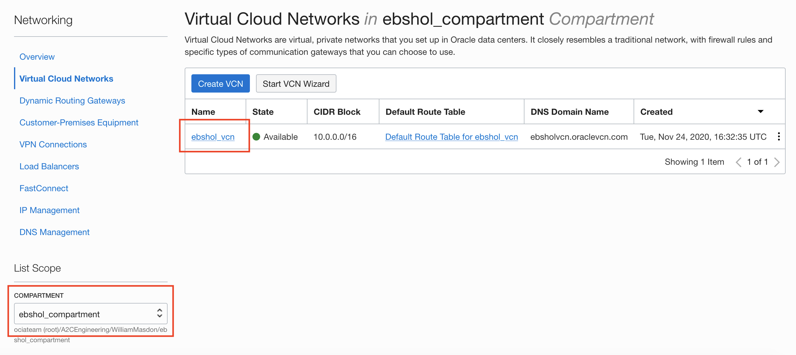

3. Select **Subnets** under **Resources** on the left and then click **Create Subnet**. 

    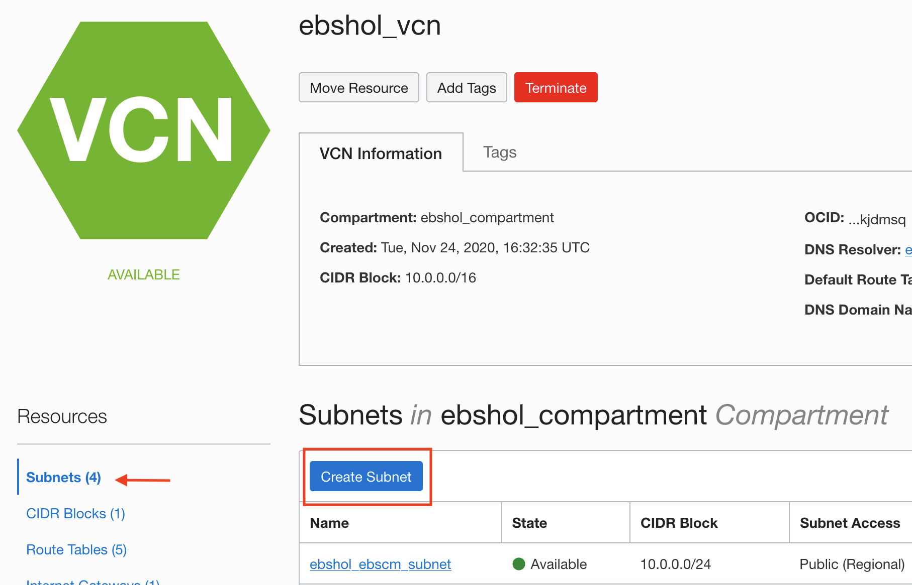

4. In the Create Subnet window, enter the following: 

    a. **Name:** `ebs_source_subnet`

    b. **Create in Compartment:** `ebshol_compartment`

    c. **Subnet Type:** `Regional`

    d. **CIDR Block:** `10.0.5.0/24` (or another valid CIDR block within the bounds of the VCN's CIDR)

    e. **Route Table:** select the Default Route Table

    f. **Subnet Access:** `Public`

    g. **DNS Resolution:** leave checked

    h. **DNS Label:** leave empty

    i. **DHCP Options:** select the `Default DHCP Options`

    j. **Security Lists:** select the `Default Security List`

    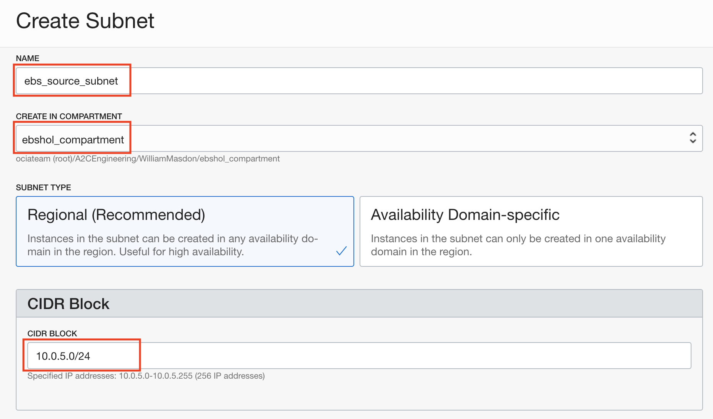

    

    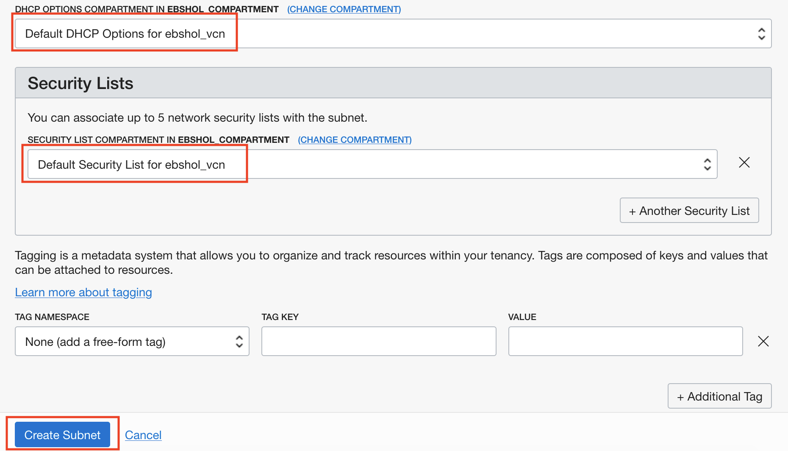

    Once completed, click **Create Subnet**.

5. Review the security lists associated with the subnet to ensure that an ingress rule exists with the following attributes:

    a. **Source Type:** `CIDR`
        
    b. **Source CIDR:** `0.0.0.0/0`

    c. **IP Protocol:** `TCP`

    d. **Destination Port:** `22` 
  
6. Once the subnet has been created, add a Route Rule to the Default Route Table with the following:

    a. **Target Type:** `Internet Gateway`
  
    b. **Destination CIDR Block:** `0.0.0.0/0`

    c. **Target Internet Gateway:** `ebshol_internetgateway`

    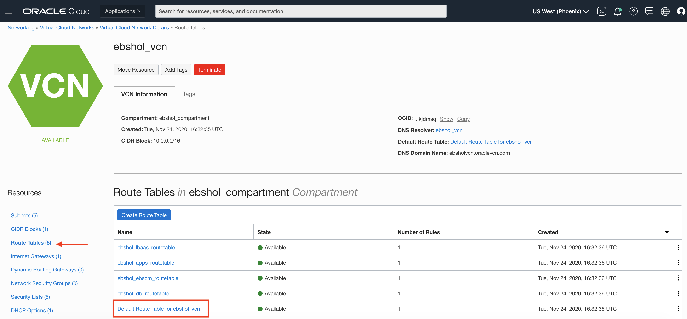

    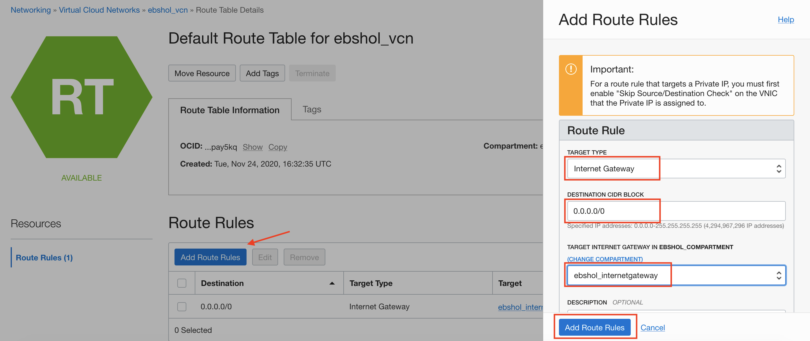


## **STEP 2:** Create Instance Using an Image from the OCI  Marketplace

Follow these steps to create and connect to your Oracle E-Business Suite instance when using an image from the OCI Console Marketplace.

1. Navigate to the **Marketplace** tab in the menu panel under the heading Solutions and Platforms
    Filter by:
        
      - **Type:** `Image`

      - **Publisher:** `Oracle`

      - **Category:** `Packaged Application`

    b. Click on **Oracle E-Business Suite 12.2.10 Demo Install Image**.

    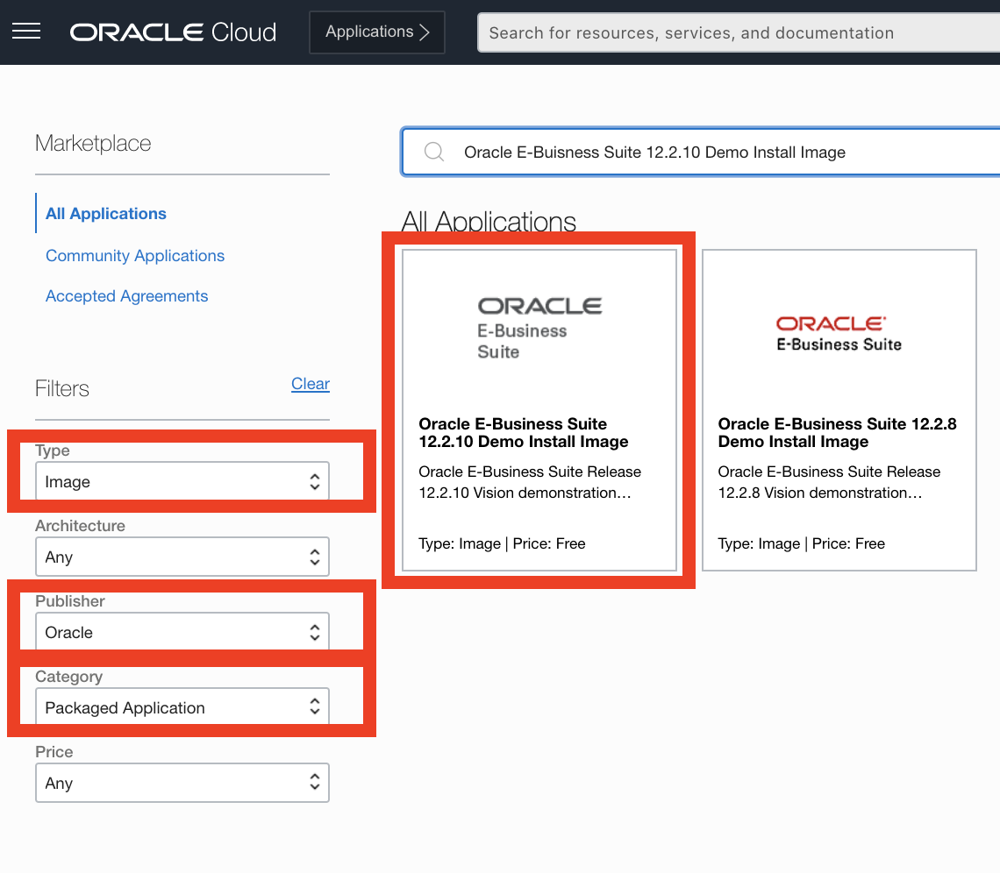


2. On the resulting screen, do the following:

    a. Select the compartment or subcompartment where you wish to install the source Oracle E-Business Suite environment. Use the **ebshol_compartment** that was created in the previous workshop. 
     
    b. Review and accept the Oracle Standard Terms and Restrictions.
    
    c. Click **Launch Instance**.

    

3. In the Create Compute Instance screen, specify the following:

    a. **Name:** `ebs-source-env`

    b. **Compartment:** leave as is (should be `ebshol_compartment`)

    c. **Availability Domain:** `AD-1`

    d. **Choose Fault Domain:** leave unchecked

    e. **Image:** `Oracle E-Business Suite 12.2.10 Demo Install Image`  (leave unchanged)

    f. **Shape:** click **Change Shape** and select the following if not already selected:

      - **Instance Type:** `Virtual Machine`
      
      - **Shape Series:** `Intel Skylake`

      - **Shape:** `VM.Standard2.1`  (you may change if desired)
    
    g. **Networking:** 

      - **Virtual Cloud Network:** `ebshol_vcn`

      - **Subnet:**  `ebs_source_subnet`

      - **Use Network Security Groups:** leave unchecked

      - **Public IP Address:** click `Assign a Public IP Address`

    h. **SSH Keys:** choose or paste the public key of an SSH Key Pair

    i. **Configure Boot Volume:** leave all choices as is

    j. Click **Create** 

  Once the instance has been created, copy down the Public IP Address and store it in the ``key-data.txt`` file. 

  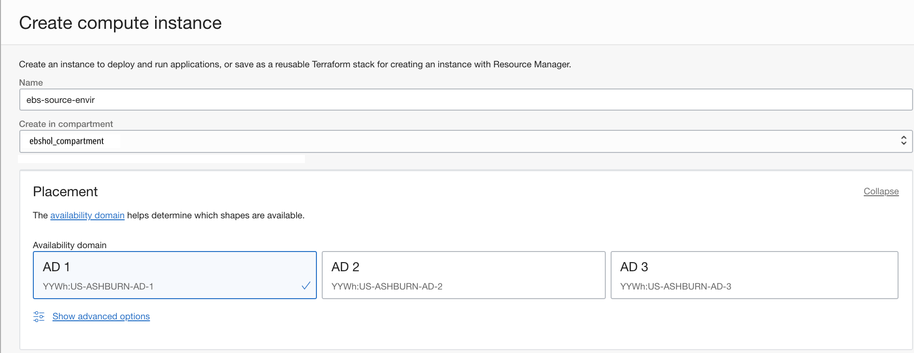

  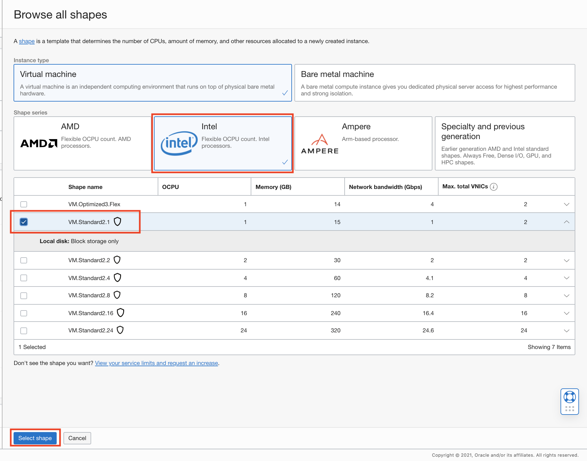

  

## **STEP 3:** Configure and Start the source E-Business Suite Environment

These steps will walk through the initial configuration of the source EBS instance and then start the application and database servers on the instance. 

1. Connect to the instance using SSH on Terminal (macOS) or using a tool such as PuTTY (Windows). 

    ```
    <copy>
    ssh -i <SSH private key file path> opc@<Public IP Address>
    </copy>
    ```

    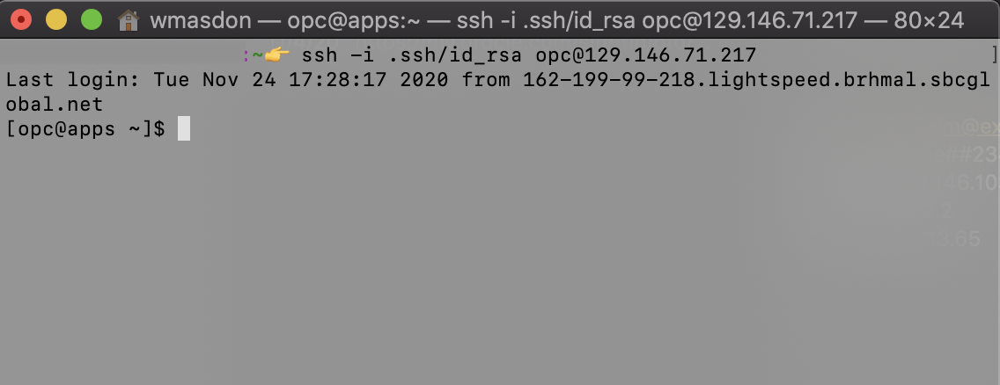

2. Switch to the root user and then run the ``updatehosts.sh`` script. 

    ```
    <copy>
    sudo su
    </copy>
    ```

    ```
    <copy>
    /u01/install/scripts/updatehosts.sh
    </copy>
    ```

    

3. Update Operating System. This will take a little bit. 

    ```
    <copy>
    yum update
    </copy>
    ```

    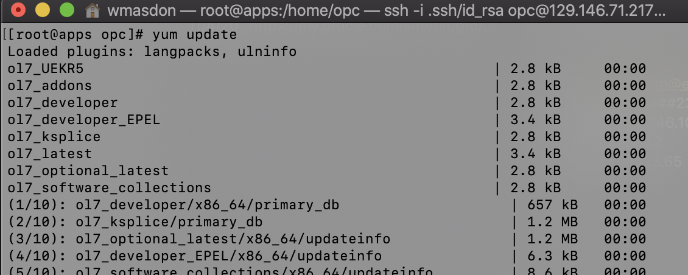

  When prompted "Is this okay \[y/d/N\]:", enter 'y'.

  

4. Update host name.

    ```
    <copy>
    hostname apps.example.com
    </copy>
    ```

  Note: you will have an opportunity to change the host name later. 

5. Start the database.

  a. Switch to the Oracle user:

    ```
    <copy>
    sudo su - oracle
    </copy>
    ```

  b. Run the script to start the database:

    ```
    <copy>
    /u01/install/APPS/scripts/startdb.sh
    </copy>
    ```

    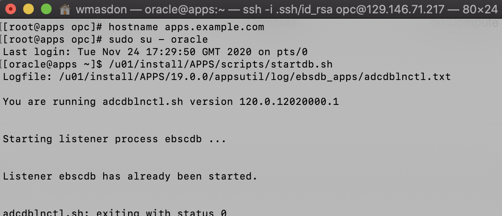

6. Change the passwords for the users.

  a. Set the environment.

    ```
    <copy>
    . /u01/install/APPS/EBSapps.env run
    </copy>
    ```

    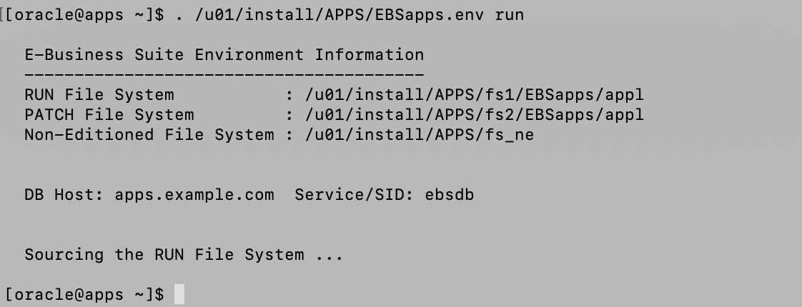

  b. Set SYSADMIN password.

    ```
    <copy>
    mkdir -p ~/logs
    cd  ~/logs
    sh /u01/install/APPS/scripts/enableSYSADMIN.sh
    </copy>
    ```

    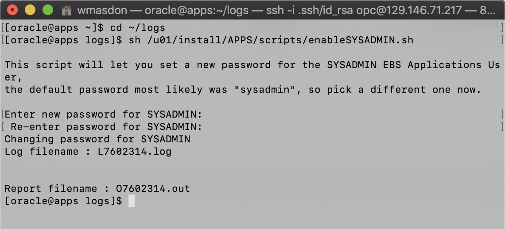

    When prompted, enter a new password for the SYSADMIN user. 

  c. Set Demo Users password.

    ```
    <copy>
    cd ~/logs
    /u01/install/APPS/scripts/enableDEMOusers.sh
    </copy>
    ```

    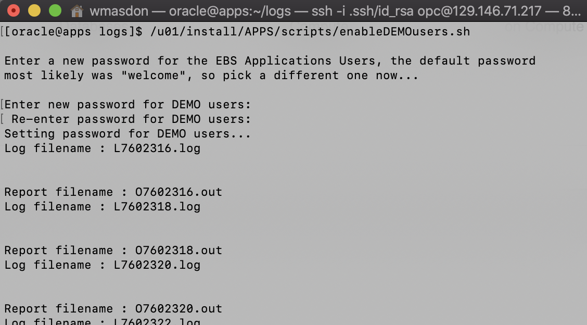

    When prompted, enter a new password. 

    Note: Do not run this script on a fresh or production environment.

7. Enable HTTP Access.

  From the OCI console, add a security rule to the security list. 

  a. Navigate to **Networking** > **Virtual Cloud Networks**.
  
  b. Select the VCN associated with your instance: **ebshol\_vcn** (make sure you are in **ebshol\_compartment**).
  
  c. Click on the **ebs\_source\_subnet** and then **Security Lists** under Resources.

      

      Select the **Default Security List** that is associated with this subnet.  

      

  d. Click **Add Ingress Rules** and fill out the following, leaving the other options as default.

    - **Source CIDR:** `0.0.0.0/0`

    - **Destination Port:** `8000`

  e. Click **Add Ingress Rules**. 

  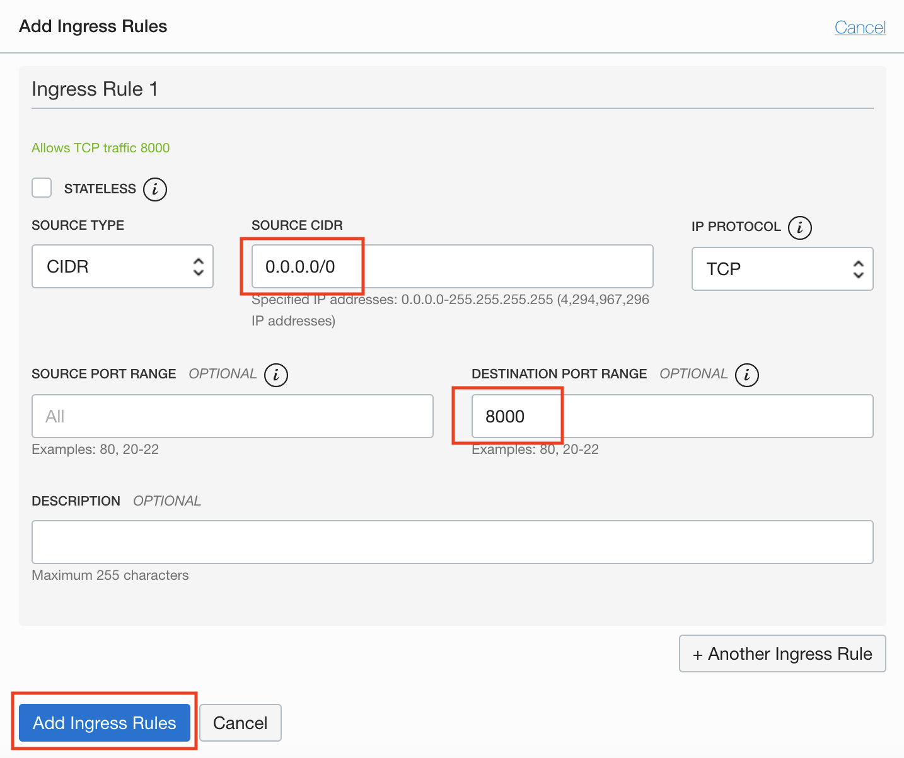

8. Configure Web Entry Point.

  a. Use the script provides to change the default web entry point, which is app.example.com

    ```
    <copy>
    /u01/install/scripts/configwebentry.sh
    </copy>
    ```

  b. When prompted, enter the following values.

    - **Enter the Web Entry Protocol (Eg: https/http):** `http`
    - **Enter the Web Entry Host Name(Eg: public):** `myapps` 
    - **Enter the Web Entry Domain Name:(Eg: example.com):** `example.com`
    - **Enter the Web Entry Port:(Eg: 443/80):** `8000`
    - **Enter the ORACLE_SID:(Eg: EBSDB):** `ebsdb`
    - **Enter the APPS user password:** `apps`

    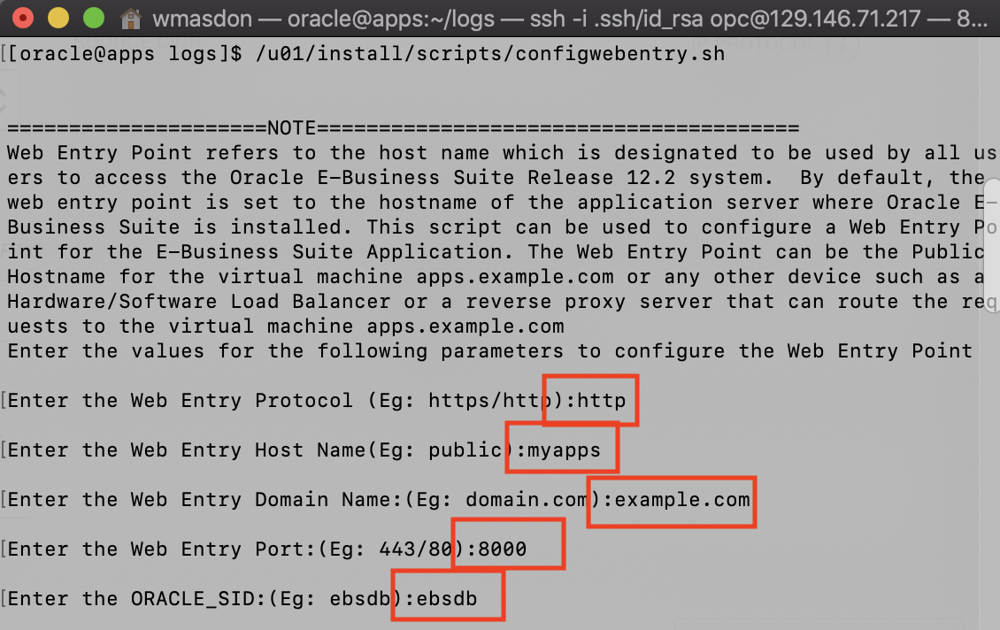

    

9. Update local hosts file.

  **For Windows users**

      a. Navigate to Notepad in your start menu.

      b. Hover over Notepad, right-click, and select the option **Run as Administrator**.

      c. In Notepad, navigate to ``File > Open``.

      d. Browse to ``C:\\Windows\System32\drivers\etc``

      e. Find the **file hosts**.

      

      f. In the hosts file, scroll down to the end of the content.

      g. Add the following entry to the very end of the file: ``<public_ip> myapps.example.com``

      h. Save the file.

  **For Mac users**

      a. Open a Terminal Window.

      b. Enter the following command.

    ```
    <copy>
    sudo vi /etc/hosts
    </copy>
    ```

      This will then require your local computer password to edit the file. Enter and you should see a screen similar to the one shown below.

      c. Type 'i' to edit the file.

      d. Go to the last line and add the following entry as show below: ``<public_ip> myapps.example.com``

      

      e. Once you have finished editing the file hit 'esc' and type ':wq' to save and exit.

10. Log on to Applications.

  Returning to the SSH session in Terminal or PuTTY as the Oracle user, run the following script to start the application.

    ```
    <copy>
    /u01/install/APPS/scripts/startapps.sh 
    </copy>
    ```

    

  You can now access the applications using [http://myapps.example.com:8000/OA_HTML/AppsLogin](http://myapps.example.com:8000/OA_HTML/AppsLogin).

      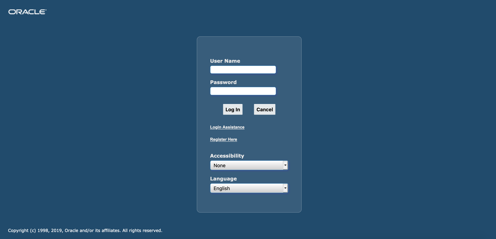

11. Acknowledge the secure configuration recommendations.

  Access to the environment will be restricted until the system administrator configures or acknowledges the secure configuration recommendations.

  To access the Secure Configuration Console, a user must have a responsibility that includes the Applications System (OAM\_APP\_SYSTEM) function privilege, such as the seeded System Administration or System Administrator responsibilities, and must be registered as a local user with Oracle E-Business Suite. The administrator must log in to Oracle E-Business Suite using the local login page (http(s)://[host]:[port]/OA_HTML/AppsLocalLogin.jsp) to navigate to the console and unlock the system. If a user with local system administrator privileges is not available, you can access the Secure Configuration Console through a command line utility. For more information, see "Secure Configuration Console" in the Oracle E-Business Suite Security Guide.
  Description of scc.jpg follows
  Description of the illustration scc.jpg

  Note: Once the system is "Unlocked" for normal usage, the Secure Configuration Console is still available for administrators under the 'Functional Administrator' responsibility.

  

You may proceed to the next lab.

## Learn More

* [Creating a Backup of an On-Premises Oracle E-Business Suite Instance on Oracle Cloud Infrastructure](https://www.oracle.com/webfolder/technetwork/tutorials/obe/cloud/compute-iaas/creating_backup_of_ebs_instance_on_oci/101_backup_oci.html)
* [Requirements for Oracle E-Business Suite on Oracle Cloud Infrastructure (Doc ID 2438928.1)](https://support.oracle.com/epmos/faces/DocumentDisplay?_afrLoop=97656525609392&id=2438928.1&_afrWindowMode=0&_adf.ctrl-state=1bsk4t5eng_4#S2)

## Acknowledgments

* **Author:** William Masdon, Cloud Engineering
* **Contributors:** 
    - Aurelian Baetu, Technology Engineering HUB - Cloud Infrastructure
    - Santiago Bastidas, Product Management Director
    - Quintin Hill, Cloud Engineering
* **Last Updated By/Date:** William Masdon, Cloud Engineering, Dec 2020

## Need Help?
Please submit feedback or ask for help using our [LiveLabs Support Forum](https://community.oracle.com/tech/developers/categories/ebs-on-oci-automation). Please click the **Log In** button and login using your Oracle Account. Click the **Ask A Question** button to the left to start a *New Discussion* or *Ask a Question*.  Please include your workshop name and lab name.  You can also include screenshots and attach files.  Engage directly with the author of the workshop.

If you do not have an Oracle Account, click [here](https://profile.oracle.com/myprofile/account/create-account.jspx) to create one. 
