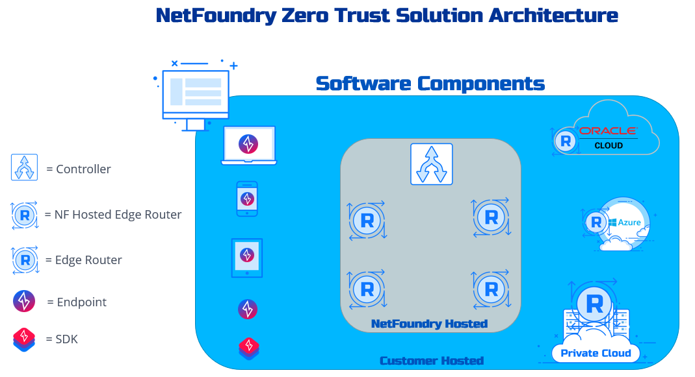

## NetFoundry Zero Trust Networking Introduction

The following guide is intended to provide you guidance for your Oracle NetFoundry LiveLab environment. It provides simple network configuration steps to help partners & end-users learn about the building blocks of configuring a NetFoundry network.  It will help outline each element within the NetFoundry network and provide instructions on how to configure a simple design connecting a Windows client to a web application in a Oracle Cloud on a private IPV4 network. (Any application will do but web is easy to test)

  

  

## Assumptions

To get started you'll need to have the following:

1. A NetFoundry Account/Organization. A seven day free trial is available to all who wish to demo the NetFoundry product and OCI.

    [NetFoundry Free Trial for Live Lab](https://nfconsole.io/signup)
 
2. A working public cloud account with networking (such as Oracle/VCN subscription), or have the necessary privilege's to install a virtual machine and/or install software onto a machine in your on premises environment. (ESXi/Hyper-V/VirtualBox). This example will utilize Oracle Cloud Infrastructure.
 
    [Oracle Cloud Free Tier for Live Lab](https://www.oracle.com/cloud/free/)
 
    [Oracle Cloud VCN Documentation for Live Lab](https://docs.oracle.com/en-us/iaas/Content/GSG/Tasks/creatingnetwork.htm)
   
3. An internet connection with outbound connections to the below ports.

    

 

## Software Components

Building the NetFoundry SDN framework consists of 7 major elements:

* **Organization** - Platform customer/partner URL for organizational platform access - https://company.nfconsole.io.

* **Network** - Dedicated Cloud based controller. Overlay only, not concerned with BGP, IP addressing and route peering.

* **Edge Router Policy** - Transit policy providing access across the fabric. e.g. Which Hosted Edge routers to be used and which endpoints can transit these Hosted Edge Routers.

* **Endpoints**

  * **Hosted Edge Routers** - NetFoundry managed Global Fabric for middle mile transit. Deployed from the NetFoundry console. Automatically registered.

  * **Customer Hosted Edge Routers** - implemented for application termination. Deployed from Cloud Marketplace. Registered by customer manually or through instance deployment script.

  * Endpoints for Windows, MAC, Linux or Mobile for application access or termination or both.

* **Attributes** - Method to group Endpoints, Edge Routers and Services. e.g. "@myendpoint" implies only that endpoint. "#it-admin" may imply a grouping of multiple IT admin endpoints. Same for services. e.g. @webserver1 & @webserver2 could be grouped into #webservers to ease administration for AppWAN membership.

* **Services** - IP/Hostname for applications residing in the VCN/VNET/VPC/VLAN.

* **AppWAN** - Policies for providing Services to Endpoints. 

Diagram below for logical reference:

