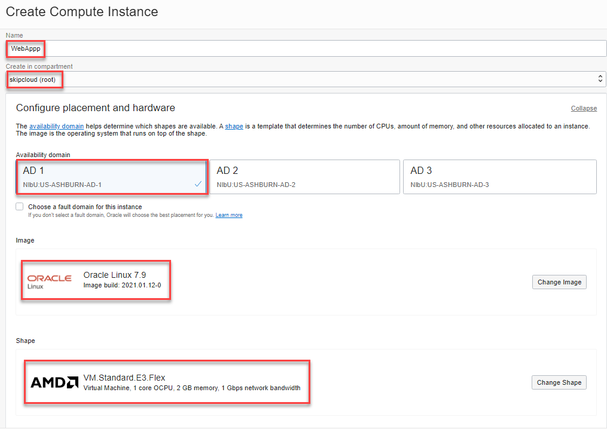

# NetFoundry Prerequisites

This guide is intended to provide you guidance for your Oracle NetFoundry LiveLab environment. 

## What You Need

The following provides simple network configuration steps to help partners & end-users learn about the building blocks of configuring a NetFoundry network.  It will help outline each element within the NetFoundry network and provide instructions on how to configure a simple design connecting a Windows client to a web application in a Oracle Cloud on a private IPV4 network. (Any application will do but web is easy to test)


### Prerequisites

To get started you'll need:

- A NetFoundry Account/Organization. A seven day free trial is available to all who wish to demo the NetFoundry product and OCI.
	[NetFoundry Free Trial for Live Lab](https://nfconsole.io/signup)
- A working public cloud account with networking (such as Oracle/VCN subscription), or have the necessary privilege's to install a virtual machine and/or install software onto a machine in your on premises environment. (ESXi/Hyper-V/VirtualBox). This example will utilize Oracle Cloud Infrastructure.
	[Oracle Cloud Free Tier for Live Lab](https://www.oracle.com/cloud/free/)
	[Oracle Cloud VCN Documentation for Live Lab](https://docs.oracle.com/en-us/iaas/Content/GSG/Tasks/creatingnetwork.htm)
- An internet connection with outbound connections to TCP port 80 and 443.
	

## Cloud application prep - Create Application in Cloud (Oracle Cloud example)

Identify an application sitting in your Cloud network or create a simple web app (Apache/80). We will provide this example of creating a web server in OCI that your NetFoundry client will access via a private VCN network IP address. If you already have an application in your network, you can skip to the next section.

1. From within your Cloud console, select 
	
   
	Select a name for your instance, select desired compartment and Availability domain. Oracle Linux is ok to use or choose an image of your liking. This example will use Oracle Linux 7.9 with 1 OCPU and 2 GB memory and apache web server.
	

2. Next, select the VCN, subnet and assign a public IP address.  Select your public key for deployment.

3. Next click "Show Advanced Options" and select Paste cloud-init script and paste the following into the field:
	````
	<copy>
	sudo yum install httpd
	sudo systemctl enable httpd
	sudo systemctl start httpd
	</copy>
	````
	**NOTE: you can configure the firewall to allow 80 or disable the built in instance firewall for testing.**
	

You should now have a running web server in your specified VCN.

## Acknowledgements
* **Author** - Person or persons, title(s)
* **Contributors** -  person, Title
* **Last Updated By/Date** - person, title,  June 2021


