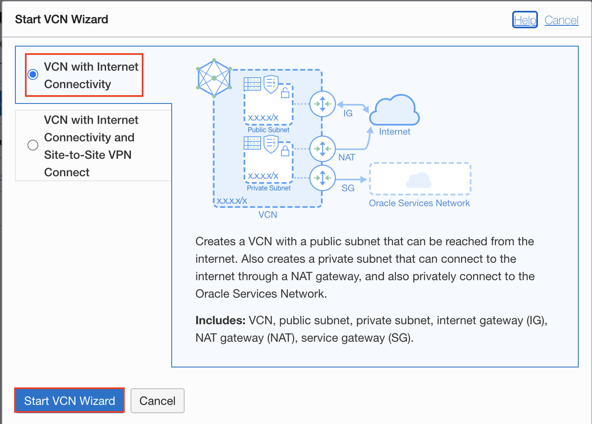
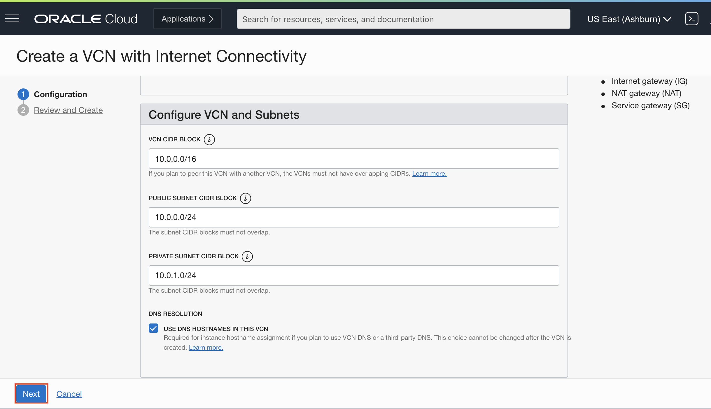
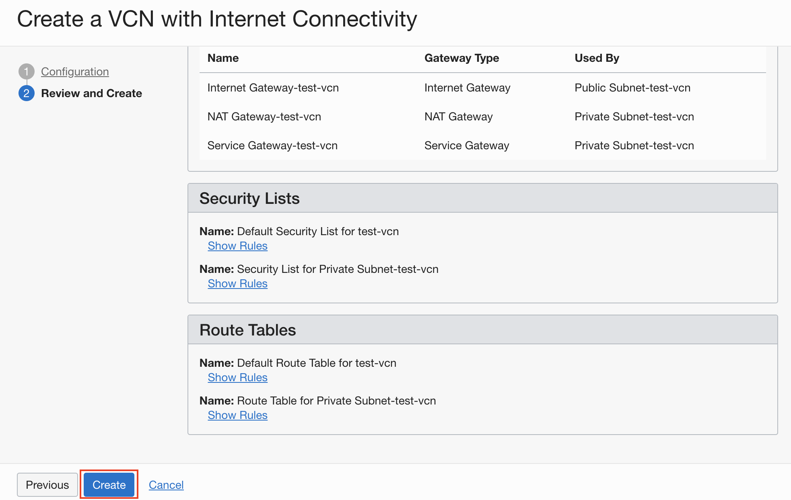
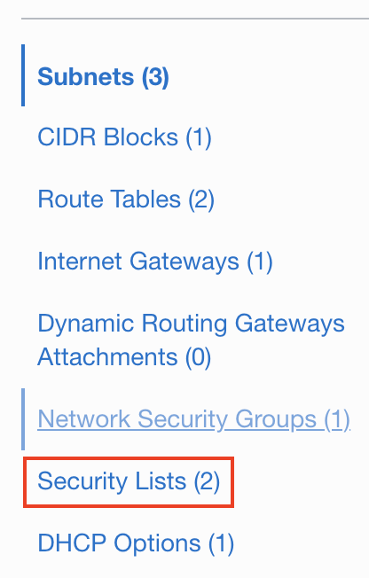
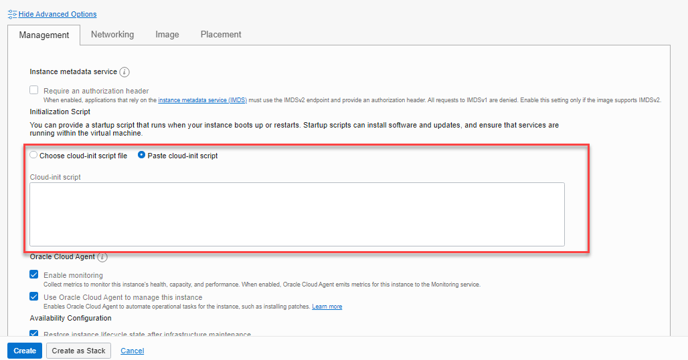

# NetFoundry Prerequisites - Cloud Application Prep

This guide is intended to provide you guidance for your Oracle NetFoundry LiveLab environment. 

## Introduction

Before we start, we will need a cloud application that we can use to test our connectivity.  If you already have an application in your network, you can skip to the labs.


### Prerequsites

To get started you will need:

- A NetFoundry Account/Organization. A seven day free trial is available to all who wish to demo the NetFoundry product and OCI.

	[NetFoundry Free Trial for Live Lab](https://nfconsole.io/signup)

- A working public cloud account with networking (such as Oracle/VCN subscription), or have the necessary privilege's to install a virtual machine and/or install software onto a machine in your on premises environment. (ESXi/Hyper-V/VirtualBox). This example will utilize Oracle Cloud Infrastructure.

	[Oracle Cloud Free Tier for Live Lab](https://www.oracle.com/cloud/free/)

	[Oracle Cloud VCN Documentation for Live Lab](https://docs.oracle.com/en-us/iaas/Content/GSG/Tasks/creatingnetwork.htm)

- An internet connection with outbound connections to TCP port 80 and 443.

	
	
	
## Create Virtual Cloud Network and related resources:

1. From the OCI console go to Networking, Virtual Cloud Network and click Start VCN Wizard

2. Next, select VCN with Internet Connectivity

	

3. Next, give a suitable name for your VCN and click Next

	

4, Next, review the components that will be created and click Create

	

5. Next, click the VCN that you just created and navigate to security list and select default Security List

	

6. Finally, Add an ingress rule for port 80 and port 443

	

	

## Create an Application in the Cloud (Oracle Cloud example)

Identify an application sitting in your Cloud network or create a simple web app (Apache/80). We will provide this example of creating a web server in OCI that your NetFoundry client will access via a private VCN network IP address. 

1. From within your Cloud console, select 
	
   
	Select a name for your instance, select desired compartment and Availability domain. Oracle Linux is ok to use or choose an image of your liking. This example will use Oracle Linux 7.9 with 1 OCPU and 2 GB memory and apache web server.
	

2. Next, select the VCN, and public subnet we created and assign a public IP address. Add your public SSH key for accessing the instance once it is created.

3. Next click "Show Advanced Options" and select Paste cloud-init script and paste the following into the field:
	````
	<copy>
	sudo yum install httpd
	sudo systemctl enable httpd
	sudo systemctl start httpd
	</copy>
	````
	**NOTE: you can configure the firewall to allow 80 or disable the built in instance firewall for testing.**
	

You should now have a running web server in your specified VCN.

## Acknowledgements

* **Author** - Skip Barr (Solutions Architect - NetFoundry), Raj Hindocha, Solutions Architect
* **Contributors** - Randall Spicher, Senior Cloud Engineer
* **Last Updated By/Date** - Randall Spicher, June 2021


