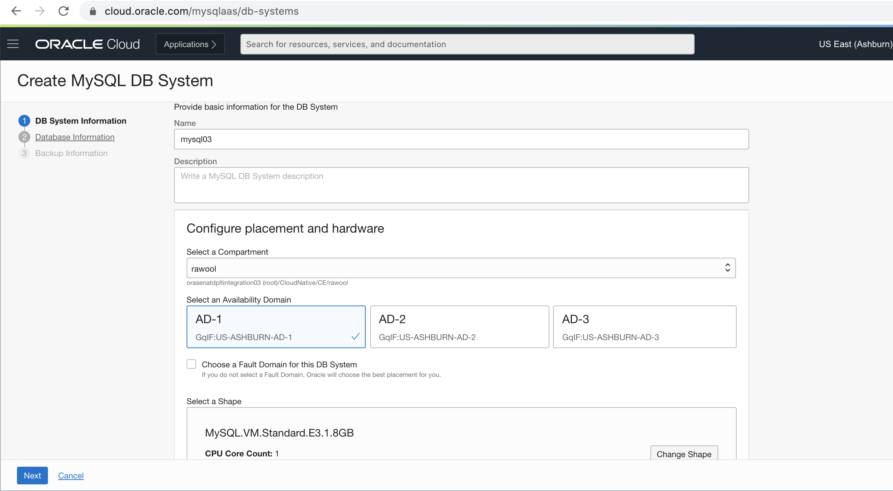
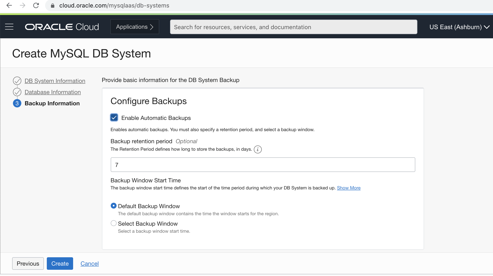
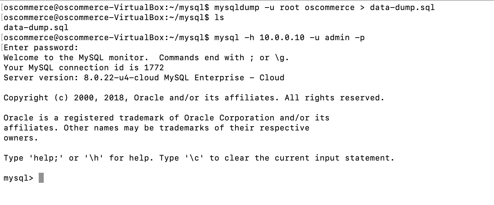
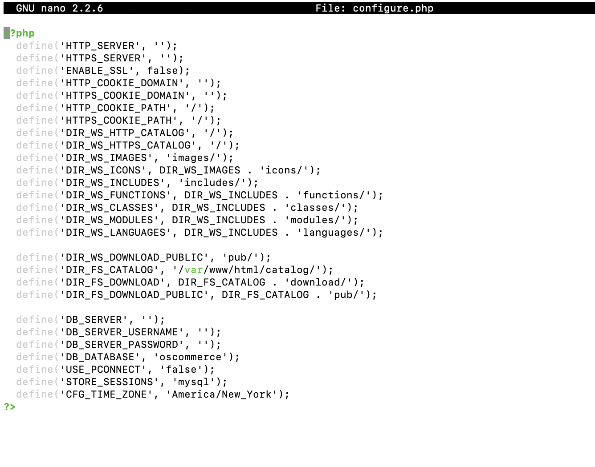
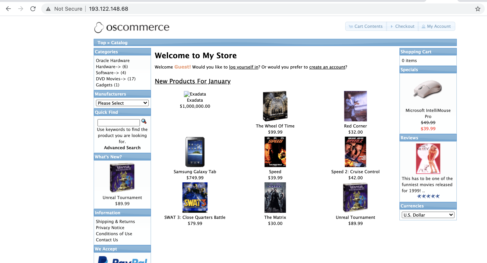

# Connecting your application with MDS (MySQL Database Cloud Service) on OCI

## Introduction
This lab walks you through the steps on how to create MDS instance on OCI and how to migrate your database from your E-Commerce App MySQL to MDS on OCI. The lab will also focus on how to connect your E-Commerce application with MDS.

Estimated Lab Time: 1 hour

### Objectives
* Create a MDS (MySQL Database Cloud Service)
* Migrate E-Commerce MySQL Database to MDS
* Connect your E-Commerce App with MDS

### Prerequisites
* Complete Lab 1 and 2
* Access to MySQL Database

## **STEP 1:** Create MDS Instance on OCI
1. Please login to OCI Console and click MySQL > DB Systems. And click Create MySQL DB System.

    

2. Please provide name for MySQL instance. Select your compartment, Availability Domain and shape. And click Next.

    

3. Now enter the credentials for MDS Instance. Please select the same VCN and public subnet you created in previous lab. And click Next.

    

4. Once complete, Please click create button. This will take few minutes to spin up the MDS Instance on OCI.

    

## **STEP 2:** Migrating Database to MDS

1. Please ssh in your primary instance. Run the following command in the terminal.

    ```
    <copy>
    mkdir mysql
    </copy>
    ```
    ```
    <copy>
    cd mkdir
    </copy>
    ```

2. Use below command to extract oscommerce database from OSCommerce MySQL instance using mysql client.

    ```
    <copy>
    mysqldump -u root oscommerce > data-dump.sql
    </copy>
    ```
    

3. Use below command to connect with MDS instance using mysql client. You would need to enter IP address of MDS, username and password created in previous step.

    ```
    <copy>
    mysql -h <MDS_IP_address> -u admin -p
    </copy>
    ```
    


4. Run the following command in the terminal. This will create oscommerce database and upload the dump to MDS Instance. Using show tables, please check if you are able to see all tables of oscommerce database.

    ```
    mysql> create database oscommerce;
    mysql> use oscommerce;
    mysql> source data-dump.sql;
    mysql> show tables;
    ```

    

5. Run below command to exit from MDS. And then proceed to next step.

    ```
    <copy>
    mysql> exit;
    </copy>
    ```

## **STEP 3:** Connecting your E-Commerce App with MDS

1. Now you would need to update the configure.php file of oscommerce application to point to MDS Database. Run the following command in the terminal.
    ```
    <copy>
    cd /var/www/html/catalog/includes
    </copy>
    ```
    ```
    <copy>
    sudo nano configure.php
    </copy>
    ```
    

2. Update following parameters:
    ```
    define('DB_SERVER', '');  # IP address of MDS
    define('DB_SERVER_USERNAME', ''); # username of MDS
    define('DB_SERVER_PASSWORD', ''); # password of MDS
    ```

3. Save the file and proceed to next steps.

4. Goto the browser and open the IP address. You would see oscommerce website up and running as below. Now the E-Commerce application is connected to MDS Database.

    

5. Congrats! You've successfully connected your primary instance of E-Commerce application with MDS. You can repeat the lab for your secondary instance.

## Learn More
* To learn about connecting to MDS on OCI [link](https://docs.oracle.com/en-us/iaas/mysql-database/doc/connecting-db-system.html)
* To learn about MySQL Shell [link](https://dev.mysql.com/doc/mysql-shell/8.0/en/)

## Acknowledgements
* **Author** - Rajsagar Rawool
* **Last Updated By/Date** - Rajsagar Rawool, January 2021

## Need Help ?
If you are doing this module as part of an instructor led lab then please just ask the instructor.

If you are working through this module self guided then please submit feedback or ask for help using our [LiveLabs Support Forum](https://community.oracle.com/tech/developers/categories/livelabsdiscussions). Please click the **Log In** button and login using your Oracle Account. Click the **Ask A Question** button to the left to start a *New Discussion* or *Ask a Question*.  Please include your workshop name and lab name.  You can also include screenshots and attach files.  Engage directly with the author of the workshop.

If you do not have an Oracle Account, click [here](https://profile.oracle.com/myprofile/account/create-account.jspx) to create one
