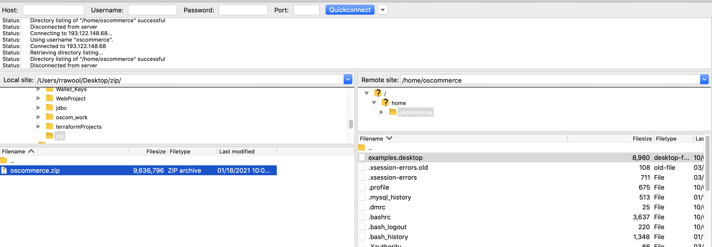
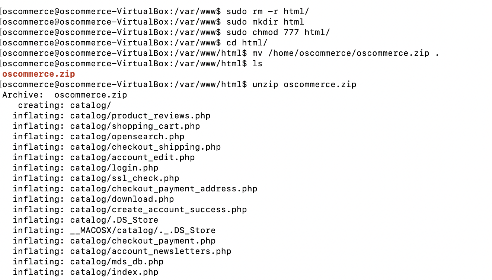
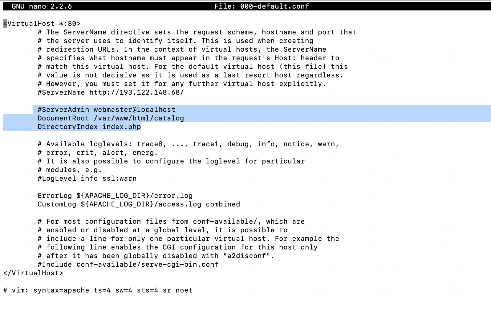

# Connecting your application with MDS (MySQL Database Cloud Service) on OCI

## Introduction
This lab walks you through the steps on how to create MDS instance on OCI and how to migrate your database from your OSCommerce App MySQL to MDS on OCI. The lab will also focus on how to connect your OSCommerce application with MDS.

Estimated Lab Time: 1 hour

### Objectives
* Create a MDS (MySQL Database Cloud Service)
* Migrate OSCommerce MySQL Database to MDS
* Connect your OSCommerce App with MDS

## **Step 1:** Create MDS Instance on OCI
1. Please login to OCI Console and click MySQL > DB Systems. And click Create MySQL DB System.

    

2. Please provide name for MySQL instance. Select your compartment, Availability Domain and shape. And click Next.

    

3. Now enter the credentials for MDS Instance. Please select the same VCN and public subnet we created in previous lab. And click Next.

    

4. Once complete, Please click create button. This will take few minutes to spin up the MDS Instance on OCI.

    

## **Step 2:** Migrating Database to MDS

1. Please ssh in your primary instance. Run the following command in the terminal.

    ```
    mkdir mysql
    cd mkdir
    ```

2. Use below command to extract oscommerce database from OSCommerce MySQL instance using mysql client.

    ```
    <copy>
    mysqldump -u root oscommerce > data-dump.sql
    </copy>
    ```
    

3. Use below command to connect with MDS instance using mysql client. You would need to enter IP address of MDS, username and password created in previous step.

    ```
    <copy>
    mysql -h <MDS_IP_address> -u admin -p
    </copy>
    ```
    


4. Run the following command in the terminal. This will create oscommerce database and upload the dump to MDS Instance. Using show tables, please check if you are able to see all tables of oscommerce database.

    ```
    mysql> create database oscommerce;
    mysql> use oscommerce;
    mysql> source data-dump.sql;
    mysql> show tables;
    ```

    

5. Run below command to exit from MDS. And then proceed to next step.

    ```
    mysql> exit;
    ```

## **Step 3:** Connecting your OSCommerce App with MDS

1. Please download the oscommerce App code to your laptop and move the zip contents to your primary instance using FileZilla tool. You can download filezilla from [here](https://filezilla-project.org/)
OSCommerce Web Application - [Link](https://objectstorage.us-ashburn-1.oraclecloud.com/p/YWohpF3cmZuDi2LWL056VHnNvlNTu37JaGMhM8oqenS_95gf2WBWfUCylfFY2jI_/n/orasenatdpltintegration03/b/workshop/o/oscommerce.zip)

Configure FileZilla connection to connect to your primary instance as below. And drag and drop oscommerce.zip file to the primary instance.




3. Run this command to delete old oscommerce application code and replace with the recent code. Copy the oscommerce zip file to /var/www/html folder after clearing the old contents.
    ```
    cd /var/www/
    sudo rm -r html/
    sudo mkdir html
    sudo chmod 777 html/
    cd html/
    mv /home/oscommerce/oscommerce.zip .
    ls
    unzip oscommerce.zip
    ```
        

4. Now you would need to update the configure.php file of oscommerce application to point to MDS Database. Run the following command in the terminal.
    ```
    cd /var/www/html/catalog/includes
    sudo nano configure.php
    ```
    

### Update following parameters:
* define('HTTP_SERVER', '<primary_instance_ip_address>'); # eg - http://193.122.148.68/
* define('HTTPS_SERVER', '<primary_instance_ip_address>'); # eg - http://193.122.148.68/
* define('DB_SERVER', '');  # IP address of MDS
* define('DB_SERVER_USERNAME', ''); # username of MDS
* define('DB_SERVER_PASSWORD', ''); # password of MDS

Save the file and proceed to next steps.

5. Make sure the apache configuration 000-default.conf file is updated as below.

* #ServerAdmin webmaster@localhost
* DocumentRoot /var/www/html/catalog
* DirectoryIndex index.php

    ```
    cd /etc/apache2/sites-available/
    sudo nano 000-default.conf
    cd /etc/apache2/sites-enabled
    sudo nano 000-default.conf
    ```
    

6. Run the following command in the terminal to restart your apache server. Goto the browser and open the IP address. You would see oscommerce website up and running as below.

    

## Learn More
* To learn about connecting to MDS on OCI [link](https://docs.oracle.com/en-us/iaas/mysql-database/doc/connecting-db-system.html)
* To learn about MySQL Shell [link](https://dev.mysql.com/doc/mysql-shell/8.0/en/)

## Acknowledgements
* **Author** - Rajsagar Rawool
* **Adapted for Cloud by** -  Rajsagar Rawool
* **Last Updated By/Date** - Rajsagar Rawool, January 2021


## Need Help?
Please submit feedback or ask for help using our [LiveLabs Support Forum](https://community.oracle.com/tech/developers/categories/livelabsdiscussions). Please click the **Log In** button and login using your Oracle Account. Click the **Ask A Question** button to the left to start a *New Discussion* or *Ask a Question*.  Please include your workshop name and lab name.  You can also include screenshots and attach files.  Engage directly with the author of the workshop.

If you do not have an Oracle Account, click [here](https://profile.oracle.com/myprofile/account/create-account.jspx) to create one.
