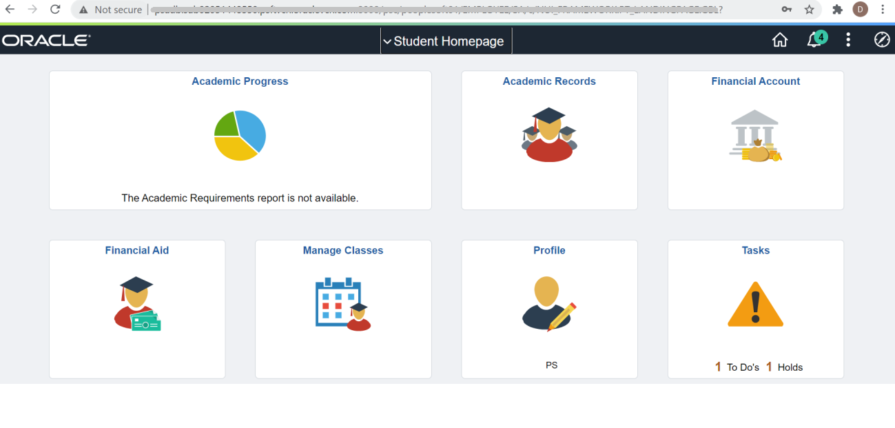

# Creating Autonomous Database

## Introduction
This lab walks you through the steps to prepare your Oracle Cloud Infrastructure Tenancy

Estimated Lab Time: 45 minutes

### About Identity and Access Management (IAM)
The Oracle Cloud Infrastructure (OCI) Identity and Access Management (IAM) Service allows you to control who has access to your cloud resources. You control the types of access a group of users has and to which specific resources. 

### Objectives

The purpose of this lab is to give you an overview of the IAM Service components and an example scenario to help you understand how they work together.

In this lab, you will:
* Sign-in to your OCI Tenancy to access the Console
* Verify the Service Limit
* Manage access by creating 
    - Demo Compartment
    - OCI Group
    - Policies
    - New Local User

### Prerequisites

* Oracle Cloud Infrastructure account credentials (User, Password, and Tenant)

* To sign in to the Console, you need the following: 

    - Tenant, Username and Password
    - URL for the Console: [https://cloud.oracle.com] (https://cloud.oracle.com)
    - Oracle Cloud Infrastructure supports the latest versions of Google Chrome, Firefox, and Internet Explorer 11

## **STEP 1**: 

## **STEP 2**:
test  
    

## **STEP 3:** 

## **STEP 4:** 

You may now **proceed to the next lab.**

## Acknowledgments
* **Authors** - 
* **Last Updated By/Date** - 

## Need Help?
Please submit feedback or ask for help using our [LiveLabs Support Forum](https://community.oracle.com/tech/developers/categories/Migrate%20SaaS%20to%20OCI). Please click the **Log In** button and login using your Oracle Account. Click the **Ask A Question** button to the left to start a *New Discussion* or *Ask a Question*.  Please include your workshop name and lab name.  You can also include screenshots and attach files.  Engage directly with the author of the workshop.

If you do not have an Oracle Account, click [here](https://profile.oracle.com/myprofile/account/create-account.jspx) to create one.