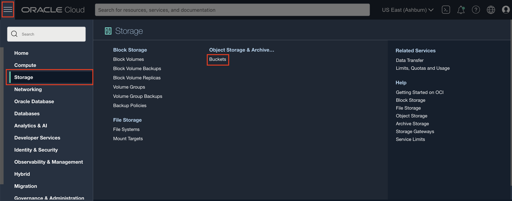

# MV2ADB Pre-requisites and Installation 

## Introduction

This lab walks you through the steps to download and install MV2ADB and also completing the pre-requisites to run one-click MV2ADB migration for ADB-S

Estimated Lab Time: 10 minutes

### Objectives


In this lab, you will:
* Download and install MV2ADB on PeopleSoft on-premise system
* Generate an OCI Auth Token
* Creating an OCI Bucket


### Prerequisties
* My Oracle Support (MOS) credentials. Please make sure that you can successfully login to [Oracle Support](https://support.oracle.com). 
* OCI CLI to be installed on the on-premise PeopleSoft database system,refer to link [here](https://docs.oracle.com/en-us/iaas/Content/API/SDKDocs/cliinstall.htm) for installing and configuration

* Root user access on the on-premise PeopleSoft system


## Task 1: Download and install MV2ADB  on PeopleSoft on-premise system

* 1. On the PeopleSoft  machine, download the MV2ADB rpm file [here](https://support.oracle.com/epmos/faces/DocContentDisplay?_afrLoop=291097898074822&id=2463574.1&_afrWindowMode=0&_adf.ctrl-state=v0102jx12_4). Platform specific rpm can be downloaded under the History Tab.

    

* 2. Login as root and place the MV2ADB rpm file on /tmp path and install the rpm

      ```
     [root@pscs92dmo-lnxdb-2 tmp]# rpm -i mv2adb-2.0.1-114.el7.x86_64.rpm
     warning: mv2adb-2.0.1-114.el7.x86_64.rpm: Header V4 RSA/SHA1 Signature, key ID 939112d6: NOKEY
     mv2adb-2.0.1.114 binary has been installed on /opt/mv2adb succesfully!
      ```


    


## Task 2: Generate an OCI Auth Token

1. Click on your **Profile** in the top right, and then click your **Username**.

  

2. Click on **Auth Token**, and click **Generate**.

  
  *Note: Copy your Auth Token to a notepad, as you cannot see it once you close the window.*

  

## Task 3: Creating an OCI Bucket on Object Storage

1.  Click on the **Menu** in top left and select **Object Storage**.

  

2. Verify you are in the correct **Compartment** and click **Create Bucket**.

  

3. Enter a **Name** for your bucket, then hit **Create Bucket** again.

  
  *Take note of your region, bucket name, and tenancy name for later.*


You may now **proceed to the next lab.**

## Acknowledgements
* **Authors** - Deepak Kumar M, PeopleSoft Architect
* **Contributors** - Deepak Kumar M, PeopleSoft Architect
* **Last Updated By/Date** - Deepak Kumar M, PeopleSoft Architect, Aug 2021


## Need Help?
Please submit feedback or ask for help using our [LiveLabs Support Forum](https://community.oracle.com/tech/developers/categories/Migrate%20SaaS%20to%20OCI). Please click the **Log In** button and login using your Oracle Account. Click the **Ask A Question** button to the left to start a *New Discussion* or *Ask a Question*.  Please include your workshop name and lab name.  You can also include screenshots and attach files.  Engage directly with the author of the workshop.

If you do not have an Oracle Account, click [here](https://profile.oracle.com/myprofile/account/create-account.jspx) to create one.


