# Creating Identity and Access Management (IAM) Resources

## Introduction
This lab walks you through the steps to prepare your Orace Cloud Infrastructure Tenancy

Estimated Lab Time: 30 minutes

### About Identity and Access Management (IAM)
The Oracle Cloud Infrastructure (OCI) Identity and Access Management (IAM) Service allows you to control who has access to your cloud resources. You control the types of access a group of users has and to which specific resources. 

### Objectives

The purpose of this lab is to give you an overview of the IAM Service components and an example scenario to help you understand how they work together.

In this lab, you will:
* Sign-in to your OCI Tenancy to access the Console
* Verify the Service Limit
* Manage access by creating 
    - Demo Compartment
    - OCI Group
    - Policies
    - New Local User


### Prerequisites

* Oracle Cloud Infrastructure account credentials (User, Password, and Tenant)

* To sign in to the Console, you need the following: 

    - Tenant, Username and Password
    - URL for the Console: [https://cloud.oracle.com] (https://cloud.oracle.com)
    - Oracle Cloud Infrastructure supports the latest versions of Google Chrome, Firefox, and Internet Explorer 11
    - Please download this file: [Details.txt](https://objectstorage.us-ashburn-1.oraclecloud.com/p/iFAPdfoRcY01Baa_b6mv7eCzg3rg6IL9olmt-P6OdlAf-B_0h0LnmI_DARqiK2Qr/n/orasenatdpltoci03/b/TestDrive/o/Details.txt.zip)

## **STEP 1**: Signing in to the Console
**Console Overview**  
If you haven't already, please download **Details.txt**, in the **Prerequisites** above. This file will be used note down important information throughout the lab. 

In this section, sign in to the Oracle Cloud Infrastructure console using your credentials.

1.	Open a supported browser and go to the Console URL: [https://cloud.oracle.com] (https://cloud.oracle.com).

2.	Click on the portrait icon in the top-right section of the browser window, then click on the Sign in to Cloud link.

    

3.	Enter your Cloud Account name (aka tenancy name), NOT your user name), note it down in **Details.txt** (#1). Click on the **Next** button. 

    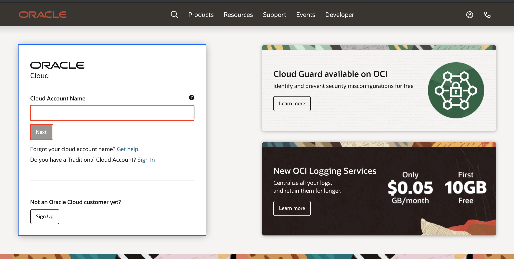

4.	Oracle Cloud Infrastructure is integrated with Identity Cloud Services. You will see a screen validating your Identity Provider. Click **Continue**. Enter your username and password and click **Sign In**. Put these credentials in **Details.txt** (#2 & 3).

    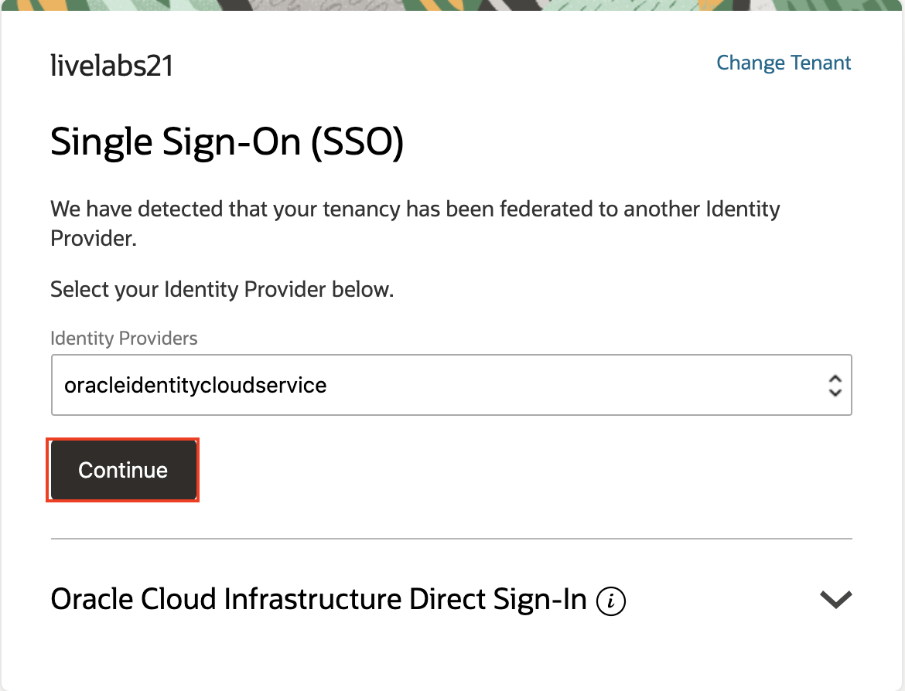 

    

5.	When you sign in to the Console, the dashboard is displayed.

    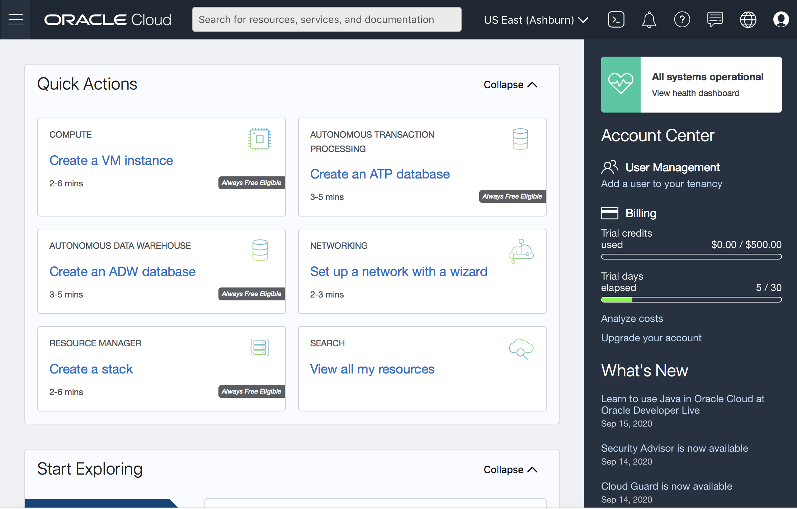

    On the top right, click on the region. Note the home region displayed in **Details.txt** (#4) as well. 

    


## **STEP 2:** Verifying Service Limits

During the workshop, you might face problems related to service limits. 

Please check that you have the required resources in Availability Domain 1

1. To check the service limit, navigate to the three-line menu on the top left and click on **Governance -> Limits, Quotas, and Usage**.

    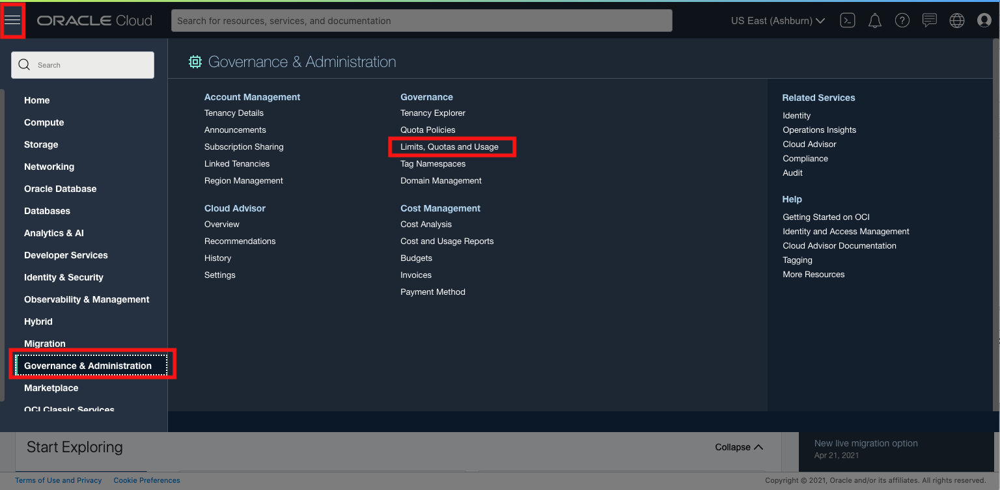

2. Using the dropdowns, make the following selections:
    * Service: **Compute** 
    * Scope:  **US-ASHBURN-AD-1** 
    * Resource: **Cores for Standard2 based VM and BM Instances**

    Make sure you have 6 cores Available in the chart below.

    

**Note**: We will be using all 6 (Jumphost is 1, Cloud Manager is 1, PSFT Environment is 2, Cloning Environment is 2), so if you would like to spin up any other compute resources that require Standard2 based VM and BMs for the duration of the trial, be sure to use a different Availability Domain.

## **STEP 3:** Creating a Demo Compartment
**Compartments Overview:**
A compartment is a collection of cloud assets, like compute instances, load balancers, databases, etc. By default, a root compartment was created for you when you created your tenancy (ie, when you registered for the trial account). It is possible to create everything in the root compartment, but Oracle recommends that you create sub-compartments to help manage your resources more efficiently.

1.	Click on the three-line menu, which is on the top left of the console. Scroll down till the bottom of the menu, click on **Identity & Security -> Compartments**. Click on the blue **Create Compartment** button to create a sub-compartment.

    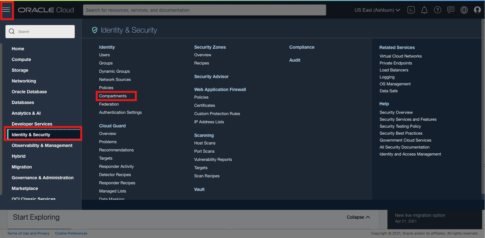

    

2.	Give the Compartment a Name and Description 
    Copy the fields below
    Name:
    ```
    <copy>Demo</copy>
    ``` 
    Description:
    ```
    <copy>This is our main compartment for test drive</copy>
    ``` 

    Be sure your root compartment is shown as the parent compartment. Press the blue **Create Compartment button** when ready.

    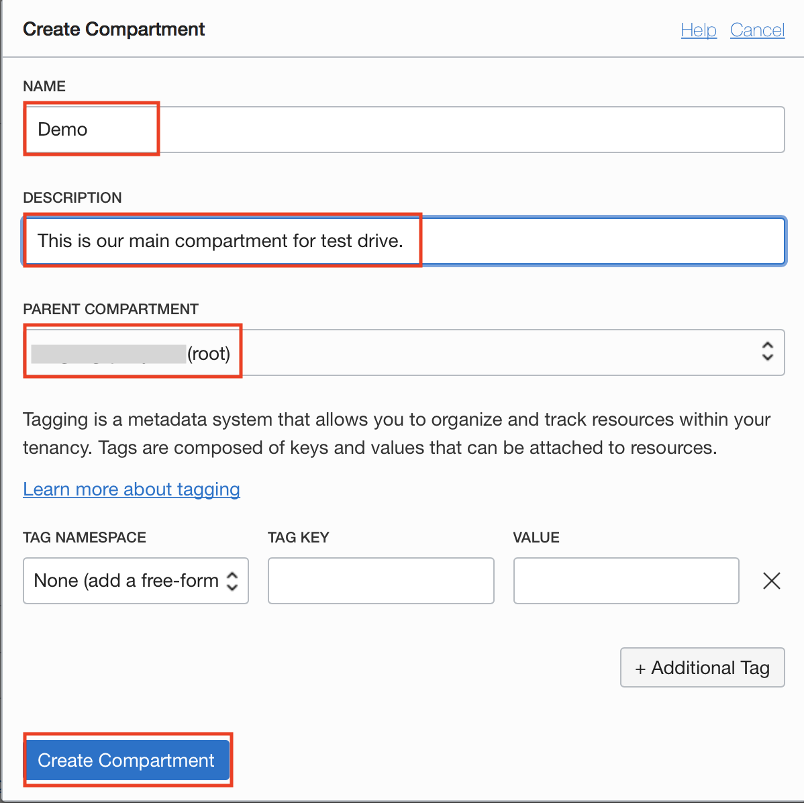

3.	You have just created a compartment for all of your work in this Test Drive.

## **STEP 4:** Creating a Group
**Security Overview:** A user's permissions to access services come from the groups to which they belong. Policies define the permissions for a group Policies explain what actions members of a group can perform, and in which compartments. Users can access services and perform operations based on the policies set for the groups.

We'll create a user, a group, and a security policy to understand the concept.

1.	After signing in to the console, click on the three-line menu on the top left. Click on **Identity & Security -> Groups**.

    

2.	Click **Create Group**.

3.	Give the Group a name and description
    Copy the fields below
    
    Name:
    ```
    <copy>oci-group</copy>
    ``` 
    Description:
    ```
    <copy>New group for OCI users</copy>
    ``` 

    Click **Create**

    

4.	Your new group is displayed.

    
   
## **STEP 5:** Creating a Policy

Now, let’s create a security policy that gives your group permissions in your assigned Compartment. In this case, we will create a policy that permits users belonging to group **'oci-group' to provision Peoplesoft Cloud Manager in Compartment 'Demo'**:

1. Click on the three-line Menu button on the top left. Click on **Identity & Security -> Policies**.
    
        

2. On the left side, navigate to **COMPARTMENT** and select **root compartment**. 

    

3. After you have selected the **root** compartment, click **Create Policy**.

    Copy the fields below. Give the group a
        
    a) Name:
    ```
    <copy>Policy-for-oci-group</copy>
    ``` 
    b) Description:
    ```
    <copy>Policy for OCI Group</copy>
    ``` 
    c) Verify it's in the **root** compaartment

    d) Toggle the radio button to **"Show manual editor"**

    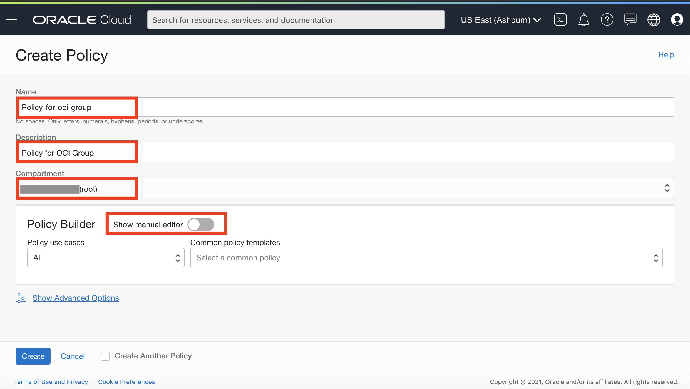

4. Add Policy Statements **Show manual editor**
    
    a) Enter the following Statements to the empty field:
    
    ```
    <copy>Allow group oci-group to manage all-resources in compartment Demo
    Allow group oci-group to read all-resources in tenancy
    Allow group oci-group to manage App-catalog-listing in tenancy</copy>
    ```  

    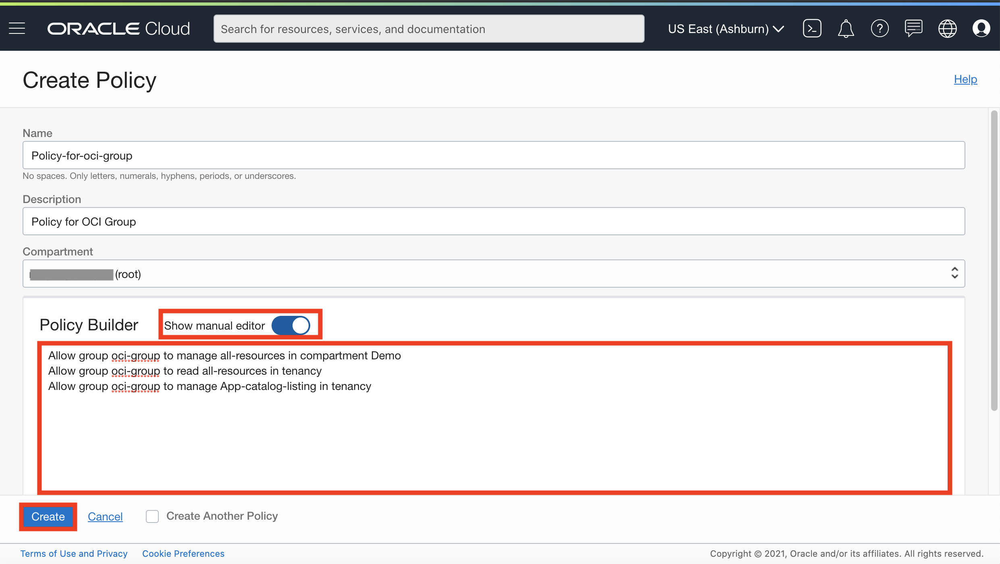    

    b) Click **Create**.

    *NOTE*: If you used a different name for the group or compartment, then you'll need to adjust these statements accordingly.

## **STEP 6:** Creating a User

Create a **New User**
   
1. Click on three-line menu on top left, and click on **Identity & Security -> Users**.
     
2. Click **Create User**.

3. Select **IAM user**. This is crucial. Do *NOT* create an IDCS user.

        

4. In the New User dialog box, copy the fields below to give the user a 
        
    a) Name:
    ```
    <copy>User01</copy>
    ``` 
    b) Description:
    ```
    <copy>User 01</copy>
    ``` 

    *Optional* Email: Enter your email ID and confirm it. Please make sure not to use the same email ID. Email ID has to be unique in the tenancy. If you don't have another email ID, you can leave it blank.

    

    b) Click **Create**.

## **STEP 7:** Managing User
1. From the same User Details page, copy the OCID by clicking on **copy** and paste it in **Details.txt** (#5). 

    


2. Now, let's set a password. Click **Create/Reset Password**.

    

3. In the dialog, click **Create/Reset Password**.

    

4. The new one-time password is displayed. Click the **Copy** button, save this to **Details.txt** (#6) for later, and then click **Close**.
    
    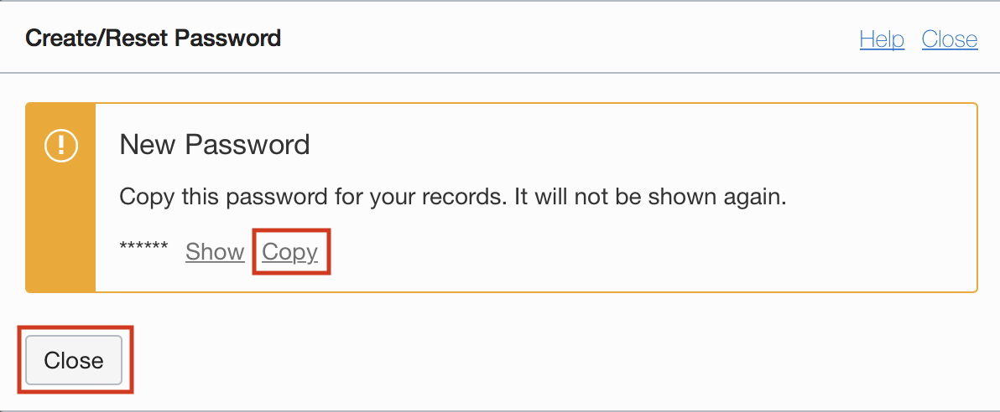

5. Scroll down and click on **Add User to Group**.

    

6. Select the group you just created, and click on **Add**.

    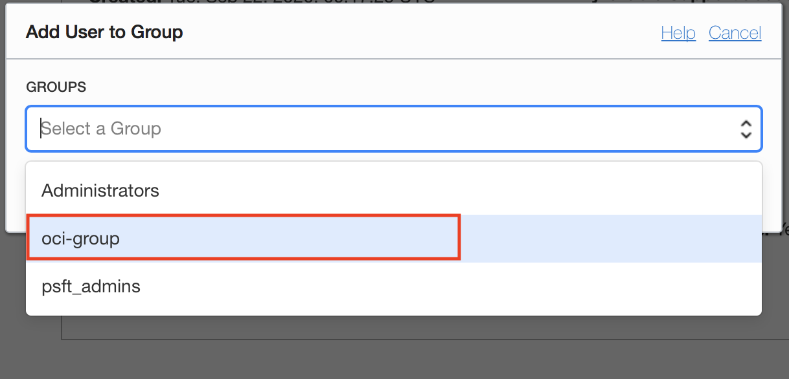

7. Click on **top-right icon button** and **Sign out** of the admin user account.

    

    This time, you will sign in using the local credentials box with the user you created. Note that the user you created is not part of the Identity Cloud Services.

8. Click **Oracle Cloud Infrastructure Direct Sign-In** 
    
    This will expand fields for non-federated accounts. Enter the username **User01** and the password that you copied to **Details.txt** (#6).

    


    *Note*: Since this is the first-time sign-in, the user will be prompted to change the temporary password, as shown in the screen capture below.
    

9. Set the new password to **Psft@1234**. Click on **Save New Password**. 
    ```
    <copy>Psft@1234</copy>
    ```
    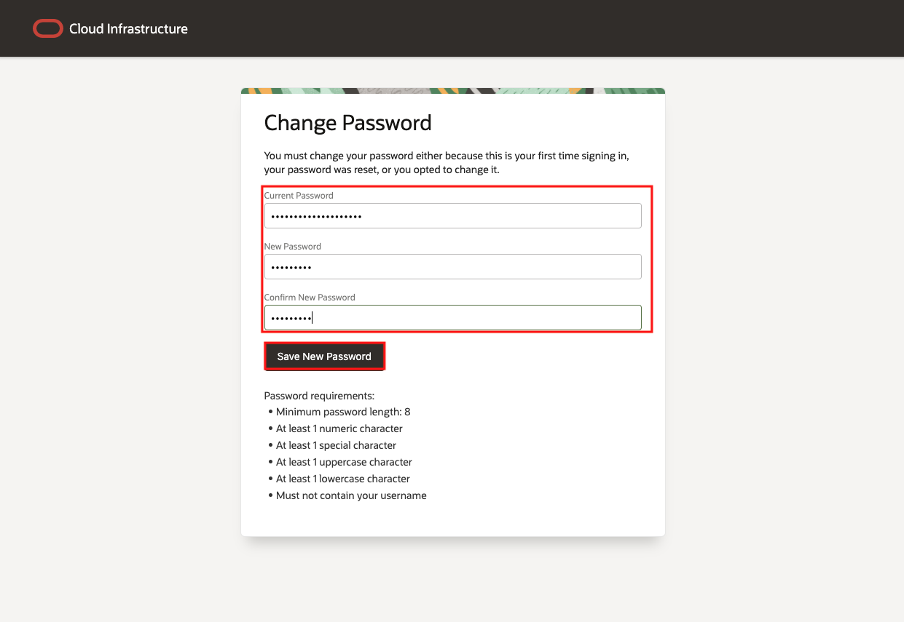


    You are now logged in as local user: **User01**

## **STEP 8:** Generating Keys

1. **For your convenience, you can use these pre-generated keys for the purpose of the demo and skip to Step 9: [psftKeys.zip](https://objectstorage.us-ashburn-1.oraclecloud.com/p/TfT512KHmcXTOfylHmEBrBeZNmjDsjVSB4sjSO0Oq2KN2KVE4Dz4bwvI5nOhzrqB/n/orasenatdpltoci03/b/TestDrive/o/psftKeys.zip)**
<!-- For your convenience, you can use these pre-generated keys for the purpose of the demo and skip to Step 9: [TestDrivekeys.zip](https://objectstorage.us-ashburn-1.oraclecloud.com/p/ayiPYT9IgCE8e4fT1qc3jjyyMKgdIbC-t_zn7TUsx8Lhlqp_W-gSJ0I2r-2c7LU9/n/c4u03/b/solutions-library/o/TestDrivekeys.zip) -->

You may now skip down to Step 9.

**OPTIONALLY**, 

If you would like to generate your own keys, continue here:
1. Ensure Git Bash is installed on your laptop/workstation.

2. Download the following script: [make_keys.sh](https://objectstorage.us-ashburn-1.oraclecloud.com/p/4siaoXfcndYoTXRI9y7evzGbNLgCcLt1YjMpb76eW87EAVGoGJCkzFxWk1S-EMn8/n/c4u03/b/solutions-library/o/make_keys.sh)

3. Launch Terminal for Mac or Git Bash for Windows command line and navigate to the folder where the file was downloaded. For example, if the file was downloaded in the Downloads folder, you can type the following command:

    ```
    <copy>
    cd ~/Downloads
    </copy>
    ```

4. Give permission to the file by typing in the command line: 

    ```
    <copy>
    chmod u+rx make_keys.sh
    </copy>
    ```

5. For Windows, run the script:

    ```
    <copy>
    bash make_keys.sh
    </copy>
    ```

  For Mac terminal run the command:

    ```
    <copy>
    ./make_keys.sh
    </copy>
    ```

    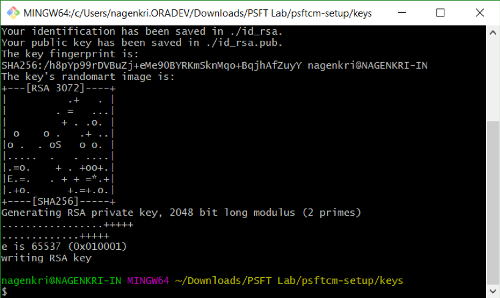

6. The command will generate the following sets of key files:

	**I.	API Signing keys**: ``api_key`` and ``api_key.pub``

	**II.	SSH key pair**: ``id_rsa`` and ``id_rsa.pub``

    
    *Note* : These Keys are necessary for you to be able to securely connect into your PeopleSoft Cloud Tenancy.
    
    

## **STEP 9**: Setting API Keys for User01

Verify you have the following 4 keys: 
* **API Signing keys**: ``api_key`` and ``api_key.pub``
* **SSH key pair**: ``id_rsa`` and ``id_rsa.pub``

1. Copy the contents of api_key.pub key (the one you downloaded or created through the script) as follows: 
    - Right click on the api_key.pub and open with a text editor as shown below. 

      

    
    *Note*: Copy EVERYTHING from the text editor (including the beginning and ending "---") and keep it in your clipboard to paste it in the OCI console.
    

2. Now, go back to the OCI console where you should still be logged in as **User01**. After you are successfully logged in, click on the **profile button on top right**. Click on your user name - **User01**.

    

3. Scroll to the bottom, on the left side click on **API Keys** and then click on **Add Public Key**

    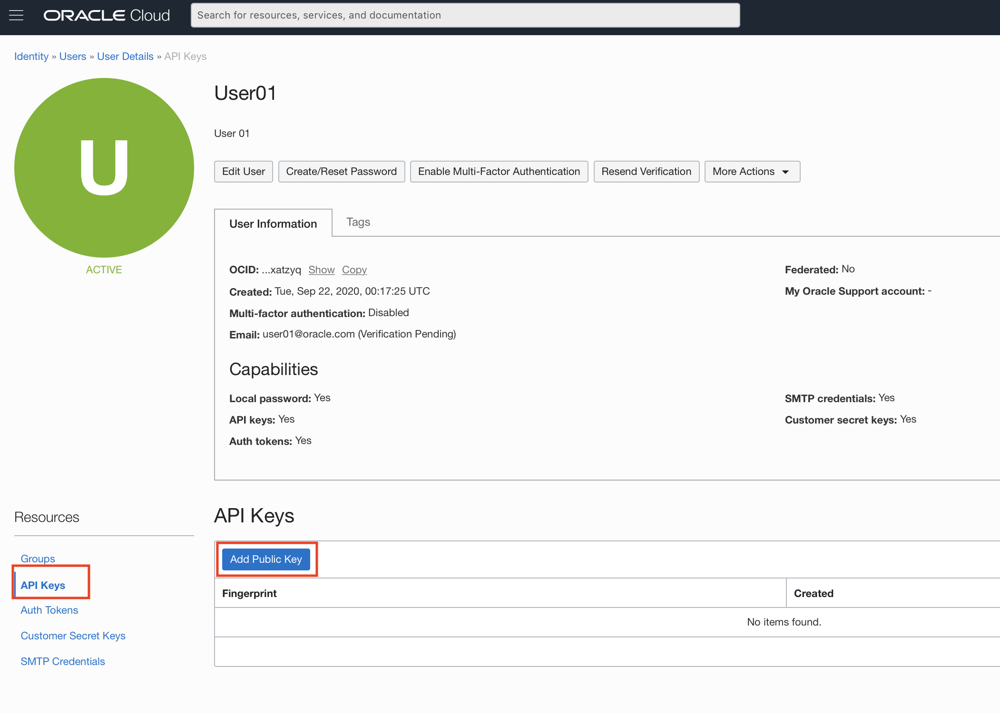

4. Click on **Paste public keys** and paste the content of **api_key.pub** (the one you just copied above). Click on **Add**.  

    

    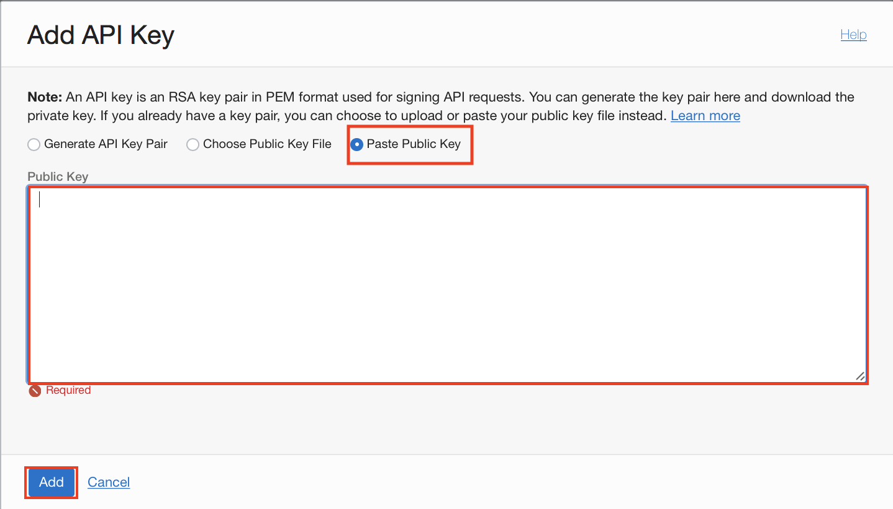

Verify that you have entries #1-8 filled out in **Details.txt**


<!-- ## **STEP 10**: Gather Information for the Cloud Manager Stack

Paste the below information in a notepad. You will need it later while creating the stack.

1. From the same User detail page, copy the OCID by clicking on **copy** and paste it in your notepad. 

    

2. On the top right, click on the region. Note the home region displayed in your notepad as well. 

     -->

You may now proceed to the next lab.


## Acknowledgments
* **Authors** - Megha Gajbhiye, Cloud Solutions Engineer; Sara Lipowsky, Cloud Engineer
* **Last Updated By/Date** - Sara Lipowsky, Cloud Engineer, May 2021
* **Lab Expiry Date** - October 1, 2021 

## Need Help?
Please submit feedback or ask for help using our [LiveLabs Support Forum](https://community.oracle.com/tech/developers/categories/Migrate%20SaaS%20to%20OCI). Please click the **Log In** button and login using your Oracle Account. Click the **Ask A Question** button to the left to start a *New Discussion* or *Ask a Question*.  Please include your workshop name and lab name.  You can also include screenshots and attach files.  Engage directly with the author of the workshop.

If you do not have an Oracle Account, click [here](https://profile.oracle.com/myprofile/account/create-account.jspx) to create one.