# Creating New Environment Template

## Introduction

This lab walks you through the steps to create a new environment template from the previously downloaded PeopleSoft Image

Estimated Lab Time: 20 minutes

### Objectives
The purpose of this lab is to show you how to create a new environment template from a downloaded PeopleSoft Image in order to create a new PeopleSoft Environment.

In this lab, you will:
* Create a new environment template

Let's take a look at the Network Topology again, so we can understand what we are configuring.

We have already provisioned Cloud Manager in a private subnet (cm) and the Jump Host in a public subnet (jumphost). We created a template of 2 nodes:
* Linux Full Tier in private subnet (ft)
* PeopleSoft Client in private subnet (win)

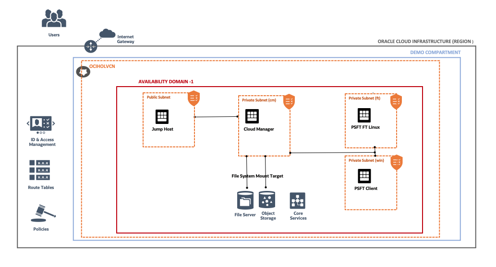

### Prerequisites
- A PeopleSoft Cloud Manager Instance
- A downloaded PeopleSoft Image

## **STEP 1**: Creating a New Environment Template and General Details

Navigate to Cloud Manager Dashboard -> **Environment Template**
    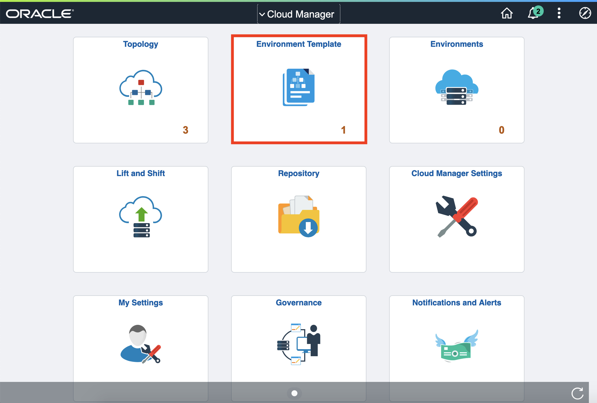

Click **Add New Template** button.
    

1. Fill out the General Settings as follows:
    - Name: **PUMFT**
    - Description **HCM 9.2 FT: Linux and Windows node**
    

2. For Select PeopleSoft Image, click the **search icon**. Do NOT type anything. If your DPK was downloaded properly, it should appear in the Search Results. If you can't see it yet, please wait and refresh the page after awhile. Since we subscribed to the HCM channel in the Lab 4, we see **PEOPLESOFT HCM UPDATE IMAGE 9.2.038 - NATIVE OS** 
    
    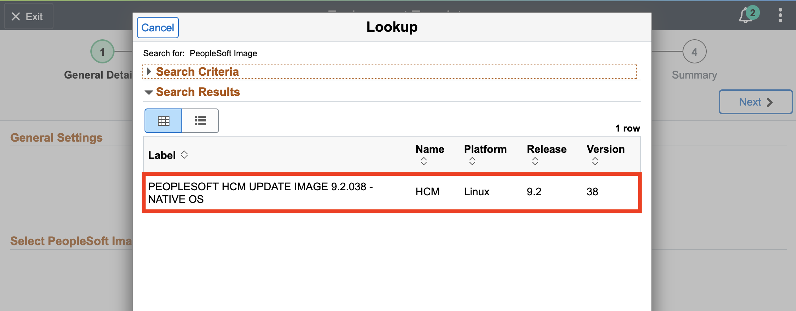

  Click **Next** when you have this:
    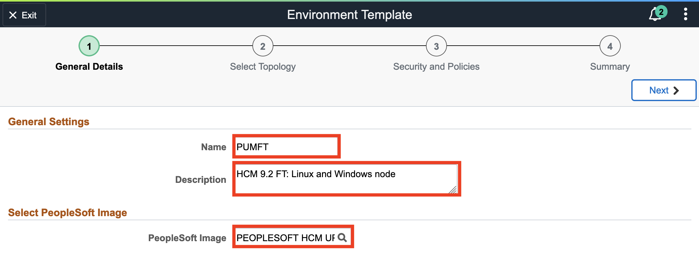
## **STEP 2**: Select Topology
1. Click the **search icon** and select **PUM Fulltier** for the topology
2. Expand **Custom Attributes** and select **PUM Fulltier** again from the dropdown.
3. Click on **Edit Custom Attributes**
    
4. Fill in the Region and Availability Domains as follows:
    * Region: **us-ashburn-1**
    * Primary Availability Domain: **KuGX:US-ASHBURN-AD-1**
    * Default Compartment: **Demo**
    * Default Virtual Cloud Network: **OCIHOLVCN(Demo)** 
    
5. Now, expand **Full Tier** > **General Settings**
    * Line 8- Database Name: **MYPUMDB**
    * Line 10- Database Operator Id: **PS**
    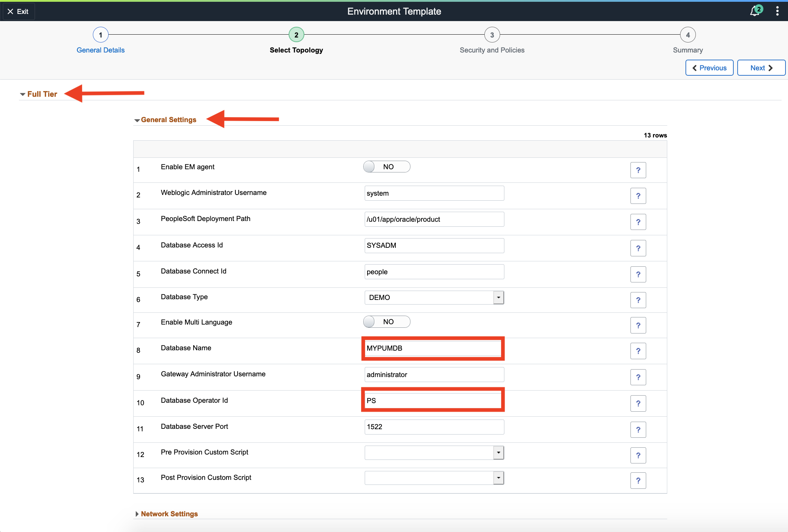
6. Now, expand **Full Tier** > **Network Settings**
    * Compartment: **Demo**
    * Subnet For Primary Instance: **ft**
    
7. Now, expand **PeopleSoft Client** > **Network Settings**
    * Compartment: **Demo**
    * Subnet For Primary Instance: **win**
    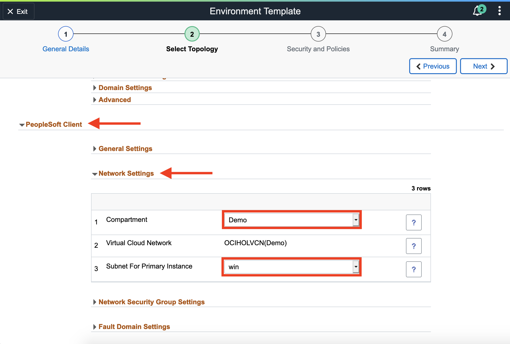
8. Scroll back up and click on **Validate Network**
    

  You should see something like this:
    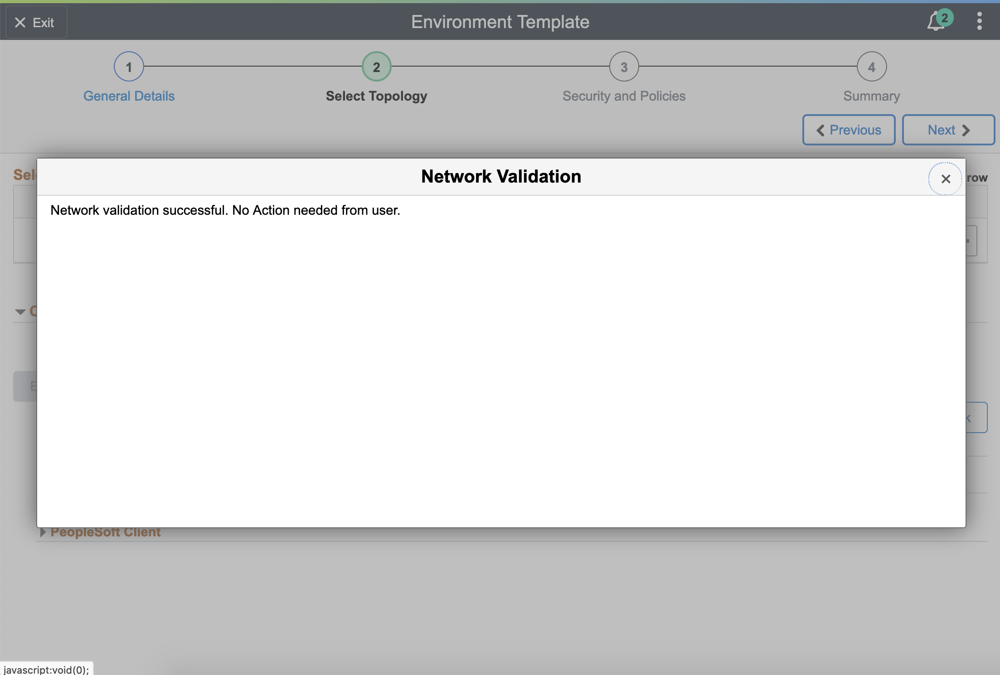

Click **Next**

## **STEP 3**: Security and Policies

Now, we'll select the Zone and Role Names

1. Click the **search icon** for **Zone Name**
    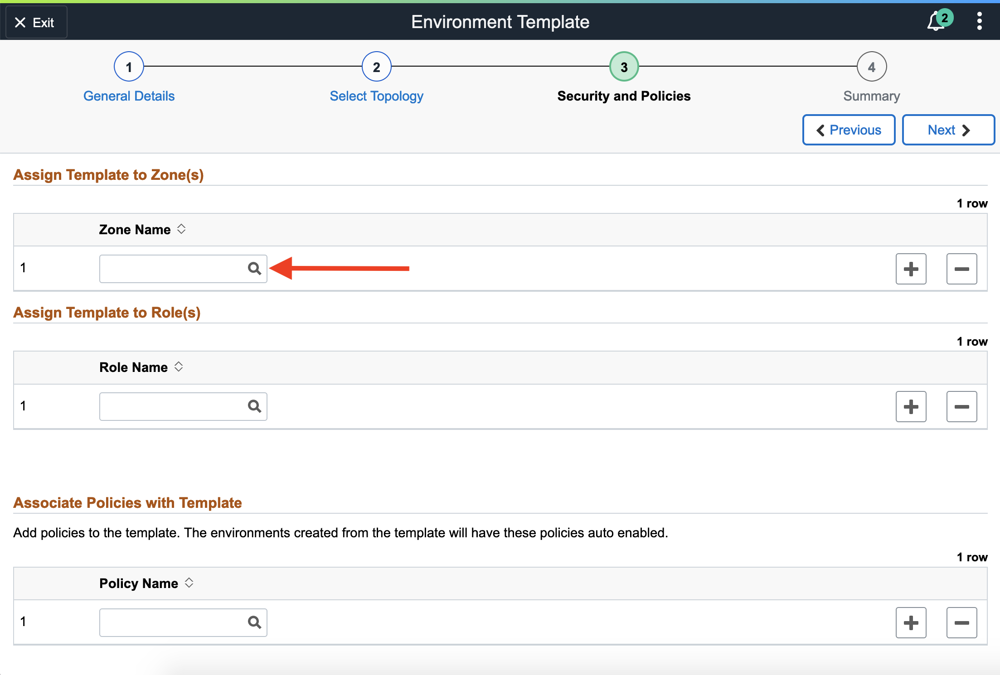

  Select **Test**
    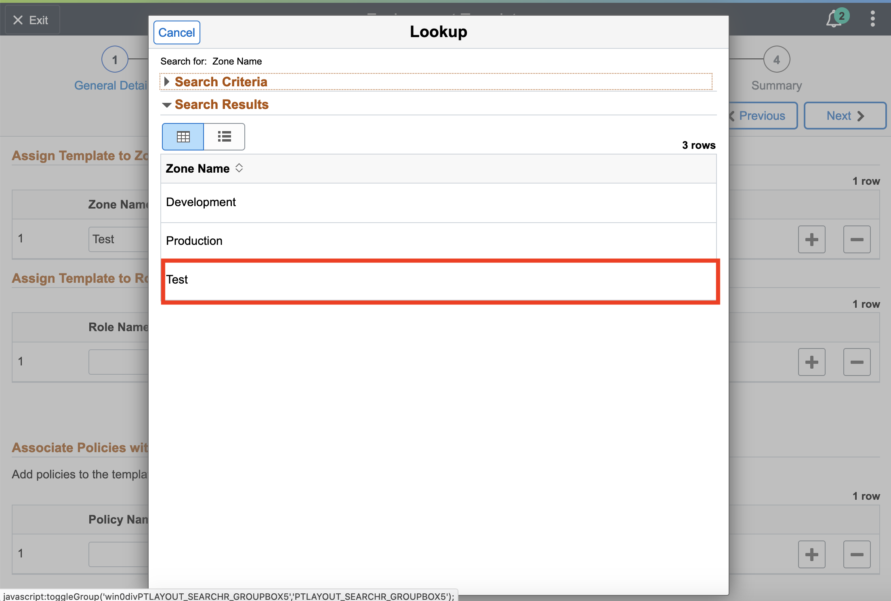

2. Click the **search icon** for **Role Name**
    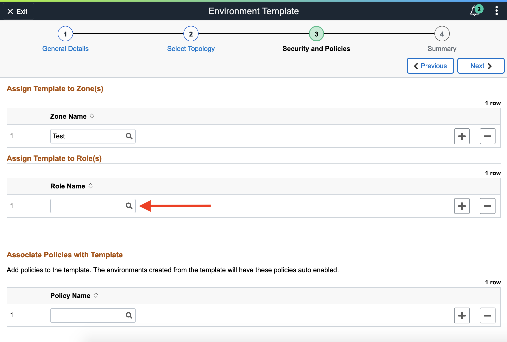

  Expand the **Search Criteria** at the top, type in **PACL\_CAD**, and click **Search**
    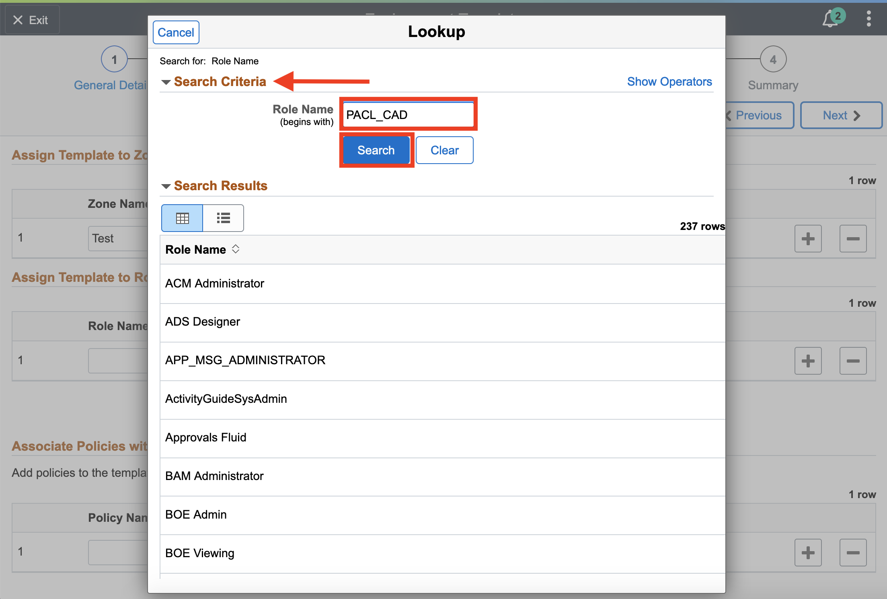
  Select **PACL\_CAD**
    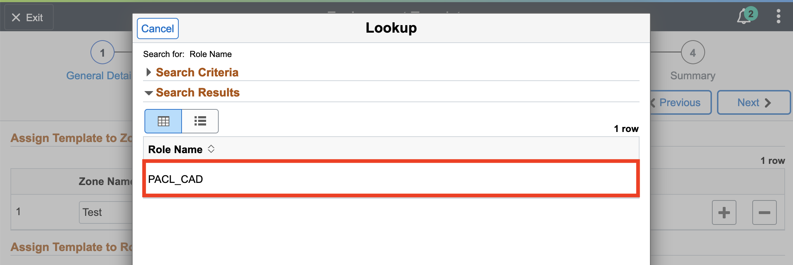

When you see this, click **Next**
  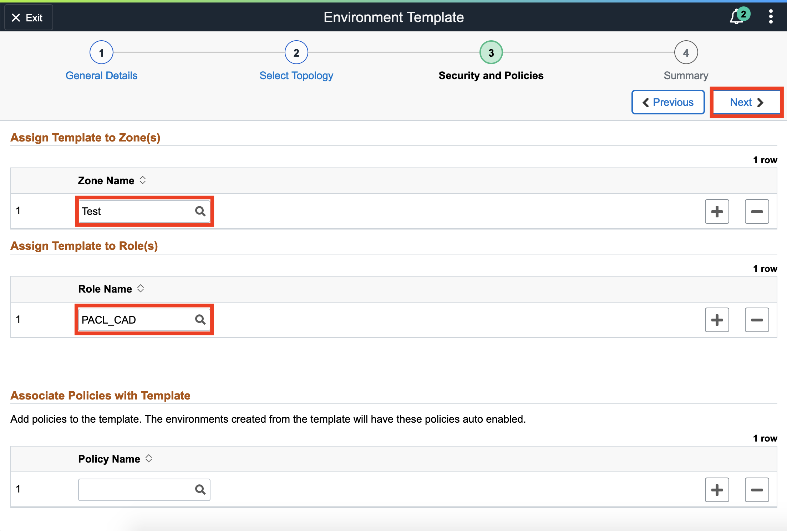

## **STEP 4**: Summary

Review the Environment Template and click **Submit**
    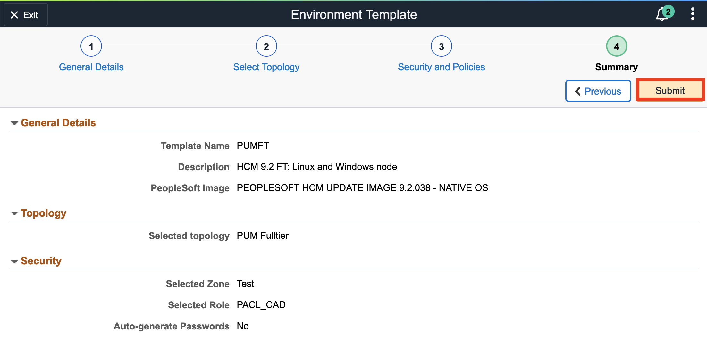

You should now see your Environment Template here:
    

You may now **proceed to the next lab.**

## Acknowledgments

**Authors** 
* **Authors** - Megha Gajbhiye, Cloud Solutions Engineer; Sara Lipowsky, Cloud Engineer
* **Last Updated By/Date** - Sara Lipowsky, Cloud Engineer, May 2021

## Need Help?
Please submit feedback or ask for help using our [LiveLabs Support Forum](https://community.oracle.com/tech/developers/categories/Migrate%20SaaS%20to%20OCI). Please click the **Log In** button and login using your Oracle Account. Click the **Ask A Question** button to the left to start a *New Discussion* or *Ask a Question*.  Please include your workshop name and lab name.  You can also include screenshots and attach files.  Engage directly with the author of the workshop.

If you do not have an Oracle Account, click [here](https://profile.oracle.com/myprofile/account/create-account.jspx) to create one.