# Creating Environment in PeopleSoft

## Introduction

This lab walks you through the steps to a PeopleSoft Environment from the previously created environment template

Estimated Lab Time: 90 minutes

### Objectives

The purpose of this lab is to show you how to create a PeopleSoft Environment from an environment template in the PeopleSoft Cloud Manager.

In this lab, you will:
* Create a PeopleSoft Environment

### Prerequisites
- A PeopleSoft Cloud Manager Instance
- A PeopleSoft Environment Template 

## **STEP 1**: Creating a New PeopleSoft Environment

1. Navigate to Cloud Manager Dashboard > **Environments**  
  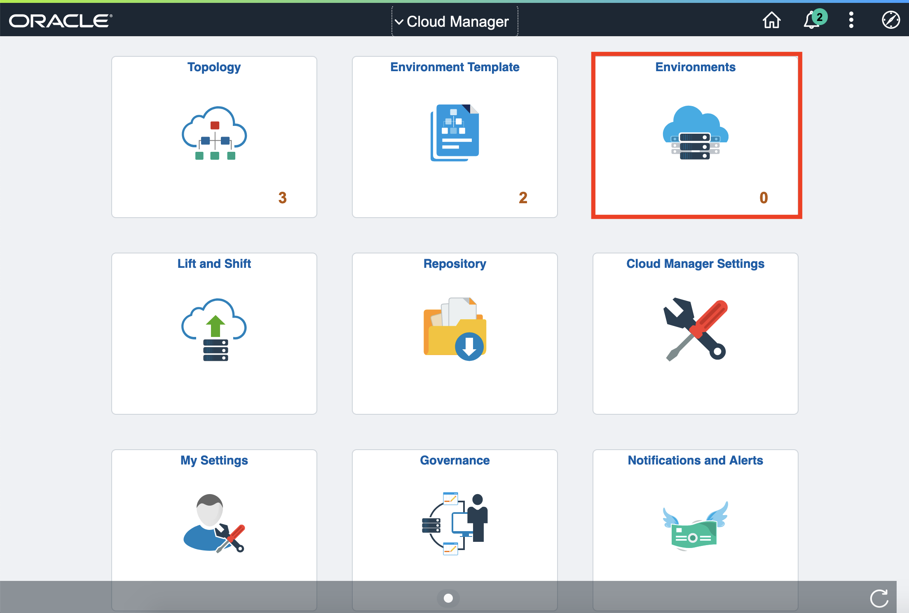

 Click **Create Environment** button.

  

2. Provide a unique Environment Name - **HCMFT**. Select the Template that was created in previous section – **TestWorkshop**. Click **yes** for **Pause after infra creation**.  

  

3. Expand **Environment Attributes -> Full Tier -> Credentials**

  Give the following values to the fields:

  No. | Full Tier | Credentials
  --- | --------- | -----------
  1 | Database Administrator Password | **Psft1234#**
  2 | Gateway Administrator Password | Psft1234
  3 | Web Profile Password for user PTWEBSERVER | Psft1234
  4 | Database Connect Password | Psft1234
  5 | Weblogic Administrator Password | Psft1234
  6 | Database Access Password | Psft1234
  7 | Database Operator Password | Psft1234

(All are the same except Database Adminitistrator Password)

  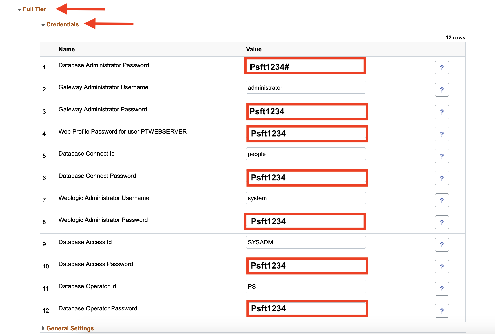

4. Expand PeopleSoft Client -> **Credentials**

  Enter the password: Psft12345678#
  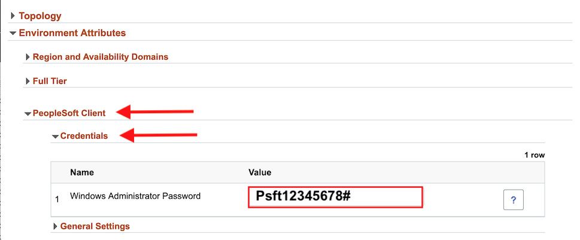

5. Scroll up and click **Done** on the top right to begin the environment creation process. 

  

<!-- 6. Accept the license. 

   -->

## **STEP 2**: Monitoring Infrastructure Creation

1. Refresh the page, and you'll see the status is **Initiating**.
  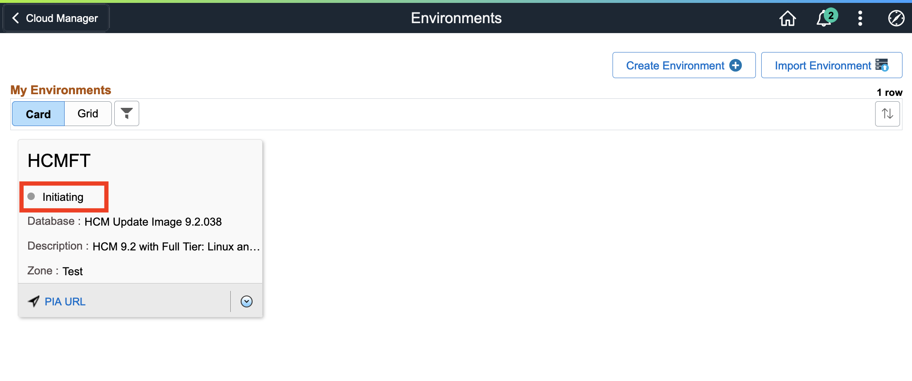

2. Refresh again after a minute, and you'll see the status change to **Infra Creation In Progress**. Now, Click the arrow, and then **Details**
  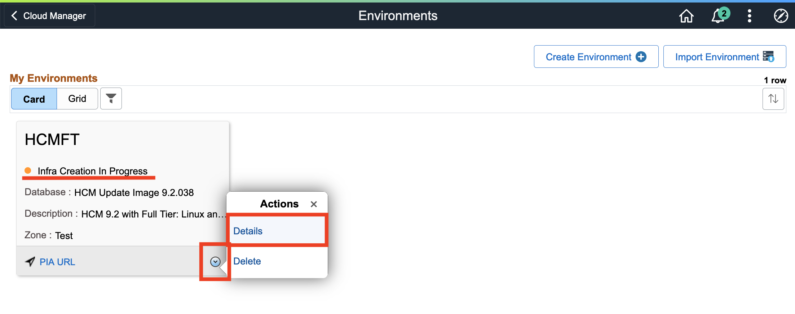

3. On the left, click **Logs**. Then, adjust the Number of Lines to Display and click **Fetch Logs**. You can take a monitor the infrastructure creation here. 
  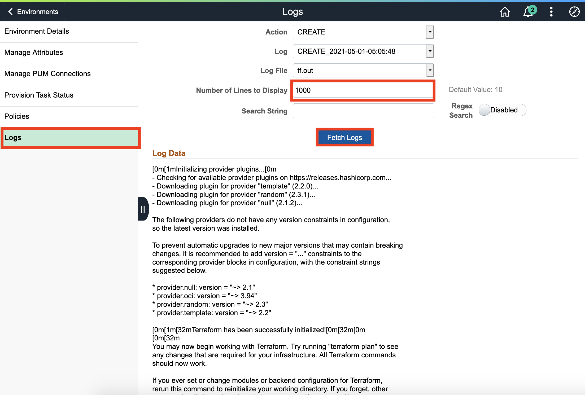

It takes about 10 minutes to see the status change to **Infrastructure Creation Complete**:
  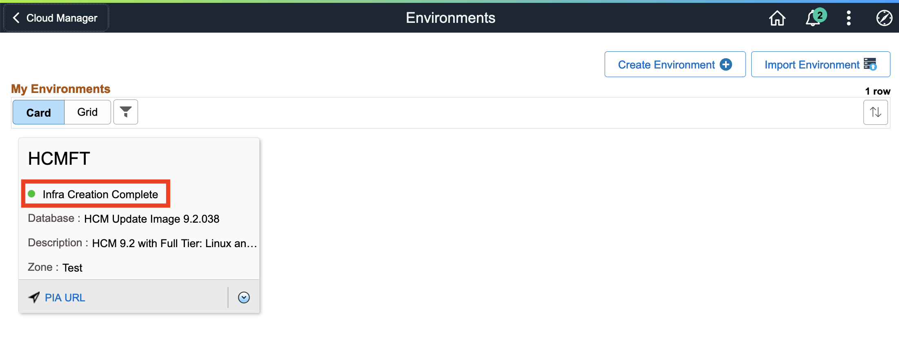


## **STEP 3**: Monitoring Deployment of PeopleSoft Environment

1. Now that the infrastructure has been created, we can deploy our environment. Click the arrow and **Deploy**
  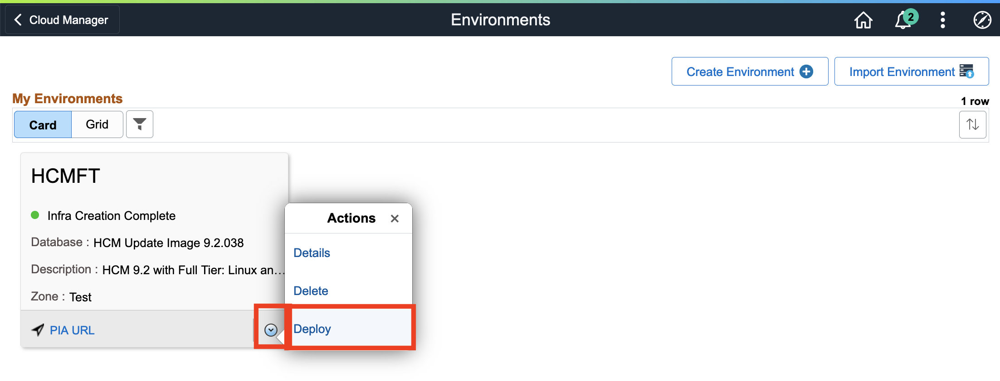

  Then click **Yes** to confirm the provisioning.
  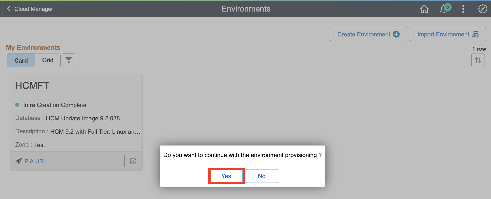

2. Again, click the arrow for the **Details**
  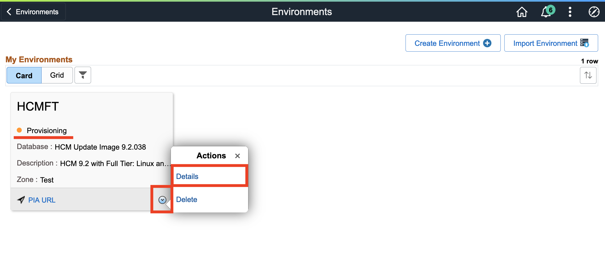

  On the left, click **Provisioning Tasksk Status** to see detailed progress status for every step. Click on **Deployment Tasks**. If any step fails, you can change the attribute as per the error and start the process from where it failed.
  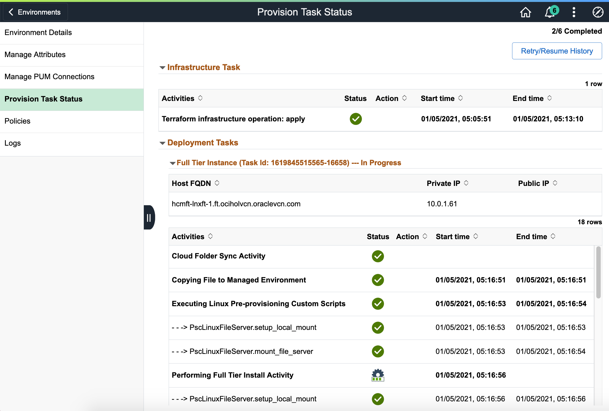

Provisioning takes about 90 minutes. You can monitor throughout this time.

## **STEP 4**: Signing in to PeopleSoft Environment

1. Once your environment is in the **Running** status, go to **Details** again.
  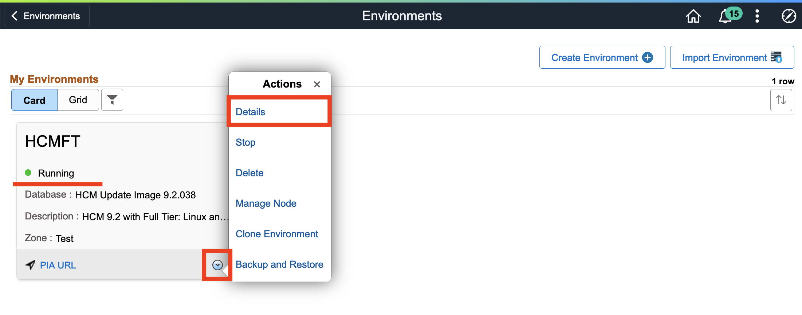

2. You can access the url here, on **Environment Details**
  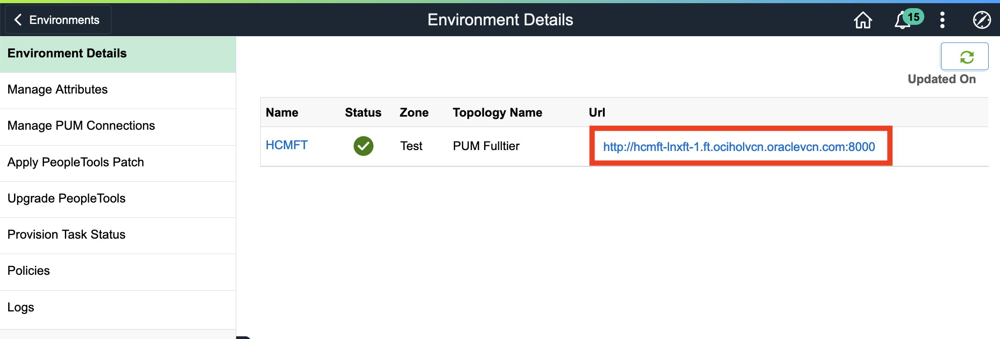

3. Sign in using the following credentials
  ```
  Username : PS    
  Password: Psft1234
  ```
  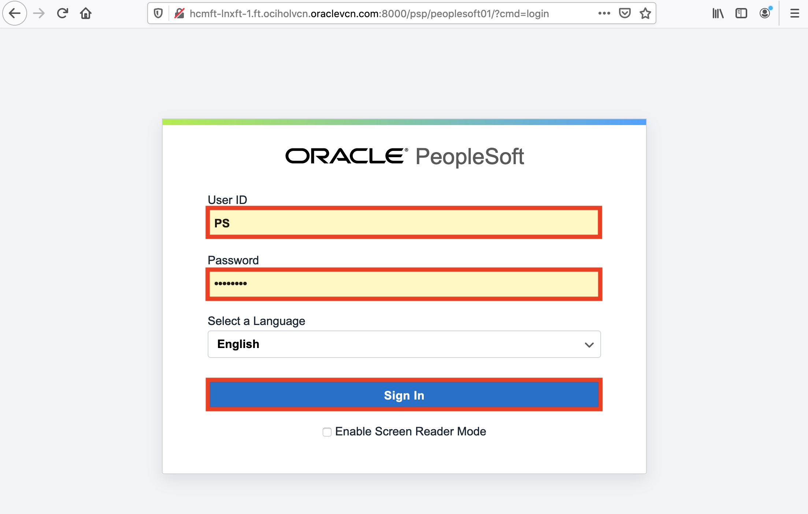
4. And voila- your HCM PeopleSoft Environment:
  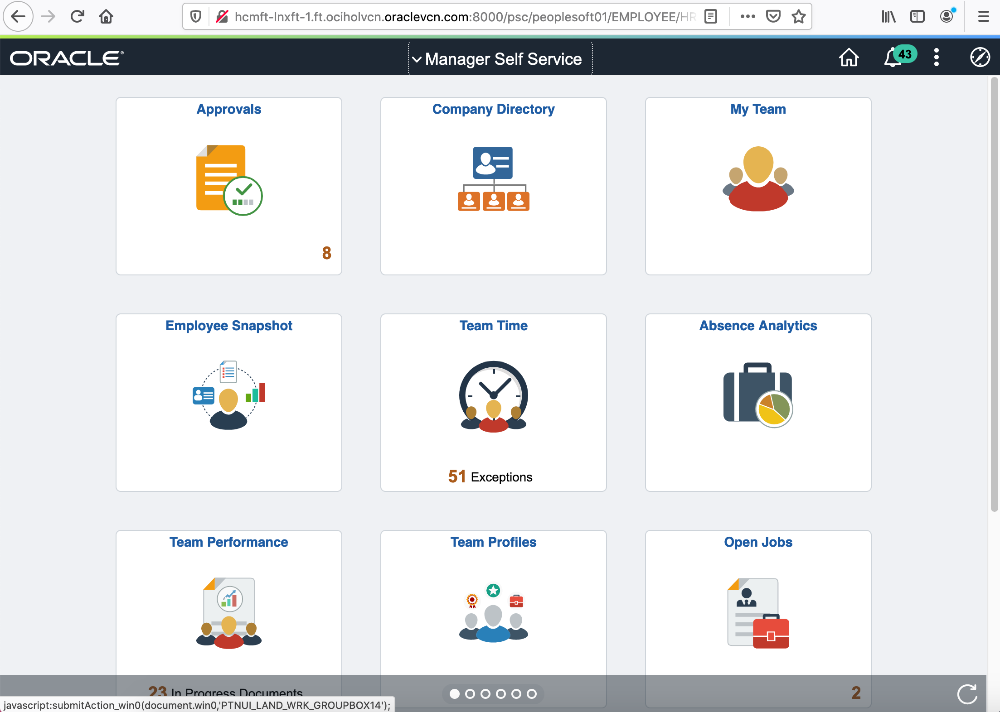


## **STEP 5**: Cloud Manager Actions for PeopleSoft Environment

We will cover Cloud Manager 12 features in depth in the following labs; however, here are some actions you can perform at a high level.

  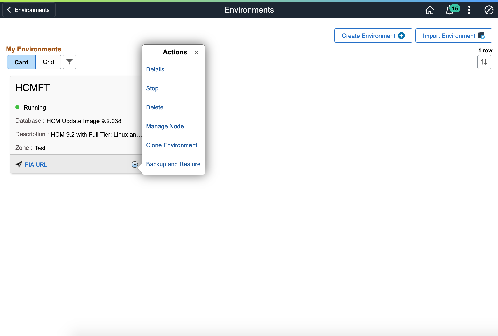
  The actions are:

  • **Details**: Select this option to view environment details and to perform additional actions on the environment such as performing a health check, applying a PeopleTools patch, viewing logs, and managing PUM connections.

  • **Start**: Select this option to start all the instances and then all the domains within them.

  • **Stop**: Select this option to stop all domains and shutdown all the instances. In case of database, only compute database instances are shutdown.

  • **Delete**: Select this option to remove the environment.

  • **Manage Node**: Select this option to scale environment up or down.

  • **Clone Environment**: Select this option to clone an existing environment.

  • **Refresh**: Select this option to refresh the database or the database, ps app home and ps cust home.  
  This option is only available for DBaaS environments.

  • **Backup and Restore**: Select this option to backup or restore an environment.


You may proceed to the next lab.

## Acknowledgments
* **Authors** - Megha Gajbhiye, Cloud Solutions Engineer; Sara Lipowsky, Cloud Engineer
* **Last Updated By/Date** - Sara Lipowsky, Cloud Engineer, May 2021

## Need Help?
Please submit feedback or ask for help using our [LiveLabs Support Forum](https://community.oracle.com/tech/developers/categories/Migrate%20SaaS%20to%20OCI). Please click the **Log In** button and login using your Oracle Account. Click the **Ask A Question** button to the left to start a *New Discussion* or *Ask a Question*.  Please include your workshop name and lab name.  You can also include screenshots and attach files.  Engage directly with the author of the workshop.

If you do not have an Oracle Account, click [here](https://profile.oracle.com/myprofile/account/create-account.jspx) to create one.