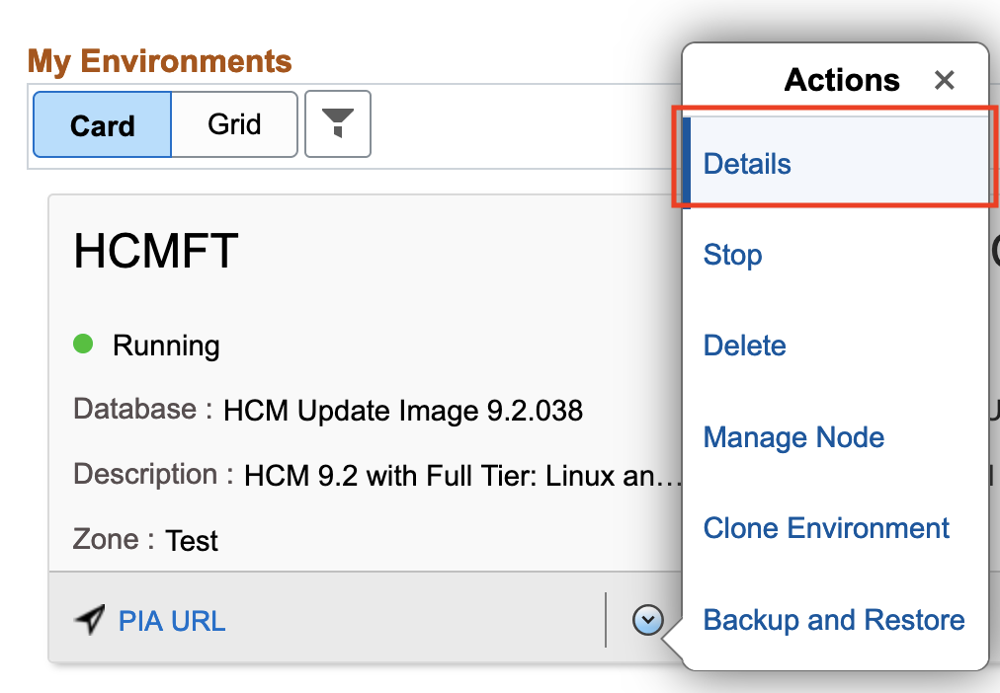

# Backing up and Restoring an Environment

## Introduction
The Backup and Restore action can be used to take a backup or restore an environment from the backup. The Backup action will backup all nodes in the environment. It is recommended to take a backup: before applying a PeopleTools Patch, before applying a PeopleTools upgrade, or before adding or removing a node. When you select to restore an environment from a backup: the Restore overwrites all the data on the target instance, the Target instance will be unavailable during the restore process, and only one instance at a time can be restored on a target instance.

Estimated Lab Time: 30 minutes

### **Objectives**
In this lab you will:
* Take a backup of a running environment
* Restore an environment to a backup

### **Prerequisites**
- Access to the Cloud Manager console
- A PeopleSoft Environment up and running on Cloud Manager

## **STEP 1**: Backing up an Environment

1.  Navigate to **Dashboard** > **Environments**. On the environment that we just created (**HCMFT**) click the down arrow and then click **Backup and Restore**. 
    

    Provide a unique backup name such as **HCMFTBACKUP**. Leave everything else as default and then click **Backup**.
    

    Click **Yes** when it asks if you want to proceed with backup operation.
    

2.  This backup will take a few minutes to complete. To check the status of the backup click the down arrow on your environment (**HCMFT**) and then click **Details**.
    

    On the side menu select **Provision Task Status**. You will then be able to see the start time and status of your backup. If under **Status** you see a gear icon (like the picture below), this means that the backup is still in progress.
    
    
    You can also select **Logs** on the side menu and follow along from there as well.
    

    Once **Status** changes to a green checkmark (like the picture below) you can continue on with this lab. 
       

## **STEP 2**: Restoring an Environment

1.  Navigate to **Dashboard** > **Environments**. On the environment that we just created (**HCMFT**) click the down arrow and then click **Backup and Restore**. 
    

    Here we will see the backup that we just took. Make sure the backup status is **Completed**. Click the checkbox next to **HCMFTBACKUP** and then click **Restore**
    

    Click **Yes** when it asks if you want to proceed.
    

You may now proceed to the next lab.

## Acknowledgements

**Created By/Date**   
* **Authors** - Hayley Allmand, Cloud Engineer
* **Last Updated By/Date** - Hayley Allmand, Cloud Engineer, April 2021

## Need Help?
Please submit feedback or ask for help using our [LiveLabs Support Forum](https://community.oracle.com/tech/developers/categories/Migrate%20SaaS%20to%20OCI). Please click the **Log In** button and login using your Oracle Account. Click the **Ask A Question** button to the left to start a *New Discussion* or *Ask a Question*.  Please include your workshop name and lab name.  You can also include screenshots and attach files.  Engage directly with the author of the workshop.

If you do not have an Oracle Account, click [here](https://profile.oracle.com/myprofile/account/create-account.jspx) to create one.