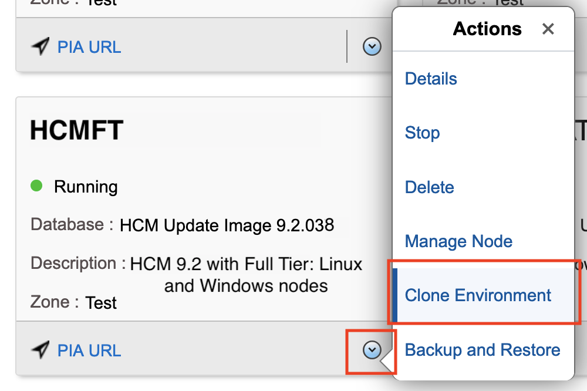
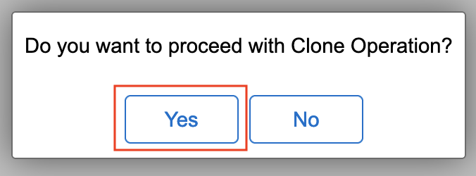
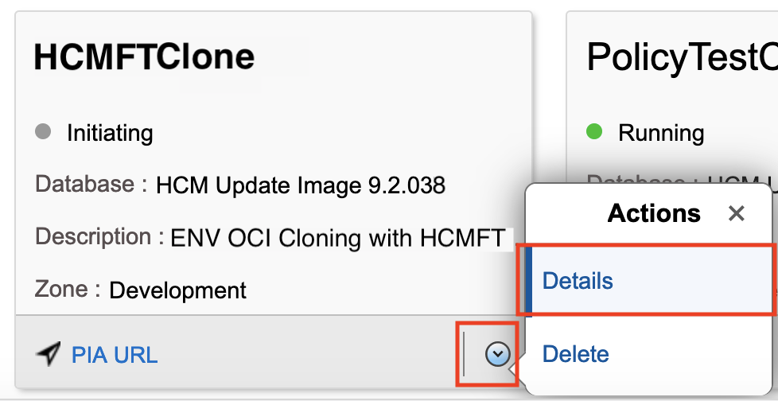
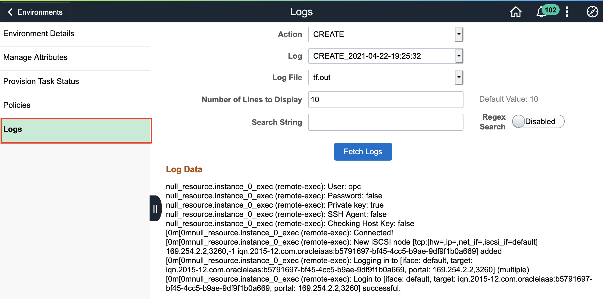
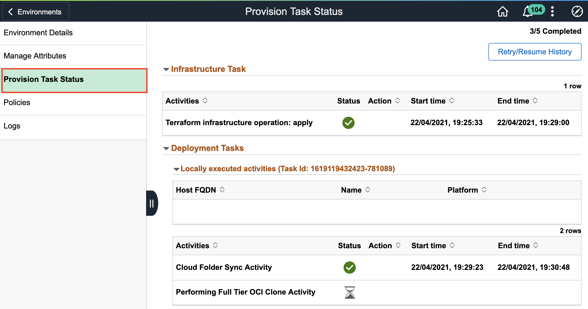
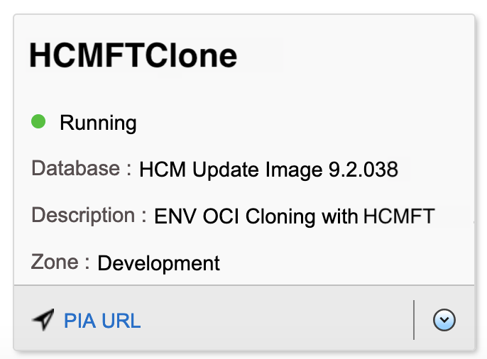

# Cloning an Environment

## Introduction
This lab walks you through the steps to clone an environment.

Estimated Lab Time: 30 minutes

### Objectives
In this lab you will:
* Clone an existing environment

### Prerequisites
- Access to the Cloud Manager console.
- Environment up and running

## **STEP 1**: Creating a Clone of an Environment

1.  Navigate to **Dashboard** > **Environments**. On the environment that we just created (**WorkshopEnvironment**) click the down arrow and then click **Clone Environment**.
    

2.  Give the new environment a name such as **WorkshopClone**. Click **Clone**.
    

    When asked if you want too proceed with Clone Operation click **Yes**.
    

3.  Refresh the page. You should now see the **WorkshopClone** Environment. This environment will take a few minutes to provision. Click the down arrow and then click **Details**
    

    Note on the **Environment Details** page, under **Status** you will see a red exclamation point. This will remain until the entire environment has successfully provisioned. Once provisioned, the status will change to a green checkmark.
    
    
    On the side menu click **Logs**. From here you can monitor the status of your clone environment.
    

    You can also go to **Provision Task Status** on the side menu to see detailed progress status for every step.
    

    Once the environment has a green dot with a status of **Running** you have successfully created a clone of your environment.
    

## Acknowledgements

**Created By/Date**   
* **Authors** - Rich Konopka, Peoplesoft Specialist, Megha Gajbhiye, Cloud Solutions Engineer
* **Contributor** -  Sara Lipowsky, Cloud Engineer
* **Last Updated By/Date** - Hayley Allmand, Cloud Engineer, April 2021

## Need Help?
Please submit feedback or ask for help using our [LiveLabs Support Forum](https://community.oracle.com/tech/developers/categories/Migrate%20SaaS%20to%20OCI). Please click the **Log In** button and login using your Oracle Account. Click the **Ask A Question** button to the left to start a *New Discussion* or *Ask a Question*.  Please include your workshop name and lab name.  You can also include screenshots and attach files.  Engage directly with the author of the workshop.

If you do not have an Oracle Account, click [here](https://profile.oracle.com/myprofile/account/create-account.jspx) to create one.