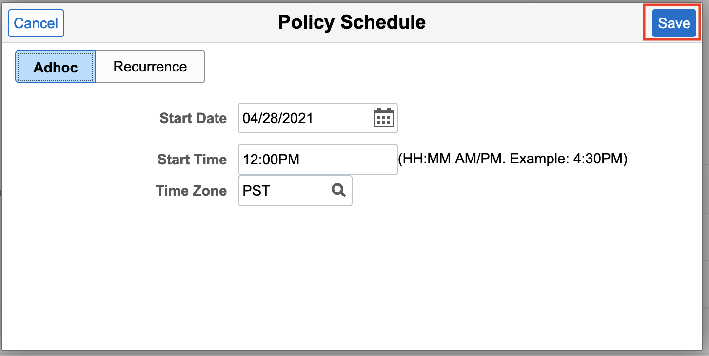
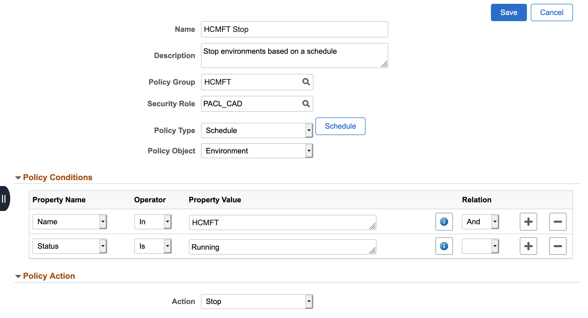
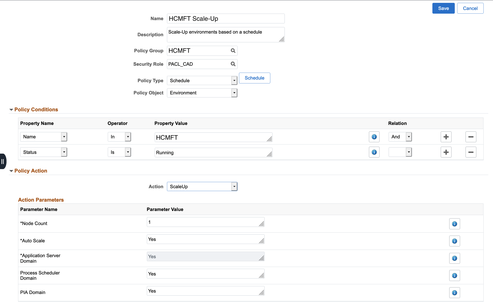
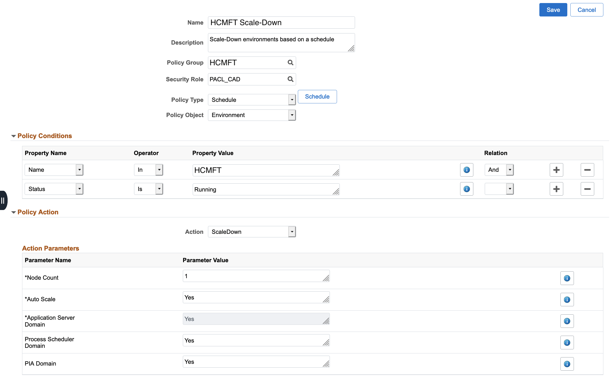
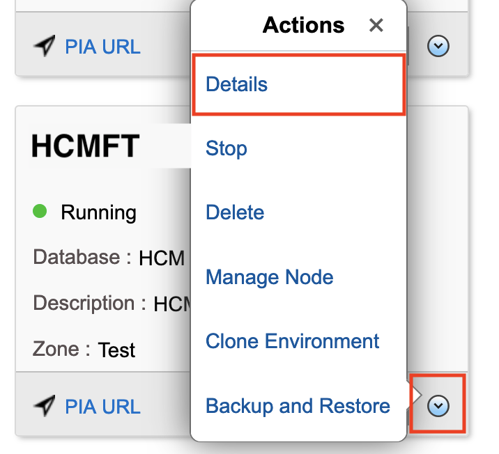
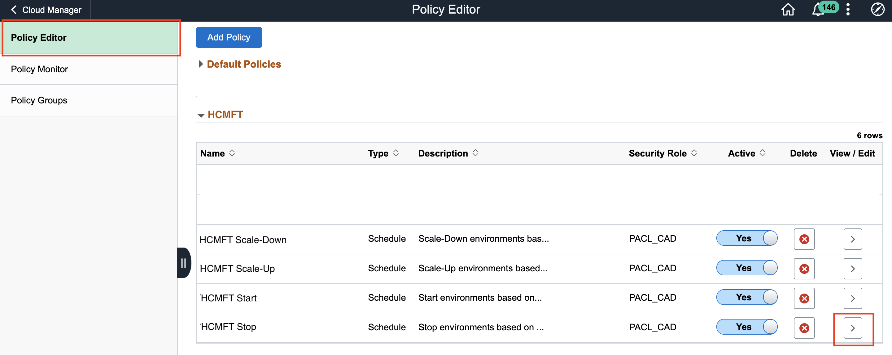
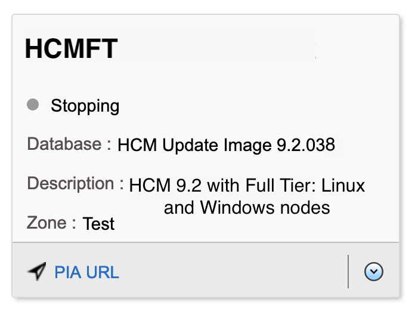
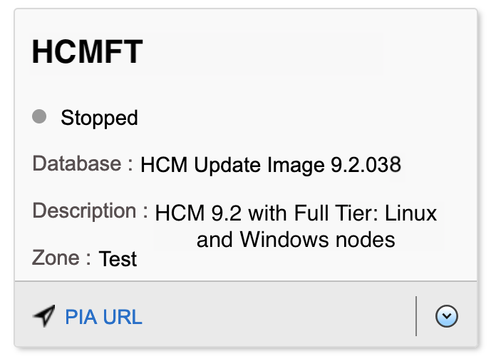
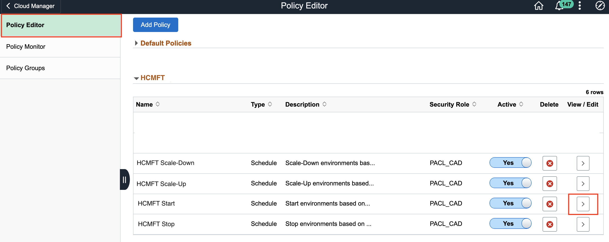
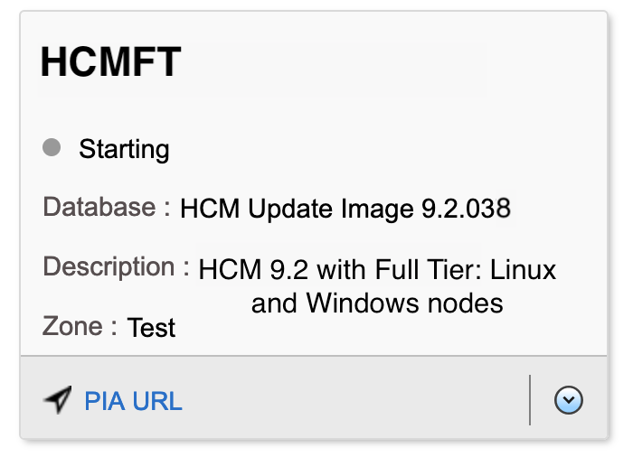

# Setting up Governance Policies

## Introduction
This lab walks you through the steps to set up governance policies on CM12.

Estimated Lab Time: 30 minutes

### Objectives
In this lab you will:
* Create a policy group
* Create policies
* Execute policies

### Prerequisites
- Access to the Cloud Manager console
- A PeopleSoft Environment up and running

## **STEP 1**: Creating a Policy Group

Before creating any policies you need to create a policy group. Policy groups are used to map policies to specific environments.

1.  Navigate to **Dashboard** > **Governance**. Click **Policy Groups** on the side menu and click the plus button to add a new policy group.
    

2.  Under name, enter the name of the PeopleSoft environment that this policy group is for. For demo purposes we will be using the **HCMFT** environment. Enter a description, then click save.
    

## **STEP 2**: Creating Policies

1.  Navigate to **Dashboard** > **Governance**. Click **PolicyEditor** on the side menu then click **Add Policy**    
    

2.  First we will create a start policy for our environment. Type the information as shown below. If you are using an environment other than **HCMFT**, be sure to update **PolicyGroup** and **PolicyConditions** as appropriate.
    

    Click **Schedule** and enter a time/date for when you want this policy to take affect. This can be changed later on, for now just put some time in the future. Click **Save** and then click **Save** on the main policy page.
    

    Next we will create a stop policy. Click **Add Policy** again and type the information as shown below:
    

    Set a schedule then click **Save** and then **Save** again.

    Next we will create a scale-up policy. Click **Add Policy** again and type the information as shown below:
    

    Set a schedule then click **Save** and then **Save** again.

    Finally we will create a scale-down policy. Click **Add Policy** again and type the information as shown below:
    

    Set a schedule then click **Save** and then **Save** again.

    Expand **HCMFT** and now as you can see we have multiple policies mapped under a single policy group for easy reference.
    

3.  You can also view all of these policies directly from your environment. Navigate to **Dashboard** > **Environments**. On **HCMFT** (or whichever environment you created the previous policies for) click the down arrow and then **Details**
    

4.  On the side menu select **Policies**. Here you will be able to see all of the policies we recently created for this environment.
    

## **STEP 3**: Executing Policies

1.  Now we will execute our stop policy. If you want a policy to execute immediately you can set the start date for a time in the past. Navigate to **Dashboard** > **Governance**. Click **Policy Editor** on the side menu then click the arrow under **View/Edit** next to our **HCMFT Stop** policy.
    

2.  Click **Schedule** then set a **Start Date** and **Start Time** that has occurred in the past. Click **Save** and then click **Save** on the main policy page.
    

3.  Answer **Yes** when the popup asks you if you are sure you want to re-generate existing policy.
    

4.  Navigate to **Dashboard** > **Environments**. You will see that our environment is in the **Stopping** phase which means that our policy has been executed and has initiated the stop of the environment.    
    

5.  To see the status of the policy which we just executed navigate to **Dashboard** > **Governance** and on the side menu click **PolicyMonitor**. Click the arrow under **Status** next to **HCMFT Stop**.
    

    You will see that the status of the policy is **Running**.
    

    Once you see the status of your environment changed to **Stopped** the policy has successfully executed.
    

6.  We can now execute our start policy to bring the environment back up. Navigate to **Dashboard** > **Governance**. Click **Policy Editor** on the side menu then click the arrow under **View/Edit** next to our **HCMFT Start** policy.
    

7.  Click **Schedule** then set a **Start Date** and **Start Time** that has occurred in the past. Click **Save** and then click **Save** on the main policy page.
    

8.  Answer **Yes** when the popup asks you if you are sure you want to re-generate existing policy.
    

9.  Navigate to **Dashboard** > **Environments**. You will see that our environment is in the **Starting** phase which means that our policy has been executed and has initiated the start of the environment.    
    

You may now proceed to the next lab.

## Acknowledgements

**Created By/Date**   
* **Authors** - Hayley Allmand, Cloud Engineer; Joowon Cho, Cloud Engineer
* **Last Updated By/Date** - Hayley Allmand, Cloud Engineer, April 2021

## Need Help?
Please submit feedback or ask for help using our [LiveLabs Support Forum](https://community.oracle.com/tech/developers/categories/Migrate%20SaaS%20to%20OCI). Please click the **Log In** button and login using your Oracle Account. Click the **Ask A Question** button to the left to start a *New Discussion* or *Ask a Question*.  Please include your workshop name and lab name.  You can also include screenshots and attach files.  Engage directly with the author of the workshop.

If you do not have an Oracle Account, click [here](https://profile.oracle.com/myprofile/account/create-account.jspx) to create one.