# Selective Governance

## Introduction
This lab walks you through 

Estimated Lab Time: 30 minutes

### Objectives
In this lab you will:
* x
* y
* z

### Prerequisites
- Access to the Cloud Manager console.
- Environment up and running

## **STEP 1**: Create Source Template

We first need to create a new template for our source environment. *The DB name of our source environment and target environment must be different*, which is why we cannot use an existing template. As for our target environment we will be using the environment created in the previous labs, **HCMFT**.

1.  Navigate to **Dashboard** > **Environment Template**. Click **Add New Template**.
    

2.  On the General Details page:
    * Give the template a name such as **PUMFT38** and enter a description
    * Click on the search icon next to PeopleSoft Image and select **PEOPLESOFT HCM UPDATE IMAGE 9.2.038 - NATIVE OS**
    * Click **Next**
    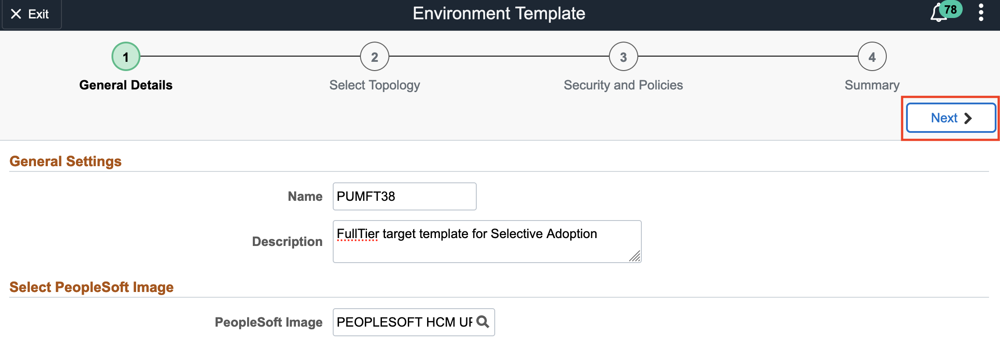
    
3.  On the Select Topology page:
    * Click on the search icon under Topology Name and select **PUM Fulltier**
    * Expand the **Custom Attributes** section and select **PUM Fulltier** again in the dropdown
    * Click on **Edit Custom Attributes**
    

    * Expand the **Region and Availability Domains** section and select the following: 
    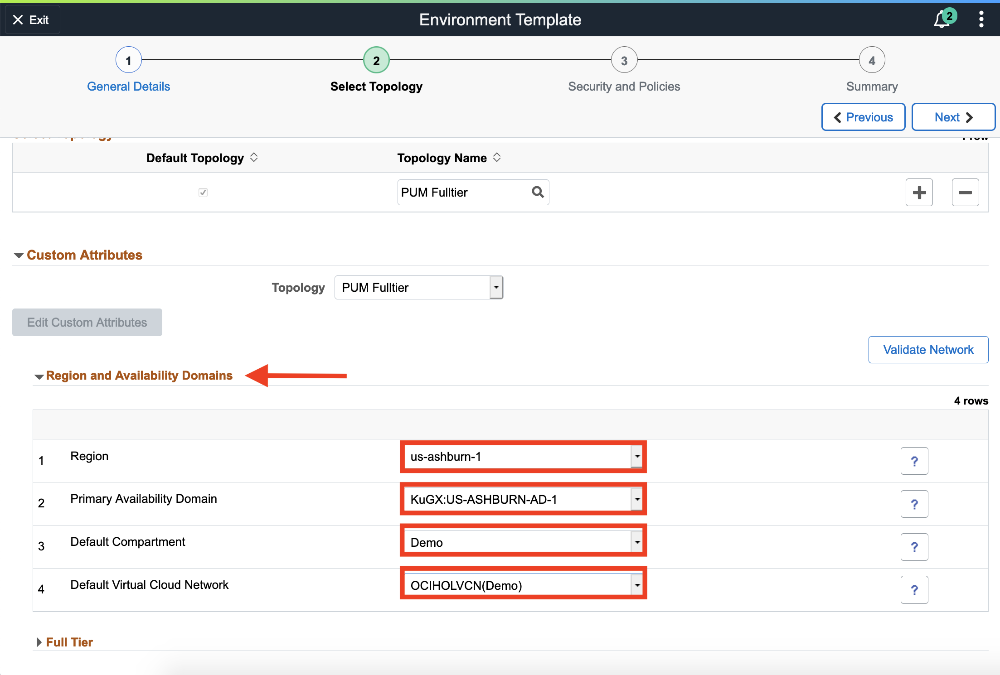

    * Expand **Full Tier** > **General Settings** and make the following changes:
        * Database Name: **SOURCEDB**
        * Database Operator Id: **PS**
    

    * Expand **Full Tier** > **Network Settings** and select the following:
    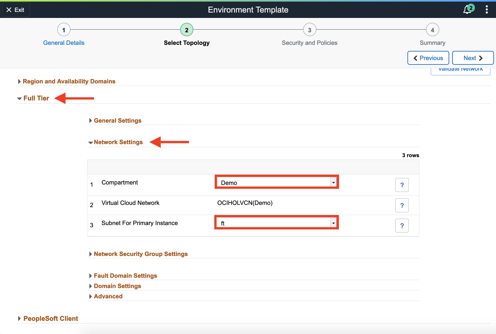

    * Expand **PeopleSoft Client** > **Network Settings** and select the following:
    

    * Click **Next**.

4.  On the Define Security page:
    * Click on the search icon under Zone Name and select **Test**
    * Click on the search icon under Role Name and select **PACL_CAD**
    * Click **Next**
    

5.  On the Summary page:
    * Review the details and click **Submit**
    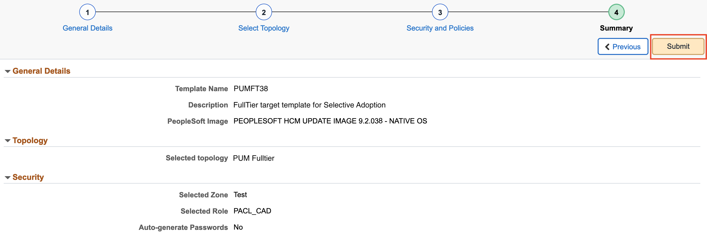

## **STEP 2**: Create Source Environment

1.  Navigate to **Dashboard** > **Environments**. Click **Create Environment**.
    

2. Provide a unique environment name such as **SourceEnv** and enter a description. For Template Name select the template we created in the previous step: **PUMFT38**.
    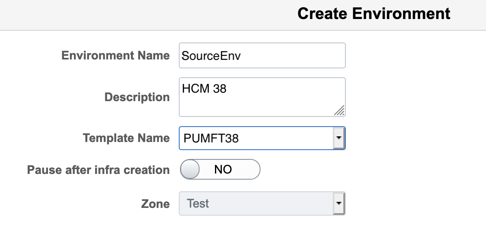

3.  Expand **Environment Attributes** > **Full Tier** > **Credentials**. Assign the following values to each field:
    * Database Administrator Password: **Psft1234##**
    * Gateway Administrator Password: **Psft1234**
    * Web Profile Password for user PTWEBSERVER: **Psft1234**
    * Database Connect Password: **Psft1234**
    * Weblogic Administrator Password: **Psft1234**
    * Database Access Password: **Psft1234**
    * Database Operator Password: **Psft1234**
    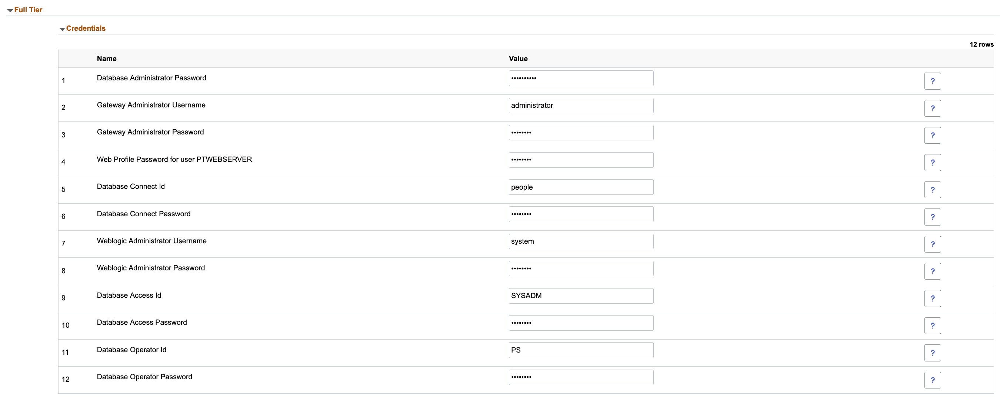

    Expand **Environment Attributes** > **PeopleSoft Client** > **Credentials**. Assign the following value to the field:
    * Windows Administrator Password: **Psft12345678#**
    
    
    Scroll up and click **Done** in the top right.

4.  Click **Accept** on the license.
    

    This environment will take a few minutes to provision. Refresh the page. On our newly created **SourceEnv** environment you should see an orange dot with a status of **Infra Creation in Progress**. Once the environment has a green dot with a status of **Running** you can move on to the next step.

## **STEP 3**: Create PUM Connection

1.  Navigate to **Dashboard** > **Environments**. On **SourceEnv** click the down arrow button and then click **Details**.
    

    Click **Manage PUM Connections** on the side menu then click **Add Target**.
    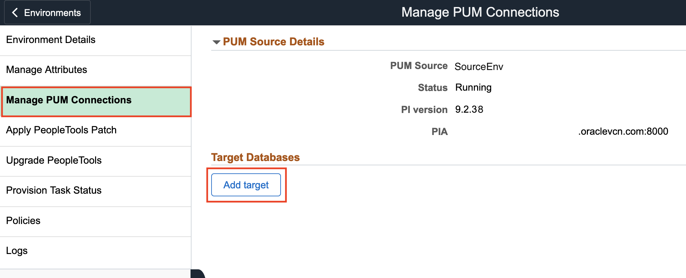

2.  Select **HCMFT** as your target environment and for client select the windows client. Click **Add**.
    

    Under **Target Databases** you should now see your new PUM connection. Notice how under **Upload target to PUM Source** the status is **in progress**. Wait until the status says **COMPLETE**, then you can move on to the next step.
    
    

## **STEP 4**: Logging into PUM Source

If you want to apply some packages to the target DB you can use the PIA URL to log into the PUM source and manually apply a change package. 

1.  Navigate to **Dashboard** > **Environments**. On **SourceEnv** click the down arrow button and then click **Details**. 
    

    On the side menu click **Environment Details** and then click on the URL.
    

    Enter your User ID (**PS**) and Password (**Psft1234**) to sign in.
    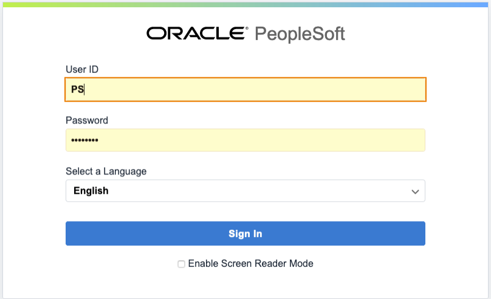

2.  Click the navigation icon in the top right to open the navigation menu.
    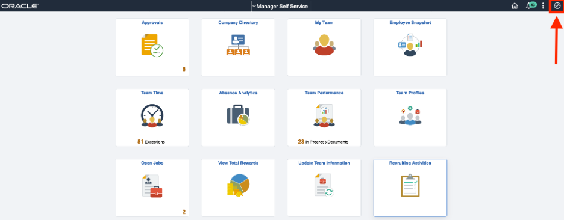

    Navigate to **PeopleTools** > **Lifecycle Tools** > **Update Manager** > **Update Manager Dashboard**
    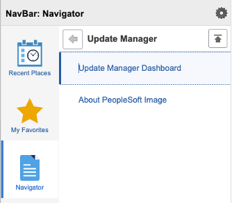

    From here you will be able to see the uploaded target DB information.
    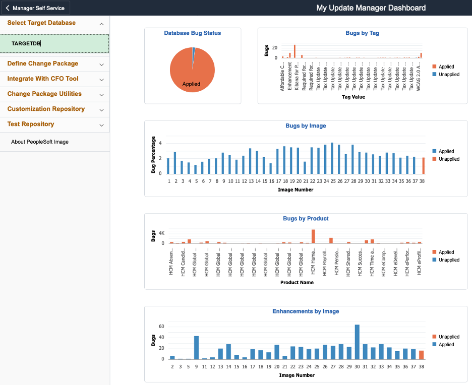

    From **Define Change Package** on the side menu you will be able to apply packages to the target DB.
    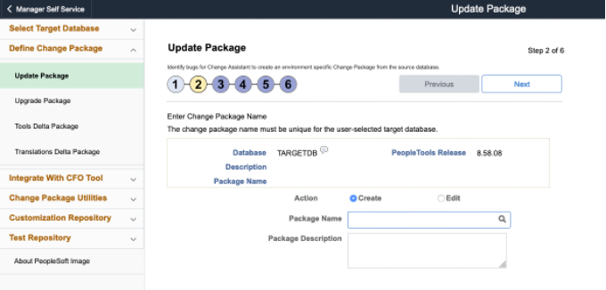

You may now proceed to the next lab.

## Acknowledgements

**Created By/Date**   
* **Authors** - Hayley Allmand, Cloud Engineer; Joowon Cho, Cloud Engineer
* **Last Updated By/Date** - Hayley Allmand, Cloud Engineer, May 2021

## Need Help?
Please submit feedback or ask for help using our [LiveLabs Support Forum](https://community.oracle.com/tech/developers/categories/Migrate%20SaaS%20to%20OCI). Please click the **Log In** button and login using your Oracle Account. Click the **Ask A Question** button to the left to start a *New Discussion* or *Ask a Question*.  Please include your workshop name and lab name.  You can also include screenshots and attach files.  Engage directly with the author of the workshop.

If you do not have an Oracle Account, click [here](https://profile.oracle.com/myprofile/account/create-account.jspx) to create one.