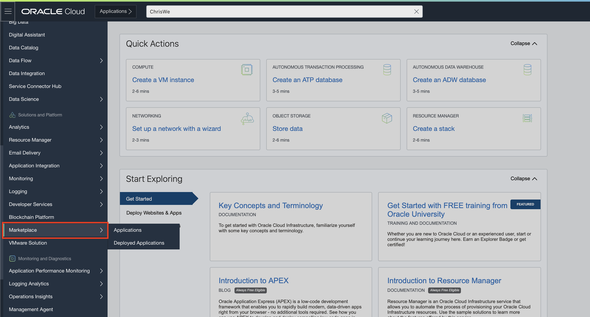
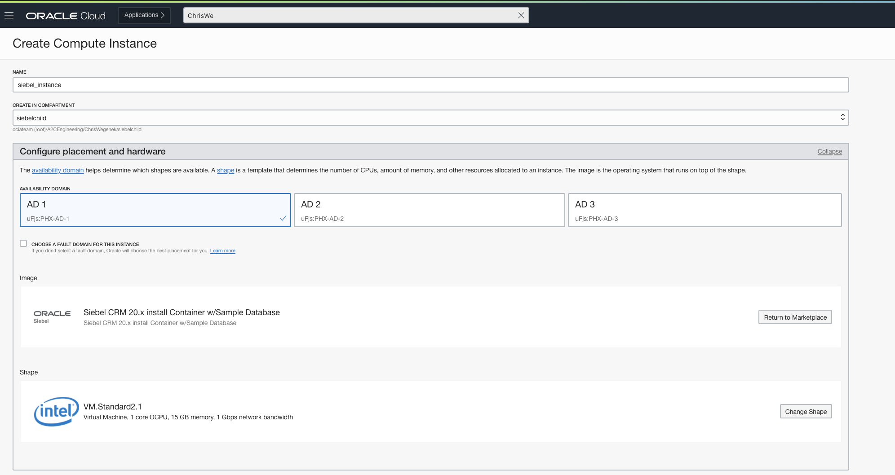
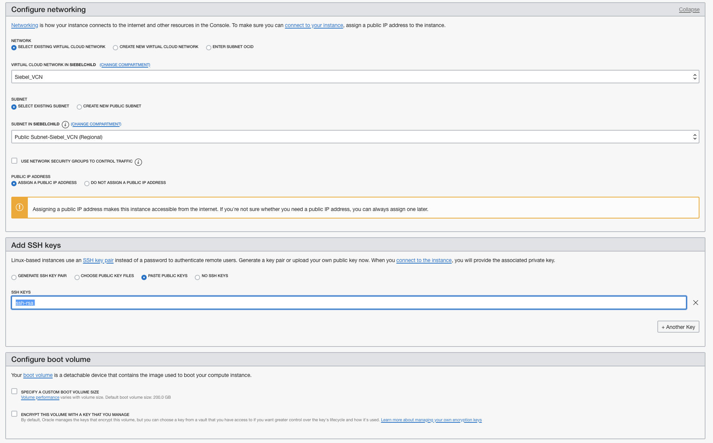
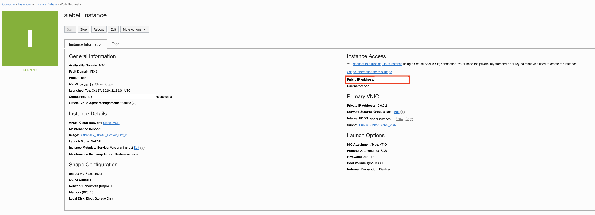
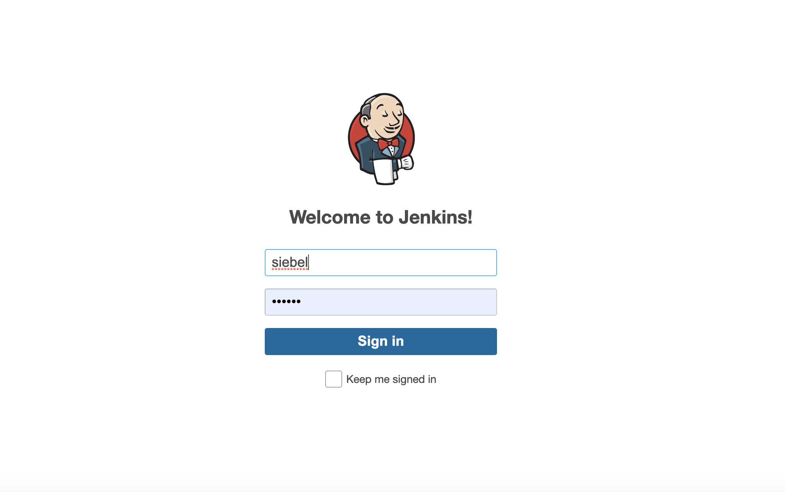
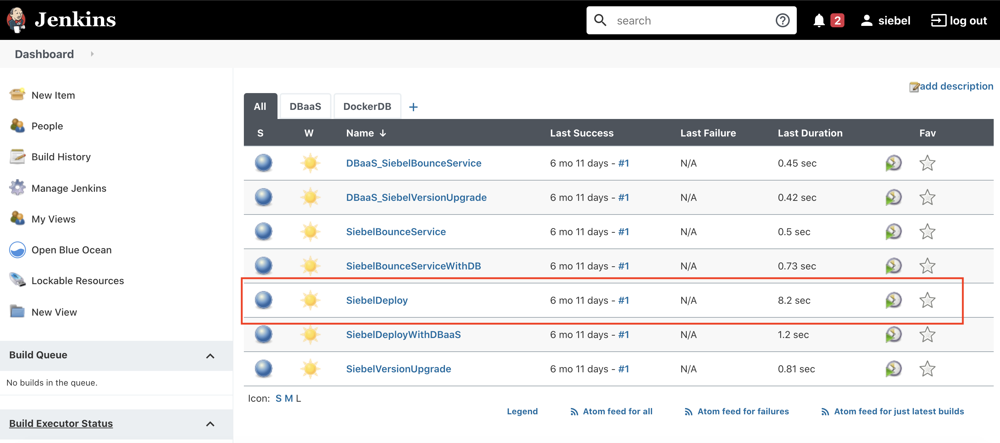
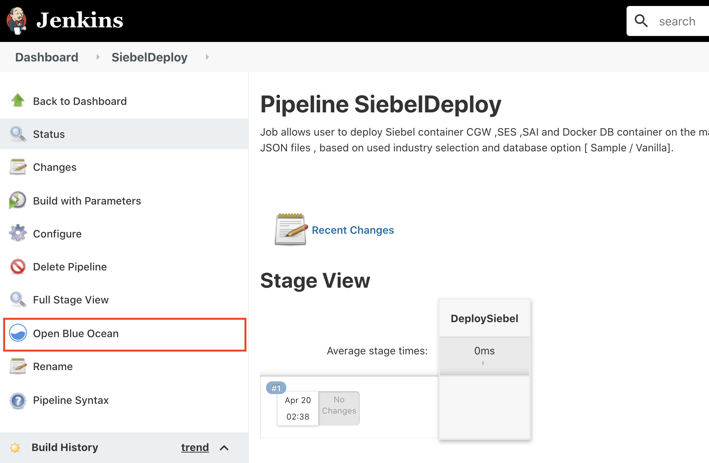
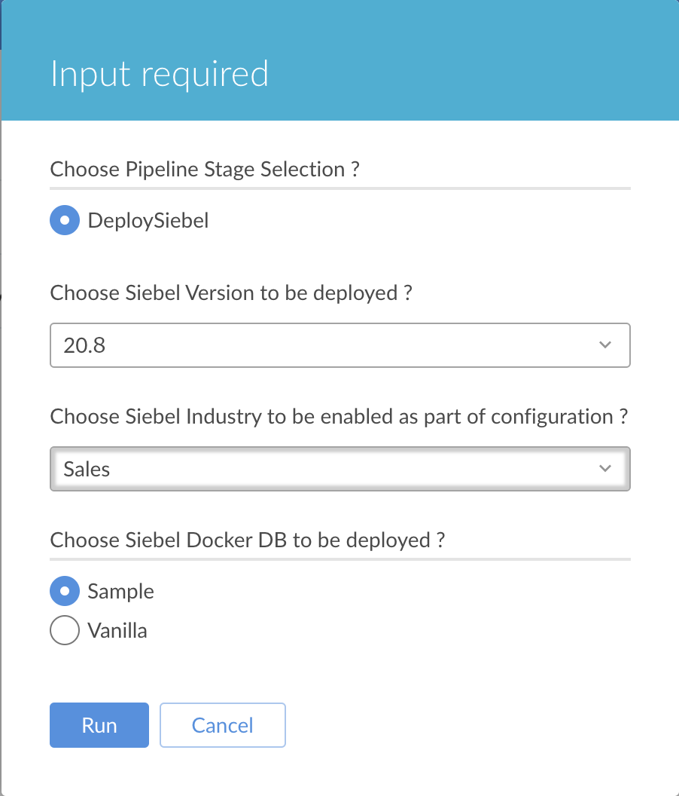
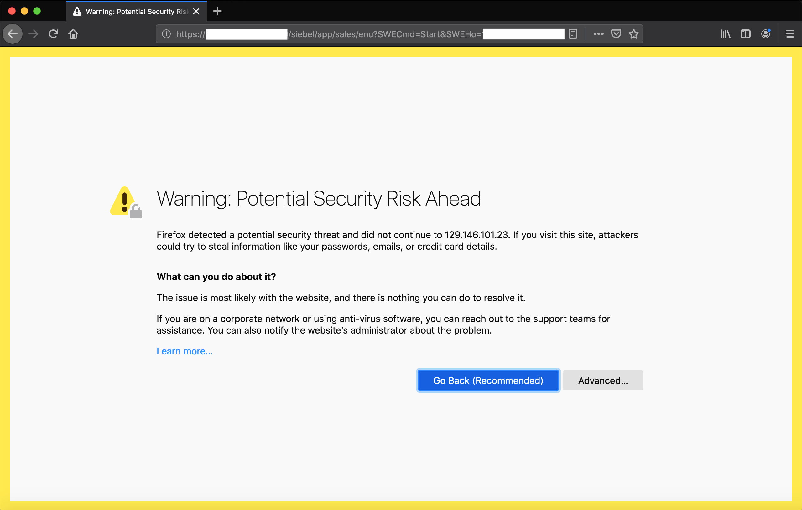
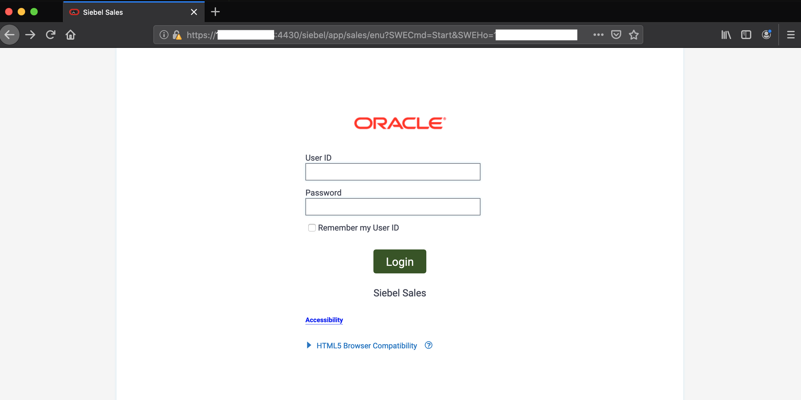

# LAB 2: Deploying the Siebel Application

## About this Workshop

In this exercise, you will create your Siebel instance by setting up the Siebel Marketplace image and use Jenkins to deploy an instance of Siebel.

Estimated Lab Time: 1 hour 15 minutes

  

### Objectives

To deploy the Siebel Application, in this lab, you will:
*   Launching Instance of Siebel from Marketplace
*   Deploy the Siebel Application
*   Generate a Jenkins URL
*   Deploy the Siebel CRM Application

## **STEP 1**: Launching Instance of Siebel from Marketplace

1. Make sure you are on the Oracle Cloud Infrastructure site

2. Navigate to ***Oracle Cloud Infrastructure Marketplace*** by using the dropdown menu on the left side of your screen and clicking the ***Marketplace*** option under ***Solutions and Platforms***

3. In the search bar type in siebel and hit search. Click on ***Siebel CRM 20.x install Container w/Sample Database*** image

4. In the instance page select the most up to date version and then select the compartment you made earlier. Then click ***Launch Instance***

5. In the Create Compute Instance page you will need to fill in additional info for your Instance

    a.  **Name:** You can name it whatever you like, such as "siebel_instance"

    b.  **Select compartment:** Select the compartment that you created earlier

    c.  **Configure placement and hardware:** You can leave this as it is by default for this Lab

    d.   For the next **Configure networking** section you will choose the ***SELECT EXISTING VIRTUAL CLOUD NETWORK*** option and choose the ***SELECT EXSISTING SUBNET*** option before selecting the Network and Subnet you created in the prevous lab

    Make sure that ***ASSIGN A PUBLIC IP ADDRESS*** is also selected since we will use this to deploy our Siebel application

    e. **Add SSH keys:** here you will need to selct the ssh key you created earlier. You can either use the

    *   ***CHOOSE PUBLIC KEY FILES*** and open the public key file you made if you know its location

        or you can use the

    *   ***PASTE PUBLIC KEYS*** and paste the data within the keyfile if you have the file open

    f.  **Configure boot volume:** You can leave this as default

    g. Now review your settings and click ***Create*** at the bottom of the page when you are ready

6. Now you will be taken to the Instance Page and will see that your newly created instance is provisioning

     Once you see the small orange box change to green your instance will have provisioned successfully and now you can move onto the next step in the Lab

## **STEP 2**: Deploying the Siebel Application

After you have created the instance, you have to generate two URLs:

*	Jenkins URL: To deploy Siebel application

*	Application domain URL: To create Siebel industry specific application

Generating Jenkins URL

1.	Copy the Public IP Address from your previously created Instance

2.	Add the port 8080 preceded with a colon and paste the URL in a browser window to open the Jenkins application like this "<public IP address>:port number"

    For example, you would type: 129.146.162.164:8080 into you browser search bar

    **Note:** If your instance was created recently you may not be able to access the Jenkins URL right away, it may take an additional 5 min before you can complete this step

3. Once you arrive at the Jenkins site you will enter the information as follows

    USERNAME AND PASSWORD :  siebel/oracle

4. After you have logged in you will see the Jenkins Home Screen. Select the ***SiebelDeploy*** option from the list

5. Now select the ***Open Blue Ocean*** Option from the dropdown on the lefthand side of the screen

6. Select the ***Run*** button to create your new instance

7. In the window that opens you can specify the Siebel version and Industry that you desire. For this Lab we will choose Siebel version ***20.1*** and select ***Sales*** as the industry; then click the ***Run*** button

    

8. After hitting run you will see that your new Siebel instance is being created, by clicking on it you can see more details

    **This can take 40 minutes to fully deploy**

    

    Once it is finished provisioning you will see its status change to a green circle with a check signifying that it is complete and that you may move onto the next step

## **STEP 3**: Generating application domain URL

You can create the application URL using the port 4430, that you opened in the previous lab, and the industry you selected while deployment

**NOTE:** For this step you Google Chrome may not allow you to access the site, we reccomend using an alternative such as Firefox for this step

The url you will need to type into your browser's search bar should look like this:

    "https://<public IP address>:4430/siebel/app/<industry>/enu"

For example, if you selected Sales, your application URL for Sales industry  could be the following.

    https://129.146.101.23:4430/siebel/app/sales/enu

**NOTE:** Make sure your url has ***"https"*** and not ***"http"*** at the beginning of it otherwise you will not obtain access

When accessing the url you may come across a "Potential Security Risk" warning message

Since this is the url and IP address that you created, you know that it is safe and that you can safely bypass the warning

You can do this on Firefox by first clicking the ***Advanced Settings*** button and then clicking ***Accept Risk and Continue*** button

Now you should see the proper site where you can log in with the default Siebel credentials

USERNAME AND PASSWORD :    SADMIN/Welcome1

Please also not that the application URL will be specific to the Industry you select for deployment, for example, the URL could be:

For Service - https://"your ip address":4430/siebel/app/callcenter/enu

For Siebel Management Console (SMC) - https://"your ip address":4430/siebel/smc

#Extension to provision
Verify Siebel version on home screen
login home Page
from the health menu - check technical support Option
popup box will show siebel version, db connection, etc.

# Summary

In this lab you launched an instance of Siebel from the OCI marketplace, deployed the Siebel application, and then deployed the Siebel CRM Application.

***Congratulations*** on completing this interactive lab and integrating Siebel with OCI. Please continue to work within the OCI environment using our other tutorials and explore our countless other features and possiblitities
