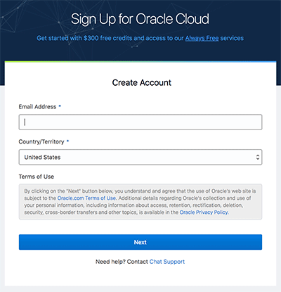
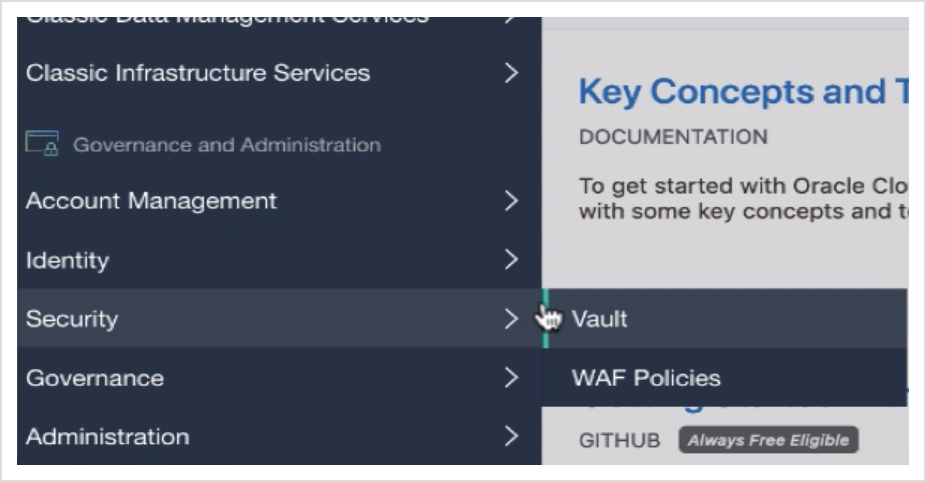
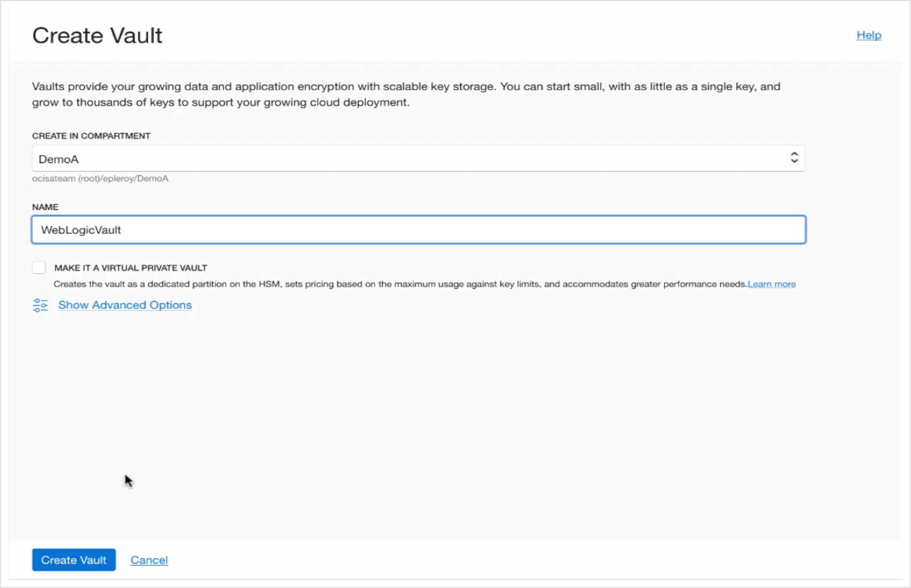
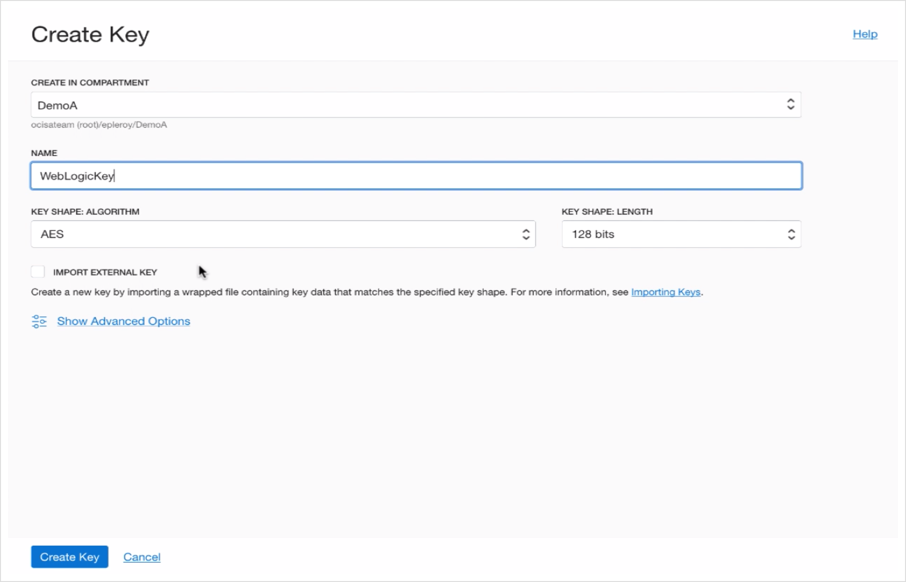

# Lab 200: Prepare the OCI account

## Task 1: Sign Up for a Free Tier Account

- Open up a browser and go to https://www.oracle.com/ to sign up for an Oracle Cloud Account. Follow the instructions to create your account. Be sure to enter an email you can access.

- Once you complete the signup, you will receive the Your Cloud Account is fully provisioned Email, make note of your Username and Cloud Account Name. Note: Usernames are usually your email address. You can login by clicking the Sign In button or access it from any browser.

- Login to Oracle Cloud Account

From any browser go to oracle.com to access the Oracle Cloud.

https://www.oracle.com/

- Click the icon in the upper right corner. Click on Sign in to Cloud at the bottom of the drop down. NOTE: Do NOT click the Sign-In button, this will take you to Single Sign-On, not the Oracle Cloud

- Enter your Cloud Account Name in the input field and click the My Services button. If you have a Free Tier account provisioned, this can be found in your welcome email. Otherwise, this will be supplied by your workshop instructor.

- Enter your Username and Password in the input fields and click Sign In.

NOTE: You will likely be prompted to change the temporary password listed in the welcome email. In that case, enter the new password in the password field.

These prerequisites only need to be done once to deploy WebLogic stacks. 
Login to your OCI account

## Step 2. Create a **Vault**

- Go to **Security -> Vault**

   

- Make sure you are in the compartment where you want to deploy WebLogic

- Click **Create Vault**

   

- Name the vault `WebLogic Vault` or a name of your choosing. Make sure the `private` option is **not checked** and click **Create Vault**

   

## Step 3. Create a **Key** in the vault

- Once the vault is provisioned, click the vault

   

- then click **Create Key**

   

- name the key `WebLogicKey` or a name of your choosing and click **Create Key**

   

## Step 4. Create a **Secret** for the WebLogic admin password

- Once the key is provisioned, click **Secrets**

   

- then **Create Secret**

  

- Name the **Secret** as `WebLogicAdminPassword`, select the `WebLogicKey` created at the previous step as the **Encryption Key**, keep the default `plaintext` option and type `welcome1` or any WebLogic compliant password (at least 8 chars and 1 uppercase or number) in the **Secret Content** text field, and click **Create Secret**

  

- Click the `WebLogicAdminPassword` **Secret** you just created and make a note of its **OCID**

   

That is all that's needed to get started.

**Note:**
If we were migrating a JRF domain (which is not the case here), the Virtual Cloud Network as well as subnets and Security Lists and an Operational Database would need to be provisioned before attempting to provision the WebLogic domain with the Marketplace.

